# Copilot Architecture Documentation

## Overview

The Copilot is an AI-powered assistant built into the application that helps users navigate, analyze data, and perform actions through natural language conversation. It uses a modular, plugin-based architecture that separates concerns between AI reasoning, tool execution, and UI rendering.

---

## Architecture Diagram


---

## Message Flow Diagram

```mermaid
sequenceDiagram
    participant U as 👤 User
    participant C as 💬 CopilotConsole
    participant O as ⚙️ Orchestrator
    participant A as 🧠 useCopilotAgent
    participant AI as 🤖 Lovable AI
    participant E as 🔧 ToolExecutor
    participant T as 📦 Tool Registry

    U->>C: Types message
    C->>O: process(message)
    O->>A: askBrain(message, context)
    A->>A: buildSystemPrompt()
    A->>AI: invokeAI({ prompt, tools })
    AI-->>A: { tool_call: "pilots:list", args: {...} }
    A-->>O: Tool call response
    
    alt Safety = "read"
        O->>E: Execute immediately
    else Safety = "write" or "destructive"
        O->>C: Show confirmation dialog
        U->>C: Confirms action
        C->>E: confirmAction()
    end
    
    E->>T: getTool("pilots:list")
    T-->>E: Tool definition
    E->>E: tool.execute(args)
    E-->>O: Execution result
    O->>C: Render response with UI widget
    C-->>U: Display result
```



---

## Tool Registration Flow


---

## Safety Layer Flow


---

## Core Components

### 1. CopilotProvider (`src/components/copilot/CopilotProvider.jsx`)

**Purpose:** Bootstrap component that wires up the Copilot system.

```jsx
export function CopilotProvider({ children }) {
    const { requestExecution } = useToolExecutor();
    const { askBrain } = useCopilotAgent();

    useEffect(() => {
        orchestrator.setExecutor(requestExecution);
        orchestrator.setCaller(askBrain);
    }, [requestExecution, askBrain]);
    
    return <>{children}</>;
}
```

**Responsibilities:**
- Syncs server state (React Query) with client store (Zustand)
- Connects the orchestrator to the executor and AI caller
- Provides context for child components

---

### 2. Orchestrator (`src/lib/ai/orchestrator.js`)

**Purpose:** Central routing logic that decides how to handle user messages.

**Key Methods:**
| Method | Description |
|--------|-------------|
| `setExecutor(fn)` | Sets the tool execution function |
| `setCaller(fn)` | Sets the AI calling function |
| `process(message)` | Main entry point for handling user input |

**Decision Flow:**
1. Receive user message
2. Send to AI with available tools
3. AI responds with either:
   - **Text response** → Display directly
   - **Tool call** → Execute via ToolExecutor → Return result

---

### 3. useCopilotAgent (`src/hooks/useCopilotAgent.js`)

**Purpose:** The "brain" hook that interfaces with the AI model.

```jsx
export function useCopilotAgent() {
    const { invokeAI } = useAIWithFallback();
    const { getAllTools } = useCopilotTools();
    
    const askBrain = useCallback(async (userMessage, contextData = {}) => {
        const systemPrompt = buildSystemPrompt({
            user,
            language,
            location: location.pathname,
            toolDefinitions
        });
        
        const response = await invokeAI({
            system_prompt: systemPrompt,
            prompt: userMessage
        });
        
        return response;
    }, []);
    
    return { askBrain, status, isLoading };
}
```

**Features:**
- Dynamic tool injection from registry
- Context awareness (URL, page title, user, language)
- Bilingual support (English/Arabic)
- Structured JSON enforcement via tool calling

---

### 4. CopilotToolsContext (`src/contexts/CopilotToolsContext.jsx`)

**Purpose:** Central registry for all available tools.

```jsx
const registerTool = useCallback((toolDef) => {
    // toolDef = { name, description, schema, execute, safety }
    setRegistry(prev => {
        const next = new Map(prev);
        next.set(toolDef.name, toolDef);
        return next;
    });
    
    // Returns unregister function
    return () => { /* cleanup */ };
}, []);
```

**Tool Definition Schema:**
```javascript
{
    name: "pilots:list",           // Namespaced tool name
    description: "List all pilots", // For AI to understand when to use
    schema: z.object({...}),        // Zod validation schema
    execute: async (args) => {...}, // Execution function
    safety: "read"                  // "read" | "write" | "destructive"
}
```

---

### 5. useCopilotPlugins (`src/hooks/ui/useCopilotPlugins.js`)

**Purpose:** Mounts all feature plugins that register domain-specific tools.

```jsx
export function useCopilotPlugins() {
    useReferenceDataTools();  // Sectors, regions, etc.
    usePilotTools();          // Pilot CRUD operations
    useContextTools();        // Page context awareness
    useChallengeTools();      // Challenge management
    useNavigationTools();     // App navigation
    useProgramTools();        // Program operations
    useSolutionTools();       // Solution management
    useOperationsTools();     // Operational tools
    useCommunityTools();      // Community features
    useStrategyTools();       // Strategic planning
    useRDInnovationTools();   // R&D tools
}
```

---

### 6. copilotStore (`src/lib/store/copilotStore.js`)

**Purpose:** Client-side state management using Zustand.

**State Slices:**

| Slice | Properties | Purpose |
|-------|------------|---------|
| Session | `activeSessionId`, `isConsoleOpen`, `viewMode` | UI state |
| Interaction | `isThinking` | Loading states |
| Tool Execution | `toolStatus`, `pendingToolCall`, `lastExecutionResult` | Safety layer |
| Context Draft | `contextDraft` | Form data collection |

**Tool Status Flow:**
```
idle → executing → success/error
         ↓
  requiring_confirmation → confirmAction() → executing
         ↓
     cancelAction() → idle
```

---

## Message Flow

### 1. User Sends Message

```
User types "Show me all active pilots"
    │
    ▼
CopilotConsole.handleSend(message)
    │
    ▼
orchestrator.process(message)
```

### 2. AI Processing

```
orchestrator.process()
    │
    ▼
askBrain(message, context)
    │
    ▼
buildSystemPrompt() + toolDefinitions
    │
    ▼
invokeAI() → Lovable AI Gateway
    │
    ▼
AI Response: { tool_call: "pilots:list", args: { status: "active" } }
```

### 3. Tool Execution

```
AI returns tool_call
    │
    ▼
orchestrator checks safety level
    │
    ├── "read" → Execute immediately
    ├── "write" → Request confirmation
    └── "destructive" → Request confirmation with warning
    │
    ▼
useToolExecutor.requestExecution(toolCall)
    │
    ▼
CopilotToolsContext.getTool(name).execute(args)
    │
    ▼
Result returned to orchestrator
```

### 4. UI Rendering

```
orchestrator receives result
    │
    ▼
Formats response with UI type
    │
    ▼
Message object: {
    role: "assistant",
    content: "Found 5 active pilots",
    ui: {
        type: "data_list",
        data: [...pilots]
    }
}
    │
    ▼
CopilotConsole renders appropriate widget
```

---

## UI Widget Types

The Copilot supports various UI widgets for rich responses:

| Type | Description | Use Case |
|------|-------------|----------|
| `text` | Plain markdown text | General responses |
| `data_list` | Clickable item list | Search results, listings |
| `draft_summary` | Form preview card | Drafts, confirmations |
| `chart` | Data visualization | Analytics, metrics |
| `action_buttons` | Interactive buttons | Quick actions |
| `table` | Structured data table | Comparisons, reports |

---

## AI Integration

### Prompt Architecture

The Copilot uses a sophisticated prompt system:

```
┌─────────────────────────────────────┐
│           System Prompt             │
│  ┌───────────────────────────────┐  │
│  │  Saudi Context (saudiContext) │  │
│  │  - Vision 2030 alignment      │  │
│  │  - Bilingual requirements     │  │
│  │  - Regional context           │  │
│  └───────────────────────────────┘  │
│  ┌───────────────────────────────┐  │
│  │  Tool Definitions             │  │
│  │  - Available actions          │  │
│  │  - Parameter schemas          │  │
│  └───────────────────────────────┘  │
│  ┌───────────────────────────────┐  │
│  │  User Context                 │  │
│  │  - Current page               │  │
│  │  - Language preference        │  │
│  │  - User role/permissions      │  │
│  └───────────────────────────────┘  │
└─────────────────────────────────────┘
```

### Model Configuration

- **Gateway:** Lovable AI (ai.gateway.lovable.dev)
- **Default Model:** google/gemini-2.5-flash
- **Fallback:** Graceful degradation via useAIWithFallback
- **Output:** Structured JSON via tool calling

---

## Adding New Tools

### Step 1: Create Tool Hook

```javascript
// src/hooks/tools/useMyFeatureTools.js
import { useEffect } from 'react';
import { useCopilotTools } from '@/contexts/CopilotToolsContext';
import { z } from 'zod';

export function useMyFeatureTools() {
    const { registerTool } = useCopilotTools();
    
    useEffect(() => {
        const unregister = registerTool({
            name: "myfeature:action",
            description: "Does something useful",
            schema: z.object({
                param1: z.string().describe("First parameter"),
                param2: z.number().optional().describe("Optional number")
            }),
            execute: async ({ param1, param2 }) => {
                // Implementation
                return { success: true, data: result };
            },
            safety: "read" // or "write" or "destructive"
        });
        
        return unregister;
    }, [registerTool]);
}
```

### Step 2: Register in Plugins

```javascript
// src/hooks/ui/useCopilotPlugins.js
import { useMyFeatureTools } from '@/hooks/tools/useMyFeatureTools';

export function useCopilotPlugins() {
    // ... existing plugins
    useMyFeatureTools(); // Add new plugin
}
```

---

## Safety Layer

The Copilot implements a safety layer for tool execution:

### Safety Levels

| Level | Behavior | Examples |
|-------|----------|----------|
| `read` | Execute immediately | List, search, view |
| `write` | Request confirmation | Create, update |
| `destructive` | Confirm with warning | Delete, archive |

### Confirmation Flow

```javascript
// In copilotStore
requestConfirmation: (toolCall) => set({
    toolStatus: 'requiring_confirmation',
    pendingToolCall: toolCall
}),

confirmAction: () => set({ toolStatus: 'executing' }),

cancelAction: () => set({
    toolStatus: 'idle',
    pendingToolCall: null
})
```

---

## State Management

### Server State (React Query)
- Chat history persistence
- Session management
- Message syncing

### Client State (Zustand)
- UI interaction state
- Pending confirmations
- Draft data collection
- Thinking indicators

---

## File Structure

```
src/
├── components/
│   └── copilot/
│       ├── CopilotProvider.jsx    # Bootstrap
│       ├── CopilotConsole.jsx     # Main UI
│       └── CopilotFAB.jsx         # Floating button
├── contexts/
│   └── CopilotToolsContext.jsx    # Tool registry
├── hooks/
│   ├── useCopilotAgent.js         # AI brain
│   ├── useToolExecutor.js         # Tool execution
│   ├── useCopilotHistory.js       # Chat persistence
│   ├── useAIWithFallback.js       # AI gateway
│   ├── ui/
│   │   └── useCopilotPlugins.js   # Plugin loader
│   └── tools/
│       ├── usePilotTools.js
│       ├── useChallengeTools.js
│       ├── useNavigationTools.js
│       └── ... (11 tool hooks)
├── lib/
│   ├── ai/
│   │   ├── orchestrator.js        # Message routing
│   │   └── prompts/
│   │       ├── copilotPrompts.js  # System prompts
│   │       └── ... (340+ prompts)
│   └── store/
│       └── copilotStore.js        # Zustand store
└── supabase/
    └── functions/
        └── invoke-llm/            # AI gateway edge function
```

---

## Best Practices

1. **Tool Naming:** Use namespaced names like `domain:action` (e.g., `pilots:create`)
2. **Schemas:** Always include `.describe()` for AI understanding
3. **Safety:** Default to `"read"` unless the action modifies data
4. **Responses:** Return structured data for UI widget rendering
5. **Context:** Leverage page context for smarter responses
6. **Bilingual:** Support both English and Arabic in outputs

---

## Debugging

### Common Issues

| Issue | Check |
|-------|-------|
| Tool not found | Verify registration in useCopilotPlugins |
| AI not calling tool | Check tool description clarity |
| Execution fails | Check schema validation, safety level |
| UI not rendering | Verify `msg.ui.type` matches widget |

### Logging

Enable orchestrator logging:
```javascript
// orchestrator.js already has console.logs for debugging
// Check browser console for message flow
```

---

## Future Enhancements

- [ ] Multi-turn conversation memory
- [ ] Tool chaining (one tool calling another)
- [ ] Voice input/output
- [ ] Proactive suggestions
- [ ] Learning from user feedback
