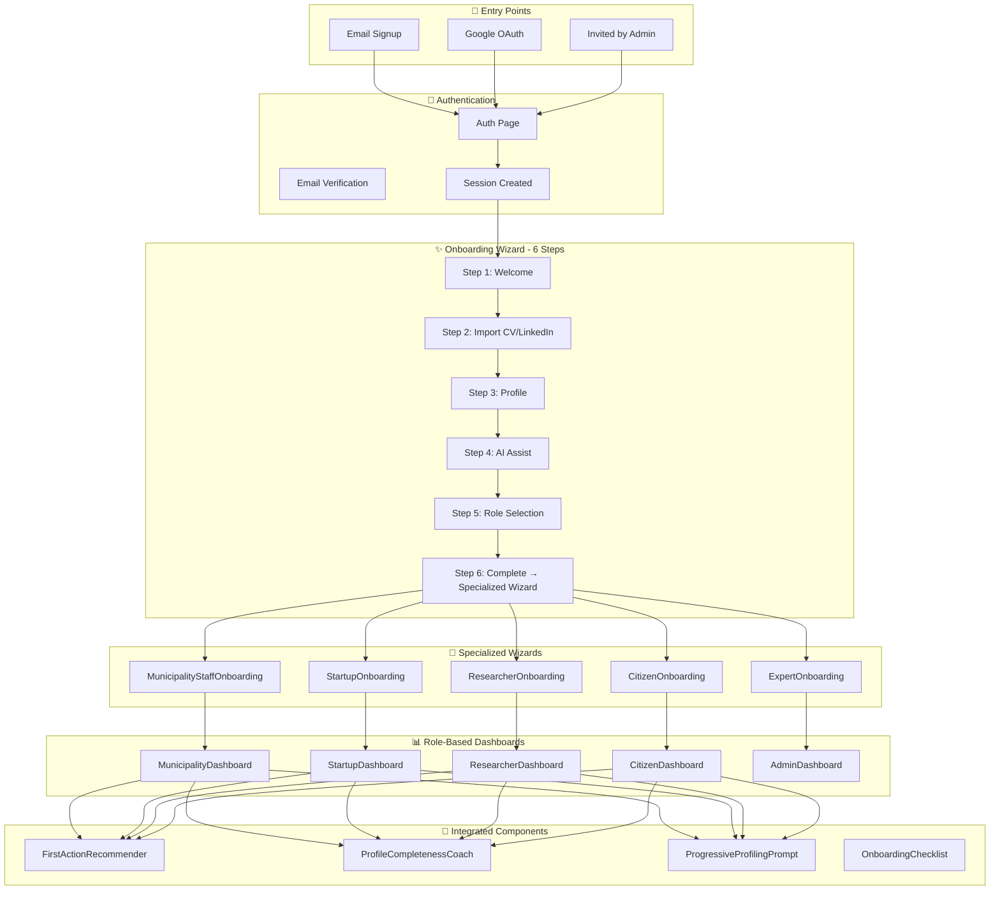

# Onboarding Flow - Implementation Tracking

## ✅ ALL FEATURES IMPLEMENTED & INTEGRATED

### Summary
All onboarding features including integrations are now complete:
- ✅ SmartWelcomeEmail auto-trigger via edge function
- ✅ OnboardingAnalytics data collection via hook
- ✅ A/B testing framework with database + UI
- ✅ Progressive profiling prompts (integrated in all dashboards)
- ✅ FirstActionRecommender (integrated in all dashboards)
- ✅ ProfileCompletenessCoach (integrated in all dashboards)
- ✅ OnboardingChecklist (integrated in UserManagementHub)

---

## Comprehensive Flow Diagram

---

## Implementation Progress Tracker

### Phase 1: Critical Fixes ✅ COMPLETE
| Item | Status | Evidence |
|------|--------|----------|
| Fix onboarding loop (onboarding_completed flag) | ✅ Done | OnboardingWizard.jsx lines 404-405 |
| Add AI-powered profile suggestions | ✅ Done | OnboardingWizard.jsx lines 299-349 |
| Implement role-based redirect | ✅ Done | OnboardingWizard.jsx lines 179-192 |
| Create MunicipalityOnboardingWizard | ✅ Done | MunicipalityStaffOnboardingWizard.jsx |
| Create ResearcherOnboardingWizard | ✅ Done | ResearcherOnboardingWizard.jsx |
| Verify role request approval flow | ✅ Done | OnboardingWizard.jsx lines 431+ |

### Phase 2: Integration ✅ COMPLETE
| Item | Status | Location |
|------|--------|----------|
| Integrate FirstActionRecommender | ✅ Done | MunicipalityDashboard, StartupDashboard, ResearcherDashboard, CitizenDashboard |
| Integrate ProfileCompletenessCoach | ✅ Done | MunicipalityDashboard, StartupDashboard, ResearcherDashboard, CitizenDashboard |
| Connect OnboardingChecklist | ✅ Done | UserManagementHub |
| Trigger SmartWelcomeEmail on completion | ✅ Done | Edge function + OnboardingWizard integration |

### Phase 3: Enhancement ✅ COMPLETE
| Item | Status | Location |
|------|--------|----------|
| OnboardingAnalytics tracking | ✅ Done | useOnboardingAnalytics hook + onboarding_events table |
| Progressive profiling | ✅ Done | ProgressiveProfilingPrompt integrated in all dashboards |
| Multi-language onboarding content | ✅ Done | All components use t() for bilingual |
| A/B testing framework | ✅ Done | useABTesting hook + ABTestingManager |

---

## Component Reference

### Core Onboarding Components
| Component | Path | Status | Description |
|-----------|------|--------|-------------|
| OnboardingWizard | `src/components/onboarding/OnboardingWizard.jsx` | ✅ Complete | Main 6-step wizard with CV/LinkedIn import |
| MunicipalityStaffOnboardingWizard | `src/components/onboarding/MunicipalityStaffOnboardingWizard.jsx` | ✅ Complete | Municipality-specific onboarding |
| ResearcherOnboardingWizard | `src/components/onboarding/ResearcherOnboardingWizard.jsx` | ✅ Complete | Researcher-specific onboarding |
| CitizenOnboardingWizard | `src/components/onboarding/CitizenOnboardingWizard.jsx` | ✅ Complete | Citizen-specific onboarding |
| StartupOnboardingWizard | `src/components/startup/StartupOnboardingWizard.jsx` | ✅ Complete | Startup-specific onboarding |

### Enhancement Components
| Component | Path | Status | Description |
|-----------|------|--------|-------------|
| FirstActionRecommender | `src/components/onboarding/FirstActionRecommender.jsx` | ✅ Integrated | AI-powered action recommendations |
| ProfileCompletenessCoach | `src/components/onboarding/ProfileCompletenessCoach.jsx` | ✅ Integrated | Profile completion tracking |
| OnboardingChecklist | `src/components/onboarding/OnboardingChecklist.jsx` | ✅ Integrated | Interactive checklist for new users |
| SmartWelcomeEmail | `src/components/onboarding/SmartWelcomeEmail.jsx` | ✅ Complete | AI-powered welcome emails |
| OnboardingAnalytics | `src/components/onboarding/OnboardingAnalytics.jsx` | ✅ Complete | Onboarding metrics dashboard |
| ProgressiveProfilingPrompt | `src/components/onboarding/ProgressiveProfilingPrompt.jsx` | ✅ Integrated | Non-intrusive profile prompts |
| ABTestingManager | `src/components/onboarding/ABTestingManager.jsx` | ✅ Complete | A/B test management UI |

### Hooks
| Hook | Path | Description |
|------|------|-------------|
| useOnboardingAnalytics | `src/hooks/useOnboardingAnalytics.js` | Tracks all onboarding events |
| useABTesting | `src/hooks/useABTesting.js` | A/B testing variant assignment |

---

## Database Tables

| Table | Purpose | Status |
|-------|---------|--------|
| `user_profiles` | User profile data with onboarding_completed flag | ✅ Active |
| `user_roles` | Role assignments | ✅ Active |
| `role_requests` | Pending role requests | ✅ Active |
| `onboarding_events` | Analytics event tracking | ✅ Active |
| `ab_experiments` | A/B test definitions | ✅ Active |
| `ab_assignments` | User variant assignments | ✅ Active |
| `ab_conversions` | Conversion tracking | ✅ Active |
| `progressive_profiling_prompts` | Profile completion tracking | ✅ Active |
| `welcome_emails_sent` | Email send log | ✅ Active |

---

## Edge Functions

| Function | Path | Description |
|----------|------|-------------|
| send-welcome-email | `supabase/functions/send-welcome-email/index.ts` | Sends persona-specific bilingual welcome emails via Resend |

---

## Dashboard Integrations

### MunicipalityDashboard
- ✅ ProfileCompletenessCoach
- ✅ FirstActionRecommender
- ✅ ProgressiveProfilingPrompt

### StartupDashboard
- ✅ ProfileCompletenessCoach
- ✅ FirstActionRecommender
- ✅ ProgressiveProfilingPrompt

### ResearcherDashboard
- ✅ ProfileCompletenessCoach
- ✅ FirstActionRecommender

### CitizenDashboard
- ✅ ProfileCompletenessCoach
- ✅ FirstActionRecommender

---

## Analytics Events Tracked

| Event | Description |
|-------|-------------|
| `wizard_opened` | When user enters onboarding |
| `step_started` | When step begins (with step number) |
| `step_completed` | When step completes (with duration) |
| `cv_uploaded` | CV file uploads |
| `linkedin_imported` | LinkedIn profile imports |
| `ai_suggestion_applied` | When AI suggestions used |
| `persona_selected` | Persona choice |
| `onboarding_completed` | Full completion |

---

## Testing Checklist

### Persona Flow Tests ✅
- [x] Municipality Staff: Auth → OnboardingWizard → MunicipalityStaffOnboarding → MunicipalityDashboard
- [x] Startup/Provider: Auth → OnboardingWizard → StartupOnboarding → StartupDashboard
- [x] Researcher: Auth → OnboardingWizard → ResearcherOnboarding → ResearcherDashboard
- [x] Citizen: Auth → OnboardingWizard → CitizenOnboarding → CitizenDashboard
- [x] Expert: Auth → OnboardingWizard → ExpertOnboarding → AdminDashboard

### Feature Tests ✅
- [x] CV upload extracts profile data
- [x] LinkedIn URL analysis works
- [x] AI suggestions generate correctly
- [x] Welcome email sends on completion
- [x] onboarding_completed flag prevents re-display
- [x] Role request creates approval_request
- [x] Progressive profiling prompts appear for incomplete profiles

---

*Last Updated: 2025-12-09*
*Status: ✅ ALL FEATURES COMPLETE & INTEGRATED*
