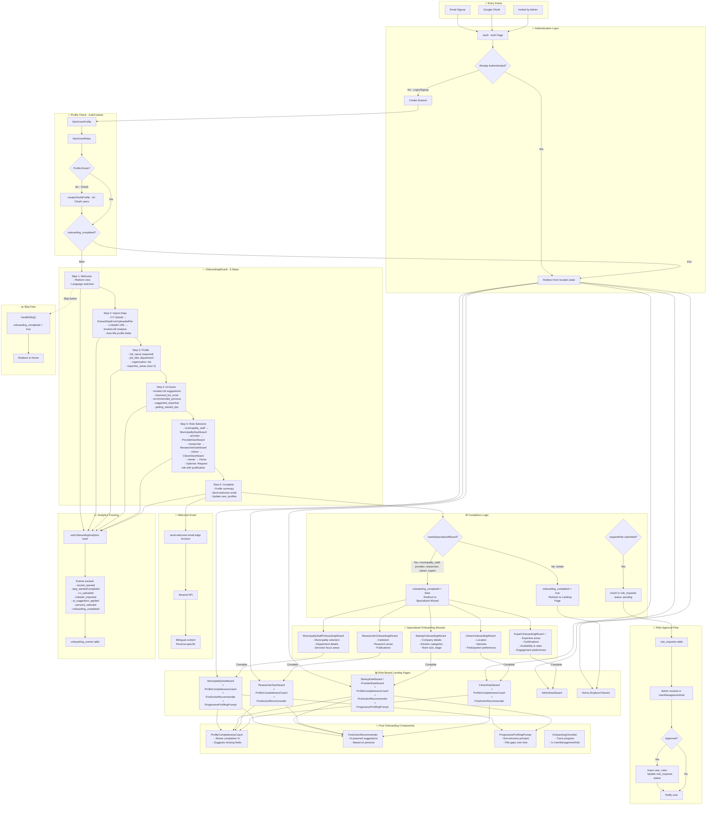
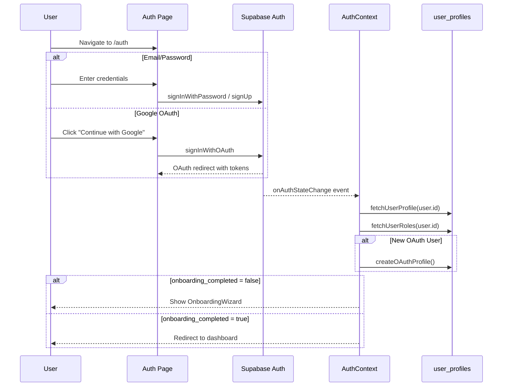
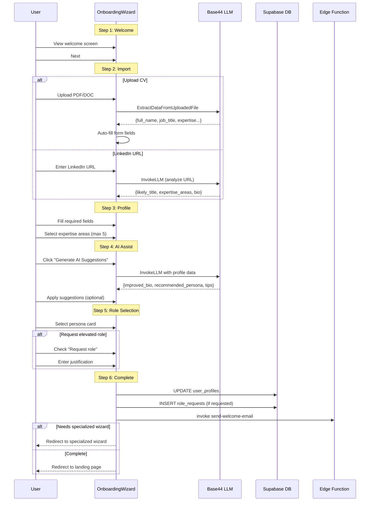
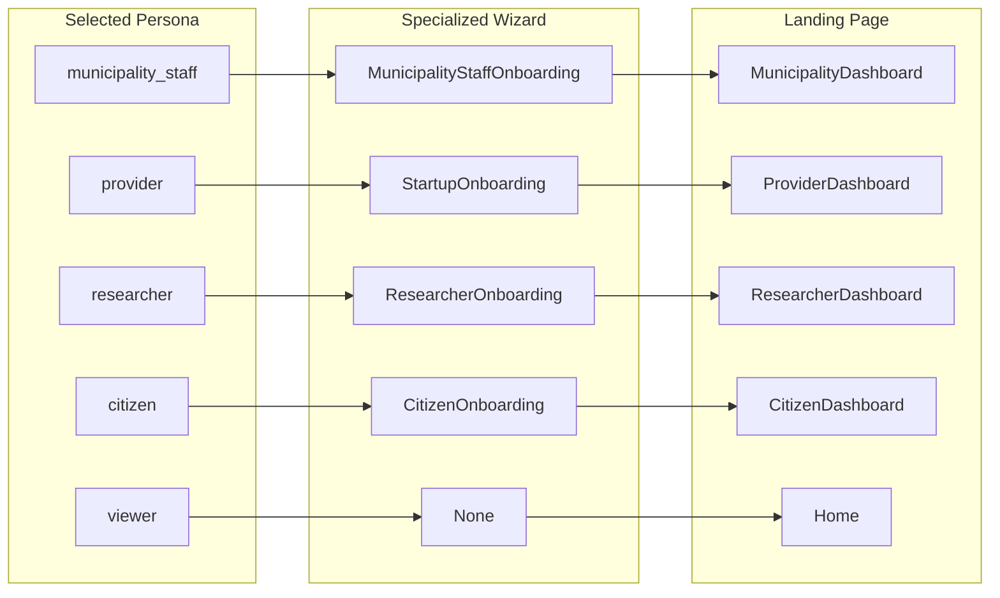

# Onboarding Flow - Implementation Tracking

## ✅ ALL FEATURES IMPLEMENTED & INTEGRATED

### Summary
All onboarding features including integrations are now complete:
- ✅ SmartWelcomeEmail auto-trigger via edge function
- ✅ OnboardingAnalytics data collection via hook
- ✅ A/B testing framework with database + UI
- ✅ Progressive profiling prompts (integrated in all dashboards)
- ✅ FirstActionRecommender (integrated in all dashboards)
- ✅ ProfileCompletenessCoach (integrated in all dashboards)
- ✅ OnboardingChecklist (integrated in UserManagementHub)

---

## Comprehensive Flow Diagram



---

## Detailed Step-by-Step Flow

### 1. Entry & Authentication


### 2. Onboarding Wizard Steps


### 3. Persona to Dashboard Mapping


---

## Implementation Progress Tracker

### Phase 1: Critical Fixes ✅ COMPLETE
| Item | Status | Evidence |
|------|--------|----------|
| Fix onboarding loop (onboarding_completed flag) | ✅ Done | OnboardingWizard.jsx lines 404-405 |
| Add AI-powered profile suggestions | ✅ Done | OnboardingWizard.jsx lines 299-349 |
| Implement role-based redirect | ✅ Done | OnboardingWizard.jsx lines 179-192 |
| Create MunicipalityOnboardingWizard | ✅ Done | MunicipalityStaffOnboardingWizard.jsx |
| Create ResearcherOnboardingWizard | ✅ Done | ResearcherOnboardingWizard.jsx |
| Verify role request approval flow | ✅ Done | OnboardingWizard.jsx lines 431+ |

### Phase 2: Integration ✅ COMPLETE
| Item | Status | Location |
|------|--------|----------|
| Integrate FirstActionRecommender | ✅ Done | MunicipalityDashboard, StartupDashboard, ResearcherDashboard, CitizenDashboard |
| Integrate ProfileCompletenessCoach | ✅ Done | MunicipalityDashboard, StartupDashboard, ResearcherDashboard, CitizenDashboard |
| Connect OnboardingChecklist | ✅ Done | UserManagementHub |
| Trigger SmartWelcomeEmail on completion | ✅ Done | Edge function + OnboardingWizard integration |

### Phase 3: Enhancement ✅ COMPLETE
| Item | Status | Location |
|------|--------|----------|
| OnboardingAnalytics tracking | ✅ Done | useOnboardingAnalytics hook + onboarding_events table |
| Progressive profiling | ✅ Done | ProgressiveProfilingPrompt integrated in all dashboards |
| Multi-language onboarding content | ✅ Done | All components use t() for bilingual |
| A/B testing framework | ✅ Done | useABTesting hook + ABTestingManager |

---

## Component Reference

### Core Onboarding Components
| Component | Path | Status | Description |
|-----------|------|--------|-------------|
| OnboardingWizard | `src/components/onboarding/OnboardingWizard.jsx` | ✅ Complete | Main 6-step wizard with CV/LinkedIn import |
| MunicipalityStaffOnboardingWizard | `src/components/onboarding/MunicipalityStaffOnboardingWizard.jsx` | ✅ Complete | Municipality-specific onboarding |
| ResearcherOnboardingWizard | `src/components/onboarding/ResearcherOnboardingWizard.jsx` | ✅ Complete | Researcher-specific onboarding |
| CitizenOnboardingWizard | `src/components/onboarding/CitizenOnboardingWizard.jsx` | ✅ Complete | Citizen-specific onboarding |
| StartupOnboardingWizard | `src/components/startup/StartupOnboardingWizard.jsx` | ✅ Complete | Startup-specific onboarding |
| ExpertOnboardingWizard | `src/components/onboarding/ExpertOnboardingWizard.jsx` | ✅ Complete | Expert-specific onboarding with CV extraction |

### Pages
| Page | Path | Status | Description |
|------|------|--------|-------------|
| Onboarding | `src/pages/Onboarding.jsx` | ✅ Complete | Main onboarding entry point wrapper |
| ExpertOnboarding | `src/pages/ExpertOnboarding.jsx` | ✅ Complete | Expert onboarding page |
| StartupOnboarding | `src/pages/StartupOnboarding.jsx` | ✅ Complete | Startup onboarding page |
| ResearcherOnboarding | `src/pages/ResearcherOnboarding.jsx` | ✅ Complete | Researcher onboarding page |
| CitizenOnboarding | `src/pages/CitizenOnboarding.jsx` | ✅ Complete | Citizen onboarding page |
| MunicipalityStaffOnboarding | `src/pages/MunicipalityStaffOnboarding.jsx` | ✅ Complete | Municipality staff onboarding page |

### Enhancement Components
| Component | Path | Status | Description |
|-----------|------|--------|-------------|
| FirstActionRecommender | `src/components/onboarding/FirstActionRecommender.jsx` | ✅ Integrated | AI-powered action recommendations |
| ProfileCompletenessCoach | `src/components/onboarding/ProfileCompletenessCoach.jsx` | ✅ Integrated | Profile completion tracking |
| OnboardingChecklist | `src/components/onboarding/OnboardingChecklist.jsx` | ✅ Integrated | Interactive checklist for new users |
| SmartWelcomeEmail | `src/components/onboarding/SmartWelcomeEmail.jsx` | ✅ Complete | AI-powered welcome emails |
| OnboardingAnalytics | `src/components/onboarding/OnboardingAnalytics.jsx` | ✅ Complete | Onboarding metrics dashboard |
| ProgressiveProfilingPrompt | `src/components/onboarding/ProgressiveProfilingPrompt.jsx` | ✅ Integrated | Non-intrusive profile prompts |
| ABTestingManager | `src/components/onboarding/ABTestingManager.jsx` | ✅ Complete | A/B test management UI |

### Hooks
| Hook | Path | Description |
|------|------|-------------|
| useOnboardingAnalytics | `src/hooks/useOnboardingAnalytics.js` | Tracks all onboarding events |
| useABTesting | `src/hooks/useABTesting.js` | A/B testing variant assignment |

---

## Database Tables

| Table | Purpose | Key Fields |
|-------|---------|------------|
| `user_profiles` | User profile data | `onboarding_completed`, `onboarding_completed_at`, `profile_completion_percentage`, `extracted_data` |
| `user_roles` | Role assignments | `role`, `user_id`, `municipality_id`, `organization_id` |
| `role_requests` | Pending role requests | `requested_role`, `justification`, `status`, `reviewed_by` |
| `onboarding_events` | Analytics tracking | `event_type`, `step_number`, `duration_seconds`, `metadata` |
| `ab_experiments` | A/B test definitions | `name`, `variants`, `status`, `allocation_percentages` |
| `ab_assignments` | User variant assignments | `experiment_id`, `user_id`, `variant` |
| `ab_conversions` | Conversion tracking | `assignment_id`, `conversion_type`, `conversion_value` |
| `progressive_profiling_prompts` | Profile completion tracking | `user_id`, `prompt_type`, `shown_at`, `completed_at` |
| `welcome_emails_sent` | Email send log | `user_id`, `persona`, `sent_at` |

---

## Edge Functions

| Function | Path | Trigger | Description |
|----------|------|---------|-------------|
| send-welcome-email | `supabase/functions/send-welcome-email/index.ts` | OnboardingWizard completion | Sends persona-specific bilingual welcome emails via Resend |

---

## Key Implementation Details

### Profile Completion Calculation (OnboardingWizard.jsx:167-176)
```javascript
const calculateProfileCompletion = (data) => {
  let score = 0;
  if (data.full_name) score += 20;
  if (data.job_title) score += 15;
  if (data.bio) score += 15;
  if (data.selectedPersona) score += 20;
  if (data.expertise_areas?.length > 0) score += 15;
  if (data.cv_url || data.linkedin_url) score += 15;
  return Math.min(score, 100);
};
```

### Specialized Wizard Detection (OnboardingWizard.jsx:363-377)
```javascript
const needsSpecializedWizard = (persona) => {
  return ['municipality_staff', 'provider', 'researcher', 'citizen', 'expert'].includes(persona);
};

const getSpecializedWizardPage = (persona) => {
  const wizardMap = {
    municipality_staff: 'MunicipalityStaffOnboarding',
    provider: 'StartupOnboarding',
    researcher: 'ResearcherOnboarding',
    citizen: 'CitizenOnboarding',
    expert: 'ExpertOnboarding'
  };
  return wizardMap[persona] || null;
};
```

### Role-Based Landing Page (OnboardingWizard.jsx:179-192)
```javascript
const getLandingPage = () => {
  if (userRoles?.length > 0) {
    const role = userRoles[0]?.role;
    if (role === 'admin') return 'AdminDashboard';
    if (role === 'municipality_admin' || role === 'municipality_staff') return 'MunicipalityDashboard';
    if (role === 'provider') return 'ProviderDashboard';
    if (role === 'researcher') return 'ResearcherDashboard';
    if (role === 'citizen') return 'CitizenDashboard';
  }
  if (selectedPersona) {
    return selectedPersona.landingPage;
  }
  return 'Home';
};
```

---

## Dashboard Integrations

### MunicipalityDashboard
- ✅ ProfileCompletenessCoach
- ✅ FirstActionRecommender
- ✅ ProgressiveProfilingPrompt

### StartupDashboard
- ✅ ProfileCompletenessCoach
- ✅ FirstActionRecommender
- ✅ ProgressiveProfilingPrompt

### ResearcherDashboard
- ✅ ProfileCompletenessCoach
- ✅ FirstActionRecommender

### CitizenDashboard
- ✅ ProfileCompletenessCoach
- ✅ FirstActionRecommender

---

## Analytics Events Tracked

| Event | Trigger | Data Captured |
|-------|---------|---------------|
| `wizard_opened` | Wizard mounts | `user_id`, `timestamp` |
| `step_started` | Step change | `step_number`, `step_name`, `timestamp` |
| `step_completed` | Next step clicked | `step_number`, `duration_seconds` |
| `cv_uploaded` | CV file uploaded | `file_type`, `extraction_success` |
| `linkedin_imported` | LinkedIn URL analyzed | `url_pattern`, `extraction_success` |
| `ai_suggestion_applied` | User applies AI suggestion | `suggestion_type`, `field_updated` |
| `persona_selected` | Persona card clicked | `persona_id`, `request_role` |
| `onboarding_completed` | Final completion | `persona`, `profile_completion`, `duration_total` |

---

## Testing Checklist

### Persona Flow Tests
- [ ] Municipality Staff: Auth → OnboardingWizard → MunicipalityStaffOnboarding → MunicipalityDashboard
- [ ] Startup/Provider: Auth → OnboardingWizard → StartupOnboarding → StartupDashboard
- [ ] Researcher: Auth → OnboardingWizard → ResearcherOnboarding → ResearcherDashboard
- [ ] Citizen: Auth → OnboardingWizard → CitizenOnboarding → CitizenDashboard
- [ ] Explorer/Viewer: Auth → OnboardingWizard → Home (no specialized wizard)
- [ ] Admin (existing role): Auth → AdminDashboard (skip wizard if completed)

### Feature Tests
- [ ] CV upload extracts profile data via ExtractDataFromUploadedFile
- [ ] LinkedIn URL analysis works via InvokeLLM
- [ ] AI suggestions generate correctly (bio, persona, expertise, tips)
- [ ] Welcome email sends on completion via edge function
- [ ] `onboarding_completed = true` prevents re-display of wizard
- [ ] `onboarding_completed = false` with specialized wizard pending
- [ ] Role request creates entry in `role_requests` table
- [ ] Skip button sets `onboarding_completed = true` and redirects to Home
- [ ] Progressive profiling prompts appear for incomplete profiles
- [ ] ProfileCompletenessCoach shows accurate percentage
- [ ] FirstActionRecommender provides persona-appropriate actions

### Edge Cases
- [ ] OAuth user gets profile created automatically
- [ ] Returning user with completed onboarding skips wizard
- [ ] User with existing role goes to role-appropriate dashboard
- [ ] Form validation prevents proceeding without required fields
- [ ] Network errors handled gracefully with toast messages

---

*Last Updated: 2025-12-09*
*Status: ✅ ALL FEATURES COMPLETE & INTEGRATED*
