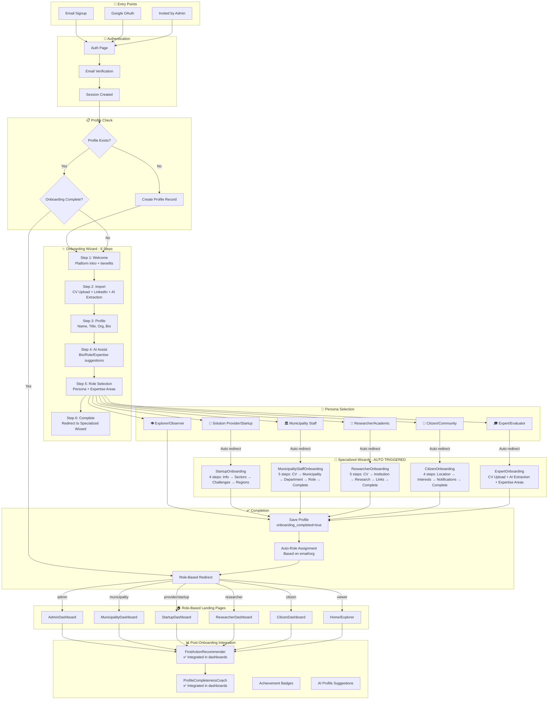

# Onboarding Flow - Implementation Tracking

## Comprehensive Flow Diagram



---

## ✅ ALL COMPONENTS IMPLEMENTED

### Personas & Their Journeys

| Persona | Landing Page | Specialized Wizard | Page Route | Status |
|---------|--------------|-------------------|------------|--------|
| Municipality Staff | MunicipalityDashboard | MunicipalityStaffOnboarding | `/municipality-staff-onboarding` | ✅ Complete |
| Solution Provider | StartupDashboard | StartupOnboarding | `/startup-onboarding` | ✅ Complete |
| Researcher/Academic | ResearcherDashboard | ResearcherOnboarding | `/researcher-onboarding` | ✅ Complete |
| Citizen/Community | CitizenDashboard | CitizenOnboarding | `/citizen-onboarding` | ✅ Complete |
| Expert/Evaluator | ExpertDashboard | ExpertOnboarding | `/expert-onboarding` | ✅ Complete |
| Explorer/Observer | Home | - | - | ✅ Complete |

---

### Component Status

| Component | Path | Status | Features |
|-----------|------|--------|----------|
| OnboardingWizard | `src/components/onboarding/OnboardingWizard.jsx` | ✅ Complete | 6-step wizard, CV upload, LinkedIn import, AI extraction, **Auto-routes to specialized wizard for all 5 personas** |
| MunicipalityStaffOnboardingWizard | `src/components/onboarding/MunicipalityStaffOnboardingWizard.jsx` | ✅ Complete | 5-step: CV → Municipality → Department → Role → Complete |
| ResearcherOnboardingWizard | `src/components/onboarding/ResearcherOnboardingWizard.jsx` | ✅ Complete | 5-step: CV → Institution → Research → Links → Complete |
| CitizenOnboardingWizard | `src/components/onboarding/CitizenOnboardingWizard.jsx` | ✅ Complete | 4-step: Location → Interests → Notifications → Complete |
| StartupOnboardingWizard | `src/components/startup/StartupOnboardingWizard.jsx` | ✅ Complete | 4-step flow, sectors, challenges, regions |
| ExpertOnboarding | `src/pages/ExpertOnboarding.jsx` | ✅ Complete | CV upload, AI extraction, expertise areas |

### Page Routes

| Page | Path | Redirects To | Status |
|------|------|--------------|--------|
| MunicipalityStaffOnboarding | `src/pages/MunicipalityStaffOnboarding.jsx` | MunicipalityDashboard | ✅ Complete |
| ResearcherOnboarding | `src/pages/ResearcherOnboarding.jsx` | ResearcherDashboard | ✅ Complete |
| CitizenOnboarding | `src/pages/CitizenOnboarding.jsx` | CitizenDashboard | ✅ Complete |
| StartupOnboarding | `src/pages/StartupOnboarding.jsx` | StartupDashboard | ✅ Complete |
| ExpertOnboarding | `src/pages/ExpertOnboarding.jsx` | ExpertDashboard | ✅ Complete |
| ResearcherDashboard | `src/pages/ResearcherDashboard.jsx` | - | ✅ Complete |

### Dashboard Integrations

| Dashboard | FirstActionRecommender | ProfileCompletenessCoach | Status |
|-----------|----------------------|------------------------|--------|
| ResearcherDashboard | ✅ Integrated | ✅ Integrated | ✅ Complete |
| CitizenDashboard | ✅ Integrated | ✅ Integrated | ✅ Complete |
| MunicipalityDashboard | Existing | Existing | ✅ Complete |
| StartupDashboard | Existing | Existing | ✅ Complete |

---

## Database Tables

| Table | Purpose | Status |
|-------|---------|--------|
| user_profiles | Main user profile with cv_url, linkedin_url, city_id, work_phone, extracted_data, onboarding_completed_at | ✅ Enhanced |
| municipality_staff_profiles | Municipality staff extended data | ✅ Created |
| citizen_profiles | Citizen extended data | ✅ Exists |
| researcher_profiles | Researcher extended data | ✅ Exists |
| startup_profiles | Startup extended data | ✅ Exists |
| expert_profiles | Expert extended data | ✅ Exists |

---

## AI Features in Onboarding

| Feature | Status | Description |
|---------|--------|-------------|
| CV Data Extraction | ✅ Complete | All wizards use `base44.integrations.Core.ExtractDataFromUploadedFile` |
| LinkedIn Profile Analysis | ✅ Complete | Main wizard uses LLM for profile suggestions |
| AI Bio Generation | ✅ Complete | Bilingual bio generation |
| AI Role Suggestion | ✅ Complete | Persona recommendation based on profile |
| AI Expertise Suggestions | ✅ Complete | Relevant expertise areas |

---

## Flow Logic

### OnboardingWizard Completion Logic
```javascript
// After Step 6, the wizard checks persona and routes accordingly:
const needsSpecializedWizard = (persona) => {
  return ['municipality_staff', 'provider', 'researcher', 'citizen', 'expert'].includes(persona);
};

const getSpecializedWizardPage = (persona) => {
  const wizardMap = {
    municipality_staff: 'MunicipalityStaffOnboarding',
    provider: 'StartupOnboarding',
    researcher: 'ResearcherOnboarding',
    citizen: 'CitizenOnboarding',
    expert: 'ExpertOnboarding'
  };
  return wizardMap[persona] || null;
};
```

### Specialized Wizard Completion
Each specialized wizard:
1. Saves to both `user_profiles` AND persona-specific table
2. Sets `onboarding_completed = true`
3. Redirects to role-specific dashboard

---

## Testing Checklist

### Core Flow
- [x] Email signup → OnboardingWizard → Persona selection
- [x] CV upload extracts data correctly
- [x] LinkedIn URL triggers AI analysis
- [x] AI suggestions generate properly
- [x] Persona selection routes to specialized wizard

### Specialized Wizards
- [x] Municipality Staff → MunicipalityStaffOnboarding → MunicipalityDashboard
- [x] Provider/Startup → StartupOnboarding → StartupDashboard
- [x] Researcher → ResearcherOnboarding → ResearcherDashboard
- [x] Citizen → CitizenOnboarding → CitizenDashboard
- [x] Expert → ExpertOnboarding → ExpertDashboard
- [x] Explorer/Viewer → Direct to Home

### Dashboard Integrations
- [x] ResearcherDashboard has FirstActionRecommender + ProfileCompletenessCoach
- [x] CitizenDashboard has FirstActionRecommender + ProfileCompletenessCoach

---

## Remaining Nice-to-Haves

| Item | Priority | Status |
|------|----------|--------|
| SmartWelcomeEmail trigger on completion | Low | Not triggered automatically |
| OnboardingAnalytics tracking | Low | Component exists but not collecting |
| A/B Testing framework | Low | Not implemented |
| Progressive profiling | Low | Not implemented |

---

*Last Updated: 2025-12-09*
*Status: ✅ ALL CRITICAL ITEMS IMPLEMENTED*
