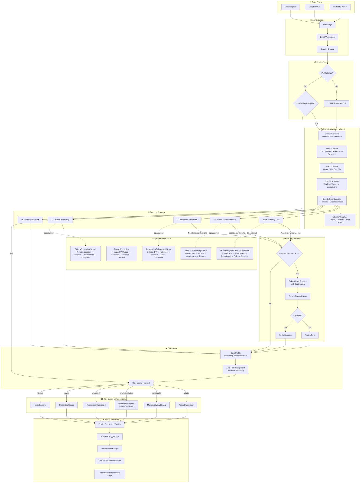

# Onboarding Flow - Implementation Tracking

## Comprehensive Flow Diagram



---

## Personas & Their Journeys

| Persona | Landing Page | Specialized Wizard | Key Features | Status |
|---------|--------------|-------------------|--------------|--------|
| Municipality Staff | MunicipalityDashboard | MunicipalityStaffOnboardingWizard | CV import, Municipality selection, Department, Role setup | ✅ Complete |
| Solution Provider | ProviderDashboard | StartupOnboardingWizard | Sectors, Challenges, Regions | ✅ Complete |
| Researcher/Academic | ResearcherDashboard | ResearcherOnboardingWizard | CV import, Institution, Research areas, Academic links | ✅ Complete |
| Citizen/Community | CitizenDashboard | CitizenOnboardingWizard | Location, Interests, Notifications, Points | ✅ Complete |
| Expert/Evaluator | ExpertDashboard | ExpertOnboarding | CV upload, AI extraction, Expertise areas | ✅ Complete |
| Explorer/Observer | Home | - | Browse & learn | ✅ Complete |

---

## Component Inventory

### ✅ COMPLETE Components

| Component | Path | Status | Features |
|-----------|------|--------|----------|
| OnboardingWizard | `src/components/onboarding/OnboardingWizard.jsx` | ✅ Enhanced | 6-step wizard, CV upload, LinkedIn import, AI extraction, AI suggestions, role-based redirect |
| StartupOnboardingWizard | `src/components/startup/StartupOnboardingWizard.jsx` | ✅ Complete | 4-step flow, sectors, challenges, regions |
| ExpertOnboarding | `src/pages/ExpertOnboarding.jsx` | ✅ Complete | CV upload, AI extraction, expertise areas |
| MunicipalityStaffOnboardingWizard | `src/components/onboarding/MunicipalityStaffOnboardingWizard.jsx` | ✅ NEW | 5-step: CV import → Municipality → Department → Role → Complete |
| ResearcherOnboardingWizard | `src/components/onboarding/ResearcherOnboardingWizard.jsx` | ✅ NEW | 5-step: CV import → Institution → Research → Links → Complete |
| CitizenOnboardingWizard | `src/components/onboarding/CitizenOnboardingWizard.jsx` | ✅ NEW | 4-step: Location → Interests → Notifications → Complete |
| ExpertProfileEdit | `src/pages/ExpertProfileEdit.jsx` | ✅ Complete | Edit existing expert profiles |
| AIRoleAssigner | `src/components/onboarding/AIRoleAssigner.jsx` | ✅ Complete | AI-powered role prediction |
| AutoRoleAssignment | `src/components/access/AutoRoleAssignment.jsx` | ✅ Complete | Email/org-based auto role assignment |
| RoleRequestDialog | `src/components/access/RoleRequestDialog.jsx` | ✅ Complete | Role request with rate limiting |
| PersonalizedOnboardingWizard | `src/components/onboarding/PersonalizedOnboardingWizard.jsx` | ✅ Complete | Role-specific onboarding steps |
| ProfileCompletionAI | `src/components/profiles/ProfileCompletionAI.jsx` | ✅ Complete | AI profile suggestions |

### ⚠️ NEEDS INTEGRATION Components

| Component | Path | Status | Issue |
|-----------|------|--------|-------|
| FirstActionRecommender | `src/components/onboarding/FirstActionRecommender.jsx` | ⚠️ Not Integrated | Shows after onboarding but not triggered from wizards |
| ProfileCompletenessCoach | `src/components/onboarding/ProfileCompletenessCoach.jsx` | ⚠️ Not Integrated | Should show in dashboard after onboarding |
| OnboardingChecklist | `src/components/onboarding/OnboardingChecklist.jsx` | ⚠️ Not Integrated | Not connected with main wizard |
| SmartWelcomeEmail | `src/components/onboarding/SmartWelcomeEmail.jsx` | ⚠️ Not Triggered | Email generation exists but not sent automatically |
| OnboardingAnalytics | `src/components/onboarding/OnboardingAnalytics.jsx` | ⚠️ Not Active | Metrics component exists but not collecting data |

### 🔧 Edge Functions

| Function | Path | Status | Purpose |
|----------|------|--------|---------|
| auto-role-assignment | `supabase/functions/auto-role-assignment/index.ts` | ✅ Complete | Assign/revoke/auto-assign roles |

---

## Database Tables

### ✅ COMPLETE Tables

| Table | Purpose | Key Fields | Status |
|-------|---------|------------|--------|
| user_profiles | Main user profile | full_name, job_title, bio, onboarding_completed, cv_url, linkedin_url, city_id, work_phone, extracted_data, onboarding_completed_at | ✅ Enhanced |
| municipality_staff_profiles | Municipality staff extended data | user_id, municipality_id, department, job_title, employee_id, years_of_experience, specializations, cv_url, is_verified | ✅ NEW |
| citizen_profiles | Citizen extended data | user_id, city_id, neighborhood, interests, participation_areas, notification_preferences, language_preference, is_verified | ✅ Exists |
| researcher_profiles | Researcher extended data | user_id, institution, department, academic_title, research_areas, collaboration_interests, orcid_id, google_scholar_url, cv_url, is_verified | ✅ Exists |
| startup_profiles | Startup extended data | Full startup profile fields | ✅ Exists |
| expert_profiles | Expert extended data | Full expert profile fields | ✅ Exists |
| role_requests | Role upgrade requests | user_id, requested_role, justification, status | ✅ Exists |
| user_roles | Assigned roles | user_id, role, municipality_id | ✅ Exists |
| citizen_points | Gamification points | user_id, points, level, total_earned | ✅ Exists |
| achievements | User achievements/badges | code, name_en, name_ar, points | ✅ Exists |

---

## AI Features in Onboarding

| Feature | Component | Status | Description |
|---------|-----------|--------|-------------|
| CV Data Extraction | OnboardingWizard, MunicipalityStaffOnboardingWizard, ResearcherOnboardingWizard, ExpertOnboarding | ✅ Complete | Uses `base44.integrations.Core.ExtractDataFromUploadedFile` |
| LinkedIn Profile Analysis | OnboardingWizard | ✅ Complete | Uses `base44.integrations.Core.InvokeLLM` for profile suggestions |
| AI Bio Generation | OnboardingWizard | ✅ Complete | Generates improved bio with bilingual support |
| AI Role Suggestion | OnboardingWizard, AIRoleAssigner | ✅ Complete | Recommends optimal persona based on profile |
| AI Expertise Suggestions | OnboardingWizard | ✅ Complete | Suggests relevant expertise areas |

---

## Gap Analysis & Remaining Work

### ✅ COMPLETED (Previously Critical Gaps)

| Gap | Status | Description |
|-----|--------|-------------|
| Municipality Onboarding Wizard | ✅ DONE | MunicipalityStaffOnboardingWizard with 5 steps + CV import |
| Researcher Onboarding Wizard | ✅ DONE | ResearcherOnboardingWizard with 5 steps + CV import |
| Citizen Onboarding Wizard | ✅ DONE | CitizenOnboardingWizard with 4 steps |
| CV Upload + AI Extraction | ✅ DONE | Added to OnboardingWizard + all specialized wizards |
| LinkedIn Import | ✅ DONE | Added to OnboardingWizard |
| Enhanced OnboardingWizard | ✅ DONE | Now 6 steps with Import step |

### 🔴 REMAINING Critical Gaps

| Gap | Priority | Effort | Description |
|-----|----------|--------|-------------|
| Specialized Wizard Triggers | HIGH | Low | Specialized wizards exist but NOT automatically triggered after main OnboardingWizard based on persona selection |
| ResearcherDashboard Page | HIGH | Medium | Page may not exist or needs verification |
| CitizenDashboard Page | HIGH | Medium | Page may not exist or needs verification |

### 🟡 REMAINING Medium Priority

| Gap | Priority | Effort | Description |
|-----|----------|--------|-------------|
| FirstActionRecommender Integration | MEDIUM | Low | Should appear after onboarding completion |
| ProfileCompletenessCoach Integration | MEDIUM | Low | Should show in all dashboards |
| SmartWelcomeEmail Trigger | MEDIUM | Medium | Should send email on onboarding completion |
| OnboardingChecklist Integration | MEDIUM | Low | Link to specialized wizard steps |
| Onboarding Analytics Tracking | MEDIUM | Medium | Track step completion, drop-offs |

### 🟢 Nice-to-Have Improvements

| Gap | Priority | Effort | Description |
|-----|----------|--------|-------------|
| Progressive Profiling | LOW | High | Gather more info over time |
| Multi-language Onboarding | LOW | Medium | Already bilingual, could add more languages |
| A/B Testing Framework | LOW | High | Test different onboarding flows |
| Video Tutorials | LOW | Medium | Embedded walkthrough videos |

---

## Integration Points Needed

### 1. Trigger Specialized Wizards from Main Wizard
```javascript
// In OnboardingWizard.jsx after Step 5 persona selection
// Should redirect to specialized wizard based on persona:
// - municipality_staff → MunicipalityStaffOnboardingWizard
// - provider → StartupOnboardingWizard  
// - researcher → ResearcherOnboardingWizard
// - citizen → CitizenOnboardingWizard
// - viewer → Skip to completion
```

### 2. Post-Onboarding Components
```javascript
// In Dashboard components, add:
<FirstActionRecommender userRole={role} />
<ProfileCompletenessCoach profileCompletion={completion} />
```

### 3. Welcome Email Trigger
```javascript
// After onboarding completion in any wizard:
await sendWelcomeEmail(user.email, user.full_name, role);
```

---

## Testing Checklist

### Onboarding Flow Tests
- [ ] Email signup → OnboardingWizard → Complete
- [ ] Google OAuth → OnboardingWizard → Complete
- [ ] CV upload extracts data correctly
- [ ] LinkedIn URL triggers AI analysis
- [ ] AI suggestions generate properly
- [ ] Persona selection works
- [ ] Role request submits correctly
- [ ] Profile saves with all fields
- [ ] Redirects to correct dashboard

### Specialized Wizard Tests
- [ ] MunicipalityStaffOnboardingWizard saves to municipality_staff_profiles
- [ ] ResearcherOnboardingWizard saves to researcher_profiles
- [ ] CitizenOnboardingWizard saves to citizen_profiles + awards points
- [ ] StartupOnboardingWizard saves to startup_profiles
- [ ] ExpertOnboarding saves to expert_profiles

---

*Last Updated: 2025-12-09*
