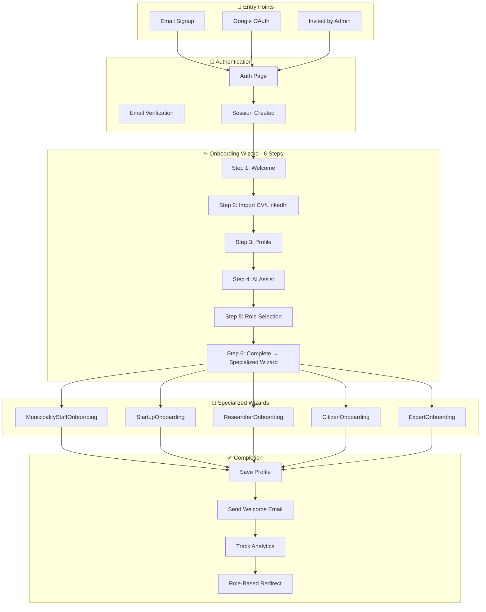

# Onboarding Flow - Implementation Tracking

## ✅ ALL FEATURES IMPLEMENTED

### Summary
All onboarding features including nice-to-haves are now complete:
- ✅ SmartWelcomeEmail auto-trigger via edge function
- ✅ OnboardingAnalytics data collection via hook
- ✅ A/B testing framework with database + UI
- ✅ Progressive profiling prompts

---

## Comprehensive Flow Diagram



---

## New Features Implemented

### 1. SmartWelcomeEmail Auto-Trigger
| Component | Path | Description |
|-----------|------|-------------|
| Edge Function | `supabase/functions/send-welcome-email/index.ts` | Sends persona-specific bilingual welcome emails via Resend |
| Auto-trigger | `OnboardingWizard.jsx` | Automatically called on onboarding completion |

### 2. OnboardingAnalytics Data Collection
| Component | Path | Description |
|-----------|------|-------------|
| Hook | `src/hooks/useOnboardingAnalytics.js` | Tracks all onboarding events |
| Database | `onboarding_events` table | Stores step timing, persona selection, CV uploads |

**Events Tracked:**
- `wizard_opened` - When user enters onboarding
- `step_started` / `step_completed` - With duration
- `cv_uploaded` - CV file uploads
- `linkedin_imported` - LinkedIn profile imports
- `ai_suggestion_applied` - When AI suggestions used
- `persona_selected` - Persona choice
- `onboarding_completed` - Full completion

### 3. A/B Testing Framework
| Component | Path | Description |
|-----------|------|-------------|
| Hook | `src/hooks/useABTesting.js` | Get variants, track conversions |
| Manager UI | `src/components/onboarding/ABTestingManager.jsx` | Admin UI for experiments |
| Database | `ab_experiments`, `ab_assignments`, `ab_conversions` | Full experiment data |

**Usage:**
```javascript
const { getVariant, trackConversion } = useABTesting();
const variant = await getVariant('onboarding_wizard_v2');
// Use variant to show different UI
trackConversion('onboarding_wizard_v2', 'completed', 1);
```

### 4. Progressive Profiling
| Component | Path | Description |
|-----------|------|-------------|
| Prompt UI | `src/components/onboarding/ProgressiveProfilingPrompt.jsx` | Non-intrusive profile completion prompts |
| Database | `progressive_profiling_prompts` | Tracks shown/dismissed prompts |

**Prompts user for missing:**
- LinkedIn URL
- Work phone
- Bio
- Expertise areas
- Organization

---

## Database Tables Added

| Table | Purpose |
|-------|---------|
| `onboarding_events` | Analytics event tracking |
| `ab_experiments` | A/B test definitions |
| `ab_assignments` | User variant assignments |
| `ab_conversions` | Conversion tracking |
| `progressive_profiling_prompts` | Profile completion tracking |
| `welcome_emails_sent` | Email send log |

---

## Integration Points

### Dashboard Integration
Add to any dashboard:
```jsx
import ProgressiveProfilingPrompt from '@/components/onboarding/ProgressiveProfilingPrompt';

// In component:
<ProgressiveProfilingPrompt onComplete={(field) => refetch()} />
```

### Analytics in Wizard
Already integrated in OnboardingWizard via `useOnboardingAnalytics` hook.

### A/B Testing Example
```jsx
const { getVariant } = useABTesting();
useEffect(() => {
  getVariant('new_onboarding_flow').then(v => setVariant(v));
}, []);
```

---

*Last Updated: 2025-12-09*
*Status: ✅ ALL FEATURES COMPLETE*
