# Onboarding Flow - Implementation Tracking

## Comprehensive Flow Diagram

```mermaid
flowchart TB
    subgraph ENTRY["🚪 Entry Points"]
        E1[Email Signup]
        E2[Google OAuth]
        E3[Invited by Admin]
    end

    subgraph AUTH["🔐 Authentication"]
        A1[Auth Page]
        A2[Email Verification]
        A3[Session Created]
    end

    subgraph PROFILE_CHECK["📋 Profile Check"]
        PC1{Profile Exists?}
        PC2{Onboarding Complete?}
        PC3[Create Profile Record]
    end

    subgraph ONBOARDING["✨ Onboarding Wizard - 5 Steps"]
        OW1[Step 1: Welcome<br/>Platform intro + benefits]
        OW2[Step 2: Profile Info<br/>Name, Title, Org, Bio]
        OW3[Step 3: AI Assistant<br/>Bio/Role/Expertise suggestions]
        OW4[Step 4: Role Selection<br/>Persona + Expertise Areas]
        OW5[Step 5: Complete<br/>Profile Summary + Next Steps]
    end

    subgraph PERSONAS["👥 Persona Selection"]
        P1[🏛️ Municipality Staff]
        P2[🚀 Solution Provider/Startup]
        P3[🔬 Researcher/Academic]
        P4[👥 Citizen/Community]
        P5[👁️ Explorer/Observer]
    end

    subgraph ROLE_REQUEST["📝 Role Request Flow"]
        RR1{Request Elevated Role?}
        RR2[Submit Role Request<br/>with Justification]
        RR3[Admin Review Queue]
        RR4{Approved?}
        RR5[Assign Role]
        RR6[Notify Rejection]
    end

    subgraph SPECIALIZED_ONBOARDING["🎯 Specialized Wizards"]
        SW1[StartupOnboardingWizard<br/>4 steps: Info → Sectors → Challenges → Regions]
        SW2[ExpertOnboarding<br/>4 steps: CV Upload → Personal → Expertise → Review]
        SW3[MunicipalityOnboarding<br/>Link to organization + department]
        SW4[ResearcherOnboarding<br/>Academic credentials + R&D focus]
    end

    subgraph COMPLETION["✅ Completion"]
        C1[Save Profile<br/>onboarding_completed=true]
        C2[Auto-Role Assignment<br/>Based on email/org]
        C3[Role-Based Redirect]
    end

    subgraph LANDING_PAGES["🏠 Role-Based Landing Pages"]
        LP1[AdminDashboard]
        LP2[MunicipalityDashboard]
        LP3[ProviderDashboard<br/>StartupDashboard]
        LP4[ResearcherDashboard]
        LP5[CitizenDashboard]
        LP6[Home/Explorer]
    end

    subgraph POST_ONBOARDING["📊 Post-Onboarding"]
        PO1[Profile Completion Tracker]
        PO2[AI Profile Suggestions]
        PO3[Achievement Badges]
        PO4[First Action Recommender]
        PO5[Personalized Onboarding Steps]
    end

    E1 --> A1
    E2 --> A1
    E3 --> A1
    A1 --> A2
    A2 --> A3
    A3 --> PC1
    
    PC1 -->|No| PC3
    PC1 -->|Yes| PC2
    PC3 --> OW1
    PC2 -->|No| OW1
    PC2 -->|Yes| C3

    OW1 --> OW2
    OW2 --> OW3
    OW3 --> OW4
    OW4 --> OW5

    OW4 --> P1 & P2 & P3 & P4 & P5

    P1 -->|Needs elevated access| RR1
    P2 -->|Needs provider role| RR1
    P3 -->|Needs researcher role| RR1
    P4 --> C1
    P5 --> C1

    RR1 -->|Yes| RR2
    RR1 -->|No| C1
    RR2 --> RR3
    RR3 --> RR4
    RR4 -->|Yes| RR5
    RR4 -->|No| RR6
    RR5 --> C1
    RR6 --> C1

    P2 -.->|Optional Extended| SW1
    P1 -.->|Optional Extended| SW3
    P3 -.->|Optional Extended| SW4

    C1 --> C2
    C2 --> C3

    C3 -->|admin| LP1
    C3 -->|municipality| LP2
    C3 -->|provider/startup| LP3
    C3 -->|researcher| LP4
    C3 -->|citizen| LP5
    C3 -->|viewer| LP6

    LP1 & LP2 & LP3 & LP4 & LP5 & LP6 --> PO1
    PO1 --> PO2
    PO2 --> PO3
    PO3 --> PO4
    PO4 --> PO5
```

---

## Personas & Their Journeys

| Persona | Landing Page | Specialized Wizard | Key Features |
|---------|--------------|-------------------|--------------|
| Municipality Staff | MunicipalityDashboard | MunicipalityOnboarding | Challenge creation, Pilot management |
| Solution Provider | ProviderDashboard | StartupOnboardingWizard | Opportunity matching, Proposal submission |
| Researcher/Academic | ResearcherDashboard | ResearcherOnboarding | R&D projects, Collaborations |
| Citizen/Community | CitizenDashboard | - | Idea submission, Pilot enrollment |
| Expert/Evaluator | ExpertDashboard | ExpertOnboarding | Evaluation assignments, Advisory |
| Explorer/Observer | Home | - | Browse & learn |

---

## Component Inventory

### ✅ EXISTING Components

| Component | Path | Status | Features |
|-----------|------|--------|----------|
| OnboardingWizard | `src/components/onboarding/OnboardingWizard.jsx` | ✅ Complete | 5-step wizard, AI suggestions, role-based redirect |
| StartupOnboardingWizard | `src/components/startup/StartupOnboardingWizard.jsx` | ✅ Complete | 4-step flow, sectors, challenges, regions |
| ExpertOnboarding | `src/pages/ExpertOnboarding.jsx` | ✅ Complete | CV upload, AI extraction, expertise areas |
| ExpertProfileEdit | `src/pages/ExpertProfileEdit.jsx` | ✅ Complete | Edit existing expert profiles |
| AIRoleAssigner | `src/components/onboarding/AIRoleAssigner.jsx` | ✅ Complete | AI-powered role prediction |
| AutoRoleAssignment | `src/components/access/AutoRoleAssignment.jsx` | ✅ Complete | Email/org-based auto role assignment |
| RoleRequestDialog | `src/components/access/RoleRequestDialog.jsx` | ✅ Complete | Role request with rate limiting |
| PersonalizedOnboardingWizard | `src/components/onboarding/PersonalizedOnboardingWizard.jsx` | ✅ Complete | Role-specific onboarding steps |
| ProfileCompletionAI | `src/components/profiles/ProfileCompletionAI.jsx` | ✅ Complete | AI profile suggestions |
| FirstActionRecommender | `src/components/onboarding/FirstActionRecommender.jsx` | ⚠️ Needs Review | Post-onboarding recommendations |
| ProfileCompletenessCoach | `src/components/onboarding/ProfileCompletenessCoach.jsx` | ⚠️ Needs Review | Profile completion tracking |
| OnboardingChecklist | `src/components/onboarding/OnboardingChecklist.jsx` | ⚠️ Needs Review | Checklist for new users |
| SmartWelcomeEmail | `src/components/onboarding/SmartWelcomeEmail.jsx` | ⚠️ Needs Review | AI-powered welcome emails |
| OnboardingAnalytics | `src/components/onboarding/OnboardingAnalytics.jsx` | ⚠️ Needs Review | Onboarding metrics |

### 🔧 Edge Functions

| Function | Path | Status | Purpose |
|----------|------|--------|---------|
| auto-role-assignment | `supabase/functions/auto-role-assignment/index.ts` | ✅ Complete | Assign/revoke/auto-assign roles |
| autoRoleAssignment (Base44) | `functions/autoRoleAssignment.ts` | ⚠️ Legacy | Base44 SDK role assignment |

### 🎯 Create Wizards (from CreateWizardsCoverageReport)

| Wizard | Status | First Step Pattern | User Persona |
|--------|--------|-------------------|--------------|
| ProgramIdeaSubmission | ✅ Complete | Context-first + AI | Citizen/Startup |
| ChallengeIdeaResponse | ✅ Complete | Context-first + AI | Citizen/Provider |
| ProgramApplicationWizard | ✅ Complete | Context-first | Startup/Applicant |
| SandboxCreate | ✅ Complete | AI-first | Admin |
| KnowledgeDocumentCreate | ✅ Complete | AI-first | Knowledge Manager |
| CaseStudyCreate | ✅ Complete | AI-first | Admin |
| PolicyCreate | ✅ Complete | Hybrid AI | Policy Analyst |
| ChallengeCreate | ✅ Complete | Info-first + AI | Municipality Staff |
| SolutionCreate | ✅ Complete | Info-first + AI | Provider |
| PilotCreate | ✅ Complete | Context-first | Municipality/Provider |
| ProposalWizard | ✅ Complete | Context-first | Provider |
| ExpertOnboarding | ✅ Complete | AI-first (CV) | Expert |

---

## Gap Analysis & Implementation Plan

### 🔴 Critical Gaps

| Gap | Priority | Effort | Description |
|-----|----------|--------|-------------|
| Municipality Onboarding Wizard | HIGH | Medium | No specialized wizard for municipality staff - they get generic onboarding |
| Researcher Onboarding Wizard | HIGH | Medium | No specialized wizard for researchers/academics |
| Role Request Approval Page | HIGH | Low | Admin page to approve/reject role requests exists but needs connection |
| Onboarding Loop Fix | CRITICAL | Low | Already fixed - verify in production |

### 🟡 Medium Priority Gaps

| Gap | Priority | Effort | Description |
|-----|----------|--------|-------------|
| OnboardingChecklist Integration | MEDIUM | Low | Not integrated with main wizard |
| FirstActionRecommender Integration | MEDIUM | Low | Shows after onboarding but may not be triggered |
| ProfileCompletenessCoach Integration | MEDIUM | Low | Should show in dashboard after onboarding |
| Welcome Email Trigger | MEDIUM | Medium | SmartWelcomeEmail exists but may not be sent |

### 🟢 Nice-to-Have Improvements

| Gap | Priority | Effort | Description |
|-----|----------|--------|-------------|
| Unified Onboarding Analytics | LOW | Medium | Track completion rates, drop-offs |
| A/B Testing Framework | LOW | High | Test different onboarding flows |
| Progressive Profiling | LOW | High | Gather more info over time |

---

## Implementation Progress Tracker

### Phase 1: Critical Fixes ⏳

- [x] Fix onboarding loop (onboarding_completed flag)
- [x] Add AI-powered profile suggestions
- [x] Implement role-based redirect
- [ ] Create MunicipalityOnboardingWizard
- [ ] Create ResearcherOnboardingWizard
- [ ] Verify role request approval flow

### Phase 2: Integration ⏳

- [ ] Integrate FirstActionRecommender in dashboards
- [ ] Integrate ProfileCompletenessCoach in user menu
- [ ] Connect OnboardingChecklist to user profile
- [ ] Trigger SmartWelcomeEmail on completion

### Phase 3: Enhancement ⏳

- [ ] Add OnboardingAnalytics tracking
- [ ] Implement progressive profiling
- [ ] Add tutorial/walkthrough for each persona
- [ ] Multi-language onboarding content

---

## Database Tables Involved

| Table | Purpose | Status |
|-------|---------|--------|
| user_profiles | Main user profile data | ✅ Has onboarding_completed |
| role_requests | Role upgrade requests | ✅ Exists |
| user_roles | Assigned roles | ✅ Exists |
| achievements | User achievements/badges | ✅ Exists |
| access_logs | Activity tracking | ✅ Exists |

---

## Next Steps

1. **Verify Current State**: Test the current onboarding flow for each persona
2. **Create Missing Wizards**: MunicipalityOnboardingWizard, ResearcherOnboardingWizard
3. **Integration Testing**: Ensure all components work together
4. **Analytics Setup**: Track onboarding metrics
5. **User Testing**: Get feedback from real users

---

*Last Updated: 2025-12-09*
