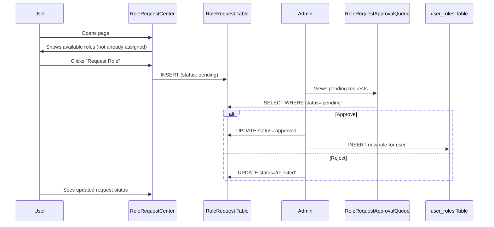

# RBAC (Role-Based Access Control) System Documentation

## Overview

This document describes the Role-Based Access Control system implemented in the application, including architecture, database schema, performance considerations, and optimization strategies.

---

## System Architecture

### Core Components

```
┌─────────────────────────────────────────────────────────────────────────┐
│                           RBAC System Overview                          │
└─────────────────────────────────────────────────────────────────────────┘

┌──────────────┐     ┌──────────────────────┐     ┌──────────────────────┐
│    Users     │────▶│   user_roles         │────▶│  App-Level Roles     │
│  (auth.users)│     │   (app_role enum)    │     │  admin, user, viewer │
└──────────────┘     └──────────────────────┘     └──────────────────────┘
       │
       │             ┌──────────────────────┐     ┌──────────────────────┐
       └────────────▶│ user_functional_roles│────▶│       roles          │
                     │   (junction table)   │     │  (functional roles)  │
                     └──────────────────────┘     └──────────────────────┘
                                                            │
                                                            ▼
                     ┌──────────────────────┐     ┌──────────────────────┐
                     │   role_permissions   │◀────│     permissions      │
                     │   (junction table)   │     │   (permission codes) │
                     └──────────────────────┘     └──────────────────────┘
                                                            │
                                                            ▼
                     ┌──────────────────────┐     ┌──────────────────────┐
                     │  delegation_rules    │────▶│  Temporary Access    │
                     │  (time-bound access) │     │  (delegated perms)   │
                     └──────────────────────┘     └──────────────────────┘
```

---

## Database Schema

### 1. Core Tables

#### `user_roles`
Assigns app-level roles to users (admin, user, viewer, editor, moderator).

```sql
CREATE TABLE public.user_roles (
  id UUID PRIMARY KEY DEFAULT gen_random_uuid(),
  user_id UUID NOT NULL,
  role app_role NOT NULL,
  created_at TIMESTAMPTZ DEFAULT now()
);
```

#### `roles`
Defines functional roles (e.g., "Challenge Manager", "Budget Approver").

```sql
CREATE TABLE public.roles (
  id UUID PRIMARY KEY DEFAULT gen_random_uuid(),
  name TEXT NOT NULL UNIQUE,
  description TEXT,
  created_at TIMESTAMPTZ DEFAULT now()
);
```

#### `permissions`
Defines granular permission codes (e.g., "challenges_create", "budgets_approve").

```sql
CREATE TABLE public.permissions (
  id UUID PRIMARY KEY DEFAULT gen_random_uuid(),
  code TEXT NOT NULL UNIQUE,
  name TEXT,
  description TEXT,
  category TEXT,
  created_at TIMESTAMPTZ DEFAULT now()
);
```

### 2. Junction Tables

#### `user_functional_roles`
Links users to functional roles with optional expiration.

```sql
CREATE TABLE public.user_functional_roles (
  id UUID PRIMARY KEY DEFAULT gen_random_uuid(),
  user_id UUID NOT NULL REFERENCES auth.users(id) ON DELETE CASCADE,
  role_id UUID NOT NULL REFERENCES public.roles(id) ON DELETE CASCADE,
  assigned_by UUID,
  assigned_at TIMESTAMPTZ DEFAULT now(),
  expires_at TIMESTAMPTZ,
  is_active BOOLEAN DEFAULT true,
  UNIQUE(user_id, role_id)
);
```

#### `role_permissions`
Links functional roles to permissions.

```sql
CREATE TABLE public.role_permissions (
  id UUID PRIMARY KEY DEFAULT gen_random_uuid(),
  role_id UUID NOT NULL REFERENCES public.roles(id) ON DELETE CASCADE,
  permission_id UUID NOT NULL REFERENCES public.permissions(id) ON DELETE CASCADE,
  created_at TIMESTAMPTZ DEFAULT now(),
  UNIQUE(role_id, permission_id)
);
```

### 3. Delegation Table

#### `delegation_rules`
Enables temporary permission delegation between users.

```sql
CREATE TABLE public.delegation_rules (
  id UUID PRIMARY KEY,
  delegator_email TEXT NOT NULL,
  delegate_email TEXT NOT NULL,
  permission_types TEXT[],
  start_date TIMESTAMPTZ NOT NULL,
  end_date TIMESTAMPTZ NOT NULL,
  is_active BOOLEAN DEFAULT true,
  reason TEXT,
  approved_by TEXT,
  approval_date TIMESTAMPTZ
);
```

---

## Security Definer Functions

### `get_user_permissions(_user_id UUID)`
Returns all permission codes for a user (including delegated permissions).

```sql
-- Returns: TEXT[] (e.g., ['challenges_read', 'challenges_create', 'budgets_view'])
-- Admin users return: ['*'] (wildcard for all permissions)

SELECT get_user_permissions('user-uuid-here');
```

### `get_user_functional_roles(_user_id UUID)`
Returns all active functional roles for a user.

```sql
-- Returns: TABLE(role_id UUID, role_name TEXT, role_description TEXT)

SELECT * FROM get_user_functional_roles('user-uuid-here');
```

### `has_permission(_user_id UUID, _permission_code TEXT)`
Checks if a user has a specific permission.

```sql
-- Returns: BOOLEAN

SELECT has_permission('user-uuid-here', 'challenges_create');
```

---

## Frontend Implementation

### `usePermissions` Hook

Located at: `src/components/permissions/usePermissions.jsx`

```jsx
import { usePermissions } from '@/components/permissions/usePermissions';

function MyComponent() {
  const {
    user,              // Current user with profile
    userId,            // User UUID
    userEmail,         // User email
    roles,             // App-level roles (admin, user, etc.)
    functionalRoles,   // Functional roles with names
    permissions,       // Permission codes array
    hasPermission,     // (permission) => boolean
    hasAnyPermission,  // ([permissions]) => boolean
    hasAllPermissions, // ([permissions]) => boolean
    canAccessEntity,   // (entityType, action) => boolean
    hasRole,           // (role) => boolean
    hasFunctionalRole, // (roleName) => boolean
    isAdmin            // boolean
  } = usePermissions();

  if (hasPermission('challenges_create')) {
    // Show create button
  }
}
```

### Permission Components

#### `PermissionGate`
Conditionally renders children based on permissions.

```jsx
<PermissionGate permission="challenges_create">
  <CreateChallengeButton />
</PermissionGate>

<PermissionGate permissions={['budgets_view', 'budgets_edit']} anyPermission>
  <BudgetSection />
</PermissionGate>
```

#### `ProtectedPage` HOC
Wraps entire pages with permission requirements.

```jsx
export default ProtectedPage(AdminDashboard, {
  requiredRoles: ['admin'],
  requireAdmin: true,
  fallback: <AccessDenied />
});
```

---

## Permission Resolution Flow

```
User Request → usePermissions Hook
                    │
                    ▼
        ┌───────────────────────┐
        │  supabase.rpc()       │
        │  get_user_permissions │
        └───────────────────────┘
                    │
                    ▼
        ┌───────────────────────┐
        │  Server-Side Logic    │
        │  (SECURITY DEFINER)   │
        └───────────────────────┘
                    │
        ┌───────────┴───────────┐
        ▼                       ▼
┌───────────────┐       ┌───────────────┐
│ Check Admin   │       │ Check Roles   │
│ (wildcard *)  │       │ & Delegations │
└───────────────┘       └───────────────┘
        │                       │
        └───────────┬───────────┘
                    ▼
        ┌───────────────────────┐
        │  Return Permission[]  │
        │  (cached by React Q)  │
        └───────────────────────┘
```

---

## Performance Analysis

### Current Implementation

| Operation | Complexity | Queries | Notes |
|-----------|------------|---------|-------|
| Get permissions | O(n) | 1 RPC call | Server-side joins |
| Get functional roles | O(n) | 1 RPC call | Server-side processing |
| Get user app roles | O(1) | 1 query | Simple lookup |
| Check permission | O(1) | 0 (cached) | Client-side array check |

### Potential Bottlenecks

1. **Multiple Concurrent Queries**: The hook makes 4 parallel queries on mount:
   - Session check
   - User profile
   - App roles
   - Permissions (RPC)
   - Functional roles (RPC)

2. **No Server-Side Caching**: Each page load triggers fresh permission queries.

3. **Delegation Check Overhead**: The `get_user_permissions` function performs a JOIN with `user_profiles` for delegation lookups.

---

## Performance Optimization Strategies

### Option 1: Materialized View (Recommended)

Create a materialized view that pre-computes user permissions:

```sql
-- Create materialized view
CREATE MATERIALIZED VIEW public.user_permissions_cache AS
SELECT 
  u.id as user_id,
  u.email as user_email,
  CASE 
    WHEN EXISTS (SELECT 1 FROM public.user_roles ur WHERE ur.user_id = u.id AND ur.role = 'admin')
    THEN ARRAY['*']::TEXT[]
    ELSE COALESCE(
      (
        SELECT array_agg(DISTINCT p.code)
        FROM public.user_functional_roles ufr
        JOIN public.role_permissions rp ON ufr.role_id = rp.role_id
        JOIN public.permissions p ON rp.permission_id = p.id
        WHERE ufr.user_id = u.id 
          AND ufr.is_active = true
          AND (ufr.expires_at IS NULL OR ufr.expires_at > now())
      ),
      ARRAY[]::TEXT[]
    )
  END as permissions,
  COALESCE(
    (
      SELECT array_agg(r.name)
      FROM public.user_functional_roles ufr
      JOIN public.roles r ON ufr.role_id = r.id
      WHERE ufr.user_id = u.id 
        AND ufr.is_active = true
        AND (ufr.expires_at IS NULL OR ufr.expires_at > now())
    ),
    ARRAY[]::TEXT[]
  ) as functional_role_names
FROM auth.users u;

-- Create unique index for fast lookups
CREATE UNIQUE INDEX idx_user_permissions_cache_user_id 
ON public.user_permissions_cache(user_id);

-- Refresh function
CREATE OR REPLACE FUNCTION refresh_user_permissions_cache()
RETURNS void AS $$
BEGIN
  REFRESH MATERIALIZED VIEW CONCURRENTLY public.user_permissions_cache;
END;
$$ LANGUAGE plpgsql SECURITY DEFINER;
```

**Pros:**
- Single query for all permission data
- Pre-computed JOINs
- Concurrent refresh doesn't block reads

**Cons:**
- Stale data until refresh
- Requires scheduled refresh or trigger-based refresh
- Delegation rules need real-time check (can't be cached)

### Option 2: Database Triggers for Incremental Updates

```sql
-- Trigger to refresh cache on role changes
CREATE OR REPLACE FUNCTION trigger_refresh_permissions_cache()
RETURNS TRIGGER AS $$
BEGIN
  PERFORM refresh_user_permissions_cache();
  RETURN NULL;
END;
$$ LANGUAGE plpgsql;

CREATE TRIGGER trg_user_functional_roles_change
AFTER INSERT OR UPDATE OR DELETE ON public.user_functional_roles
FOR EACH STATEMENT EXECUTE FUNCTION trigger_refresh_permissions_cache();

CREATE TRIGGER trg_role_permissions_change
AFTER INSERT OR UPDATE OR DELETE ON public.role_permissions
FOR EACH STATEMENT EXECUTE FUNCTION trigger_refresh_permissions_cache();
```

### Option 3: Redis/Edge Caching

For high-traffic applications, implement edge function caching:

```typescript
// Edge function with caching
const CACHE_TTL = 300; // 5 minutes

async function getCachedPermissions(userId: string) {
  const cacheKey = `permissions:${userId}`;
  
  // Check cache first (using Supabase Edge KV or external Redis)
  const cached = await cache.get(cacheKey);
  if (cached) return JSON.parse(cached);
  
  // Fetch from DB
  const { data } = await supabase.rpc('get_user_permissions', { _user_id: userId });
  
  // Cache result
  await cache.set(cacheKey, JSON.stringify(data), { ex: CACHE_TTL });
  
  return data;
}
```

### Option 4: Optimized Single Query Function

Replace multiple RPC calls with a single comprehensive function:

```sql
CREATE OR REPLACE FUNCTION get_user_access_data(_user_id UUID)
RETURNS JSONB
LANGUAGE plpgsql
STABLE SECURITY DEFINER
SET search_path TO 'public'
AS $$
DECLARE
  result JSONB;
  is_admin_user BOOLEAN;
BEGIN
  -- Check admin status
  SELECT EXISTS (
    SELECT 1 FROM public.user_roles WHERE user_id = _user_id AND role = 'admin'
  ) INTO is_admin_user;
  
  -- Build complete access data in single query
  SELECT jsonb_build_object(
    'is_admin', is_admin_user,
    'app_roles', COALESCE((
      SELECT jsonb_agg(role) FROM public.user_roles WHERE user_id = _user_id
    ), '[]'::jsonb),
    'permissions', CASE 
      WHEN is_admin_user THEN '["*"]'::jsonb
      ELSE COALESCE((
        SELECT jsonb_agg(DISTINCT p.code)
        FROM public.user_functional_roles ufr
        JOIN public.role_permissions rp ON ufr.role_id = rp.role_id
        JOIN public.permissions p ON rp.permission_id = p.id
        WHERE ufr.user_id = _user_id 
          AND ufr.is_active = true
          AND (ufr.expires_at IS NULL OR ufr.expires_at > now())
      ), '[]'::jsonb)
    END,
    'functional_roles', COALESCE((
      SELECT jsonb_agg(jsonb_build_object(
        'id', r.id,
        'name', r.name,
        'description', r.description
      ))
      FROM public.user_functional_roles ufr
      JOIN public.roles r ON ufr.role_id = r.id
      WHERE ufr.user_id = _user_id 
        AND ufr.is_active = true
        AND (ufr.expires_at IS NULL OR ufr.expires_at > now())
    ), '[]'::jsonb)
  ) INTO result;
  
  RETURN result;
END;
$$;
```

---

## Recommendation

### For Most Use Cases: Materialized View + Single RPC

1. **Create the materialized view** for fast lookups
2. **Use `get_user_access_data()`** single function to reduce round trips
3. **Refresh view on role changes** via triggers
4. **Handle delegations separately** with real-time checks (they're time-sensitive)

### Performance Comparison

| Approach | Queries | Latency | Staleness | Complexity |
|----------|---------|---------|-----------|------------|
| Current (multiple RPC) | 4-5 | ~200ms | None | Low |
| Materialized View | 1 | ~20ms | 0-5 min | Medium |
| Single RPC Function | 1 | ~50ms | None | Low |
| Redis Cache | 0-1 | ~5ms | 0-5 min | High |

---

## Security Considerations

1. **All permission functions use SECURITY DEFINER** - runs with owner privileges
2. **RLS policies on junction tables** - users can only see their own assignments
3. **Delegation requires approval** - `approval_status = 'approved'` check
4. **Time-bound access** - `expires_at` and delegation date ranges
5. **Audit logging** - Track permission changes in `access_logs`

---

## API Reference

### Edge Function: `validate-permission`

```bash
POST /functions/v1/validate-permission
Content-Type: application/json

{
  "user_id": "uuid",
  "user_email": "email@example.com",
  "permission": "challenges_create",
  "resource": "challenges",
  "action": "create"
}

Response:
{
  "success": true,
  "allowed": true,
  "roles": ["user", "editor"],
  "reason": "role_permission" | "admin_role" | "delegation"
}
```

---

## Migration Guide

To add new permissions:

```sql
-- 1. Add permission
INSERT INTO public.permissions (code, name, category)
VALUES ('new_feature_access', 'New Feature Access', 'features');

-- 2. Assign to roles
INSERT INTO public.role_permissions (role_id, permission_id)
SELECT r.id, p.id
FROM public.roles r, public.permissions p
WHERE r.name = 'Manager' AND p.code = 'new_feature_access';

-- 3. Refresh cache (if using materialized view)
SELECT refresh_user_permissions_cache();
```

---

## Troubleshooting

### User missing expected permissions

1. Check `user_functional_roles` - is assignment active and not expired?
2. Check `role_permissions` - is permission linked to the role?
3. Check delegation rules - is delegation active and within date range?
4. Run: `SELECT * FROM get_user_permissions('user-id');`

### Permissions not updating

1. If using materialized view, refresh it: `SELECT refresh_user_permissions_cache();`
2. Clear React Query cache: `queryClient.invalidateQueries(['user-permissions'])`
3. Check for `is_active = false` on assignments

---

## UI Pages & Components

### Admin Pages

| Page | File | Purpose |
|------|------|---------|
| **RoleRequestApprovalQueue** | `src/pages/RoleRequestApprovalQueue.jsx` | Admin queue to approve/reject pending role requests |
| **RoleRequestCenter** | `src/pages/RoleRequestCenter.jsx` | User hub for requesting new roles + admin approval view |
| **MenuRBACCoverageReport** | `src/pages/MenuRBACCoverageReport.jsx` | RBAC coverage analysis *(empty - needs implementation)* |
| **RBACComprehensiveAudit** | `src/pages/RBACComprehensiveAudit.jsx` | Full RBAC audit report *(empty - needs implementation)* |

### Management Components

| Component | Location | Purpose |
|-----------|----------|---------|
| **UserRoleManager** | `src/components/UserRoleManager.jsx` | Assign/manage special roles for individual users |
| **PermissionMatrix** | `src/components/PermissionMatrix.jsx` | Toggle permissions per role/entity/action grid |
| **RoleHierarchyBuilder** | `src/components/access/RoleHierarchyBuilder.jsx` | Visualize and manage parent-child role hierarchy |
| **RoleTemplateLibrary** | `src/components/access/RoleTemplateLibrary.jsx` | Apply predefined role templates |
| **BulkRoleAssignment** | `src/components/access/BulkRoleAssignment.jsx` | Assign one role to multiple users at once |
| **BulkRoleActions** | `src/components/access/BulkRoleActions.jsx` | Add/remove permissions from multiple roles |
| **RolePermissionMatrix** | `src/components/access/RolePermissionMatrix.jsx` | View permissions by role or by permission category |

### Permission Components

| Component | Location | Purpose |
|-----------|----------|---------|
| **PermissionGate** | `src/components/permissions/PermissionGate.jsx` | Conditionally render UI based on permissions |
| **ProtectedPage** | `src/components/permissions/ProtectedPage.jsx` | HOC to protect entire pages |
| **PermissionSelector** | `src/components/permissions/PermissionSelector.jsx` | Multi-select UI for choosing permissions |
| **usePermissions** | `src/components/permissions/usePermissions.jsx` | Hook for permission/role checking |

---

## Role Request Workflow



### Role Request States

| Status | Description |
|--------|-------------|
| `pending` | Awaiting admin review |
| `approved` | Role granted, user_roles updated |
| `rejected` | Request denied by admin |

---

## Component Usage Examples

### Protecting a Page (HOC)

```jsx
import ProtectedPage from '@/components/permissions/ProtectedPage';

function AdminDashboard() {
  return <div>Admin content</div>;
}

// Require admin role
export default ProtectedPage(AdminDashboard, { requireAdmin: true });

// Require specific permissions
export default ProtectedPage(AdminDashboard, { 
  requiredPermissions: ['users_manage', 'roles_assign'] 
});

// Require specific roles
export default ProtectedPage(AdminDashboard, { 
  requiredRoles: ['super_admin', 'hr_manager'] 
});
```

### Conditional Rendering (Gate)

```jsx
import PermissionGate from '@/components/permissions/PermissionGate';

function Dashboard() {
  return (
    <div>
      <h1>Dashboard</h1>
      
      {/* Show only to admins */}
      <PermissionGate requireAdmin>
        <AdminPanel />
      </PermissionGate>
      
      {/* Show if user has ANY of these permissions */}
      <PermissionGate permissions={['edit_users', 'view_users']} anyPermission>
        <UserList />
      </PermissionGate>
      
      {/* Show if user has ALL permissions */}
      <PermissionGate permissions={['delete_records', 'audit_access']}>
        <DangerZone />
      </PermissionGate>
    </div>
  );
}
```

### Using the Hook Directly

```jsx
import { usePermissions } from '@/components/permissions/usePermissions';

function MyComponent() {
  const { 
    user,
    isAdmin,
    hasPermission,
    hasAnyPermission,
    hasAllPermissions,
    hasRole,
    hasFunctionalRole,
    canAccessEntity
  } = usePermissions();

  // Check single permission
  if (hasPermission('users_delete')) { /* ... */ }

  // Check any of multiple permissions
  if (hasAnyPermission(['users_edit', 'users_view'])) { /* ... */ }

  // Check entity access (generates "challenges_edit")
  if (canAccessEntity('challenges', 'edit')) { /* ... */ }

  // Check functional role
  if (hasFunctionalRole('Challenge Manager')) { /* ... */ }
}
```

---

## Empty Pages - Implementation Suggestions

### 1. MenuRBACCoverageReport

**Purpose:** Analyze which menu items/routes are protected by RBAC

**Suggested Features:**
- List all routes/menu items in the app
- Show which permissions/roles protect each route
- Highlight unprotected routes (security gaps)
- Coverage percentage metric
- Export report as PDF/CSV

### 2. RBACComprehensiveAudit

**Purpose:** Full audit of the RBAC system health

**Suggested Features:**
- Users without any roles assigned
- Orphaned permissions (not assigned to any role)
- Roles without any users
- Unused roles (defined but never assigned)
- Permission conflicts or duplicates
- Recent role/permission changes audit trail
- Expired assignments cleanup suggestions

---

## Implementation Status Summary

✅ **Completed:**
- Junction tables (`user_functional_roles`, `role_permissions`)
- Security definer functions (`has_permission`, `get_user_permissions`, `get_user_functional_roles`)
- `usePermissions` hook using RPC calls
- RLS policies on all permission tables
- Role request workflow (request → approve/reject)
- Permission gates and protected page HOC
- Bulk role assignment components
- Role hierarchy visualization

📋 **Recommended Next Steps:**
1. Implement `MenuRBACCoverageReport` page
2. Implement `RBACComprehensiveAudit` page
3. Add materialized view for performance optimization
4. Add Redis/edge caching for high-traffic scenarios
5. Add audit logging for all permission changes
6. Create role wizard for guided role creation
