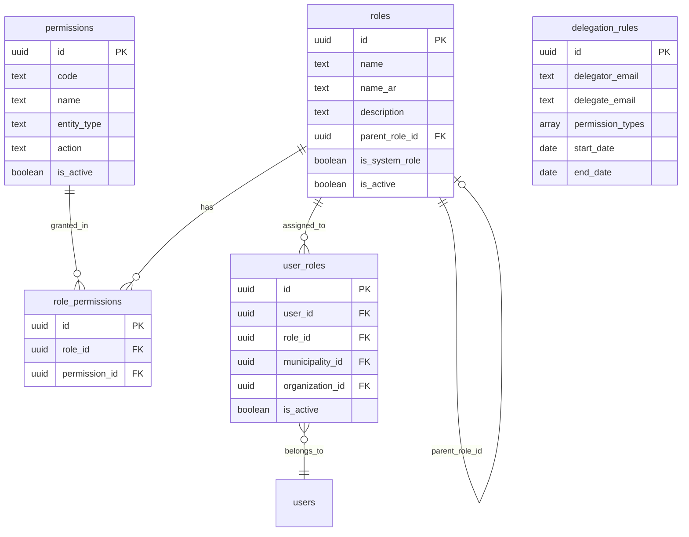

# Admin & Platform System Inventory

> **Version:** 3.0  
> **Last Updated:** 2025-12-18  
> **Total Assets:** 125 files (65 pages, 52 components, 8 hooks)  
> **Parent System:** Platform Administration  
> **Hub Page:** `/admin-portal`

---

## 🔗 Navigation

| ⬅️ Previous | ⬆️ Parent | ➡️ Next |
|-------------|-----------|---------|
| [← Matchmaker](../matchmaker/matchmaker-system-inventory.md) | [Master Index](../SYSTEM_INVENTORIES_INDEX.md) | [Communications →](../communications/communications-system-inventory.md) |

---

## Overview

The Admin System provides platform administration including user management, RBAC (Role-Based Access Control), data management, system configuration, monitoring, compliance, and platform auditing.

---

## 🔐 RBAC System Architecture

### Database Schema (Phase 4 Migration Complete)

### Database Tables

| Table | Purpose | Key Columns |
|-------|---------|-------------|
| `roles` | Role definitions (Admin, Municipality Admin, Citizen, etc.) | `id`, `name`, `name_ar`, `parent_role_id`, `is_system_role` |
| `permissions` | Granular permissions (challenge_create, pilot_edit, etc.) | `id`, `code`, `name`, `entity_type`, `action` |
| `role_permissions` | Junction table linking roles → permissions | `role_id`, `permission_id` |
| `user_roles` | User → Role assignments with scope | `user_id`, `role_id`, `municipality_id`, `organization_id`, `is_active` |
| `delegation_rules` | Temporary permission delegation between users | `delegator_email`, `delegate_email`, `permission_types`, `start_date`, `end_date` |

### Database Functions

| Function | Purpose | Security |
|----------|---------|----------|
| `get_user_permissions(_user_id)` | Get all user permissions via role_permissions join | SECURITY DEFINER |
| `get_user_functional_roles(_user_id)` | Get user roles via role_id join | SECURITY DEFINER |
| `has_role(_user_id, _role_name)` | Check if user has specific role | SECURITY DEFINER |
| `is_admin(_user_id)` | Check admin status via role_id join | SECURITY DEFINER |

### Migration History

| Phase | Description | Status |
|-------|-------------|--------|
| Phase 1 | Add `role_id` FK to `user_roles` table | ✅ Complete |
| Phase 2 | Populate `role_id` from role enum/name | ✅ Complete |
| Phase 3 | Make `role_id` NOT NULL, update functions | ✅ Complete |
| Phase 4 | Remove `role` enum column, update all queries | ✅ Complete |

---

## 📄 Pages (65)

### Core Admin Pages

| Page | File | Route | Permission | Parent |
|------|------|-------|------------|--------|
| **Admin Portal** | `AdminPortal.jsx` | `/admin-portal` | `admin` | Self (Root) |
| Command Center | `CommandCenter.jsx` | `/command-center` | `admin` | Admin Portal |
| System Health Dashboard | `SystemHealthDashboard.jsx` | `/system-health-dashboard` | `admin` | Admin Portal |
| Platform Audit | `PlatformAudit.jsx` | `/platform-audit` | `admin` | Admin Portal |

### Platform Audit Pages

| Page | File | Route | Permission | Parent |
|------|------|-------|------------|--------|
| Admin Coverage Report | `AdminCoverageReport.jsx` | `/admin-coverage-report` | `admin` | Admin Portal |
| Analytics Cluster Audit | `AnalyticsClusterAudit.jsx` | `/analytics-cluster-audit` | `admin` | Admin Portal |
| Bilingual Coverage Reports | `BilingualCoverageReports.jsx` | `/bilingual-coverage-reports` | `admin` | Admin Portal |
| Bilingual RTL Audit | `BilingualRTLAudit.jsx` | `/bilingual-rtl-audit` | `admin` | Admin Portal |
| Bilingual System Audit | `BilingualSystemAudit.jsx` | `/bilingual-system-audit` | `admin` | Admin Portal |
| Comment System Cluster Audit | `CommentSystemClusterAudit.jsx` | `/comment-system-cluster-audit` | `admin` | Admin Portal |
| Comprehensive Report Audit | `ComprehensiveReportAudit.jsx` | `/comprehensive-report-audit` | `admin` | Admin Portal |
| Content Audit | `ContentAudit.jsx` | `/content-audit` | `admin` | Admin Portal |
| Coverage Report Standardization | `CoverageReportStandardization.jsx` | `/coverage-report-standardization` | `admin` | Admin Portal |
| Coverage Report Update Tracker | `CoverageReportUpdateTracker.jsx` | `/coverage-report-update-tracker` | `admin` | Admin Portal |
| Coverage Reports Audit | `CoverageReportsAudit.jsx` | `/coverage-reports-audit` | `admin` | Admin Portal |
| Mobile Responsiveness Audit | `MobileResponsivenessAudit.jsx` | `/mobile-responsiveness-audit` | `admin` | Admin Portal |
| Module Consistency Validator | `ModuleConsistencyValidator.jsx` | `/module-consistency-validator` | `admin` | Admin Portal |
| Module Coverage Hub | `ModuleCoverageHub.jsx` | `/module-coverage-hub` | `admin` | Admin Portal |
| Platform Completion Report | `PlatformCompletionReport.jsx` | `/platform-completion-report` | `admin` | Admin Portal |
| Platform Coverage Audit | `PlatformCoverageAudit.jsx` | `/platform-coverage-audit` | `admin` | Admin Portal |
| Priority 6 Master Audit | `Priority6MasterAudit.jsx` | `/priority-6-master-audit` | `admin` | Admin Portal |

### User Management Pages

| Page | File | Route | Permission | Parent |
|------|------|-------|------------|--------|
| User Management | `UserManagement.jsx` | `/user-management` | `user_manage` | Admin Portal |
| User Management Hub | `UserManagementHub.jsx` | `/user-management-hub` | `user_manage` | Admin Portal |
| User Activity Dashboard | `UserActivityDashboard.jsx` | `/user-activity-dashboard` | `user_manage` | User Management |
| User Profile | `UserProfile.jsx` | `/user-profile` | `authenticated` | Personal |
| User Profile Multi Identity | `UserProfileMultiIdentity.jsx` | `/user-profile-multi-identity` | `authenticated` | Personal |
| Team Overview | `TeamOverview.jsx` | `/team-overview` | `team_manage` | User Management |
| Team Workspace | `TeamWorkspace.jsx` | `/team-workspace` | `team_manage` | User Management |
| Team Management | `TeamManagement.jsx` | `/team-management` | `team_manage` | User Management |
| Delegation Manager | `DelegationManager.jsx` | `/delegation-manager` | `authenticated` | Personal |
| Session Device Manager | `SessionDeviceManager.jsx` | `/session-device-manager` | `authenticated` | Personal |
| My Delegation | `MyDelegation.jsx` | `/my-delegation` | `authenticated` | Personal |

### RBAC Pages (11)

| Page | File | Route | Permission | Parent |
|------|------|-------|------------|--------|
| **RBAC Hub** | `RBACHub.jsx` | `/rbac-hub` | `rbac_admin` | Admin Portal |
| Role Permission Manager | `RolePermissionManager.jsx` | `/role-permission-manager` | `rbac_admin` | RBAC Hub |
| RBAC Dashboard | `RBACDashboard.jsx` | `/rbac-dashboard` | `rbac_admin` | RBAC Hub |
| RBAC Audit Report | `RBACAuditReport.jsx` | `/rbac-audit-report` | `rbac_admin` | RBAC Hub |
| Role Request Center | `RoleRequestCenter.jsx` | `/role-request-center` | `rbac_admin` | RBAC Hub |
| Role Manager | `RoleManager.jsx` | `/role-manager` | `rbac_admin` | RBAC Hub |
| RBAC Implementation Tracker | `RBACImplementationTracker.jsx` | `/rbac-implementation-tracker` | `admin` | RBAC Hub |
| RBAC Comprehensive Audit | `RBACComprehensiveAudit.jsx` | `/rbac-comprehensive-audit` | `admin` | RBAC Hub |
| Conditional Access Rules | `ConditionalAccessRules.jsx` | `/conditional-access-rules` | `rbac_admin` | RBAC Hub |
| Menu RBAC Coverage Report | `MenuRBACCoverageReport.jsx` | `/menu-rbac-coverage-report` | `admin` | Reports |
| Expert Registry | `ExpertRegistry.jsx` | `/expert-registry` | `rbac_admin` | RBAC Hub |

### Data Management Pages

| Page | File | Route | Permission | Parent |
|------|------|-------|------------|--------|
| Data Management Hub | `DataManagementHub.jsx` | `/data-management-hub` | `data_admin` | Admin Portal |
| Import Export Hub | `ImportExportHub.jsx` | `/import-export-hub` | `data_admin` | Data Management |
| Validation Rules Engine | `ValidationRulesEngine.jsx` | `/validation-rules-engine` | `data_admin` | Data Management |
| Data Retention Config | `DataRetentionConfig.jsx` | `/data-retention-config` | `data_admin` | Data Management |
| Backup Recovery Manager | `BackupRecoveryManager.jsx` | `/backup-recovery-manager` | `admin` | Admin Portal |
| Data Model Documentation | `DataModelDocumentation.jsx` | `/data-model-documentation` | `admin` | Data Management |

### System Configuration Pages

| Page | File | Route | Permission | Parent |
|------|------|-------|------------|--------|
| Settings | `Settings.jsx` | `/settings` | `authenticated` | Personal |
| Branding Settings | `BrandingSettings.jsx` | `/branding-settings` | `admin` | Admin Portal |
| System Defaults Config | `SystemDefaultsConfig.jsx` | `/system-defaults-config` | `admin` | Admin Portal |
| Security Policy Manager | `SecurityPolicyManager.jsx` | `/security-policy-manager` | `admin` | Admin Portal |
| Feature Flags Dashboard | `FeatureFlagsDashboard.jsx` | `/feature-flags-dashboard` | `admin` | Admin Portal |
| AI Configuration Panel | `AIConfigurationPanel.jsx` | `/ai-configuration-panel` | `admin` | Admin Portal |
| Taxonomy Builder | `TaxonomyBuilder.jsx` | `/taxonomy-builder` | `admin` | Admin Portal |
| Workflow Designer | `WorkflowDesigner.jsx` | `/workflow-designer` | `admin` | Admin Portal |

### Monitoring Pages

| Page | File | Route | Permission | Parent |
|------|------|-------|------------|--------|
| Performance Monitor | `PerformanceMonitor.jsx` | `/performance-monitor` | `admin` | Admin Portal |
| Error Logs Console | `ErrorLogsConsole.jsx` | `/error-logs-console` | `admin` | Admin Portal |
| Scheduled Jobs Manager | `ScheduledJobsManager.jsx` | `/scheduled-jobs-manager` | `admin` | Admin Portal |
| API Management Console | `APIManagementConsole.jsx` | `/api-management-console` | `admin` | Admin Portal |
| Usage Analytics | `UsageAnalytics.jsx` | `/usage-analytics` | `admin` | Admin Portal |
| Feature Usage Heatmap | `FeatureUsageHeatmap.jsx` | `/feature-usage-heatmap` | `admin` | Admin Portal |
| Audit Trail | `AuditTrail.jsx` | `/audit-trail` | `admin` | Admin Portal |
| Audit Registry | `AuditRegistry.jsx` | `/audit-registry` | `admin` | Admin Portal |
| Audit Detail | `AuditDetail.jsx` | `/audit-detail` | `admin` | Audit Registry |
| Flow Visualizer | `FlowVisualizer.jsx` | `/flow-visualizer` | `admin` | Admin Portal |

### Compliance Pages

| Page | File | Route | Permission | Parent |
|------|------|-------|------------|--------|
| Compliance Dashboard | `ComplianceDashboard.jsx` | `/compliance-dashboard` | `admin` | Admin Portal |

### Template & Content Pages

| Page | File | Route | Permission | Parent |
|------|------|-------|------------|--------|
| Template Library | `TemplateLibrary.jsx` | `/template-library` | `admin` | Admin Portal |
| Template Library Manager | `TemplateLibraryManager.jsx` | `/template-library-manager` | `admin` | Admin Portal |
| Document Version Control | `DocumentVersionControl.jsx` | `/document-version-control` | `admin` | Admin Portal |
| Media Library | `MediaLibrary.jsx` | `/media-library` | `admin` | Admin Portal |
| File Library | `FileLibrary.jsx` | `/file-library` | `authenticated` | Personal |

---

## 🧩 Components (52)

### Permission Components (8)
**Location:** `src/components/permissions/`

| Component | File | Description |
|-----------|------|-------------|
| usePermissions | `usePermissions.jsx` | Core hook for permission checks - queries `user_roles`, `role_permissions` |
| PermissionGate | `PermissionGate.jsx` | Conditional rendering wrapper based on permissions |
| ProtectedAction | `ProtectedAction.jsx` | Action button protection with lock icon fallback |
| ProtectedPage | `ProtectedPage.jsx` | Page-level protection HOC |
| FieldPermission | `FieldPermissions.jsx` | Field-level access control |
| PermissionSelector | `PermissionSelector.jsx` | Permission picker UI component |
| RowLevelSecurity | `RowLevelSecurity.jsx` | RLS helper utilities |
| withEntityAccess | `withEntityAccess.jsx` | HOC for entity-level access control |

### RBAC Dashboard Components (7)
**Location:** `src/components/rbac/`

| Component | File | Description |
|-----------|------|-------------|
| RBACDashboardContent | `RBACDashboardContent.jsx` | Main RBAC dashboard content |
| RBACAuditContent | `RBACAuditContent.jsx` | RBAC audit reporting content |
| RBACCoverageContent | `RBACCoverageContent.jsx` | RBAC coverage analysis |
| DelegationApprovalQueue | `DelegationApprovalQueue.jsx` | Delegation approval workflow |
| PermissionAuditTrail | `PermissionAuditTrail.jsx` | Permission change audit trail |
| MenuRBACContent | `MenuRBACContent.jsx` | Menu-level RBAC configuration |
| MobileDelegationManager | `MobileDelegationManager.jsx` | Mobile-friendly delegation UI |

### Access Control Components (37)
**Location:** `src/components/access/`

| Component | File | Description |
|-----------|------|-------------|
| RolePermissionMatrix | `RolePermissionMatrix.jsx` | Visual role/permission grid |
| RoleAuditDetail | `RoleAuditDetail.jsx` | Detailed role audit view |
| RoleAuditDialog | `RoleAuditDialog.jsx` | Role audit modal dialog |
| BulkRoleActions | `BulkRoleActions.jsx` | Bulk role operations |
| BulkRoleAssignment | `BulkRoleAssignment.jsx` | Mass role assignment |
| RoleHierarchyBuilder | `RoleHierarchyBuilder.jsx` | Role inheritance configuration |
| RoleTemplateLibrary | `RoleTemplateLibrary.jsx` | Pre-defined role templates |
| RoleRequestDialog | `RoleRequestDialog.jsx` | Role request modal |
| RoleRequestApprovalQueue | `RoleRequestApprovalQueue.jsx` | Role request approval workflow |
| AutoRoleAssignment | `AutoRoleAssignment.jsx` | Automatic role assignment rules |
| PermissionInheritanceVisualizer | `PermissionInheritanceVisualizer.jsx` | Permission inheritance tree view |
| PermissionTestingTool | `PermissionTestingTool.jsx` | Permission testing/simulation |
| PermissionTemplateManager | `PermissionTemplateManager.jsx` | Permission templates |
| PermissionUsageAnalytics | `PermissionUsageAnalytics.jsx` | Permission usage statistics |
| DelegationApprovalQueue | `DelegationApprovalQueue.jsx` | Delegation approvals |
| FieldLevelPermissions | `FieldLevelPermissions.jsx` | Field-level permission config |
| FieldSecurityRulesEditor | `FieldSecurityRulesEditor.jsx` | Field security rules editor |
| ConditionalAccessRules | `ConditionalAccessRules.jsx` | Conditional access configuration |
| SessionTimeoutConfig | `SessionTimeoutConfig.jsx` | Session timeout settings |
| MultiDevicePolicyBuilder | `MultiDevicePolicyBuilder.jsx` | Multi-device policies |
| BulkUserImport | `BulkUserImport.jsx` | Bulk user import |
| BulkUserActions | `BulkUserActions.jsx` | Bulk user operations |
| AdvancedUserFilters | `AdvancedUserFilters.jsx` | Advanced user filtering |
| UserHealthScores | `UserHealthScores.jsx` | User health metrics |
| UserJourneyMapper | `UserJourneyMapper.jsx` | User journey visualization |
| PredictiveChurnAnalysis | `PredictiveChurnAnalysis.jsx` | Churn prediction |
| FeatureUsageHeatmap | `FeatureUsageHeatmap.jsx` | Feature usage visualization |
| TeamWorkspace | `TeamWorkspace.jsx` | Team workspace management |
| TeamPerformanceAnalytics | `TeamPerformanceAnalytics.jsx` | Team performance metrics |
| CrossTeamCollaboration | `CrossTeamCollaboration.jsx` | Cross-team collaboration |
| ImpersonationAuditLog | `ImpersonationAuditLog.jsx` | Impersonation audit trail |
| ImpersonationRequestWorkflow | `ImpersonationRequestWorkflow.jsx` | Impersonation request flow |
| AutomatedAuditScheduler | `AutomatedAuditScheduler.jsx` | Scheduled audit configuration |
| AuditExporter | `AuditExporter.jsx` | Audit data export |
| ComplianceReportTemplates | `ComplianceReportTemplates.jsx` | Compliance report templates |
| BackendPermissionValidator | `BackendPermissionValidator.jsx` | Backend permission validation |
| WelcomeEmailCustomizer | `WelcomeEmailCustomizer.jsx` | Welcome email customization |

---

## 🪝 Hooks (8)

| Hook | File | Description |
|------|------|-------------|
| usePermissions | `src/components/permissions/usePermissions.jsx` | Core permission hook - queries DB functions |
| useUserRoles | `src/hooks/useUserRoles.js` | User roles fetching (legacy) |
| useRBACManager | `src/hooks/useRBACManager.js` | RBAC operations (approve, revoke, etc.) |
| useAuditLog | `src/hooks/useAuditLog.js` | Audit logging |
| useAutoRoleAssignment | `src/hooks/useAutoRoleAssignment.js` | Auto role assignment |
| useUsersWithVisibility | `src/hooks/useUsersWithVisibility.js` | Users with visibility filtering |
| useEntityVisibility | `src/hooks/useEntityVisibility.js` | Entity visibility based on permissions |
| useEntityAccessCheck | `src/hooks/useEntityAccessCheck.js` | Single entity access verification |

---

## 🔌 Services

| Service | File | Description |
|---------|------|-------------|
| rbacService | `src/services/rbac/rbacService.ts` | Edge function client for RBAC operations |

### RBAC Service Actions

| Action | Description |
|--------|-------------|
| `role.grant` | Grant role to user |
| `role.revoke` | Revoke role from user |
| `role.check_auto_approve` | Check auto-approval rules |
| `role.get_user_roles` | Get user's roles |
| `role.request.approve` | Approve role request |
| `role.request.reject` | Reject role request |

---

## 🔐 RBAC Permissions

### System Permissions

| Permission | Description |
|------------|-------------|
| `admin` | Full admin access (wildcard) |
| `rbac_admin` | RBAC administration |
| `user_manage` | User management |
| `data_admin` | Data administration |
| `team_manage` | Team management |
| `platform_admin` | Platform administration |
| `security_manage` | Security management |

### Entity Permissions Pattern

| Pattern | Example | Description |
|---------|---------|-------------|
| `{entity}_create` | `challenge_create` | Create entity |
| `{entity}_edit` | `challenge_edit` | Edit entity |
| `{entity}_view` | `challenge_view` | View entity |
| `{entity}_delete` | `challenge_delete` | Delete entity |
| `{entity}_approve` | `challenge_approve` | Approve entity |
| `{entity}_publish` | `challenge_publish` | Publish entity |

### Visibility Permissions

| Permission | Description |
|------------|-------------|
| `visibility_all_municipalities` | View all municipalities |
| `visibility_all_sectors` | View all sectors |
| `visibility_national` | National-level visibility |
| `visibility_cross_region` | Cross-region visibility |

---

## 🔄 Related Systems

| System | Relationship |
|--------|--------------|
| All Systems | RBAC controls access to all system features |
| Authentication | Provides user identity for permission checks |
| Visibility System | Uses permissions for data filtering |
| Audit System | Logs permission changes and access |
