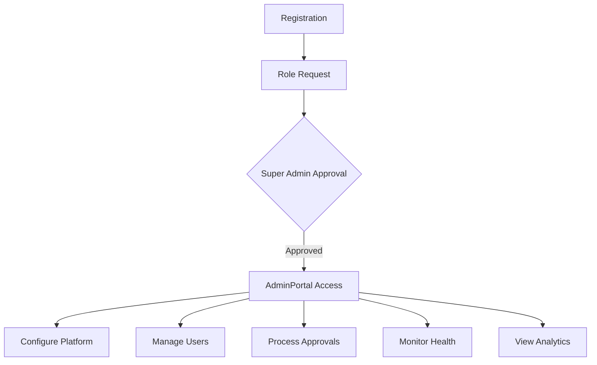
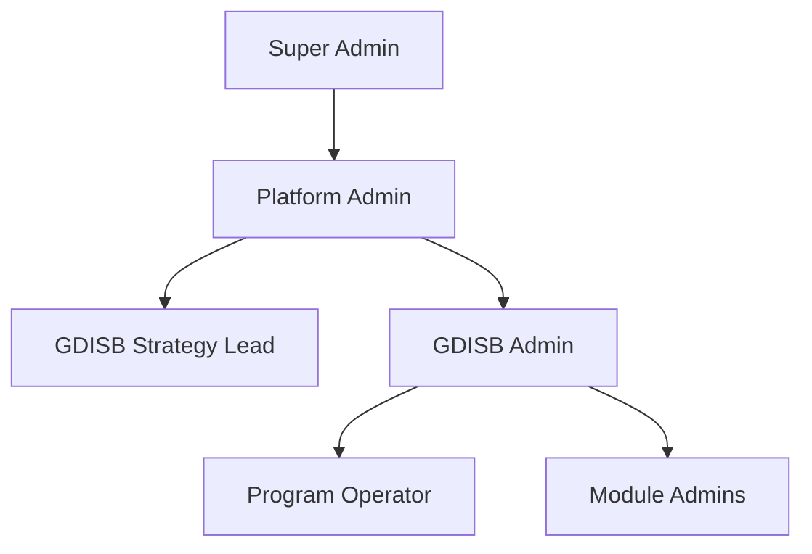

# Admin / Platform Administrator Persona Documentation

## Overview

Administrators manage the platform operations, configure system settings, approve users and entities, manage RBAC, and ensure smooth platform operations. They have full access to all platform features.

## Persona Attributes

| Attribute | Value |
|-----------|-------|
| **Role Name** | Admin / Platform Administrator |
| **Role Code** | `admin`, `super_admin`, `gdisb_admin` |
| **Organization Type** | Platform Operator |
| **Primary Dashboard** | `AdminPortal` |
| **Onboarding Flow** | Manual assignment by existing admin (bypasses standard 2-phase flow) |

> **Note:** Admin roles are NOT self-requested. They are manually assigned by existing Super Admins via `UserManagementHub` → `RolePermissionManager`. New admins still complete Phase 1 onboarding but Phase 2 is handled internally.

## User Journey



## Permissions

### Core Permissions
- `*` - Wildcard (all permissions)
- Full CRUD on all entities
- User management
- Role management
- System configuration
- Audit trail access

### RLS Scope
```sql
-- Admins bypass RLS by being assigned the admin role via role_id
-- (role name stored in roles table)
SELECT EXISTS (
  SELECT 1
  FROM public.user_roles ur
  JOIN public.roles r ON ur.role_id = r.id
  WHERE ur.user_id = auth.uid()
    AND ur.is_active = true
    AND LOWER(r.name) = 'admin'
);
```

## Dashboard Features

### AdminPortal.jsx (471 lines)

#### Key Sections
1. **Approval Alerts Banner**
   - Pending challenge approvals
   - Pending pilot approvals
   - Pending program applications

2. **Platform Statistics**
   - Challenges (total + pending)
   - Pilots (total + active)
   - Solutions (total + verified)
   - Organizations (total + partners)
   - Municipalities (total + active)

3. **Recent System Activity**
   - Activity feed from SystemActivity
   - Cross-entity activity stream

4. **Admin Sections**
   - Entity Management
   - Geography & Taxonomy
   - User & Access Management
   - Citizen Engagement
   - System Operations

5. **Quick Admin Actions**
   - Bulk Import
   - Approvals
   - Audit Trail
   - Configuration

6. **Pipeline Health**
   - Status breakdown
   - Processing metrics

## Admin Sections Detail

### Entity Management
- Challenges management
- Solutions registry
- Pilots oversight
- Organizations directory
- Programs administration
- R&D projects tracking

### Geography & Taxonomy
- Municipalities management
- Regions configuration
- Sectors taxonomy
- Services catalog

### User & Access Management
- Users hub
- Roles & Permissions manager
- Experts registry
- Teams management

### Citizen Engagement
- Ideas management
- Ideas analytics
- Leaderboard configuration

### System Operations
- Approval center
- Audit trail
- System health dashboard
- Configuration settings

## Key Pages

| Page | Purpose | Permission Required |
|------|---------|-------------------|
| `AdminPortal` | Main admin dashboard | `requireAdmin: true` |
| `DataManagementHub` | Entity data management | `requireAdmin: true` |
| `UserManagementHub` | User administration | `requireAdmin: true` |
| `RolePermissionManager` | RBAC configuration | `requireAdmin: true` |
| `ApprovalCenter` | Process approvals | `requireAdmin: true` |
| `SystemHealthDashboard` | System monitoring | `requireAdmin: true` |
| `SystemDefaultsConfig` | Platform settings | `requireAdmin: true` |
| `BulkImport` | Bulk data import | `requireAdmin: true` |
| `AuditTrail` | Security audit | `requireAdmin: true` |

## Data Access

### Full Access to Entities
Admins have unrestricted access to:
- All challenges (including drafts, confidential)
- All pilots (all stages)
- All solutions (including unverified)
- All organizations
- All programs
- All R&D projects/calls
- All municipalities
- All user profiles
- All citizen ideas
- All expert profiles
- All evaluations
- System logs and activities

### Queries
```javascript
// Admins see ALL challenges - no filters
const { data: challenges } = useQuery({
  queryKey: ['all-challenges-admin'],
  queryFn: () => legacy.entities.Challenge.list('-created_date', 500)
});

// All pending approvals across entities
const { data: pendingApprovals } = useQuery({
  queryKey: ['pending-approvals-admin'],
  queryFn: async () => {
    const [challenges, pilots, programs] = await Promise.all([
      legacy.entities.Challenge.filter({ status: 'submitted' }),
      legacy.entities.PilotApproval.filter({ status: 'pending' }),
      legacy.entities.ProgramApplication.filter({ status: 'submitted' })
    ]);
    return { challenges, pilots, programs };
  }
});
```

## Workflows

### User Role Assignment
1. User requests role upgrade
2. Admin reviews in `UserManagementHub`
3. Verify organization/credentials
4. Assign roles via `RolePermissionManager`
5. User receives notification

### Entity Approval Flow
1. Entity submitted (challenge/pilot/etc.)
2. Appears in `ApprovalCenter`
3. Admin reviews details
4. Approve/Reject with notes
5. Workflow continues

### Bulk Operations
1. Prepare data file
2. Navigate to `BulkImport`
3. Select entity type
4. Upload file
5. Validation check
6. Execute import

### System Configuration
1. Access `SystemDefaultsConfig`
2. Modify settings:
   - SLA thresholds
   - Email templates
   - Default values
   - Feature flags
3. Save and publish

## AI Features

| Feature | Component | Description |
|---------|-----------|-------------|
| Anomaly Detection | System monitoring | Detect unusual patterns |
| Workload Prediction | Capacity planning | Predict resource needs |
| User Behavior Analysis | Analytics | Usage patterns |

## Integration Points

- **All Portals**: Monitor and configure
- **User Management**: Control access
- **Approval Workflows**: Final authority
- **System Settings**: Platform configuration
- **Audit Trail**: Compliance tracking

## Protected Page Pattern

```javascript
// AdminPortal.jsx export
export default ProtectedPage(AdminPortal, { requireAdmin: true });

// Permission check in usePermissions
const { isAdmin } = usePermissions();
if (user?.role === 'admin') return ['*']; // All permissions
```

## Role Hierarchy



### Super Admin
- Full platform control
- Role management
- System configuration
- Data management

### Platform Admin
- Entity management
- User management
- Approval processing
- Monitoring

### GDISB Strategy Lead
- Strategic oversight
- Executive decisions
- High-priority approvals
- Cross-entity visibility

### GDISB Admin
- Operational management
- Routine approvals
- User support
- Quality control

## Security Responsibilities

1. **Access Control**
   - Manage RLS policies
   - Configure role permissions
   - Monitor access logs

2. **Data Governance**
   - Ensure data quality
   - Manage sensitive data
   - Handle deletion requests

3. **Compliance**
   - Audit trail maintenance
   - Policy enforcement
   - Incident response

4. **System Health**
   - Performance monitoring
   - Error tracking
   - Capacity planning
