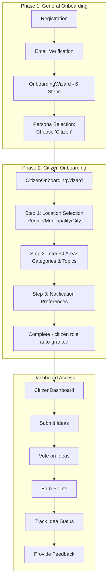
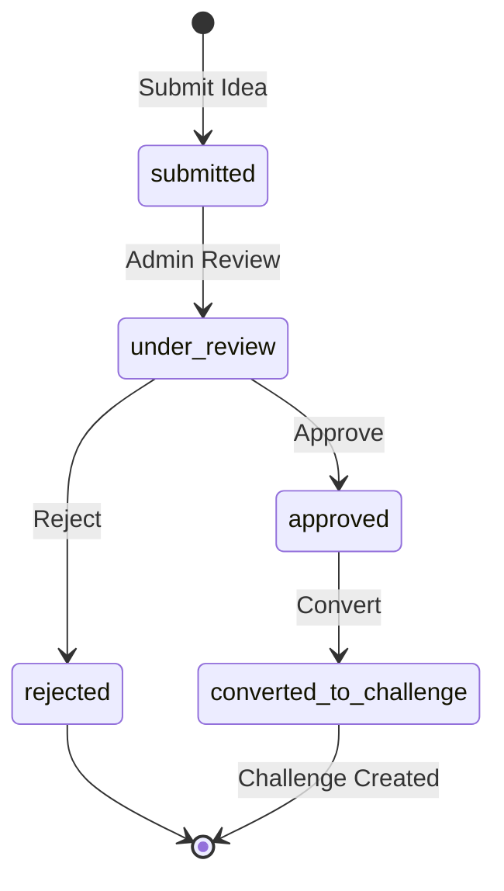

# Citizen Persona Documentation

## Overview

Citizens are public users who submit innovation ideas, vote on proposals, participate in pilots, and provide feedback on municipal services. They contribute to civic innovation through the citizen engagement portal.

## Persona Attributes

| Attribute | Value |
|-----------|-------|
| **Role Name** | Citizen |
| **Role Code** | `citizen` |
| **Organization Type** | N/A (Individual) |
| **Primary Dashboard** | `CitizenDashboard` |
| **Onboarding Flow** | `CitizenOnboarding` |

## User Journey (2-Phase Onboarding)



> **Note:** Citizens do NOT require admin approval. The `citizen` role is automatically granted upon completing Phase 2 onboarding.

## Permissions

### Core Permissions
- `citizen_idea_create` - Submit ideas
- `citizen_idea_view_own` - View own ideas
- `citizen_vote` - Vote on ideas
- `citizen_feedback` - Provide feedback
- `pilot_enrollment` - Enroll in pilots

### RLS Scope
```sql
-- Citizens see published ideas only
WHERE is_published = true

-- Own ideas/votes
WHERE user_id = auth.uid()
   OR user_email = user.email
```

## Dashboard Features

### CitizenDashboard.jsx (341 lines)

#### Key Sections
1. **Statistics Cards**
   - Ideas submitted count
   - Votes cast count
   - Total points earned
   - Ideas converted to challenges

2. **Profile Completeness**
   - `ProfileCompletenessCoach` component
   - `FirstActionRecommender` component

3. **Impact Level Card**
   - Current level (bronze/silver/gold)
   - Badges earned
   - National rank

4. **Tabs**
   - My Ideas (with status tracking)
   - My Votes
   - Updates (notifications)

5. **Idea Status Tracking**
   - Submitted
   - Under review
   - Approved
   - Rejected
   - Converted to challenge

## Key Pages

| Page | Purpose | Permission Required |
|------|---------|-------------------|
| `CitizenDashboard` | Main dashboard | Authenticated |
| `PublicIdeaSubmission` | Submit new ideas | `citizen_idea_create` |
| `PublicIdeasBoard` | Browse/vote on ideas | Authenticated |
| `IdeaDetail` | View idea details | Authenticated |
| `CitizenLeaderboard` | Top contributors | Authenticated |
| `CitizenPilotEnrollment` | Enroll in pilots | `pilot_enrollment` |
| `MunicipalityIdeasView` | Municipality ideas | Authenticated |

## Data Access

### Entities Accessed
- `CitizenIdea` (own ideas + published)
- `CitizenVote` (own votes)
- `CitizenPoints` (own gamification)
- `CitizenNotification` (own notifications)
- `CitizenPilotEnrollment` (own enrollments)
- `CitizenFeedback` (own feedback)
- `CitizenBadge` (own badges)

### Queries
```javascript
// My ideas (Supabase direct)
const { data: myIdeas } = useQuery({
  queryKey: ['my-ideas'],
  queryFn: async () => {
    const { data } = await supabase
      .from('citizen_ideas')
      .select('*')
      .eq('user_id', user?.id)
      .order('created_at', { ascending: false });
    return data;
  }
});

// My votes
const { data: myVotes } = useQuery({
  queryKey: ['my-votes'],
  queryFn: async () => {
    const { data } = await supabase
      .from('citizen_votes')
      .select('*')
      .eq('user_id', user?.id);
    return data;
  }
});
```

## Gamification System

### Points Earning
| Action | Points |
|--------|--------|
| Submit idea | 10 |
| Idea approved | 25 |
| Idea converted | 100 |
| Vote cast | 1 |
| Feedback provided | 5 |
| Pilot enrollment | 20 |
| Pilot completion | 50 |

### Levels
| Level | Points Required |
|-------|-----------------|
| Bronze | 0-99 |
| Silver | 100-499 |
| Gold | 500-999 |
| Platinum | 1000+ |

### Badges
- First Idea
- Idea Champion (10 ideas)
- Voter (100 votes)
- Influencer (idea with 50+ votes)
- Pioneer (first idea converted)
- Community Leader

## Workflows

### Idea Submission Flow
1. Click "Submit New Idea" → `PublicIdeaSubmission`
2. Fill idea form:
   - Title
   - Description
   - Category
   - Location (municipality)
   - Optional image
3. Submit for review
4. Municipality reviews idea
5. If approved → May convert to challenge

### Voting Flow
1. Browse `PublicIdeasBoard`
2. View idea details
3. Cast upvote/downvote
4. Vote count updates
5. Points awarded

### Pilot Enrollment
1. View available citizen-facing pilots
2. Check eligibility
3. Enroll via `CitizenPilotEnrollment`
4. Participate in pilot
5. Provide feedback/rating
6. Receive points

## AI Features

| Feature | Component | Description |
|---------|-----------|-------------|
| AI Pre-Screening | `ai_pre_screening` field | Auto-classify ideas |
| Duplicate Detection | Submission flow | Detect similar ideas |
| Sentiment Analysis | Feedback processing | Analyze feedback sentiment |

## Integration Points

- **Challenge System**: Ideas can become challenges via conversion
- **Municipality Dashboard**: Municipalities manage citizen ideas
- **Pilot System**: Citizens enroll in applicable pilots
- **Feedback Loop**: Ideas track full lifecycle to resolution

## Onboarding Specifics

### CitizenOnboarding Flow
1. Welcome step
2. Select region/municipality
3. Select neighborhood (optional)
4. Choose interest areas
5. Notification preferences

### CitizenProfile Fields
- `user_id` - Auth user reference
- `user_email` - User email
- `municipality_id` - Location
- `city_id` - City reference
- `region_id` - Region reference
- `neighborhood` - Neighborhood
- `interests[]` - Interest categories
- `participation_areas[]` - Preferred areas
- `language_preference` - ar/en
- `notification_preferences` - Settings
- `accessibility_needs` - Accessibility
- `is_verified` - Verification status

## Idea Status Flow



## Transparency Features

- **Public R&D Tracker**: View research funded by citizen ideas
- **Challenge Resolution**: Track if idea-originated challenges are resolved
- **Impact Dashboard**: See aggregate citizen impact
- **Success Stories**: View converted ideas that became solutions
