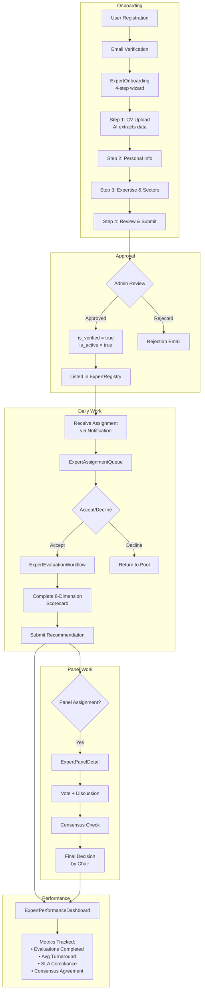
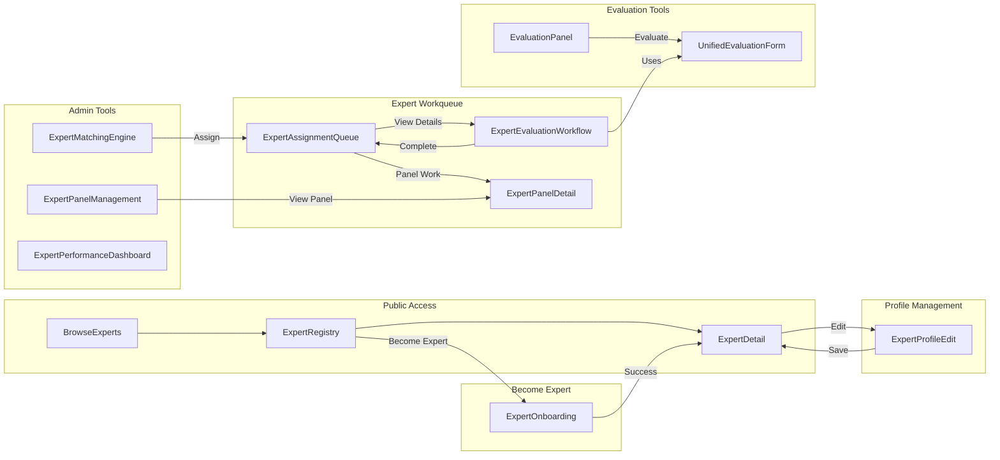

# Expert Evaluator Persona Documentation

## Overview

Experts are domain specialists who evaluate challenges, solutions, proposals, pilots, and other entities using structured scoring systems. They participate in expert panels and provide consensus recommendations.

## Persona Attributes

| Attribute | Value |
|-----------|-------|
| **Role Name** | Expert / Evaluator |
| **Role Code** | `expert`, `evaluator`, `expert_evaluator` |
| **Organization Type** | Various (consultant, academic, government) |
| **Primary Dashboard** | `ExpertAssignmentQueue` |
| **Onboarding Flow** | `ExpertOnboarding` |

---

## Expert Pages Inventory

### Core Expert Pages (14 Pages)

| Page | File | Purpose | Permission Required | Access Level |
|------|------|---------|---------------------|--------------|
| **ExpertAssignmentQueue** | `src/pages/ExpertAssignmentQueue.jsx` | Expert's personal workqueue - pending, active, completed assignments | `expert_evaluate` | Expert Only |
| **ExpertOnboarding** | `src/pages/ExpertOnboarding.jsx` | 4-step wizard: CV upload → Personal info → Expertise → Review | Authenticated | Any User |
| **ExpertRegistry** | `src/pages/ExpertRegistry.jsx` | Directory of all experts (browse/search) | Public/View | All Users |
| **ExpertDetail** | `src/pages/ExpertDetail.jsx` | Individual expert profile view with tabs | Public/View | All Users |
| **ExpertProfileEdit** | `src/pages/ExpertProfileEdit.jsx` | Edit expert profile | `expert_edit_own` or `expert_edit_all` | Expert/Admin |
| **ExpertPerformanceDashboard** | `src/pages/ExpertPerformanceDashboard.jsx` | Performance metrics, rankings, workload monitoring | `expert_view_assigned` | Admin/Manager |
| **ExpertMatchingEngine** | `src/pages/ExpertMatchingEngine.jsx` | AI-powered expert assignment tool | Admin only | Admin |
| **ExpertEvaluationWorkflow** | `src/pages/ExpertEvaluationWorkflow.jsx` | Complete evaluation flow for assigned entity | `expert_evaluate` | Expert Only |
| **ExpertPanelManagement** | `src/pages/ExpertPanelManagement.jsx` | Create/manage multi-expert panels | Admin only | Admin |
| **ExpertPanelDetail** | `src/pages/ExpertPanelDetail.jsx` | Panel view with voting and consensus | `expert_manage_panel` or `expert_evaluate` | Panel Members |
| **EvaluationPanel** | `src/pages/EvaluationPanel.jsx` | Evaluate R&D proposals and pilots | `expert_evaluate` | Expert Only |
| **BrowseExperts** | `src/pages/BrowseExperts.jsx` | Public expert browsing (uses ExpertFinder component) | Public | All Users |
| **ExpertCoverageReport** | `src/pages/ExpertCoverageReport.jsx` | Coverage/audit report for expert system | Admin only | Admin |
| **ExpertGapsSummary** | `src/pages/ExpertGapsSummary.jsx` | Gap analysis for expert features | Admin only | Admin |
| **ExpertSystemClusterAudit** | `src/pages/ExpertSystemClusterAudit.jsx` | System audit for expert cluster | Admin only | Admin |

### Related Components

| Component | File | Purpose |
|-----------|------|---------|
| **ExpertFinder** | `src/components/profiles/ExpertFinder.jsx` | AI-powered expert search widget |
| **ProgramExpertEvaluation** | `src/components/programs/ProgramExpertEvaluation.jsx` | Program-specific evaluation form |
| **UnifiedEvaluationForm** | `src/components/evaluation/UnifiedEvaluationForm.jsx` | Reusable 8-dimension evaluation form |
| **EvaluationConsensusPanel** | `src/components/evaluation/EvaluationConsensusPanel.jsx` | Displays consensus status |

---

## Edge Functions

| Function | File | Purpose |
|----------|------|---------|
| **auto-expert-assignment** | `supabase/functions/auto-expert-assignment/index.ts` | Automatically assigns experts based on availability, sector, expertise |

---

## User Journey Flow



---

## Page Flow Diagram



---

## Permissions

### Core Permissions
| Permission | Description |
|------------|-------------|
| `expert_evaluate` | Perform evaluations on assigned entities |
| `expert_view_assigned` | View entities assigned for evaluation |
| `expert_panel_participate` | Join and participate in expert panels |
| `expert_manage_panel` | Create/manage panels (admin) |
| `expert_edit_own` | Edit own expert profile |
| `expert_edit_all` | Edit any expert profile (admin) |
| `expert_register` | Register as new expert |
| `expert_view_all` | View all expert profiles (admin) |

### RLS Scope
```sql
-- Experts see only their assigned evaluations
WHERE expert_email = auth.email()

-- Via ExpertAssignment entity
WHERE assignment.expert_email = auth.email()
  AND assignment.status IN ('pending', 'accepted', 'in_progress')
```

---

## Data Entities

### Primary Entities
| Entity | Table | Description |
|--------|-------|-------------|
| **ExpertProfile** | `expert_profiles` | Expert credentials, expertise, availability |
| **ExpertAssignment** | `expert_assignments` | Work assignments linking experts to entities |
| **ExpertEvaluation** | `expert_evaluations` | Completed evaluation scorecards |
| **ExpertPanel** | `expert_panels` | Multi-expert evaluation committees |

### Entity Types That Can Be Evaluated
- `challenge` - Challenge submissions
- `pilot` - Pilot evaluations
- `solution` - Solution verifications
- `rd_proposal` - R&D proposal reviews
- `rd_project` - R&D project assessments
- `program_application` - Program applications
- `matchmaker_application` - Matchmaker applications
- `scaling_plan` - Scaling readiness assessments
- `citizen_idea` - Citizen idea reviews

---

## Evaluation System

### 8-Dimension Scorecard

| Dimension | Field | Score Range |
|-----------|-------|-------------|
| Feasibility | `feasibility_score` | 0-100 |
| Impact | `impact_score` | 0-100 |
| Innovation | `innovation_score` | 0-100 |
| Cost Effectiveness | `cost_effectiveness_score` | 0-100 |
| Risk | `risk_score` | 0-100 |
| Strategic Alignment | `strategic_alignment_score` | 0-100 |
| Quality | `quality_score` | 0-100 |
| Scalability | `scalability_score` | 0-100 |

### Recommendations
| Value | Description |
|-------|-------------|
| `approve` | Approve for next stage |
| `reject` | Reject with feedback |
| `conditional` | Conditional approval |
| `revise` | Request revisions |

---

## AI Features

| Feature | Location | Description |
|---------|----------|-------------|
| **Expert Matching** | `ExpertMatchingEngine` | AI semantic matching by expertise/sector/availability |
| **CV Extraction** | `ExpertOnboarding` | Extracts expertise from uploaded CV |
| **Expert Finder** | `ExpertFinder` component | AI-powered expert search |
| **Conflict Detection** | Assignment system | Detects conflicts of interest |
| **Consensus Calculation** | `EvaluationConsensusPanel` | Statistical consensus across panel |

---

## Workflows

### Single Expert Evaluation Flow
1. Admin assigns via `ExpertMatchingEngine` or `auto-expert-assignment` function
2. Expert receives notification
3. Expert views in `ExpertAssignmentQueue` (pending tab)
4. Expert accepts assignment
5. Expert navigates to `ExpertEvaluationWorkflow`
6. Expert completes 8-dimension scorecard via `UnifiedEvaluationForm`
7. Expert submits recommendation
8. Assignment moves to completed

### Expert Panel Flow
1. Admin creates panel via `ExpertPanelManagement`
2. Multiple experts assigned to same entity
3. Each expert submits independent evaluation
4. `ExpertPanelDetail` shows voting interface
5. Each member votes (approve/revise/reject)
6. `EvaluationConsensusPanel` calculates consensus
7. When threshold met, Chair records final decision

---

## ExpertProfile Key Fields

| Field | Type | Description |
|-------|------|-------------|
| `user_email` | string | User email (primary key link) |
| `title` | string | Professional title (Dr., Prof., Eng.) |
| `position` | string | Current position |
| `bio_en` / `bio_ar` | string | Biography in English/Arabic |
| `expertise_areas` | string[] | Domain expertise list |
| `expertise_areas_ar` | string[] | Arabic expertise list |
| `sector_specializations` | string[] | Sector codes |
| `years_of_experience` | number | Experience years |
| `certifications` | json[] | Professional certifications |
| `publications` | json[] | Publications list |
| `cv_url` | string | Uploaded CV URL |
| `linkedin_url` | string | LinkedIn profile |
| `google_scholar_url` | string | Google Scholar profile |
| `is_verified` | boolean | Admin verified |
| `is_active` | boolean | Available for assignments |
| `availability_status` | string | `available`, `busy`, `unavailable` |
| `availability_hours_per_month` | number | Monthly availability |
| `expert_rating` | number | Performance rating |
| `evaluation_count` | number | Total evaluations completed |
| `response_time_avg_hours` | number | Average response time |
| `evaluation_quality_score` | number | Quality score |

---

## Performance Metrics

| Metric | Description |
|--------|-------------|
| **Evaluations Completed** | Total evaluations finished |
| **Average Turnaround** | Days from assignment to completion |
| **SLA Compliance** | % completed within deadline |
| **Consensus Agreement** | % alignment with panel consensus |
| **Quality Score** | Meta-evaluation of evaluation quality |

---

## Integration Points

- **Challenge Workflow**: Experts evaluate submitted challenges
- **Solution Verification**: Experts verify solution claims
- **Pilot Gates**: Gate evaluations at pilot milestones
- **R&D Review**: Peer review of proposals/projects
- **Program Selection**: Experts evaluate program applicants
- **Scaling Assessment**: Experts assess scaling readiness

---

## Routing Summary

| Route | Page | Notes |
|-------|------|-------|
| `/expert-assignment-queue` | ExpertAssignmentQueue | Primary expert dashboard |
| `/expert-onboarding` | ExpertOnboarding | 4-step onboarding wizard |
| `/expert-registry` | ExpertRegistry | Public expert directory |
| `/expert-detail?id=` | ExpertDetail | Expert profile view |
| `/expert-profile-edit?id=` | ExpertProfileEdit | Edit profile |
| `/expert-performance-dashboard` | ExpertPerformanceDashboard | Admin metrics view |
| `/expert-matching-engine` | ExpertMatchingEngine | Admin assignment tool |
| `/expert-evaluation-workflow?assignment_id=` | ExpertEvaluationWorkflow | Evaluation flow |
| `/expert-panel-management` | ExpertPanelManagement | Admin panel management |
| `/expert-panel-detail?id=` | ExpertPanelDetail | Panel view |
| `/evaluation-panel` | EvaluationPanel | Quick evaluation access |
| `/browse-experts` | BrowseExperts | Public browsing |
