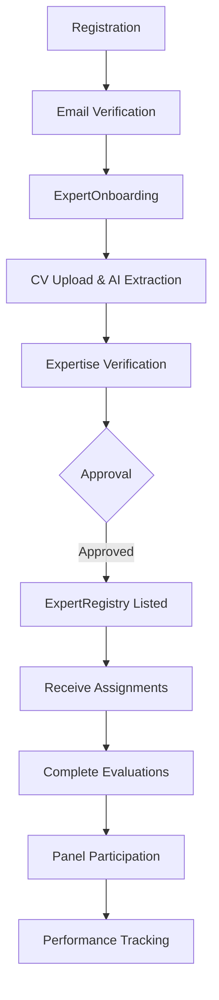

# Expert Evaluator Persona Documentation

## Overview

Experts are domain specialists who evaluate challenges, solutions, proposals, pilots, and other entities using structured scoring systems. They participate in expert panels and provide consensus recommendations.

## Persona Attributes

| Attribute | Value |
|-----------|-------|
| **Role Name** | Expert / Evaluator |
| **Role Code** | `expert`, `evaluator`, `expert_evaluator` |
| **Organization Type** | Various (consultant, academic, government) |
| **Primary Dashboard** | `ExpertAssignmentQueue` |
| **Onboarding Flow** | `ExpertOnboarding` |

## User Journey



## Permissions

### Core Permissions
- `expert_evaluate` - Perform evaluations
- `expert_view_assigned` - View assigned entities
- `expert_panel_participate` - Join expert panels
- `evaluation_create` - Create evaluations
- `evaluation_view_own` - View own evaluations

### RLS Scope
```sql
-- Experts see only assigned evaluations
WHERE expert_email = user.email

-- Via ExpertAssignment entity
WHERE assignment.expert_email = user.email
  AND assignment.status IN ('assigned', 'in_progress')
```

## Dashboard Features

### ExpertAssignmentQueue Page

#### Key Sections
1. **Assignment Queue**
   - Pending evaluations by due date
   - Entity type indicators
   - SLA countdown

2. **Evaluation Workbench**
   - 8-dimension scorecard
   - Qualitative feedback fields
   - Recommendation selection

3. **Performance Dashboard**
   - Completed evaluations count
   - Average turnaround time
   - Agreement rate with consensus

4. **Panel Invitations**
   - Multi-expert panel assignments
   - Consensus status

## Key Pages

| Page | Purpose | Permission Required |
|------|---------|-------------------|
| `ExpertAssignmentQueue` | Evaluation queue | `expert_view_assigned` |
| `EvaluationPanel` | Perform evaluations | `expert_evaluate` |
| `ExpertPanelDetail` | Panel view | `expert_panel_participate` |
| `ExpertRegistry` | Expert directory (admin) | `expert_view_all` |
| `ExpertOnboarding` | Profile setup | Authenticated |
| `MyEvaluatorProfile` | Own profile | Authenticated |
| `ExpertPerformanceDashboard` | Performance metrics | `expert_view_assigned` |

## Data Access

### Entities Accessed
- `ExpertProfile` (own profile)
- `ExpertAssignment` (own assignments)
- `ExpertEvaluation` (own evaluations)
- `ExpertPanel` (panel memberships)
- Assigned entities (Challenge, Solution, Pilot, etc.)

### Queries
```javascript
// Expert assignments
const { data: assignments } = useQuery({
  queryKey: ['my-assignments'],
  queryFn: async () => {
    const all = await base44.entities.ExpertAssignment.list();
    return all.filter(a => 
      a.expert_email === user?.email &&
      ['assigned', 'in_progress'].includes(a.status)
    );
  }
});

// Own evaluations
const { data: evaluations } = useQuery({
  queryKey: ['my-evaluations'],
  queryFn: async () => {
    return base44.entities.ExpertEvaluation.filter({
      expert_email: user?.email
    });
  }
});
```

## Evaluation System

### 8-Dimension Scorecard

| Dimension | Description | Score Range |
|-----------|-------------|-------------|
| `feasibility_score` | Technical feasibility | 0-100 |
| `impact_score` | Expected impact | 0-100 |
| `innovation_score` | Novelty and creativity | 0-100 |
| `cost_effectiveness_score` | Value for money | 0-100 |
| `risk_score` | Risk assessment | 0-100 |
| `strategic_alignment_score` | Alignment with goals | 0-100 |
| `quality_score` | Submission quality | 0-100 |
| `scalability_score` | Scaling potential | 0-100 |

### Entity Types Evaluated
- `challenge` - Challenge submissions
- `solution` - Solution verifications
- `pilot` - Pilot evaluations
- `rd_proposal` - R&D proposal reviews
- `rd_project` - R&D project assessments
- `program_application` - Program applications
- `sandbox_application` - Sandbox applications
- `citizen_idea` - Citizen idea reviews
- `innovation_proposal` - Innovation proposals
- `scaling_plan` - Scaling readiness
- `policy_recommendation` - Policy reviews
- `procurement_package` - Procurement packages
- `livinglab_project` - Living lab projects

### Recommendations
- `approve` - Approve for next stage
- `reject` - Reject with feedback
- `conditional` - Conditional approval
- `revise` - Request revisions

## Workflows

### Single Expert Evaluation
1. Receive assignment notification
2. Review entity details
3. Complete 8-dimension scorecard
4. Provide qualitative feedback
5. Select recommendation
6. Submit evaluation

### Expert Panel Evaluation
1. Multiple experts assigned
2. Each submits independent evaluation
3. `EvaluationConsensusPanel` calculates consensus
4. `checkConsensus()` function auto-updates status
5. Final recommendation based on threshold

### AI-Assisted Matching
```javascript
// ExpertMatchingEngine assigns experts by:
// 1. Sector specialization match
// 2. Expertise area overlap (embedding similarity)
// 3. Availability and workload
// 4. Past evaluation quality
```

## AI Features

| Feature | Component | Description |
|---------|-----------|-------------|
| Expert Matching | `ExpertMatchingEngine` | AI semantic matching |
| CV Extraction | AI in onboarding | Extract expertise from CV |
| Conflict Detection | Assignment system | Detect conflicts of interest |
| Consensus Calculation | `EvaluationConsensusPanel` | Statistical consensus |

## Integration Points

- **Challenge Workflow**: Evaluate submitted challenges
- **Solution Verification**: Verify solution claims
- **Pilot Gates**: Gate evaluations at pilot stages
- **R&D Review**: Peer review of proposals/projects
- **Program Selection**: Evaluate program applicants

## Onboarding Specifics

### ExpertOnboarding Flow
1. Basic profile information
2. CV/resume upload
3. AI extracts expertise from CV
4. Credential verification
5. Sector specializations
6. Availability preferences

### ExpertProfile Fields (40+ fields)
- `email` - User email
- `expertise_areas[]` - Domain expertise
- `sector_specializations[]` - Sector focus
- `certifications[]` - Professional certifications
- `years_experience` - Experience years
- `organization` - Affiliation
- `availability_status` - Current availability
- `hourly_rate` - Rate (if applicable)
- `embedding` - AI expertise embedding
- `evaluation_count` - Completed evaluations
- `average_turnaround_days` - Speed metric
- `consensus_agreement_rate` - Quality metric

## Performance Metrics

| Metric | Description |
|--------|-------------|
| **Evaluations Completed** | Total evaluations finished |
| **Average Turnaround** | Days from assignment to completion |
| **SLA Compliance** | % completed within deadline |
| **Consensus Agreement** | % alignment with panel consensus |
| **Quality Score** | Meta-evaluation of evaluation quality |
