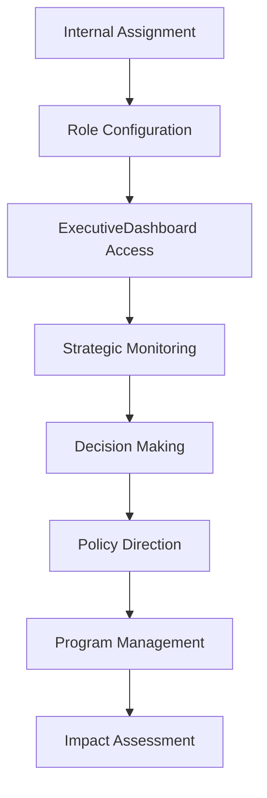

# Innovation Department (GDISB) Persona Documentation

## Overview

The Innovation Department (GDISB - General Directorate for Innovation in Saudi Boards) represents the strategic leadership and platform operators who oversee the national municipal innovation ecosystem. They have executive-level access and strategic decision-making authority.

## Persona Attributes

| Attribute | Value |
|-----------|-------|
| **Role Name** | GDISB Strategy Lead / Platform Administrator |
| **Role Code** | `gdisb_admin`, `platform_admin`, `executive` |
| **Organization Type** | Government (Innovation Department) |
| **Primary Dashboard** | `ExecutiveDashboard` + `AdminPortal` |
| **Onboarding Flow** | Manual internal assignment |

## User Journey



## Sub-Personas

### 1. GDISB Strategy Lead
- **Focus**: Strategic direction, high-level decisions
- **Primary Page**: `ExecutiveDashboard`
- **Key Actions**: Approve tier-1 priorities, set strategic goals

### 2. Platform Administrator
- **Focus**: Platform operations, system management
- **Primary Page**: `AdminPortal`
- **Key Actions**: User management, system configuration

### 3. Program Operator
- **Focus**: Program management, cohort oversight
- **Primary Page**: `ProgramOperatorPortal`
- **Key Actions**: Manage program applications, track cohorts

### 4. Executive Leadership
- **Focus**: National innovation metrics, policy impact
- **Primary Page**: `ExecutiveDashboard`
- **Key Actions**: Review KPIs, approve strategic initiatives

## Permissions

### GDISB Strategy Lead
- All admin permissions
- Strategic plan management
- Tier-1 priority approvals
- Budget allocation authority
- Policy direction setting

### Platform Administrator
- Full CRUD on all entities
- User and role management
- System configuration
- Audit trail access

### Program Operator
- Program management
- Application review
- Cohort management
- Participant tracking

## Dashboard Features

### ExecutiveDashboard.jsx (623 lines)

#### Strategic KPIs
- Strategic challenges count
- Active pilots count
- Scaled solutions count
- High-risk challenges count
- Average MII score
- Active programs count

#### Alert System
- Critical challenges needing executive attention
- Tier-1 priorities with SLA violations
- Escalated items requiring immediate decision

#### Visualizations
- National Innovation Map
- Sector distribution chart
- Top performing municipalities

#### Strategic Queues
- `ExecutiveStrategicChallengeQueue` - Priority decisions
- Flagship pilots monitoring
- R&D portfolio overview

#### AI Tools
- `AIRiskForecasting` - Risk prediction
- `PriorityRecommendations` - AI-driven priorities
- `ExecutiveBriefingGenerator` - Automated briefs

## Key Pages

| Page | Purpose | Role Required |
|------|---------|--------------|
| `ExecutiveDashboard` | Strategic overview | Executive Leadership, GDISB Strategy Lead |
| `ExecutiveStrategicChallengeQueue` | Priority decisions | Executive Leadership, GDISB Strategy Lead |
| `AdminPortal` | Platform administration | Platform Administrator, GDISB Admin |
| `ProgramOperatorPortal` | Program management | Program Operator |
| `StrategicPlanBuilder` | Strategic planning | GDISB Strategy Lead |
| `MultiYearRoadmap` | Long-term planning | GDISB Strategy Lead |
| `StrategicKPITracker` | KPI monitoring | Executive Leadership |
| `GapAnalysisTool` | Gap identification | GDISB Strategy Lead |
| `RDPortfolioPlanner` | R&D portfolio | GDISB Strategy Lead, R&D Manager |

## Data Access

### Full Platform Visibility
- All challenges across municipalities
- All pilots and their status
- All solutions and providers
- All programs and applications
- All R&D projects and proposals
- All user activities
- Platform analytics

### Strategic Filters
```javascript
// Strategic challenges (Tier 1 & 2)
const strategicChallenges = challenges.filter(c => 
  c.priority === 'tier_1' || c.priority === 'tier_2' || 
  c.is_featured || c.overall_score >= 80 || 
  c.strategic_plan_ids?.length > 0
);

// Critical items needing attention
const criticalChallenges = challenges.filter(c => 
  c.escalation_level === 2 || 
  (c.priority === 'tier_1' && c.status === 'submitted')
);
```

## Workflows

### Strategic Challenge Assignment
1. Challenge reaches strategic threshold
2. Appears in `ExecutiveStrategicChallengeQueue`
3. Strategy lead reviews
4. Assign track (pilot/R&D/policy/procurement)
5. Set implementation priority

### Program Launch
1. Define program via `ProgramCreate`
2. Set eligibility and criteria
3. Open applications
4. Review via `ProgramApplicationEvaluationHub`
5. Select cohort
6. Track outcomes

### Policy Direction
1. Identify policy gaps
2. Create policy recommendations
3. Legal review
4. Approval workflow
5. Implementation tracking

### Budget Allocation
1. Annual planning via `BudgetManagement`
2. Allocate to programs/pilots
3. Track spending
4. Variance reporting

## AI Features

| Feature | Component | Description |
|---------|-----------|-------------|
| Risk Forecasting | `AIRiskForecasting` | Predict risks across portfolio |
| Priority Recommendations | `PriorityRecommendations` | AI-driven priority setting |
| Briefing Generator | `ExecutiveBriefingGenerator` | Automated executive summaries |
| Trend Analysis | Analytics engine | Pattern detection across data |

## Multi-Step Approval Authority

```javascript
// From MultiStepApproval.jsx
const ENTITY_APPROVAL_STEPS = {
  Challenge: [
    { step: 1, role: 'municipality_lead' },
    { step: 2, role: 'sector_expert' },
    { step: 3, role: 'gdisb_admin' }  // Final authority
  ],
  Pilot: [
    { step: 1, role: 'municipality_admin' },
    { step: 2, role: 'budget_officer' },
    { step: 3, role: 'municipality_director' },
    { step: 4, role: 'gdisb_admin' }  // Final authority
  ],
  Program: [
    { step: 1, role: 'program_manager' },
    { step: 2, role: 'gdisb_admin' }  // Final authority
  ]
};
```

## Integration Points

- **All Portals**: Monitor and direct all portal activities
- **Municipalities**: Oversee all municipal innovation
- **Providers**: Manage provider ecosystem
- **R&D Institutions**: Direct research priorities
- **Programs**: Launch and manage programs
- **Policy**: Direct policy outcomes

## Strategic Tools

### Planning
- `StrategicPlanBuilder` - Create strategic plans
- `MultiYearRoadmap` - Long-term planning
- `OKRManagementSystem` - Objectives and Key Results

### Analysis
- `GapAnalysisTool` - Identify gaps
- `PredictiveAnalytics` - Forecasting
- `PatternRecognition` - Pattern detection

### Reporting
- `CustomReportBuilder` - Ad-hoc reports
- `ExecutiveBriefGenerator` - Auto-generated briefs
- `ProgressReport` - Progress tracking

## Performance Metrics

| Metric | Description |
|--------|-------------|
| **National MII Average** | Overall innovation index |
| **Challenge Resolution Rate** | % challenges resolved |
| **Pilot Success Rate** | % pilots successful |
| **Scaling Rate** | % pilots scaled nationally |
| **R&D Output Rate** | Research to solution conversion |
| **Citizen Engagement** | Citizen participation metrics |
| **Provider Ecosystem Health** | Active providers and success |

## Communication Channels

### Internal
- Platform notifications
- Email notifications
- System alerts

### External
- `AnnouncementSystem` - Platform-wide announcements
- `EmailTemplateManager` - Communication templates
- `CampaignPlanner` - Engagement campaigns

## Security & Governance

### Audit Requirements
- All admin actions logged
- Decision trail maintained
- Access patterns monitored

### Compliance
- Data protection policies
- Access control reviews
- Incident response procedures

### Delegation
- `DelegationManager` - Temporary authority delegation
- `DelegationRule` entity for formal delegations
- Time-bound permissions
