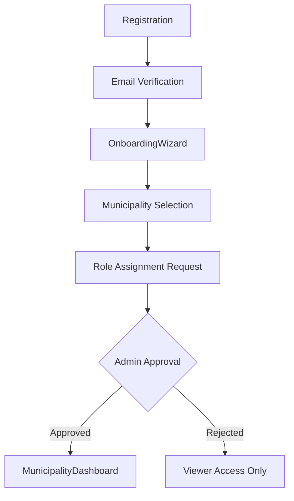

# Municipality Staff Persona Documentation

## Overview

Municipality Staff represents government employees working in Saudi municipalities who submit innovation challenges, manage pilots, and drive local innovation initiatives.

## Persona Attributes

| Attribute | Value |
|-----------|-------|
| **Role Name** | Municipality Staff / Municipality Admin |
| **Role Code** | `municipality_staff`, `municipality_admin` |
| **Organization Type** | `municipality` |
| **Primary Dashboard** | `MunicipalityDashboard` |
| **Onboarding Flow** | `MunicipalityStaffOnboarding.jsx` |

## User Journey



## Permissions

### Core Permissions
- `challenge_create` - Create new challenges
- `challenge_view_own` - View challenges from own municipality
- `challenge_update_own` - Update own challenges
- `challenge_delete_own` - Delete draft challenges
- `pilot_view_own` - View pilots in municipality
- `pilot_update_own` - Update own pilots
- `rd_view_own` - View R&D projects
- `citizen_idea_view` - View citizen ideas for municipality

### RLS Scope
```sql
-- Municipality users see challenges from their municipality
WHERE municipality_id = user.municipality_id
   OR challenge_owner_email = user.email
   OR created_by = user.email
```

## Dashboard Features

### MunicipalityDashboard.jsx (1145 lines)

#### Key Sections
1. **Alert Banners**
   - Escalated challenges needing attention
   - Pending reviews assigned
   - Citizen ideas ready for conversion

2. **MII Profile Card**
   - Municipality Innovation Index score
   - National rank
   - Active challenges/pilots count

3. **Profile Completeness**
   - `ProfileCompletenessCoach` component
   - `FirstActionRecommender` component
   - `ProgressiveProfilingPrompt` component

4. **AI Tools**
   - `MIIImprovementAI` - AI suggestions for improving innovation score
   - `PeerBenchmarkingTool` - Compare with peer municipalities
   - `QuickSolutionsMarketplace` - Find solutions for challenges

5. **Policy Tracking**
   - `MunicipalPolicyTracker` - Track policy recommendations

## Key Pages

| Page | Purpose | Permission Required |
|------|---------|-------------------|
| `MunicipalityDashboard` | Main dashboard | `challenge_view_own` |
| `ChallengeCreate` | Submit new challenges | `challenge_create` |
| `MyChallenges` | Track own challenges | `challenge_view_own` |
| `ChallengeReviewQueue` | Review assigned challenges | `challenge_review` |
| `MunicipalityProfile` | View/edit profile | Authenticated |
| `IdeasManagement` | Manage citizen ideas | `citizen_idea_view` |
| `PilotCreate` | Create pilot projects | `pilot_create` |

## Data Access

### Entities Accessed
- `Challenge` (filtered by municipality_id)
- `Pilot` (filtered by municipality_id)
- `RDProject` (created_by filter)
- `CitizenIdea` (municipality_id filter)
- `Municipality` (own profile)
- `ChallengeSolutionMatch` (for matched solutions)
- `ChallengeActivity` (activity feed)
- `StrategicPlan` (view only)

### Queries
```javascript
// Own municipality
const { data: myMunicipality } = useQuery({
  queryKey: ['my-municipality', user?.email],
  queryFn: async () => {
    const all = await base44.entities.Municipality.list();
    return all.find(m => m.contact_email === user?.email);
  }
});

// Municipality challenges
const { data: challenges } = useQuery({
  queryKey: ['municipality-challenges'],
  queryFn: async () => {
    return all.filter(c => 
      c.municipality_id === myMunicipality.id || 
      c.created_by === user?.email
    );
  }
});
```

## Workflows

### Challenge Submission Flow
1. User clicks "New Challenge" → `ChallengeCreate`
2. Fill 6-step wizard with AI assistance
3. Submit for review → Status: `submitted`
4. Internal review → Status: `under_review`
5. Track assignment (matchmaker/pilot/R&D/policy)

### Pilot Tracking
1. View matched solutions
2. Accept/reject matches
3. Pilot initiation → `PilotCreate`
4. Monitor pilot progress
5. Evaluate pilot completion

### Citizen Idea Conversion
1. View approved citizen ideas
2. Evaluate for challenge conversion
3. Convert to challenge → Links `citizen_origin_idea_id`

## AI Features

| Feature | Component | Description |
|---------|-----------|-------------|
| AI Insights | `handleAIInsights()` | Strategic analysis of municipality ecosystem |
| MII Improvement | `MIIImprovementAI` | Recommendations for improving MII score |
| Peer Benchmarking | `PeerBenchmarkingTool` | Compare with similar municipalities |
| Solution Marketplace | `QuickSolutionsMarketplace` | AI-matched solutions |

## Integration Points

- **Citizen Engagement**: Receives citizen ideas for conversion
- **Provider Ecosystem**: Receives solution matches
- **R&D Track**: Can initiate R&D projects from challenges
- **Policy Track**: Tracks policy recommendations
- **Programs**: Can apply to regional programs

## Onboarding Specifics

### MunicipalityStaffOnboarding.jsx
1. Welcome step
2. Select municipality from dropdown
3. Select department
4. Specify role (innovation officer, director, etc.)
5. Request role approval

### Profile Fields
- `municipality_id` - Reference to Municipality entity
- `department` - Department within municipality
- `job_title` - Position title
- `phone` - Contact number
- `areas_of_interest` - Sector preferences
