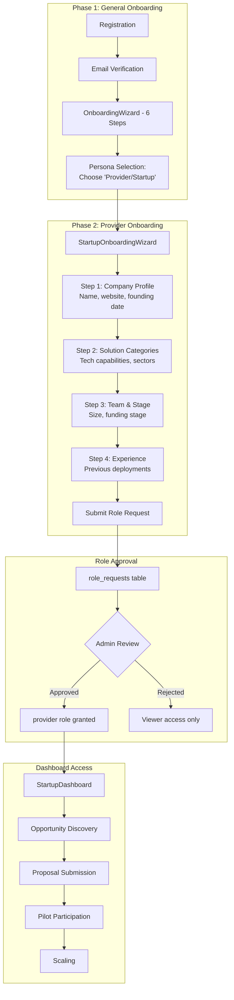

# Solution Provider / Startup Persona Documentation

## Overview

Solution Providers are technology companies, startups, and service providers who offer innovative solutions to municipal challenges. They discover opportunities, submit proposals, and participate in pilot programs.

## Persona Attributes

| Attribute | Value |
|-----------|-------|
| **Role Name** | Provider / Startup User |
| **Role Code** | `provider`, `startup_user` |
| **Organization Type** | `solution_provider`, `startup` |
| **Primary Dashboard** | `StartupDashboard` (Note: Code references `ProviderDashboard` which routes to `StartupDashboard`) |
| **Onboarding Flow** | `StartupOnboarding.jsx` + `StartupOnboardingWizard.jsx` |

## User Journey (2-Phase Onboarding)



> **Note:** Provider role requires admin approval. Users can browse public content while pending but cannot submit proposals until approved.

## Permissions

### Core Permissions
- `solution_create` - Create new solutions
- `solution_update_own` - Update own solutions
- `solution_view_own` - View own solutions
- `proposal_create` - Submit proposals to challenges
- `proposal_view_own` - View own proposals
- `pilot_view_involved` - View pilots involving their solutions

### RLS Scope
```sql
-- Providers see only PUBLISHED challenges
WHERE is_published = true 
  AND status IN ('approved', 'in_treatment')

-- Own solutions/proposals
WHERE provider_id = user.organization_id
   OR created_by = user.email
```

## Dashboard Features

### StartupDashboard.jsx (659 lines)

#### Key Sections
1. **Matchmaker Status Banner**
   - Current matchmaker program status
   - AI-matched challenges count
   - Program stage

2. **Statistics Cards**
   - Open challenges count
   - AI matches count
   - My solutions count
   - Open programs count
   - Applications count

3. **Profile Completeness**
   - `ProfileCompletenessCoach` component
   - `FirstActionRecommender` component
   - `ProgressiveProfilingPrompt` component

4. **Opportunity Pipeline**
   - `OpportunityPipelineDashboard` - Track pursuit funnel
   - `ProposalWorkflowTracker` - Proposal status tracking

5. **Market Intelligence**
   - `MarketIntelligenceFeed` - Sector trends
   - `ProviderPerformanceDashboard` - Performance metrics

6. **Ecosystem Features**
   - `StartupJourneyAnalytics` - Journey tracking
   - `EcosystemContributionScore` - Contribution metrics
   - `MultiMunicipalityExpansionTracker` - Expansion tracking
   - `StartupCollaborationHub` - Partner connections
   - `StartupReferralProgram` - Referral system
   - `StartupMentorshipMatcher` - Mentorship matching
   - `StartupChurnPredictor` - Engagement prediction

## Key Pages

| Page | Purpose | Permission Required |
|------|---------|-------------------|
| `StartupDashboard` | Main dashboard | `solution_view_own` |
| `SolutionCreate` | Register new solutions | `solution_create` |
| `ProviderPortfolioDashboard` | Manage solution portfolio | `solution_view_own` |
| `OpportunityFeed` | Browse published challenges | Authenticated |
| `MatchmakerApplicationCreate` | Apply to matchmaker program | Authenticated |
| `ProposalWizard` | Submit challenge proposals | `proposal_create` |
| `ProgramApplicationWizard` | Apply to programs | Authenticated |
| `MyApplications` | Track all applications | Authenticated |

## Data Access

### Entities Accessed
- `Challenge` (only `is_published = true`)
- `Solution` (filtered by provider_id)
- `ChallengeProposal` (own proposals)
- `Pilot` (where solution is deployed)
- `Organization` (own profile)
- `MatchmakerApplication` (own application)
- `Program` (published, open programs)
- `ProgramApplication` (own applications)

### Queries
```javascript
// Published challenges only (RLS: no access to drafts/internal)
const { data: openChallenges } = useQuery({
  queryKey: ['published-challenges'],
  queryFn: async () => {
    const all = await base44.entities.Challenge.list();
    return all.filter(c => 
      c.is_published && 
      ['approved', 'in_treatment'].includes(c.status)
    );
  }
});

// Own solutions
const { data: mySolutions } = useQuery({
  queryKey: ['my-solutions'],
  queryFn: async () => {
    return all.filter(s => 
      s.provider_id === myOrganization?.id || 
      s.created_by === user?.email
    );
  }
});
```

## Workflows

### Solution Registration Flow
1. Navigate to `SolutionCreate`
2. Complete multi-step wizard:
   - Basic info (name, description)
   - Technical specs (TRL, categories)
   - Deployment history
   - Case studies
   - Pricing tiers
3. Submit for verification
4. Admin/expert review
5. Solution verified and published

### Challenge Proposal Flow
1. Discover challenges via `OpportunityFeed`
2. AI matching via Matchmaker program
3. Submit proposal via `ProposalWizard`
4. Municipality reviews proposal
5. If accepted → Pilot negotiation

### Matchmaker Program
1. Apply via `MatchmakerApplicationCreate`
2. Admin classification (pre-classified, classified, advanced)
3. AI matches challenges based on capabilities
4. Receive matched opportunities
5. Track success rate

## AI Features

| Feature | Component | Description |
|---------|-----------|-------------|
| AI Matching | Matchmaker AI | Match capabilities to challenges |
| Market Intelligence | `MarketIntelligenceFeed` | Sector trend analysis |
| Churn Prediction | `StartupChurnPredictor` | Engagement risk alerts |
| Mentorship Matching | `StartupMentorshipMatcher` | AI mentor recommendations |

## Integration Points

- **Matchmaker Program**: Primary challenge discovery
- **Pilot Participation**: Deploy solutions in pilots
- **Program Applications**: Apply to accelerators/incubators
- **Expert Evaluations**: Solutions evaluated by experts
- **Municipality Connections**: Direct relationship building

## Onboarding Specifics

### StartupOnboardingWizard.jsx
1. Company profile (name, website, founding)
2. Solution categories
3. Sector focus areas
4. Team size and stage
5. Previous experience

### Profile Fields (Organization)
- `name_en`, `name_ar` - Company name
- `organization_type` - `solution_provider` or `startup`
- `sectors` - Focus sectors
- `technologies` - Tech capabilities
- `team_size` - Company size
- `stage` - Company stage (seed, series_a, etc.)
- `is_verified` - Verification status

### Profile Fields (StartupProfile)
- `user_email` - User reference
- `company_name` - Company name
- `stage` - Current stage
- `funding_history[]` - Funding rounds
- `traction` - Traction metrics
