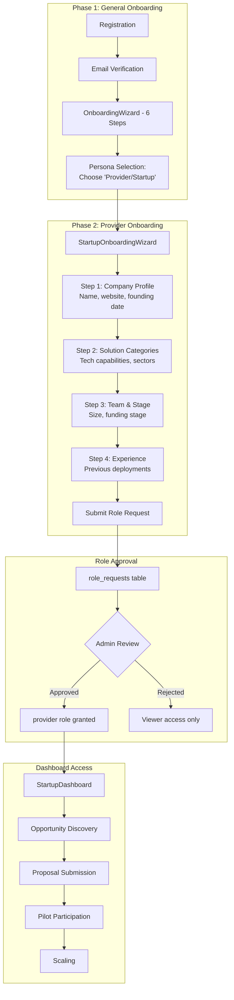

# Solution Provider / Startup Persona Documentation

## Overview

Solution Providers are technology companies, startups, and service providers who offer innovative solutions to municipal challenges. They discover opportunities, submit proposals, and participate in pilot programs.

## Persona Attributes

| Attribute | Value |
|-----------|-------|
| **Role Name** | Provider / Startup User |
| **Role Code** | `provider`, `startup_user` |
| **Organization Type** | `solution_provider`, `startup` |
| **Primary Dashboard** | `StartupDashboard` (Note: Code references `ProviderDashboard` which routes to `StartupDashboard`) |
| **Onboarding Flow** | `StartupOnboarding.jsx` + `StartupOnboardingWizard.jsx` |

## Layout System Coverage

### ✅ Pages with PageLayout + PageHeader
| Page | Status | Notes |
|------|--------|-------|
| `StartupDashboard.jsx` | ✅ Complete | Main dashboard with full PageHeader stats |
| `ProviderPortfolioDashboard.jsx` | ✅ Complete | Portfolio management |
| `ProviderLeaderboard.jsx` | ✅ Complete | Leaderboard rankings |
| `OpportunityFeed.jsx` | ✅ Complete | Opportunity discovery |
| `StartupEcosystemDashboard.jsx` | ✅ Complete | Ecosystem metrics (Admin view) |
| `StartupProfile.jsx` | ✅ Complete | Public startup profile view |
| `StartupVerificationQueue.jsx` | ✅ Complete | Admin verification queue |
| `ProviderNotificationPreferences.jsx` | ✅ Complete | Notification settings |

### ⏭️ Excluded from PageLayout (by design)
| Page | Reason |
|------|--------|
| `StartupOnboarding.jsx` | Wizard-based flow |
| `ProviderProposalWizard.jsx` | Multi-step wizard |
| `StartupShowcase.jsx` | Public showcase component wrapper |
| `StartupCoverageReport.jsx` | Admin coverage report (2000+ lines) |

### ✅ Cleanup Completed
| Page | Action Taken |
|------|--------------|
| `StartupGapsImplementationTracker.jsx` | Deleted - duplicate of `GapsImplementationTracker.jsx` |
| `ResearcherProviderNetwork.jsx` | Deleted - `ResearcherNetwork.jsx` provides this functionality |
| `BrowseStartups.jsx` | Deleted - `StartupShowcase.jsx` covers browsing |
| `MyStartupProfileEditor.jsx` | Deleted - profile editing via `StartupOnboarding` |

## User Journey (2-Phase Onboarding)



> **Note:** Provider role requires admin approval. Users can browse public content while pending but cannot submit proposals until approved.

## Permissions

### Core Permissions
- `solution_create` - Create new solutions
- `solution_update_own` - Update own solutions
- `solution_view_own` - View own solutions
- `proposal_create` - Submit proposals to challenges
- `proposal_view_own` - View own proposals
- `pilot_view_involved` - View pilots involving their solutions

### RLS Scope
```sql
-- Providers see only PUBLISHED challenges
WHERE is_published = true 
  AND status IN ('approved', 'in_treatment')

-- Own solutions/proposals
WHERE provider_id = user.organization_id
   OR created_by = user.email
```

## Key Pages

| Page | Purpose | Permission Required |
|------|---------|-------------------|
| `StartupDashboard` | Main dashboard | `solution_view_own` |
| `SolutionCreate` | Register new solutions | `solution_create` |
| `ProviderPortfolioDashboard` | Manage solution portfolio | `solution_view_own` |
| `OpportunityFeed` | Browse published challenges | Authenticated |
| `MatchmakerApplicationCreate` | Apply to matchmaker program | Authenticated |
| `ProposalWizard` | Submit challenge proposals | `proposal_create` |
| `ProgramApplicationWizard` | Apply to programs | Authenticated |
| `MyApplications` | Track all applications | Authenticated |

## Dashboard Components

### StartupDashboard.jsx Key Sections
1. **Matchmaker Status Banner** - Current matchmaker program status
2. **Statistics Cards** - Open challenges, AI matches, solutions, programs, applications
3. **Profile Completeness** - `ProfileCompletenessCoach`, `FirstActionRecommender`, `ProgressiveProfilingPrompt`
4. **Opportunity Pipeline** - `OpportunityPipelineDashboard`, `ProposalWorkflowTracker`
5. **Market Intelligence** - `MarketIntelligenceFeed`, `ProviderPerformanceDashboard`
6. **Ecosystem Features** - Journey analytics, contribution score, expansion tracker, collaboration hub

## Data Access

### Entities Accessed
- `Challenge` (only `is_published = true`)
- `Solution` (filtered by provider_id)
- `ChallengeProposal` (own proposals)
- `Pilot` (where solution is deployed)
- `Organization` (own profile)
- `MatchmakerApplication` (own application)
- `Program` (published, open programs)
- `ProgramApplication` (own applications)

## Workflows

### Solution Registration Flow
1. Navigate to `SolutionCreate`
2. Complete multi-step wizard
3. Submit for verification
4. Admin/expert review
5. Solution verified and published

### Challenge Proposal Flow
1. Discover challenges via `OpportunityFeed`
2. AI matching via Matchmaker program
3. Submit proposal via `ProposalWizard`
4. Municipality reviews proposal
5. If accepted → Pilot negotiation

## AI Features

| Feature | Component | Description |
|---------|-----------|-------------|
| AI Matching | Matchmaker AI | Match capabilities to challenges |
| Market Intelligence | `MarketIntelligenceFeed` | Sector trend analysis |
| Churn Prediction | `StartupChurnPredictor` | Engagement risk alerts |
| Mentorship Matching | `StartupMentorshipMatcher` | AI mentor recommendations |

## Onboarding Specifics

### StartupOnboardingWizard.jsx Steps
1. Company profile (name, website, founding)
2. Solution categories
3. Sector focus areas
4. Team size and stage
5. Previous experience

### Profile Fields
**Organization:**
- `name_en`, `name_ar` - Company name
- `organization_type` - `solution_provider` or `startup`
- `sectors` - Focus sectors
- `technologies` - Tech capabilities
- `team_size` - Company size
- `stage` - Company stage (seed, series_a, etc.)
- `is_verified` - Verification status

**StartupProfile:**
- `user_email` - User reference
- `company_name` - Company name
- `stage` - Current stage
- `funding_history[]` - Funding rounds
- `traction` - Traction metrics
