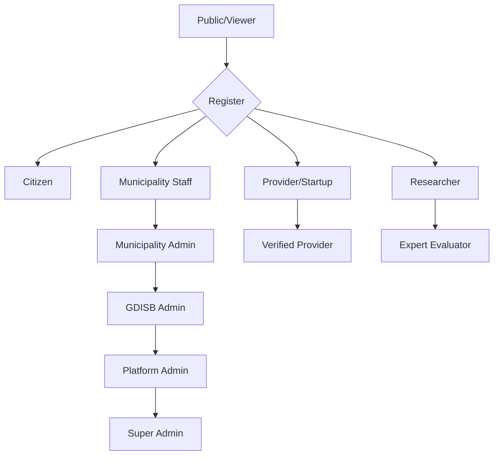

# Platform Personas Documentation Index

## Overview

This directory contains comprehensive documentation for each persona type on the Saudi Municipal Innovation Platform.

## Persona Documents

| Persona | File | Primary Dashboard | Role Code |
|---------|------|-------------------|-----------|
| Municipality Staff | [MUNICIPALITY_STAFF_PERSONA.md](./MUNICIPALITY_STAFF_PERSONA.md) | MunicipalityDashboard | `municipality_staff`, `municipality_admin` |
| Solution Provider | [PROVIDER_PERSONA.md](./PROVIDER_PERSONA.md) | StartupDashboard | `provider`, `startup_user` |
| Researcher | [RESEARCHER_PERSONA.md](./RESEARCHER_PERSONA.md) | AcademiaDashboard | `researcher` |
| Expert | [EXPERT_PERSONA.md](./EXPERT_PERSONA.md) | ExpertAssignmentQueue | `expert`, `evaluator` |
| Citizen | [CITIZEN_PERSONA.md](./CITIZEN_PERSONA.md) | CitizenDashboard | `citizen` |
| Viewer | [VIEWER_PERSONA.md](./VIEWER_PERSONA.md) | PublicPortal | `viewer` |
| Admin | [ADMIN_PERSONA.md](./ADMIN_PERSONA.md) | AdminPortal | `admin`, `super_admin` |
| Innovation Department | [INNOVATION_DEPARTMENT_PERSONA.md](./INNOVATION_DEPARTMENT_PERSONA.md) | ExecutiveDashboard | `gdisb_admin`, `platform_admin` |

## Persona Hierarchy

## Quick Reference

### By Access Level
1. **Public**: Viewer
2. **Authenticated**: Citizen, Provider, Researcher, Municipality Staff
3. **Elevated**: Expert, Municipality Admin
4. **Administrative**: GDISB Admin, Program Operator
5. **Executive**: Platform Admin, Super Admin, GDISB Strategy Lead

### By Primary Function
- **Challenge Submitters**: Municipality Staff
- **Solution Providers**: Providers, Startups
- **Evaluators**: Experts
- **Research**: Researchers, Academics
- **Engagement**: Citizens
- **Operations**: Admins, GDISB
- **Strategy**: Executive Leadership
