# Platform Personas Documentation Index

## Overview

This directory contains comprehensive documentation for each persona type on the Saudi Municipal Innovation Platform.

---

## 2-Phase Onboarding System

The platform implements a **two-phase onboarding system** to ensure proper user verification and role assignment:

```mermaid
flowchart TB
    subgraph PHASE1["📋 Phase 1: General Onboarding"]
        A[User Registration] --> B[Email Verification]
        B --> C[OnboardingWizard - 6 Steps]
        C --> D["Step 1: Welcome<br/>Language selection"]
        D --> E["Step 2: Data Import<br/>CV/LinkedIn upload"]
        E --> F["Step 3: Profile<br/>Bilingual details"]
        F --> G["Step 4: AI Assist<br/>Bio/expertise suggestions"]
        G --> H["Step 5: Persona Selection<br/>Choose role type"]
        H --> I["Step 6: Complete<br/>Summary + welcome email"]
    end

    subgraph PHASE2["🎯 Phase 2: Specialized Onboarding"]
        I --> J{Selected Persona}
        J -->|Municipality Staff| K[MunicipalityStaffOnboardingWizard]
        J -->|Provider/Startup| L[StartupOnboardingWizard]
        J -->|Researcher| M[ResearcherOnboardingWizard]
        J -->|Citizen| N[CitizenOnboardingWizard]
        J -->|Expert| O[ExpertOnboardingWizard]
        J -->|Viewer| P[Skip - Direct to Home]
        
        K --> K1[Select Municipality + Department]
        L --> L1[Company Profile + Solutions]
        M --> M1[Institution + Research Areas]
        N --> N1[Location + Interests]
        O --> O1[CV + Expertise + Rates]
    end

    subgraph APPROVAL["✅ Role Approval Process"]
        K1 & L1 & M1 & O1 --> Q[Submit Role Request]
        Q --> R[role_requests table]
        R --> S{Admin Review}
        S -->|Approved| T[user_roles assigned]
        S -->|Rejected| U[Viewer access only]
        N1 --> T2[Citizen role auto-granted]
    end

    subgraph ACCESS["🚀 Dashboard Access"]
        T --> V[Persona Dashboard]
        T2 --> W[CitizenDashboard]
        U --> X[Home/PublicPortal]
        P --> X
    end
```

### Phase 1: General Onboarding (OnboardingWizard.jsx)
All new users go through this 6-step wizard:
1. **Welcome** - Platform intro, language selection (en/ar)
2. **Data Import** - Optional CV upload or LinkedIn URL for AI extraction
3. **Profile** - Bilingual name, job title, bio, contact info
4. **AI Assist** - AI-generated bio suggestions, expertise recommendations
5. **Persona Selection** - Choose user type (municipality/provider/researcher/citizen/expert/viewer)
6. **Complete** - Summary review, welcome email sent

### Phase 2: Specialized Onboarding
Based on persona selected, users complete persona-specific wizard with additional information:

| Persona | Specialized Wizard | Collects | Role Request Required |
|---------|-------------------|----------|----------------------|
| Municipality Staff | MunicipalityStaffOnboardingWizard | Municipality, department, position | ✅ Yes - Admin approval |
| Provider/Startup | StartupOnboardingWizard | Company profile, solutions, sectors | ✅ Yes - Admin approval |
| Researcher | ResearcherOnboardingWizard | Institution, research areas, ORCID | ✅ Yes - Admin approval |
| Expert | ExpertOnboardingWizard | CV, expertise, rates, availability | ✅ Yes - Admin verification |
| Citizen | CitizenOnboardingWizard | Location, interests, preferences | ❌ No - Auto-granted |
| Viewer | None | N/A | ❌ No - Default access |

### Role Request & Approval
- Specialized onboarding creates entry in `role_requests` table
- Admins review in `UserManagementHub` or `ApprovalCenter`
- Approved requests create entry in `user_roles` table
- Users gain access to persona-specific dashboard and permissions

---

## Persona Documents

| Persona | File | Primary Dashboard | Role Code |
|---------|------|-------------------|-----------|
| Municipality Staff | [MUNICIPALITY_STAFF_PERSONA.md](./MUNICIPALITY_STAFF_PERSONA.md) | MunicipalityDashboard | `municipality_staff`, `municipality_admin` |
| Solution Provider | [PROVIDER_PERSONA.md](./PROVIDER_PERSONA.md) | StartupDashboard | `provider`, `startup_user` |
| Researcher | [RESEARCHER_PERSONA.md](./RESEARCHER_PERSONA.md) | AcademiaDashboard | `researcher` |
| Expert | [EXPERT_PERSONA.md](./EXPERT_PERSONA.md) | ExpertAssignmentQueue | `expert`, `evaluator` |
| Citizen | [CITIZEN_PERSONA.md](./CITIZEN_PERSONA.md) | CitizenDashboard | `citizen` |
| Viewer | [VIEWER_PERSONA.md](./VIEWER_PERSONA.md) | PublicPortal | `viewer` |
| Admin | [ADMIN_PERSONA.md](./ADMIN_PERSONA.md) | AdminPortal | `admin`, `super_admin` |
| Innovation Department | [INNOVATION_DEPARTMENT_PERSONA.md](./INNOVATION_DEPARTMENT_PERSONA.md) | ExecutiveDashboard | `gdisb_admin`, `platform_admin` |

## Persona Hierarchy

## Quick Reference

### By Access Level
1. **Public**: Viewer
2. **Authenticated**: Citizen, Provider, Researcher, Municipality Staff
3. **Elevated**: Expert, Municipality Admin
4. **Administrative**: GDISB Admin, Program Operator
5. **Executive**: Platform Admin, Super Admin, GDISB Strategy Lead

### By Primary Function
- **Challenge Submitters**: Municipality Staff
- **Solution Providers**: Providers, Startups
- **Evaluators**: Experts
- **Research**: Researchers, Academics
- **Engagement**: Citizens
- **Operations**: Admins, GDISB
- **Strategy**: Executive Leadership

---

*Last Updated: 2025-12-10*
