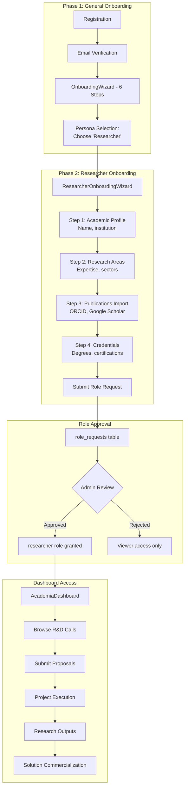

# Researcher / Academic Persona Documentation

## Overview

Researchers and academics from universities and research institutions participate in R&D calls, submit proposals, manage research projects, and contribute to municipal innovation through applied research.

## Persona Attributes

| Attribute | Value |
|-----------|-------|
| **Role Name** | Researcher / Academic |
| **Role Code** | `researcher` |
| **Organization Type** | `research_institution`, `university` |
| **Primary Dashboard** | `AcademiaDashboard` |
| **Onboarding Flow** | `ResearcherOnboarding` |

## User Journey (2-Phase Onboarding)



> **Note:** Researcher role requires admin approval with credential verification. Users can browse public R&D calls while pending.

## Permissions

### Core Permissions
- `rd_view_own` - View own R&D projects
- `rd_create` - Create R&D projects
- `rd_update_own` - Update own projects
- `rd_proposal_create` - Submit proposals
- `rd_proposal_view_own` - View own proposals
- `livinglab_booking` - Book living lab slots

### RLS Scope
```sql
-- Researchers see published R&D calls
WHERE status = 'open' 
  AND is_published = true
  AND close_date > now()

-- Own projects/proposals
WHERE created_by = user.email
   OR principal_investigator->>'email' = user.email
   OR team_members @> '[{"email": "user.email"}]'
```

## Dashboard Features

### AcademiaDashboard.jsx (542 lines)

#### Key Sections
1. **Urgent Deadlines Banner**
   - R&D calls closing within 2 weeks
   - Animated pulse alert

2. **Statistics Cards**
   - Open R&D calls count (with total funding)
   - My projects count (active/total)
   - Proposals count (under review)
   - Living labs count (bookings)
   - R&D challenges count

3. **Open R&D Calls**
   - List of open calls with deadlines
   - Budget information
   - Linked challenges count
   - Direct submit button

4. **Quick Actions**
   - Submit Proposal
   - New R&D Project
   - Book Living Lab
   - Research Library

5. **My Research Portfolio**
   - Active projects with TRL tracking
   - Proposals with status

6. **Research Programs**
   - Fellowship programs
   - Training programs

## Key Pages

| Page | Purpose | Permission Required |
|------|---------|-------------------|
| `AcademiaDashboard` | Main dashboard | `rd_view_own` |
| `RDCalls` | Browse R&D calls | Authenticated |
| `RDCallDetail` | View call details | Authenticated |
| `ProposalWizard` | Submit proposals | `rd_proposal_create` |
| `RDProjectCreate` | Create R&D projects | `rd_create` |
| `MyRDProjects` | Track own projects | `rd_view_own` |
| `RDProjectDetail` | Project details | `rd_view_own` |
| `LivingLabs` | Browse living labs | Authenticated |
| `Knowledge` | Research library | Authenticated |

## Data Access

### Entities Accessed
- `RDCall` (published, open calls)
- `RDProject` (own projects)
- `RDProposal` (own proposals)
- `ResearcherProfile` (own profile)
- `LivingLab` (active, public labs)
- `LivingLabBooking` (own bookings)
- `Program` (fellowship, training type)
- `Challenge` (R&D track only)

### Queries
```javascript
// Open R&D calls
const { data: openRDCalls } = useQuery({
  queryKey: ['open-rd-calls'],
  queryFn: async () => {
    const all = await base44.entities.RDCall.list();
    return all.filter(c => 
      c.status === 'open' && 
      c.is_published &&
      new Date(c.close_date) > new Date()
    );
  }
});

// Own R&D projects
const { data: myRDProjects } = useQuery({
  queryKey: ['my-rd-projects'],
  queryFn: async () => {
    return all.filter(p => 
      p.created_by === user?.email || 
      p.principal_investigator?.email === user?.email ||
      p.team_members?.some(t => t.email === user?.email)
    );
  }
});
```

## Workflows

### R&D Proposal Submission
1. Discover open R&D calls
2. Review call requirements and linked challenges
3. Submit proposal via `ProposalWizard`
4. Peer review process
5. Expert panel evaluation
6. Approval → Project initiation

### R&D Project Lifecycle
1. **Kickoff**: RDProjectKickoffWorkflow
2. **Execution**: Milestone tracking, progress updates
3. **TRL Advancement**: Track TRL progression
4. **Completion**: Final evaluation, output documentation
5. **Transition**: Convert to solution/policy/pilot

### Living Lab Usage
1. Browse available living labs
2. Check capacity and equipment
3. Book time slot
4. Conduct research/testing
5. Submit results

## AI Features

| Feature | Component | Description |
|---------|-----------|-------------|
| AI Proposal Writer | `AIProposalWriter` | AI-assisted proposal drafting |
| Expert Finder | `ExpertFinder` | Find collaborators by expertise |
| Credential Verification | `CredentialVerificationAI` | Verify academic credentials |
| Reputation Scoring | `ResearcherReputationScoring` | H-index and citation analysis |

## Integration Points

- **Challenge System**: R&D track challenges become R&D calls
- **Pilot System**: R&D outputs can become pilot solutions
- **Policy Track**: Research informs policy recommendations
- **Living Labs**: Access to testing environments
- **Knowledge Hub**: Publish and access research outputs

## Onboarding Specifics

### ResearcherOnboarding Flow
1. Academic profile (name, institution)
2. Research areas
3. Publications import (ORCID)
4. Credential verification
5. Expertise keywords

### ResearcherProfile Fields
- `email` - User email
- `institution_id` - University/research org
- `expertise_areas[]` - Research areas
- `h_index` - H-index score
- `citation_count` - Total citations
- `publications[]` - Published works
- `orcid` - ORCID identifier
- `embeddings` - AI expertise embedding

## TRL Tracking

Researchers track Technology Readiness Level (TRL) for R&D projects:

| TRL | Description |
|-----|-------------|
| 1-2 | Basic research |
| 3-4 | Proof of concept |
| 5-6 | Prototype development |
| 7-8 | System demonstration |
| 9 | Market ready |

Projects aim to advance from `trl_start` to `trl_target`.
