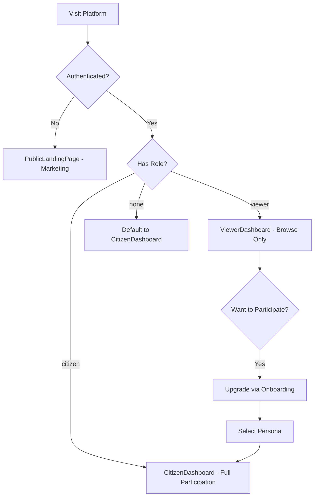

# Viewer / Public User Persona Documentation

## Overview

Viewers are minimally authenticated users who can **browse-only** public information on the platform. They **cannot participate** (submit ideas, vote, provide feedback). This role is for users who want to observe without engaging.

**Key Difference from Citizen:**
- **Viewer**: Browse-only, no participation features, cannot submit ideas or vote
- **Citizen**: Full participation, can submit ideas, vote, provide feedback, earn points

## Persona Attributes

| Attribute | Value |
|-----------|-------|
| **Role Name** | Viewer / Public User |
| **Role Code** | `viewer` |
| **Organization Type** | N/A |
| **Primary Dashboard** | `ViewerDashboard` |
| **Onboarding Flow** | None (can upgrade to Citizen or other personas) |

## User Journey



> **Note:** Viewers can upgrade to Citizen or other personas by completing onboarding. The default for new authenticated users without roles is Citizen.

## Permissions

### Core Permissions
- View-only access to published content
- **NO** create/update/delete permissions
- **CANNOT** submit ideas
- **CANNOT** vote
- **CANNOT** provide feedback
- Can upgrade to other personas

### RLS Scope
```sql
-- Viewers see only public/published content
WHERE is_published = true

-- No access to drafts, internal, or confidential
-- No access to user-specific data
```

## Portal Features

### PublicPortal.jsx (602 lines)

#### Key Sections
1. **Navigation Bar**
   - About
   - Challenges
   - Solutions
   - For Municipalities
   - For Providers
   - For Innovators
   - For Researchers
   - Language toggle
   - Sign In / Get Started buttons

2. **Hero Section**
   - Platform branding
   - Call to action
   - Join Platform / Explore buttons

3. **Platform Statistics**
   - Municipalities count
   - Challenges count
   - Solutions count
   - Pilots count

4. **How It Works**
   - Step 1: Identify Challenges
   - Step 2: Match Solutions
   - Step 3: Run Pilots
   - Step 4: Scale Success

5. **Top Municipalities**
   - Innovation leaders by MII score
   - Top 5 ranked municipalities

6. **Open Programs**
   - Active programs accepting applications
   - Funding availability indicators

7. **Featured Challenges**
   - Published challenges seeking solutions

8. **Success Stories**
   - Completed and scaled pilots

9. **Verified Solutions**
   - Market-ready verified solutions

## Key Pages

| Page | Purpose | Auth Required |
|------|---------|---------------|
| `PublicPortal` | Main public landing | No |
| `About` | Platform information | No |
| `PublicChallenges` | Browse challenges | No |
| `PublicSolutions` | Browse solutions | No |
| `ForMunicipalities` | Municipality info page | No |
| `ForProviders` | Provider info page | No |
| `ForInnovators` | Innovator info page | No |
| `ForResearchers` | Researcher info page | No |
| `Auth` | Login/Register | No |

## Data Access

### Entities Accessed (Read-Only)
- `Pilot` (stage = 'completed'/'scaled', is_published = true)
- `Challenge` (is_published = true)
- `Solution` (is_published = true, is_verified = true)
- `Municipality` (is_active = true)
- `Program` (is_published = true, status = 'applications_open')

### Queries
```javascript
// Public successful pilots
const { data: successfulPilots } = useQuery({
  queryKey: ['public-successful-pilots'],
  queryFn: async () => {
    const { data } = await supabase
      .from('pilots')
      .select('*')
      .in('stage', ['completed', 'scaled'])
      .eq('is_published', true)
      .eq('recommendation', 'scale')
      .limit(6);
    return data;
  }
});

// Platform statistics
const { data: platformStats } = useQuery({
  queryKey: ['public-platform-stats'],
  queryFn: async () => {
    const [challenges, pilots, solutions, municipalities] = await Promise.all([
      supabase.from('challenges').select('*', { count: 'exact', head: true }),
      supabase.from('pilots').select('*', { count: 'exact', head: true }),
      supabase.from('solutions').select('*', { count: 'exact', head: true }),
      supabase.from('municipalities').select('*', { count: 'exact', head: true })
    ]);
    return {
      challenges: challenges.count,
      pilots: pilots.count,
      solutions: solutions.count,
      municipalities: municipalities.count
    };
  }
});
```

## Content Types Available

### Published Challenges
- Title and description
- Sector and category
- Municipality (high-level)
- Status and priority
- No confidential details

### Verified Solutions
- Solution name and description
- Provider name
- Maturity level
- Deployment count
- Average rating

### Success Stories (Pilots)
- Pilot title
- Municipality
- Solution used
- Outcomes achieved
- Media gallery

### Programs
- Program name
- Type (accelerator, etc.)
- Status
- Funding availability
- Application deadlines

## Conversion Paths

### To Municipality Staff
1. Click "For Municipalities" or "Get Started"
2. Register with government email
3. Complete municipality onboarding
4. Full access to MunicipalityDashboard

### To Provider
1. Click "For Providers" or "Get Started"
2. Register with company email
3. Complete startup onboarding
4. Full access to StartupDashboard

### To Researcher
1. Click "For Researchers" or "Get Started"
2. Register with institution email
3. Complete researcher onboarding
4. Full access to AcademiaDashboard

### To Citizen
1. Click "For Innovators" or "Get Started"
2. Register with any email
3. Complete citizen onboarding
4. Full access to CitizenDashboard

## SEO & Public Pages

### Public Routes
- `/` or `/public-portal` - Main landing
- `/about` - About the platform
- `/public-challenges` - Challenge explorer
- `/public-solutions` - Solution marketplace
- `/for-municipalities` - Municipality info
- `/for-providers` - Provider info
- `/for-researchers` - Researcher info

### Meta Information
```html
<title>Saudi Innovates - National Municipal Innovation Platform</title>
<meta name="description" content="Connect municipalities with innovative solutions..." />
```

## Analytics Tracked

| Event | Description |
|-------|-------------|
| Page View | All public page visits |
| CTA Click | Get Started, Sign In clicks |
| Explore Click | Solution/Challenge views |
| Persona Selection | Which "For X" pages visited |
| Language Toggle | ar/en preference |

## Mobile Responsiveness

PublicPortal is fully responsive:
- Mobile navigation (hamburger menu)
- Stacked cards on small screens
- Touch-friendly CTAs
- Optimized hero section
