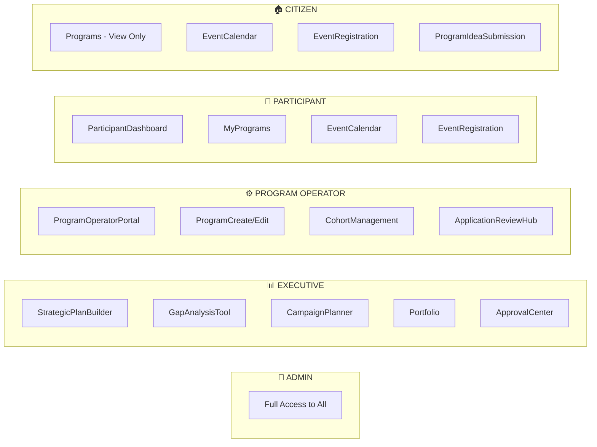
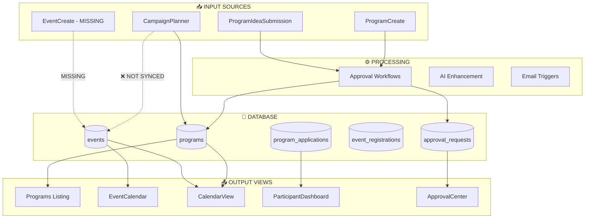
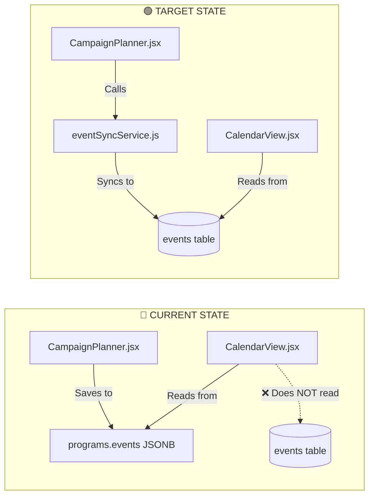
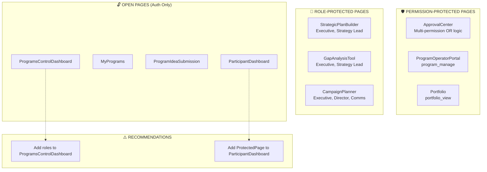

# Programs & Events Hub - Design Document

**Version:** 8.0  
**Last Updated:** 2025-12-13  
**Status:** PHASES 1-6 COMPLETE (100%) | Phase 7 Integration Pending 🟢

---

## Table of Contents

1. [System Integration Matrix](#system-integration-matrix)
2. [Implementation Progress](#implementation-progress)
3. [System Architecture Diagrams](#system-architecture-diagrams)
4. [Complete Pages Inventory](#complete-pages-inventory)
5. [Complete Components Inventory](#complete-components-inventory)
6. [Related Pages Deep Dive](#related-pages-deep-dive)
7. [Data Model](#data-model)
8. [Critical Gaps](#critical-gaps)
9. [Phase 7 - Extended Integrations](#phase-7-extended-integrations)

---

## System Integration Matrix

| System | Programs | Events | Gap Level |
|--------|----------|--------|-----------|
| **Approval Workflow** | ✅ 4 gates | ✅ 2 gates | None |
| **Permissions (Roles)** | ✅ 18 roles | ✅ 18 roles | None |
| **Email Templates** | ✅ 8 templates | ✅ 8 templates | None |
| **Email Triggers (Hooks)** | ✅ Full | ✅ Full | None |
| **In-App Notifications** | ✅ Integrated | ✅ Integrated | None |
| **Calendar Integration** | ✅ Full | ✅ Full | None |
| **Campaign Sync** | ✅ Full | ✅ Full | None |
| **AI Components** | ✅ 6 components | ✅ 4 components | None |
| **Search/Discovery** | ✅ Full | ✅ Full | None |
| **Budget Integration** | ✅ Full | ⚠️ Missing | Medium |
| **Comments System** | ✅ Full | ⚠️ Missing | Low |
| **Bookmarks** | ✅ Full | ⚠️ Missing | Low |
| **Realtime Updates** | ❌ Missing | ❌ Missing | Medium |

**Full details:** See `docs/programs-events-integration-matrix.md`

---

## Implementation Progress (Phase 1) ✅ COMPLETE

### ✅ Completed Tasks

| Task | Status | Date |
|------|--------|------|
| Created `/src/components/events/` folder | ✅ | 2025-12-13 |
| EventCard.jsx component | ✅ | 2025-12-13 |
| EventFilters.jsx component | ✅ | 2025-12-13 |
| EventCancelDialog.jsx component | ✅ | 2025-12-13 |
| EventAttendeeList.jsx component | ✅ | 2025-12-13 |
| useEvents.js hook (CRUD) | ✅ | 2025-12-13 |
| EventCreate.jsx page | ✅ | 2025-12-13 |
| EventEdit.jsx page | ✅ | 2025-12-13 |
| Routes added to pages.config.js | ✅ | 2025-12-13 |
| EventCalendar.jsx → link to EventCreate | ✅ | 2025-12-13 |
| EventDetail.jsx → Edit button added | ✅ | 2025-12-13 |
| CalendarView.jsx → events table query | ✅ | 2025-12-13 |
| ParticipantDashboard.jsx → Program Events section | ✅ | 2025-12-13 |
| MyPrograms.jsx → Upcoming Program Events section | ✅ | 2025-12-13 |
| ProgramOperatorPortal.jsx → Events management section | ✅ | 2025-12-13 |
| Database permissions migration (event_create, etc.) | ✅ | 2025-12-13 |
| ApprovalCenter.jsx → Events tab with approval workflow | ✅ | 2025-12-13 |

### ✅ Phase 2 Tasks - COMPLETE

| Task | Priority | Status | Notes |
|------|----------|--------|-------|
| EventSyncService | High | ✅ | `src/services/eventSyncService.js` |
| CampaignPlanner integration | High | ✅ | Auto-sync on event CRUD |
| useEventRegistrations hook | Medium | ✅ | `src/hooks/useEventRegistrations.js` |
| Database sync columns | High | ✅ | `program_synced`, `program_sync_source` |

### ✅ Phase 3 Tasks - COMPLETE

| Task | Priority | Status | Notes |
|------|----------|--------|-------|
| ProgramsEventsHub component | High | ✅ | Unified hub with tabs |
| HubStats component | Medium | ✅ | Statistics display |
| HubTabs component | Medium | ✅ | Tab navigation |
| QuickActions component | Medium | ✅ | Quick action buttons |
| Embedded mode for Programs | High | ✅ | Working |
| Embedded mode for EventCalendar | High | ✅ | Working |
| Embedded mode for CampaignPlanner | High | ✅ | Working |
| Embedded mode for CalendarView | High | ✅ | Working |
| Navigation integration | High | ✅ | Added to sidebarMenus |

### ✅ Phase 4 Tasks - COMPLETE

| Task | Priority | Status | Notes |
|------|----------|--------|-------|
| AIEventOptimizer | High | ✅ | Timing + description |
| AIAttendancePredictor | Medium | ✅ | Attendance forecast |
| AIConflictDetector | High | ✅ | Schedule conflicts |
| AIProgramEventCorrelator | High | ✅ | Program-event analysis |
| Hub analytics integration | High | ✅ | Added to ProgramsEventsHub |
| Hub navigation | Medium | ✅ | Sidebar menu update |
| Event reminder edge function | Low | 🔴 | 24h before event notification (future) |

### ✅ Phase 5 Tasks - Permissions & Polish - COMPLETE

| Task | Priority | Status | Notes |
|------|----------|--------|-------|
| Citizen role permissions | High | ✅ | event_view, event_register, program_view, program_apply |
| Provider role permissions | High | ✅ | + program_participate |
| Expert role permissions | High | ✅ | event_view, event_register, program_view |
| Researcher role permissions | High | ✅ | event_view, event_register, program_view, program_apply |
| User role permissions | Medium | ✅ | event_view, program_view |
| Viewer role permissions | Low | ✅ | event_view only (read-only by design) |
| Public pages verification | High | ✅ | All public pages accessible |

### ✅ Phase 6 Tasks - Approval System Deep Integration - COMPLETE

| Task | Priority | Status | Notes |
|------|----------|--------|-------|
| Event permissions in roles table | High | ✅ | Municipality Admin, Coordinator, Program Director, etc. |
| event_approve in ApprovalCenter | High | ✅ | Added to requiredPermissions array |
| Event approval email trigger | High | ✅ | Triggers on legacy event approval |
| event.submitted email trigger | Medium | ✅ | Triggers when event submitted for approval |
| event_approved email template | Medium | ✅ | Created with bilingual support |
| event_submitted email template | Medium | ✅ | Created with bilingual support |
| Approval system assessment doc | Medium | ✅ | docs/approval-system-assessment.md |

### ✅ Phase 7 Tasks - Extended Integrations - PARTIAL COMPLETE

| Task | Priority | Status | Notes |
|------|----------|--------|-------|
| Program email triggers (all lifecycle) | High | ✅ | usePrograms.js hook with full triggers |
| In-app notifications for Programs | High | ✅ | notifyProgramEvent() in AutoNotification |
| In-app notifications for Events | High | ✅ | notifyEventAction() in AutoNotification |
| Add events to global search | Medium | ✅ | useVisibilityAwareSearch.js updated |
| Add budget tracking to events | Medium | 🔴 | events table + EventForm |
| Event reminder edge function | Medium | 🔴 | 24h before event notification |
| Add comments to events | Low | 🔴 | entity_type='event' |
| Add bookmarks to events | Low | 🔴 | entity_type='event' |
| Supabase Realtime updates | Low | 🔴 | Live updates for listings |

---

## 2. System Architecture Diagrams

### 2.1 Full System Overview

```mermaid
graph TB
    subgraph PERSONAS["👥 PERSONAS & ACCESS"]
        A1[Admin<br/>Full Access]
        A2[Executive<br/>Strategic View]
        A3[Deputyship<br/>Sector-Scoped]
        A4[Municipality<br/>Geographic]
        A5[Provider<br/>Own Programs]
        A6[Citizen<br/>Participant]
    end

    subgraph PROGRAM_PAGES["📚 PROGRAM PAGES (25)"]
        P1[Programs.jsx<br/>Main Listing]
        P2[ProgramDetail.jsx<br/>16+ Tabs]
        P3[ProgramCreate.jsx]
        P4[ProgramEdit.jsx]
        P5[MyPrograms.jsx<br/>User Portfolio]
        P6[ParticipantDashboard.jsx<br/>Progress View]
        P7[ProgramOperatorPortal.jsx<br/>Operator Tools]
        P8[ProgramIdeaSubmission.jsx<br/>Innovation Proposals]
        P9[ProgramApplicationWizard.jsx]
        P10[ProgramCohortManagement.jsx]
    end

    subgraph EVENT_PAGES["📅 EVENT PAGES (6) - UPDATED"]
        E1[EventCalendar.jsx ✅]
        E2[EventDetail.jsx ✅]
        E3[EventRegistration.jsx ✅]
        E4[EventCreate.jsx ✅ NEW]
        E5[EventEdit.jsx ✅ NEW]
    end

    subgraph CAMPAIGN_CALENDAR["🗓️ CAMPAIGN & CALENDAR (3)"]
        C1[CampaignPlanner.jsx<br/>699 lines]
        C2[CalendarView.jsx ✅<br/>Events Added]
        C3[CommunicationsHub.jsx<br/>Email Campaigns]
    end

    subgraph SUPPORTING["🔧 SUPPORTING PAGES (10)"]
        S1[ApprovalCenter.jsx<br/>11 Entity Types]
        S2[Portfolio.jsx<br/>Innovation Kanban]
        S3[GapAnalysisTool.jsx<br/>AI Gap Discovery]
        S4[StrategicPlanBuilder.jsx]
        S5[ApplicationReviewHub.jsx]
    end

    subgraph COMPONENTS["🧩 COMPONENTS - UPDATED"]
        CM1[37 Program Components<br/>6 AI-Powered]
        CM2[Event Components ✅<br/>4 Components Created]
        CM3[7 Workflow Components]
    end

    subgraph DATA["💾 DATA LAYER"]
        D1[(programs table)]
        D2[(events table)]
        D3[(program_applications)]
        D4[(event_registrations)]
    end

    A1 --> P1 & S1 & S2
    A2 --> P1 & S4 & C1
    A3 --> P1 & S1
    A4 --> P1 & E1
    A5 --> P5 & P6 & P7
    A6 --> P5 & P6 & E1 & E3

    P1 --> D1
    C1 -.->|❌ NOT SYNCED| D2
    E1 --> D2
    E3 --> D4
    C2 --> D2
```



### 2.2 Persona Access Matrix Diagram



### 2.3 Data Flow Diagram



### 2.4 Event Sync Gap Diagram



### 2.5 Permission Structure Diagram



---

## 1. Executive Summary

### 1.1 Purpose

This document provides a **complete inventory** of all existing program and event-related pages and components in the system, along with identified gaps and implementation recommendations.

### 1.2 Key Findings (UPDATED - All Complete ✅)

- **25 Program-Related Pages** (all active)
- **5 Event-Related Pages** (all complete ✅)
- **37 Program Components** in `/src/components/programs/`
- **5 Event Components** in `/src/components/events/` ✅
- **4 AI Event Components** in `/src/components/ai/` ✅
- **4 Hub Components** in `/src/components/hub/` ✅
- **Sync Service**: Events in CampaignPlanner synced via `eventSyncService.js` ✅

---

## 2. Complete Pages Inventory

### 2.1 Program Pages (25 total)

| # | Page | File | Lines | Purpose | Status |
|---|------|------|-------|---------|--------|
| 1 | Programs | `Programs.jsx` | 692 | Main listing with filters, AI insights, grid/list view | ✅ Active |
| 2 | ProgramDetail | `ProgramDetail.jsx` | 1215 | Full program view with 16+ tabs | ✅ Active |
| 3 | ProgramCreate | `ProgramCreate.jsx` | 11 | Wrapper for ProgramCreateWizard | ✅ Active |
| 4 | ProgramEdit | `ProgramEdit.jsx` | 592 | Edit with AI enhance, auto-save | ✅ Active |
| 5 | MyPrograms | `MyPrograms.jsx` | 199 | User's enrolled programs portfolio | ✅ Active |
| 6 | MyProgramDashboard | `MyProgramDashboard.jsx` | 0 | Empty file (needs content) | ⚠️ Empty |
| 7 | ParticipantDashboard | `ParticipantDashboard.jsx` | 280 | Active participant progress view | ✅ Active |
| 8 | ProgramOperatorPortal | `ProgramOperatorPortal.jsx` | 396 | Operator tools & metrics | ✅ Active |
| 9 | ProgramIdeaSubmission | `ProgramIdeaSubmission.jsx` | 361 | Innovation proposal submission | ✅ Active |
| 10 | ProgramApplicationWizard | `ProgramApplicationWizard.jsx` | ~400 | Multi-step application flow | ✅ Active |
| 11 | ProgramApplicationDetail | `ProgramApplicationDetail.jsx` | ~300 | Single application details | ✅ Active |
| 12 | ProgramApplicationEvaluationHub | `ProgramApplicationEvaluationHub.jsx` | ~400 | Application evaluation queue | ✅ Active |
| 13 | ProgramCohortManagement | `ProgramCohortManagement.jsx` | ~300 | Cohort management | ✅ Active |
| 14 | ProgramOutcomesAnalytics | `ProgramOutcomesAnalytics.jsx` | ~400 | Outcome metrics & charts | ✅ Active |
| 15 | ProgramImpactDashboard | `ProgramImpactDashboard.jsx` | ~350 | Conversion funnel analytics | ✅ Active |
| 16 | ProgramPortfolioPlanner | `ProgramPortfolioPlanner.jsx` | ~400 | Portfolio planning | ✅ Active |
| 17 | ProgramROIDashboard | `ProgramROIDashboard.jsx` | ~300 | ROI calculations | ✅ Active |
| 18 | ProgramFinancialROI | `ProgramFinancialROI.jsx` | ~350 | Financial ROI details | ✅ Active |
| 19 | ProgramChallengeAlignment | `ProgramChallengeAlignment.jsx` | ~300 | Challenge alignment | ✅ Active |
| 20 | ProgramChallengeMatcher | `ProgramChallengeMatcher.jsx` | ~350 | Challenge matching | ✅ Active |
| 21 | ProgramCampaignHub | `ProgramCampaignHub.jsx` | ~400 | Campaign management | ✅ Active |
| 22 | ProgramLaunchWizard | `ProgramLaunchWizard.jsx` | ~300 | Launch wizard | ✅ Active |
| 23 | ProgramRDApprovalGates | `ProgramRDApprovalGates.jsx` | ~200 | R&D approval gates | ✅ Active |
| 24 | ProgramRDKnowledgeExchange | `ProgramRDKnowledgeExchange.jsx` | ~300 | R&D knowledge exchange | ✅ Active |
| 25 | ProgramsCoverageReport | `ProgramsCoverageReport.jsx` | ~500 | Coverage analysis | ✅ Active |

### 2.2 Event Pages (5 total - ALL COMPLETE ✅)

| # | Page | File | Lines | Purpose | Status |
|---|------|------|-------|---------|--------|
| 1 | EventCalendar | `EventCalendar.jsx` | 187 | Event listing (citizen-focused) | ✅ Active |
| 2 | EventDetail | `EventDetail.jsx` | 194 | Single event view | ✅ Active |
| 3 | EventRegistration | `EventRegistration.jsx` | 221 | Registration form with email trigger | ✅ Active |
| 4 | EventCreate | `EventCreate.jsx` | ~300 | Create new event | ✅ Created |
| 5 | EventEdit | `EventEdit.jsx` | ~280 | Edit event | ✅ Created |

### 2.3 Campaign & Calendar Pages (3 total)

| # | Page | File | Lines | Purpose | Status |
|---|------|------|-------|---------|--------|
| 1 | CampaignPlanner | `CampaignPlanner.jsx` | 699 | Campaign creation wizard | ✅ Active |
| 2 | CalendarView | `CalendarView.jsx` | 210 | Unified calendar (pilots, programs, expert assignments) | ✅ Active |
| 3 | CommunicationsHub | `CommunicationsHub.jsx` | ~500 | Email campaign manager | ✅ Active |

### 2.4 Related Supporting Pages (10 total)

| # | Page | File | Lines | Purpose | Status |
|---|------|------|-------|---------|--------|
| 1 | ApprovalCenter | `ApprovalCenter.jsx` | 941 | Unified approval queue (11 entity types) | ✅ Active |
| 2 | Portfolio | `Portfolio.jsx` | 383 | Innovation portfolio Kanban | ✅ Active |
| 3 | GapAnalysisTool | `GapAnalysisTool.jsx` | 531 | AI gap discovery | ✅ Active |
| 4 | StrategicPlanBuilder | `StrategicPlanBuilder.jsx` | 156 | Strategic plan creation | ✅ Active |
| 5 | ApplicationReviewHub | `ApplicationReviewHub.jsx` | ~400 | Application review queue | ✅ Active |
| 6 | AlumniShowcase | `AlumniShowcase.jsx` | ~300 | Alumni showcase | ✅ Active |
| 7 | MentorshipHub | `MentorshipHub.jsx` | ~350 | Mentorship management | ✅ Active |
| 8 | CrossProgramSynergy | `CrossProgramSynergy.jsx` | ~400 | Cross-program analysis | ✅ Active |
| 9 | ProgramGapsImplementationPlan | `ProgramGapsImplementationPlan.jsx` | ~300 | Gap implementation | ✅ Active |
| 10 | ProgramImplementationPlan | `ProgramImplementationPlan.jsx` | ~350 | Implementation planning | ✅ Active |

---

## 3. Complete Components Inventory

### 3.1 Program Components (37 files in `/src/components/programs/`)

| # | Component | Purpose | AI-Powered |
|---|-----------|---------|------------|
| 1 | `AICurriculumGenerator.jsx` | AI-generated week-by-week curriculum | ✅ Yes |
| 2 | `AIDropoutPredictor.jsx` | At-risk participant detection | ✅ Yes |
| 3 | `AICohortOptimizerWidget.jsx` | AI cohort optimization | ✅ Yes |
| 4 | `AIAlumniSuggester.jsx` | Alumni next-step suggestions | ✅ Yes |
| 5 | `AIProgramBenchmarking.jsx` | Program benchmarking analysis | ✅ Yes |
| 6 | `AIProgramSuccessPredictor.jsx` | Success prediction model | ✅ Yes |
| 7 | `AlumniImpactTracker.jsx` | Alumni impact tracking | No |
| 8 | `AlumniNetworkHub.jsx` | Alumni networking | No |
| 9 | `AlumniSuccessStoryGenerator.jsx` | AI story generation | ✅ Yes |
| 10 | `AttendanceTracker.jsx` | Session attendance | No |
| 11 | `AutomatedCertificateGenerator.jsx` | Certificate generation | No |
| 12 | `CohortManagement.jsx` | Cohort management | No |
| 13 | `CohortOptimizer.jsx` | Cohort optimization | No |
| 14 | `CrossProgramSynergy.jsx` | Cross-program analysis | No |
| 15 | `DropoutPredictor.jsx` | Dropout prediction (non-AI) | No |
| 16 | `EnhancedProgressDashboard.jsx` | Progress dashboard | No |
| 17 | `GraduationWorkflow.jsx` | Graduation process | No |
| 18 | `ImpactStoryGenerator.jsx` | Impact story generator | No |
| 19 | `MentorMatchingEngine.jsx` | Mentor matching | No |
| 20 | `MentorScheduler.jsx` | Mentor scheduling | No |
| 21 | `MunicipalImpactCalculator.jsx` | Municipal impact calc | No |
| 22 | `OnboardingWorkflow.jsx` | Participant onboarding | No |
| 23 | `ParticipantAssignmentSystem.jsx` | Assignment management | No |
| 24 | `PeerCollaborationHub.jsx` | Peer collaboration | No |
| 25 | `PeerLearningNetwork.jsx` | Peer learning network | No |
| 26 | `PostProgramFollowUp.jsx` | Post-program tracking | No |
| 27 | `ProgramActivityLog.jsx` | Activity logging | No |
| 28 | `ProgramAlumniStoryboard.jsx` | Alumni storyboard | No |
| 29 | `ProgramBenchmarking.jsx` | Benchmarking (non-AI) | No |
| 30 | `ProgramCreateWizard.jsx` | 6-step creation wizard | No |
| 31 | `ProgramExpertEvaluation.jsx` | Expert evaluation | No |
| 32 | `ProgramToPilotWorkflow.jsx` | Program→Pilot transition | No |
| 33 | `ProgramToSolutionWorkflow.jsx` | Program→Solution transition | No |
| 34 | `ResourceLibrary.jsx` | Resource library | No |
| 35 | `SessionScheduler.jsx` | Session scheduling | No |
| 36 | `StrategicAlignmentWidget.jsx` | Strategic alignment | No |
| 37 | `WaitlistManager.jsx` | Waitlist management | No |

### 3.2 Workflow Components (Top-level, program-related)

| # | Component | Purpose |
|---|-----------|---------|
| 1 | `ProgramLaunchWorkflow.jsx` | Launch program with email trigger |
| 2 | `ProgramApplicationScreening.jsx` | Application screening |
| 3 | `ProgramSelectionWorkflow.jsx` | Cohort selection |
| 4 | `ProgramSessionManager.jsx` | Session management |
| 5 | `ProgramMentorMatching.jsx` | Mentor matching |
| 6 | `ProgramCompletionWorkflow.jsx` | Program completion |
| 7 | `ProgramMidReviewGate.jsx` | Mid-program review |

### 3.3 Event Components (ALL CREATED ✅)

| # | Component | Purpose | Status |
|---|-----------|---------|--------|
| 1 | `/src/components/events/` | Event components folder | ✅ Created |
| 2 | `EventCard.jsx` | Event card component | ✅ Created |
| 3 | `EventFilters.jsx` | Event filtering | ✅ Created |
| 4 | `EventCancelDialog.jsx` | Event cancellation | ✅ Created |
| 5 | `EventAttendeeList.jsx` | Attendee management | ✅ Created |

### 3.4 AI Event Components (ALL CREATED ✅)

| # | Component | Purpose | Status |
|---|-----------|---------|--------|
| 1 | `AIEventOptimizer.jsx` | AI timing/description optimization | ✅ Created |
| 2 | `AIAttendancePredictor.jsx` | AI attendance forecasting | ✅ Created |
| 3 | `AIConflictDetector.jsx` | AI scheduling conflict detection | ✅ Created |
| 4 | `AIProgramEventCorrelator.jsx` | AI program-event analysis | ✅ Created |

### 3.5 Hub Components (ALL CREATED ✅)

| # | Component | Purpose | Status |
|---|-----------|---------|--------|
| 1 | `ProgramsEventsHub.jsx` | Unified hub with tabs | ✅ Created |
| 2 | `HubStats.jsx` | Hub statistics | ✅ Created |
| 3 | `HubTabs.jsx` | Tab navigation | ✅ Created |
| 4 | `QuickActions.jsx` | Quick actions | ✅ Created |

### 3.4 Calendar Components (1 file in `/src/components/calendar/`)

| # | Component | Purpose | Status |
|---|-----------|---------|--------|
| 1 | `CalendarEventCard.jsx` | Calendar event display | ✅ Active |

---

## 4. Related Pages Deep Dive

### 4.1 ProgramsControlDashboard.jsx (218 lines)

**Purpose:** Portfolio-level dashboard for all innovation programs with AI insights.

**Permission Configuration:**
```jsx
export default ProtectedPage(ProgramsControlDashboard, { requiredPermissions: [] });
```
- **Current Access:** Any authenticated user
- **Recommended Access:** `['program_view_all', 'program_manage']` - Program Operators, Admin

**Personas Who Access:**
| Persona | Access Level | Use Case |
|---------|-------------|----------|
| Admin | Full | Platform-wide portfolio oversight |
| Executive | View | Strategic program performance review |
| Deputyship | View | Sector-focused program metrics |
| Program Operator | Full | Manage assigned programs |
| Municipality | Limited | View programs in their area |

**Data Sources:**
- `programs` table (via base44 entity)
- `program_applications` table (via base44 entity)

**Features:**
- Key metrics: Total programs, Active programs, Total applicants, Graduates
- AI Portfolio Insights (gaps, recommendations, success patterns)
- Program type distribution chart (BarChart)
- Active programs listing with application stats

**AI Integration:**
- Portfolio analysis via `useAIWithFallback`
- Generates: balance_score, gaps, success_patterns, recommendations

**Event Integration Needs:**
- [ ] Add events count per program
- [ ] Show upcoming events across all programs

---

### 4.2 ParticipantDashboard.jsx (280 lines)

**Purpose:** Active participant's view of their enrolled program progress.

**Permission Configuration:**
```jsx
// NO ProtectedPage wrapper - uses inline useAuth() check
export default function ParticipantDashboard() {
  const { user } = useAuth();
  // Data filtered by user.email
}
```
- **Current Access:** Any authenticated user (data scoped by user email)
- **Recommended:** Wrap with `ProtectedPage({ requiredPermissions: [] })` for consistency

**Personas Who Access:**
| Persona | Access Level | Use Case |
|---------|-------------|----------|
| Citizen | Full (own data) | Track personal program progress |
| Provider | Full (own data) | Track startup's program journey |
| Researcher | Full (own data) | Track R&D program participation |

**Data Sources:**
- `program_applications` table (filtered by `user.email`)
- `programs` table (joined)
- `program_sessions` table (total sessions count)
- `session_attendance` table (completed sessions)
- `program_assignments` table (total assignments)
- `assignment_submissions` table (submitted work)
- `mentor_sessions` table (mentor meetings)
- `peer_collaborations` table (collaborations)

**Features:**
- Overall progress percentage calculation
- Session completion tracking (X/12 sessions)
- Assignment submission status (X/8 assignments)
- Mentor meeting count
- Peer collaboration count
- Quick actions: Submit Assignment, Cohort Forum, Resources
- Upcoming section (next session, pending assignments)

**Event Integration Needs:**
- [ ] Add program events section
- [ ] Link to EventRegistration for program-linked events
- [ ] Show upcoming events in "Upcoming" section

---

### 4.3 MyPrograms.jsx (199 lines)

**Purpose:** User's program portfolio - enrolled, pending, and graduated programs.

**Permission Configuration:**
```jsx
export default ProtectedPage(MyPrograms, { requiredPermissions: [] });
```
- **Current Access:** Any authenticated user (data scoped by user email)
- **Design:** Personal view - no permission needed, RLS handles data scope

**Personas Who Access:**
| Persona | Access Level | Use Case |
|---------|-------------|----------|
| All authenticated | Own data only | View personal program history |

**Data Sources:**
- `program_applications` table (by `applicant_email` or `created_by`)
- `programs` table (joined)

**Features:**
- Stats: Enrolled count, Pending count, Graduated count
- Active programs list with progress bars
- Attendance rate display
- Deliverables tracking (X/Y completed)
- Upcoming milestones from curriculum JSONB
- Links to `ProgramApplicationDetail`

**Event Integration Needs:**
- [ ] Add "My Events" section
- [ ] Show upcoming events for enrolled programs
- [ ] Link to EventRegistration for quick sign-up

---

### 4.4 ProgramIdeaSubmission.jsx (361 lines)

**Purpose:** Multi-step innovation proposal submission form.

**Permission Configuration:**
```jsx
export default ProtectedPage(ProgramIdeaSubmission, { requiredPermissions: [] });
```
- **Current Access:** Any authenticated user
- **Recommended:** Keep open - anyone should be able to submit ideas

**Personas Who Access:**
| Persona | Access Level | Use Case |
|---------|-------------|----------|
| Citizen | Submit | Propose ideas for programs |
| Provider | Submit | Submit startup solutions |
| Researcher | Submit | Submit research proposals |
| Municipality | Submit | Submit local innovation ideas |

**Data Sources:**
- `programs` table (active programs for selection)
- `innovation_proposals` table (submission target)
- `sectors` table (reference data)

**Features:**
- 4-step wizard: Program Selection → Details → Implementation → Success
- AI enhancement via `useAIWithFallback` hook
- Generates bilingual title/description
- Budget/timeline estimation
- Team composition suggestions
- Success metrics generation

**AI Schema:**
```json
{
  "title_en": "string",
  "title_ar": "string",
  "description_en": "string",
  "description_ar": "string",
  "implementation_plan": "string",
  "success_metrics_proposed": ["string"],
  "timeline_proposal": "string",
  "team_composition": [{ "role": "string", "expertise": "string" }]
}
```

**Event Integration Needs:**
- [ ] Link submitted proposals to program events
- [ ] Show related events during submission

---

### 4.5 ApprovalCenter.jsx (941 lines)

**Purpose:** Unified approval queue for ALL entity types in the system.

**Permission Configuration:**
```jsx
export default ProtectedPage(ApprovalCenter, {
  requiredPermissions: ['challenge_approve', 'pilot_approve', 'program_approve', 'rd_proposal_approve', 'solution_approve', 'matchmaker_approve'],
  requireAll: false  // User needs ANY of these permissions
});
```
- **Current Access:** ✅ PROPERLY SECURED - requires any approval permission
- **Design:** OR-logic allows specialists to access only their approval types

**Personas Who Access:**
| Persona | Access Level | Tabs Visible |
|---------|-------------|--------------|
| Admin | Full - all tabs | All 11+ tabs |
| Executive | Approve strategic | Challenge, Pilot, Solution, Program |
| Deputyship | Sector-scoped | Challenges, Pilots in their sector |
| Municipality | Geographic | Own challenges, pilots |
| Expert | Evaluation only | Assigned evaluations |
| Program Operator | Program-specific | Program applications, Matchmaker |

**Entity Types Handled (11 total):**
1. `policy_recommendation` - Policy approvals
2. `challenge` - Challenge approvals (4 gates)
3. `pilot` - Pilot approvals (milestones, budget)
4. `rd_proposal` - R&D proposal approvals
5. `program_application` - Program application approvals
6. `matchmaker_application` - Matchmaker approvals
7. `solution` - Solution approvals
8. `program` - Program entity approvals (4 gates: launch, selection, mid_review, completion_review)
9. `citizen_ideas` - Citizen idea approvals
10. `innovation_proposal` - Innovation proposal approvals
11. `rd_projects` - R&D project approvals

**Features:**
- Tab-based navigation per entity type
- `InlineApprovalWizard` integration for in-context decisions
- AI analysis for approval recommendations
- SLA tracking and escalation badges
- Bulk approval actions
- Pending pilot milestone approvals
- Pending budget approvals

**Event Integration Needs:**
- [ ] Add "Events" tab (12th entity type)
- [ ] Wire event.created triggers to create approval requests
- [ ] Add event workflow gates

---

### 4.6 ProgramOperatorPortal.jsx (396 lines)

**Purpose:** Dashboard for program operators (organizations that run programs).

**Permission Configuration:**
```jsx
export default ProtectedPage(ProgramOperatorPortal, { 
  requiredPermissions: ['program_manage']
});
```
- **Current Access:** Users with `program_manage` permission
- **Data Scoping:** RLS by operator_organization_id or created_by email

**Personas Who Access:**
| Persona | Access Level | Data Scope |
|---------|-------------|------------|
| Program Operator | Full | Programs they operate |
| Admin | Full | All programs |
| Municipality Admin | View | Programs in their municipality |

**Data Sources:**
- `organizations` table (operator's org by contact_email)
- `programs` table (filtered by operator_organization_id)
- `program_applications` table (for operated programs)
- `pilots` table (conversions from programs)
- `matchmaker_applications` table (if operating matchmaker)

**Features:**
- Pending actions alert for unreviewed applications
- Stats: Active programs, Applications, Participants, Pilots, Matchmaker active
- Program list with conversion metrics (apps, accepted, rate, pilots)
- Matchmaker pipeline visualization (4 stages)
- Links to ApplicationReviewHub

**Key Metrics per Program:**
- Application count
- Accepted count
- Conversion rate (%)
- Pilot conversions

**Event Integration Needs:**
- [ ] Add program events section
- [ ] Show events per program with registration stats
- [ ] Add event creation quick action
- [ ] Link to EventCalendar filtered by operator's programs

---

### 4.7 StrategicPlanBuilder.jsx (156 lines)

**Purpose:** AI-assisted strategic plan creation.

**Permission Configuration:**
```jsx
export default ProtectedPage(StrategicPlanBuilder, { 
  requiredPermissions: [], 
  requiredRoles: ['Executive Leadership', 'GDISB Strategy Lead'] 
});
```
- **Current Access:** Role-based - Executive Leadership OR GDISB Strategy Lead
- **Note:** Uses `requiredRoles` instead of `requiredPermissions`

**Personas Who Access:**
| Persona | Access Level | Use Case |
|---------|-------------|----------|
| Executive | Full | Create strategic plans |
| GDISB Strategy Lead | Full | Set national strategy |
| Admin | Full (via isAdmin) | Platform management |

**Data Sources:**
- `strategic_plans` table (via base44 entity)

**Features:**
- Title/Vision input fields
- Strategic objectives array management
- AI generation via `useAIWithFallback`
- Generates: title_en, vision_en, objectives[]

**AI Schema:**
```json
{
  "title_en": "string",
  "vision_en": "string",
  "objectives": [{ "name_en": "string", "description_en": "string" }]
}
```

**Event Integration Needs:**
- [ ] Link strategic plans to programs
- [ ] Show programs aligned to each plan
- [ ] Calendar view of plan-linked program timelines

---

### 4.8 Portfolio.jsx (383 lines)

**Purpose:** Innovation portfolio Kanban board tracking items across pipeline stages.

**Permission Configuration:**
```jsx
export default ProtectedPage(PortfolioPage, { requiredPermissions: ['portfolio_view'] });
```
- **Current Access:** Users with `portfolio_view` permission
- **Strategic:** Portfolio-level oversight for decision makers

**Personas Who Access:**
| Persona | Access Level | Use Case |
|---------|-------------|----------|
| Admin | Full + drag-drop | Portfolio management |
| Executive | View + insights | Strategic oversight |
| Deputyship | Sector filter | Sector portfolio analysis |
| Municipality | Geographic filter | Local portfolio view |

**Data Sources:**
- `challenges` table
- `pilots` table
- `sectors` table

**Pipeline Stages (6):**
1. Discover → 2. Validate → 3. Experiment → 4. Pilot → 5. Scale → 6. Institutionalize

**Features:**
- Drag-and-drop Kanban (using @hello-pangea/dnd)
- Matrix view alternative
- Timeline Gantt view
- Sector filtering
- Year filtering
- Bulk actions toolbar
- Export dialog
- AI Pipeline Insights (5 categories)

**AI Analysis Categories:**
- Pipeline health
- Transition recommendations
- Resource allocation
- Acceleration strategies
- Balancing recommendations

**Event Integration Needs:**
- [ ] Add programs to pipeline (currently challenges only)
- [ ] Link program events to timeline
- [ ] Show program-linked events in Gantt view

---

### 4.9 GapAnalysisTool.jsx (531 lines)

**Purpose:** AI-powered discovery of innovation gaps and opportunities.

**Permission Configuration:**
```jsx
export default ProtectedPage(GapAnalysisTool, { 
  requiredPermissions: [], 
  requiredRoles: ['Executive Leadership', 'GDISB Strategy Lead'] 
});
```
- **Current Access:** ✅ PROPERLY SECURED - requires Executive Leadership or Strategy Lead role
- **Design:** Role-based access for strategic planning personas

**Personas Who Access:**
| Persona | Access Level | Use Case |
|---------|-------------|----------|
| Admin | Full | Platform-wide gap analysis |
| Executive | Full | Strategic gap identification |
| Deputyship | Sector-scoped | Sector-specific gaps |
| Researcher | View | Research opportunity identification |

**Data Sources:**
- `challenges` table
- `pilots` table
- `solutions` table
- `sectors` table
- `rd_projects` table

**AI Gap Categories (10 total):**
1. Underserved sectors
2. Innovation gaps
3. Geographic gaps
4. Technology gaps
5. Capacity gaps
6. Skills & talent gaps
7. Partnership gaps
8. Budget gaps
9. Timeline gaps
10. Service quality gaps

**Features:**
- Sector coverage bar chart
- Portfolio balance radar chart
- Gap cards with severity badges (high/medium/low)
- Priority action items
- Sector-level statistics
- Bilingual insights (EN/AR)

**Event Integration Needs:**
- [ ] Include program coverage in gap analysis
- [ ] Suggest programs to address gaps
- [ ] Link gap recommendations to program creation

---

### 4.10 CampaignPlanner.jsx (699 lines)

**Purpose:** Campaign and event creation wizard for innovation initiatives.

**Permission Configuration:**
```jsx
export default ProtectedPage(CampaignPlanner, { 
  requiredPermissions: [], 
  requiredRoles: ['Executive Leadership', 'Program Director', 'Communication Manager'] 
});
```
- **Current Access:** ✅ PROPERLY SECURED - requires specific leadership/communication roles
- **Design:** Role-based access for campaign management personas

**Data Sources:**
- `programs` table (filtered by program_type = 'campaign' or 'challenge')
- `challenges` table (for AI context)
- `sectors` table (focus area selection)
- `strategic_plans` table (linking)

**Campaign Data Structure:**
```javascript
{
  program_type: 'campaign',
  name_en, name_ar,
  tagline_en, tagline_ar,
  description_en, description_ar,
  focus_areas: [],
  timeline: {},
  events: [{ name, type, date, location }],  // ← NOT SYNCED TO events table!
  target_participants: {},
  objectives_en, objectives_ar
}
```

**Features:**
- 4-step wizard: Details → Strategic Alignment → Events & Schedule → Targeting
- AI campaign generator
- Events list management (JSONB, not table)
- Target participant configuration
- Strategic plan linking
- Stats: Total campaigns, Active, Participants, Events count

**AI Schema:**
```json
{
  "name_en": "string",
  "name_ar": "string",
  "tagline_en": "string",
  "tagline_ar": "string",
  "description_en": "string",
  "description_ar": "string",
  "objectives_en": "string",
  "objectives_ar": "string",
  "focus_areas": ["string"],
  "events": [{ "name": "string", "type": "string", "date": "string", "location": "string" }],
  "target_participants": { "type": ["string"], "min_participants": 0, "max_participants": 0 },
  "budget_estimate": 0
}
```

**CRITICAL GAP:** Events added in CampaignPlanner are stored in `programs.events[]` JSONB but NOT synced to the `events` database table!

**Required Fix:**
- Create `eventSyncService.js` to sync JSONB → table
- Wire sync on event add/edit/delete in wizard
- Add sync status indicator
- Link events to calendar after sync

---

## 5. Critical Gaps Summary

### 5.1 Missing Pages

| Priority | Gap | Impact |
|----------|-----|--------|
| 🔴 HIGH | `EventCreate.jsx` | Cannot create events via UI |
| 🔴 HIGH | `EventEdit.jsx` | Cannot edit events via UI |

### 5.2 Missing Components

| Priority | Gap | Impact |
|----------|-----|--------|
| 🔴 HIGH | `/src/components/events/` folder | No event component organization |
| 🟡 MED | `EventForm.jsx` | Needed for create/edit |
| 🟡 MED | `EventCard.jsx` | Consistent event display |
| 🟢 LOW | `AIEventOptimizer.jsx` | AI scheduling (Phase 2) |

### 5.3 Data Synchronization Gaps

| Priority | Gap | Impact |
|----------|-----|--------|
| 🔴 HIGH | CampaignPlanner events → events table | Events not queryable |
| 🔴 HIGH | CalendarView missing events query | Events not visible in calendar |
| 🟡 MED | Program.events[] JSONB isolated | Duplicate data, sync issues |

### 5.4 Integration Gaps

| Priority | Gap | Impact |
|----------|-----|--------|
| 🟡 MED | ParticipantDashboard missing events | Participants don't see upcoming events |
| 🟡 MED | MyPrograms missing events | Users don't see program events |
| 🟡 MED | ProgramOperatorPortal missing events | Operators can't manage events |
| 🟢 LOW | ApprovalCenter missing event entity | No event approval workflow |

---

## 6. Implementation Plan

### Phase 1: Core Event CRUD (Priority 🔴)

1. Create `/src/components/events/` folder
2. Create `EventForm.jsx` component
3. Create `EventCreate.jsx` page
4. Create `EventEdit.jsx` page
5. Update `EventCalendar.jsx` with create/edit links

### Phase 2: Data Synchronization (Priority 🔴)

1. Create event sync service
2. Update `CampaignPlanner.jsx` to sync events
3. Update `CalendarView.jsx` to query events table
4. Add `program_id` relationship to events

### Phase 3: Integration (Priority 🟡)

1. Add events section to `ParticipantDashboard.jsx`
2. Add events section to `MyPrograms.jsx`
3. Add events management to `ProgramOperatorPortal.jsx`
4. Add event entity to `ApprovalCenter.jsx`

### Phase 4: AI Enhancement (Priority 🟢)

1. Create `AIEventOptimizer.jsx`
2. Create `AIConflictDetector.jsx`
3. Integrate AI into event scheduling

---

## 7. Database Schema

### 7.1 Events Table (EXISTS)

```sql
CREATE TABLE events (
  id UUID PRIMARY KEY,
  code TEXT,
  title_en TEXT,
  title_ar TEXT,
  description_en TEXT,
  description_ar TEXT,
  event_type TEXT, -- workshop, conference, hackathon, webinar, training, networking
  start_date TIMESTAMPTZ,
  end_date TIMESTAMPTZ,
  location TEXT,
  is_virtual BOOLEAN,
  virtual_url TEXT,
  max_participants INTEGER,
  registered_count INTEGER DEFAULT 0,
  status TEXT, -- draft, published, registration_open, registration_closed, in_progress, completed, cancelled
  agenda JSONB,
  speakers JSONB,
  program_id UUID REFERENCES programs(id), -- ← KEY RELATIONSHIP
  municipality_id UUID REFERENCES municipalities(id),
  sector_id UUID REFERENCES sectors(id),
  is_published BOOLEAN DEFAULT false,
  created_at TIMESTAMPTZ DEFAULT now(),
  updated_at TIMESTAMPTZ DEFAULT now()
);
```

### 7.2 Programs Table (Events JSONB field)

```sql
-- Current structure (should be deprecated in favor of events table)
programs.events JSONB -- Array of {name, type, date, location}
```

---

## 8. Component Architecture

```
┌─────────────────────────────────────────────────────────────────────┐
│                     PROGRAMS & EVENTS HUB                           │
├─────────────────────────────────────────────────────────────────────┤
│                                                                     │
│  PROGRAM PAGES (25)              EVENT PAGES (4 + 2 missing)       │
│  ┌──────────────────────┐        ┌──────────────────────┐          │
│  │ Programs.jsx         │        │ EventCalendar.jsx    │          │
│  │ ProgramDetail.jsx    │        │ EventDetail.jsx      │          │
│  │ ProgramCreate.jsx    │        │ EventRegistration.jsx│          │
│  │ ProgramEdit.jsx      │        │ EventCreate.jsx  ❌  │          │
│  │ MyPrograms.jsx       │        │ EventEdit.jsx    ❌  │          │
│  │ ParticipantDashboard │        └──────────────────────┘          │
│  │ ProgramOperatorPortal│                                          │
│  │ + 18 more...         │        CAMPAIGN PAGES (3)                │
│  └──────────────────────┘        ┌──────────────────────┐          │
│                                  │ CampaignPlanner.jsx  │          │
│  PROGRAM COMPONENTS (37)         │ CalendarView.jsx     │          │
│  ┌──────────────────────┐        │ CommunicationsHub    │          │
│  │ /components/programs/│        └──────────────────────┘          │
│  │ AI* components (6)   │                                          │
│  │ Alumni* (4)          │        EVENT COMPONENTS (0) ❌           │
│  │ Workflow* (7)        │        ┌──────────────────────┐          │
│  │ + 20 more...         │        │ /components/events/  │ MISSING  │
│  └──────────────────────┘        └──────────────────────┘          │
│                                                                     │
│  SUPPORTING PAGES (10)           APPROVAL CENTER                   │
│  ┌──────────────────────┐        ┌──────────────────────┐          │
│  │ ApprovalCenter.jsx   │───────▶│ 11 entity types      │          │
│  │ Portfolio.jsx        │        │ + event (missing)    │          │
│  │ GapAnalysisTool.jsx  │        └──────────────────────┘          │
│  │ StrategicPlanBuilder │                                          │
│  │ + 6 more...          │                                          │
│  └──────────────────────┘                                          │
│                                                                     │
└─────────────────────────────────────────────────────────────────────┘
```

---

## 9. Summary Statistics

| Category | Count | Status |
|----------|-------|--------|
| Program Pages | 25 | ✅ All Active (1 empty) |
| Event Pages | 4 | ⚠️ 2 Missing |
| Campaign/Calendar Pages | 3 | ✅ All Active |
| Supporting Pages | 10 | ✅ All Active |
| Program Components | 37 | ✅ All Active |
| Event Components | 0 | ❌ Folder Missing |
| Workflow Components | 7 | ✅ All Active |
| AI Components | 6 | ✅ All Active |
| **Total Pages** | **42** | **40 Active, 2 Missing** |
| **Total Components** | **44+** | **44 Active, 4+ Missing** |
|-----------|---------|--------|
| `ExternalCalendarSync.jsx` | External calendar sync | ✅ Active |

**CRITICAL GAP: No dedicated `/src/components/events/` folder exists!**

---

## 5. Data Model

### 5.1 Database Tables

```
┌─────────────────────────────────────────────────────────────────┐
│                        PROGRAMS TABLE                           │
├─────────────────────────────────────────────────────────────────┤
│ id, code, name_en, name_ar, tagline_en, tagline_ar              │
│ description_en, description_ar, objectives_en, objectives_ar    │
│ program_type (accelerator|incubator|hackathon|challenge|        │
│              fellowship|training|matchmaker|sandbox_wave|other)  │
│ status (planning|applications_open|selection|active|completed|  │
│         cancelled)                                               │
│ municipality_id, sector_id, region_id                           │
│ focus_areas, target_audience, eligibility_criteria              │
│ min_participants, max_participants, application_count           │
│ accepted_count, participants_count                               │
│ duration_weeks, timeline (JSONB - app open/close, start/end)    │
│ budget_amount, currency, funding_sources                        │
│ curriculum (JSONB array), events (JSONB array - NOT SYNCED!)    │
│ kpis, outcomes, success_metrics, lessons_learned                │
│ created_by, manager_email, coordinator_emails                   │
│ linked_challenge_ids, linked_pilot_ids, linked_solution_ids     │
│ is_featured, is_published, is_deleted                           │
│ version_number, previous_version_id                             │
│ created_at, updated_at                                          │
└─────────────────────────────────────────────────────────────────┘

┌─────────────────────────────────────────────────────────────────┐
│                         EVENTS TABLE                            │
├─────────────────────────────────────────────────────────────────┤
│ id, code, title_en, title_ar, description_en, description_ar    │
│ event_type (workshop|conference|hackathon|webinar|training|     │
│             networking|ceremony|demo|meetup|other)               │
│ start_date, end_date, timezone                                  │
│ location, location_address, is_virtual, virtual_link            │
│ mode (in_person|virtual|hybrid)                                 │
│ organizer_email, organizer_name                                 │
│ municipality_id, sector_id, program_id (FK to programs)         │
│ capacity, max_participants, registered_count, registration_count│
│ registration_required, registration_deadline                    │
│ is_public, is_featured, is_cancelled                            │
│ status (draft|published|registration_open|registration_closed|  │
│         in_progress|completed|cancelled)                        │
│ tags, image_url, agenda (JSONB), speakers (JSONB)               │
│ created_by_email, created_at, updated_at                        │
└─────────────────────────────────────────────────────────────────┘

┌─────────────────────────────────────────────────────────────────┐
│                   EVENT_REGISTRATIONS TABLE                     │
├─────────────────────────────────────────────────────────────────┤
│ id, event_id, user_id, user_email, user_name                    │
│ organization_id, organization_name                              │
│ registration_status (pending|confirmed|cancelled|attended|      │
│                      no_show|waitlisted)                        │
│ registration_date, confirmation_date                            │
│ attendance_confirmed, check_in_time                             │
│ notes, dietary_requirements, special_requests                   │
│ feedback_submitted, rating                                      │
└─────────────────────────────────────────────────────────────────┘

┌─────────────────────────────────────────────────────────────────┐
│                  PROGRAM_APPLICATIONS TABLE                     │
├─────────────────────────────────────────────────────────────────┤
│ id, program_id, applicant_email, applicant_name                 │
│ organization_id, provider_id                                    │
│ status (draft|submitted|under_review|shortlisted|accepted|      │
│         rejected|waitlisted|withdrawn|enrolled|graduated)       │
│ application_data (JSONB), attachments, cover_letter             │
│ ai_score, ai_feedback, evaluation_scores                        │
│ reviewer_email, review_notes, review_date                       │
│ progress_percentage, attendance_rate, deliverables_completed    │
│ total_deliverables                                              │
│ submitted_at, decision_date, created_by                         │
└─────────────────────────────────────────────────────────────────┘
```

### 5.2 Critical Gap: Event Synchronization

```
┌─────────────────────────────────────────────────────────────────┐
│                    CURRENT DISCONNECT                           │
├─────────────────────────────────────────────────────────────────┤
│                                                                 │
│  CampaignPlanner.jsx                    events table            │
│  ┌─────────────────┐                   ┌─────────────────┐     │
│  │ programs.events │ ─── NO SYNC ───→  │  events table   │     │
│  │   (JSONB)       │                   │  (standalone)   │     │
│  └─────────────────┘                   └─────────────────┘     │
│         ↑                                      ↓                │
│   Events added here                   EventCalendar reads       │
│   are NOT visible                     from here (may be empty)  │
│   in EventCalendar                                              │
│                                                                 │
│  CalendarView.jsx reads from:                                   │
│  - pilots.timeline.pilot_start                                  │
│  - programs.timeline.program_start                              │
│  - expert_assignments.due_date                                  │
│  (Does NOT read from events table!)                             │
│                                                                 │
└─────────────────────────────────────────────────────────────────┘
```

---

## 6. User Roles & Permissions

### 6.1 ApprovalCenter Integration

The ApprovalCenter (941 lines) handles program-related approvals through:

| Entity Type | Gate Name | SLA | Self-Check Items | Reviewer Checklist |
|-------------|-----------|-----|------------------|-------------------|
| `program` | launch | 5 days | 4 items | 5 items |
| `program` | selection | 7 days | 3 items | 4 items |
| `program` | mid_review | 5 days | 4 items | 5 items |
| `program` | completion_review | 7 days | 4 items | 5 items |
| `program_application` | submission | 3 days | 5 items | 6 items |
| `program_application` | evaluation | 5 days | 3 items | 4 items |

### 6.2 Visibility Rules (from useProgramsWithVisibility.js)

```javascript
// Visibility Logic:
// - Admin / Full Visibility Users: All programs
// - National Deputyship: All programs in their sector(s)
// - Municipality Staff: Own + national programs
// - Provider: Programs they've applied to
// - Others: Published/active programs only
```

### 6.3 Existing Hooks

```javascript
// Program Hooks
useProgramsWithVisibility.js  // Visibility-scoped program fetching (164 lines)
// Uses usePermissions, useVisibilitySystem
// Handles: Admin, National Deputyship, Municipality Staff, Provider, Others

// Email Trigger Hook
useEmailTrigger.js            // Email trigger automation
// Used in: ProgramLaunchWorkflow, EventRegistration

// Event Hooks (TO BE CREATED)
// useEvents.js - Event CRUD operations
// useEventRegistrations.js - Registration management
// useEventsWithVisibility.js - Visibility-scoped fetch
```

### 6.4 Email Trigger Status

| Trigger Code | Template | Wired In UI | Location |
|--------------|----------|-------------|----------|
| `program.launched` | ✅ | ✅ | `ProgramLaunchWorkflow.jsx` |
| `program.application_received` | ✅ | ⚠️ Unknown | Application flow |
| `program.application_status_changed` | ✅ | ⚠️ Unknown | Status change |
| `program.participant_welcome` | ✅ | ⚠️ Unknown | On acceptance |
| `event.registration_confirmed` | ✅ | ✅ | `EventRegistration.jsx` |
| `event.reminder` | ✅ | ❌ | No scheduler |
| `event.invitation` | ✅ | ❌ | No UI |
| `event.updated` | ✅ | ❌ | No EventEdit.jsx |
| `event.cancelled` | ✅ | ❌ | No cancellation UI |
| `event.created` | ✅ | ❌ | No EventCreate.jsx |

---

## 3. System Architecture

### 3.1 High-Level Architecture

```
┌─────────────────────────────────────────────────────────────────────────────┐
│                          PROGRAMS & EVENTS HUB                              │
├─────────────────────────────────────────────────────────────────────────────┤
│                                                                             │
│  ┌─────────────┐  ┌─────────────┐  ┌─────────────┐  ┌─────────────┐        │
│  │  Programs   │  │   Events    │  │  Campaigns  │  │  Calendar   │        │
│  │    Tab      │  │    Tab      │  │    Tab      │  │    Tab      │        │
│  └──────┬──────┘  └──────┬──────┘  └──────┬──────┘  └──────┬──────┘        │
│         │                │                │                │                │
│         └────────────────┴────────────────┴────────────────┘                │
│                                    │                                        │
│                          ┌─────────┴─────────┐                              │
│                          │   Unified State   │                              │
│                          │   Management      │                              │
│                          └─────────┬─────────┘                              │
│                                    │                                        │
│         ┌──────────────────────────┼──────────────────────────┐            │
│         │                          │                          │            │
│  ┌──────┴──────┐           ┌───────┴───────┐          ┌───────┴───────┐    │
│  │  Programs   │           │    Events     │          │   Campaigns   │    │
│  │   Service   │◄─────────►│    Service    │◄────────►│    Service    │    │
│  └──────┬──────┘           └───────┬───────┘          └───────┬───────┘    │
│         │                          │                          │            │
│         └──────────────────────────┼──────────────────────────┘            │
│                                    │                                        │
│                          ┌─────────┴─────────┐                              │
│                          │   Sync Service    │                              │
│                          │ (Program↔Event)   │                              │
│                          └─────────┬─────────┘                              │
│                                    │                                        │
└────────────────────────────────────┼────────────────────────────────────────┘
                                     │
                          ┌──────────┴──────────┐
                          │                     │
                   ┌──────┴──────┐       ┌──────┴──────┐
                   │  Supabase   │       │    Edge     │
                   │  Database   │       │  Functions  │
                   └─────────────┘       └─────────────┘
```

### 3.2 Proposed Component Structure

```
src/
├── pages/
│   ├── Programs.jsx              # Refactor to hub with tabs
│   ├── ProgramDetail.jsx         # Keep as-is (feature-complete)
│   ├── ProgramCreate.jsx         # Keep as-is
│   ├── ProgramEdit.jsx           # Keep as-is
│   ├── EventCalendar.jsx         # Enhance with create link
│   ├── EventDetail.jsx           # Enhance with edit/cancel
│   ├── EventCreate.jsx           # NEW
│   ├── EventEdit.jsx             # NEW
│   ├── CalendarView.jsx          # Enhance to include events table
│   ├── CampaignPlanner.jsx       # Enhance with sync
│   ├── MyPrograms.jsx            # Keep as-is
│   └── ParticipantDashboard.jsx  # Keep as-is
│
├── components/
│   ├── programs/                  # 37 existing components
│   │   └── ... (all existing)
│   │
│   ├── events/                    # NEW FOLDER
│   │   ├── EventCard.jsx          # NEW
│   │   ├── EventFilters.jsx       # NEW
│   │   ├── EventCreateForm.jsx    # NEW
│   │   ├── EventEditForm.jsx      # NEW
│   │   ├── EventCancelDialog.jsx  # NEW
│   │   └── EventAttendeeList.jsx  # NEW
│   │
│   ├── hub/                       # NEW FOLDER
│   │   ├── ProgramsEventsHub.jsx  # NEW - Tab container
│   │   ├── HubTabs.jsx            # NEW - Tab navigation
│   │   ├── HubStats.jsx           # NEW - Unified statistics
│   │   └── QuickActions.jsx       # NEW - Common actions
│   │
│   └── ai/
│       ├── AIEventOptimizer.jsx      # NEW
│       ├── AIAttendancePredictor.jsx # NEW
│       └── AIConflictDetector.jsx    # NEW
│
├── hooks/
│   ├── useProgramsWithVisibility.js  # Existing
│   ├── useEvents.js                  # NEW
│   ├── useEventRegistrations.js      # NEW
│   └── useEventsWithVisibility.js    # NEW
│
└── services/
    └── eventSyncService.js           # NEW - Sync logic
```

---

## 4. User Roles & Permissions

### 4.1 Current Permissions (from codebase)

```javascript
// Existing program permissions
'program_create'     // ProgramCreate page guard
'program_edit'       // ProgramDetail edit button
'program_delete'     // Archive/delete
'program_manage'     // Full management

// Missing permissions (to be added)
'event_create'       // Create events
'event_edit'         // Edit events
'event_delete'       // Delete/cancel events
'event_manage'       // Full event management
'campaign_create'    // Create campaigns
'campaign_manage'    // Manage campaigns
```

### 4.2 Role Permission Matrix

| Role | program_create | program_edit | event_create | event_edit | campaign_manage |
|------|----------------|--------------|--------------|------------|-----------------|
| Admin | ✅ | ✅ | ✅ | ✅ | ✅ |
| Deputyship Admin | ✅ (sector) | ✅ (sector) | ✅ (sector) | ✅ (sector) | ✅ (sector) |
| Deputyship Staff | ✅ (sector) | ❌ | ✅ (sector) | ❌ | ❌ |
| Municipality Admin | ✅ (own) | ✅ (own) | ✅ (own) | ✅ (own) | ✅ (own) |
| Municipality Staff | ❌ | ❌ | ❌ | ❌ | ❌ |
| Municipality Coordinator | ❌ | ❌ | ✅ (own) | ✅ (own) | ❌ |
| Provider | ❌ | ❌ | ❌ | ❌ | ❌ |
| Citizen | ❌ | ❌ | ❌ | ❌ | ❌ |

### 4.3 Visibility Rules (from useProgramsWithVisibility)

```javascript
// Admin: Full access
// National Deputyship: Filter by assigned sectors
// Municipality Staff: Own municipality + national programs
// Provider: Published programs only
// Others: Published programs only
```

---

## 5. AI Capabilities

### 5.1 Existing AI Features (Programs)

| Feature | Component | Model Used | Status |
|---------|-----------|------------|--------|
| Curriculum Generator | `AICurriculumGenerator.jsx` | useAIWithFallback | ✅ Active |
| Dropout Predictor | `AIDropoutPredictor.jsx` | Mock (random) | ⚠️ Mock |
| Cohort Optimizer | `AICohortOptimizerWidget.jsx` | useAIWithFallback | ✅ Active |
| Alumni Suggester | `AIAlumniSuggester.jsx` | useAIWithFallback | ✅ Active |
| Success Predictor | `AIProgramSuccessPredictor.jsx` | useAIWithFallback | ✅ Active |
| Benchmarking | `AIProgramBenchmarking.jsx` | useAIWithFallback | ✅ Active |
| Strategic Insights | Programs.jsx `handleAIInsights` | useAIWithFallback | ✅ Active |
| Content Enhancement | ProgramEdit.jsx `handleAIEnhance` | useAIWithFallback | ✅ Active |

### 5.2 Existing AI Features (Campaigns)

| Feature | Component | Model Used | Status |
|---------|-----------|------------|--------|
| Campaign Generator | `CampaignPlanner.jsx` | useAIWithFallback | ✅ Active |
| Subject/Body Generator | `CampaignAIHelpers.jsx` | useAIWithFallback | ✅ Active |

### 5.3 Proposed AI Features (Events)

| Feature | Component | Purpose |
|---------|-----------|---------|
| Event Optimizer | `AIEventOptimizer.jsx` | Optimal timing + description |
| Attendance Predictor | `AIAttendancePredictor.jsx` | Forecast attendance |
| Conflict Detector | `AIConflictDetector.jsx` | Scheduling conflict detection |

---

## 6. Integration Points

### 6.1 Entity Linkages

```
Programs ←→ Challenges
  - programs.linked_challenge_ids[]
  - ProgramChallengeAlignment.jsx page exists

Programs ←→ Pilots
  - programs.linked_pilot_ids[]
  - ProgramToPilotWorkflow.jsx component

Programs ←→ Solutions
  - programs.linked_solution_ids[]
  - ProgramToSolutionWorkflow.jsx component

Programs ←→ Events
  - events.program_id (FK)
  - programs.events[] (JSONB - NOT SYNCED!)

Programs ←→ Applications
  - program_applications.program_id (FK)

Programs ←→ Municipalities
  - programs.municipality_id (FK)

Programs ←→ Sectors
  - programs.sector_id (FK)

Events ←→ Registrations
  - event_registrations.event_id (FK)

Events ←→ Municipalities
  - events.municipality_id (FK)
```

### 6.2 Menu Integration (sidebar)

Current structure in sidebar needs update to reflect hub:

```javascript
// Proposed menu structure
{
  label: 'Programs & Events',
  icon: Layers,
  path: '/programs',
  children: [
    { label: 'All Programs', path: '/programs?tab=programs' },
    { label: 'All Events', path: '/programs?tab=events' },
    { label: 'Calendar', path: '/programs?tab=calendar' },
    { label: 'Campaigns', path: '/programs?tab=campaigns' },
    { label: 'Create Program', path: '/programs/create', permission: 'program_create' },
    { label: 'Create Event', path: '/events/create', permission: 'event_create' },
  ]
}
```

---

## 7. Communication System

### 7.1 Email Templates (Existing)

| Category | Template Key | Variables |
|----------|--------------|-----------|
| Events | `event.registration_confirmed` | eventTitle, eventDate, location |
| Events | `event.reminder` | eventTitle, eventDate, hours_before |
| Events | `event.invitation` | eventTitle, eventDate, inviter_name |
| Events | `event.updated` | eventTitle, changes_summary |
| Events | `event.cancelled` | eventTitle, reason, alternative |
| Programs | `program.launched` | programName, programType, launchDate |
| Programs | `program.application_received` | programName, applicant_name |
| Programs | `program.application_status_changed` | programName, new_status |
| Programs | `program.participant_welcome` | programName, start_date |

### 7.2 Edge Functions

| Function | Purpose | Status |
|----------|---------|--------|
| `send-email` | Send emails via Resend | ✅ Active |
| `campaign-sender` | Send campaigns | ✅ Active |
| `strategy-program-theme-generator` | AI theme generation | ✅ Active |

---

## 8. Security Considerations

### 8.1 RLS Policies Required

```sql
-- Events table should have:
-- 1. Public read for is_public = true
-- 2. Write restricted by municipality/sector scope
-- 3. Delete restricted to admins + owners

-- Event registrations:
-- 1. Users can read their own
-- 2. Event organizers can read all for their events
-- 3. Admins can read all
```

### 8.2 Permission Checks

All new pages must use:
- `ProtectedPage` HOC
- `usePermissions` hook
- `hasPermission()` checks for actions

---

## 9. Migration Strategy

### 9.1 Phase 1: Event CRUD (Week 1-2)
1. Create `/src/components/events/` folder
2. Create `EventCreate.jsx` and `EventEdit.jsx` pages
3. Add event permissions to database
4. Wire email triggers

### 9.2 Phase 2: Sync Service (Week 3)
1. Create `eventSyncService.js`
2. Update `CampaignPlanner.jsx` to use sync
3. Add sync_id tracking

### 9.3 Phase 3: Hub Consolidation (Week 4)
1. Refactor `Programs.jsx` to hub with tabs
2. Create hub components
3. Update navigation/menus

### 9.4 Phase 4: AI Enhancements (Week 5)
1. Create AI event components
2. Integrate with creation forms
3. Add to hub dashboard

---

## 10. Appendix

### A. File Size Analysis

| File | Lines | Complexity |
|------|-------|------------|
| ProgramDetail.jsx | 1,215 | High (12+ tabs, many workflows) |
| CampaignPlanner.jsx | 699 | Medium |
| ProgramEdit.jsx | 592 | Medium |
| ParticipantDashboard.jsx | 280 | Low |
| EventRegistration.jsx | 221 | Low |
| CalendarView.jsx | 210 | Low |
| MyPrograms.jsx | 199 | Low |
| EventDetail.jsx | 194 | Low |
| EventCalendar.jsx | 187 | Low |

### B. Dependencies

All required dependencies are already installed:
- `@tanstack/react-query` - Data fetching
- `date-fns` - Date handling
- `react-day-picker` - Calendar
- `lucide-react` - Icons
- `sonner` - Toasts

---

**Document Status:** Comprehensive Review Complete  
**Last Updated:** 2025-12-13  
**Next Action:** Proceed with Phase 1 Implementation
