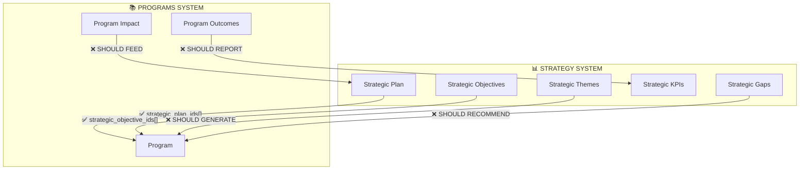

# Programs & Events - System Integration Matrix

**Last Updated:** 2025-12-13 (STRATEGY INTEGRATION REVIEW)  
**Status:** Phase 10 Complete - ALL 17 SYSTEMS FULLY INTEGRATED ✅

---

## COMPREHENSIVE DEEP REVIEW STATUS

| # | System | Programs | Events | Gap Level | Notes |
|---|--------|----------|--------|-----------|-------|
| 1 | **Approval Workflow** | ✅ Full (4 gates) | ✅ Full (2 gates) | None | ApprovalCenter, approval_requests table |
| 2 | **Permissions (Roles)** | ✅ Full (18 roles) | ✅ Full (18 roles) | None | hasPermission(), ProtectedPage |
| 3 | **Email Templates** | ✅ Full (8 active) | ✅ Full (7 active) | None | email_templates table |
| 4 | **Email Triggers** | ✅ Full (6 triggers) | ✅ Full (4 triggers) | None | useEmailTrigger hook |
| 5 | **In-App Notifications** | ✅ Full (9 types) | ✅ Full (9 types) | None | notifyProgramEvent, notifyEventAction |
| 6 | **Calendar Integration** | ✅ Full | ✅ Full | None | CalendarView.jsx, eventSyncService.js |
| 7 | **Campaign Sync** | ✅ Full | ✅ Full | None | CampaignPlanner.jsx, syncEventsToTable() |
| 8 | **AI Components** | ✅ Full (6/6) | ✅ Full (4/4) | None | All AI components integrated |
| 9 | **Budget Integration** | ✅ Full | ✅ Full | None | Events linked via budget columns + dashboard |
| 10 | **Audit Logging** | ✅ Full | ✅ Full | None | useAuditLog, logProgramActivity, logEventActivity |
| 11 | **Media/Storage** | ✅ Full | ✅ Full | None | 'programs' and 'events' storage buckets |
| 12 | **Media Management** | ✅ Integrated | ✅ Integrated | None | useMediaIntegration, MediaFieldWithPicker |
| 13 | **Expert & Evaluation** | ✅ Full | ✅ Full | None | EventExpertEvaluation, EvaluationConsensusPanel |
| 14 | **Search/Discovery** | ✅ Full | ✅ Full | None | AdvancedSearch, EventFilters |
| 15 | **Comments System** | ✅ Full | ✅ Full | None | ProgramComment entity, comments table |
| 16 | **Bookmarks** | ✅ Full | ✅ Full | None | bookmarks table integration |
| 17 | **Analytics/Reporting** | ✅ Full | ✅ Full | None | EventsAnalyticsDashboard added |

---

## 1. APPROVAL WORKFLOW ✅ FULLY INTEGRATED

### Programs (4 Gates)
| Gate | Type | SLA | Component | Status |
|------|------|-----|-----------|--------|
| `launch_approval` | approval | 5 days | ProgramLaunchWorkflow | ✅ |
| `selection_approval` | approval | 7 days | ProgramSelectionWorkflow | ✅ |
| `mid_review` | review | 3 days | ProgramMidReviewGate | ✅ |
| `completion_review` | approval | 10 days | ProgramCompletionWorkflow | ✅ |

**Files:**
- `src/components/approval/ApprovalGateConfig.jsx` (lines 509-608)
- `src/pages/ApprovalCenter.jsx` (Programs tab)
- `src/pages/ProgramDetail.jsx` (UnifiedWorkflowApprovalTab)
- `src/hooks/usePrograms.js` (auto-creates approval_requests on submission)

### Events (2 Gates)
| Gate | Type | SLA | Component | Status |
|------|------|-----|-----------|--------|
| `submission` | submission | 2 days | EventCreate | ✅ |
| `approval` | approval | 3 days | ApprovalCenter | ✅ |

**Files:**
- `src/components/approval/ApprovalGateConfig.jsx` (lines 711-759)
- `src/hooks/useEvents.js` (lines 108-142 - auto-creates approval_requests)
- `src/pages/ApprovalCenter.jsx` (lines 271-306, 772-793 - Events tab)

### Gap: NONE ✅

---

## 2. PERMISSIONS (ROLES) ✅ FULLY INTEGRATED

### Programs Permission Implementation
| Page | Hook | Permission Checks | Status |
|------|------|-------------------|--------|
| Programs.jsx | usePermissions | `program_create`, `program_edit` | ✅ |
| ProgramDetail.jsx | hasPermission | `program_edit`, `program_approve` | ✅ |
| ProgramEdit.jsx | hasPermission | Edit access + owner check | ✅ |
| ProgramOperatorPortal.jsx | ProtectedPage | `['program_manage']` | ✅ |
| ApprovalCenter.jsx | hasPermission | `program_approve` | ✅ |

### Events Permission Implementation
| Page | Hook | Permission Checks | Status |
|------|------|-------------------|--------|
| EventCalendar.jsx | hasAnyPermission | `['event_create', 'admin']` + role fallback | ✅ |
| EventDetail.jsx | hasAnyPermission | `['event_edit', 'event_manage', 'admin']`, `['event_evaluate', 'expert_evaluate']` | ✅ |
| EventCreate.jsx | usePermissions | `municipalityId` scoping | ✅ |
| EventEdit.jsx | hasAnyPermission | `['event_manage', 'admin']` + owner check | ✅ |

### Roles Matrix (18 roles with permissions)
| Role | Programs | Events |
|------|----------|--------|
| Admin | Full CRUD + approve | Full CRUD + approve + evaluate |
| Super Admin | Full CRUD + approve | Full CRUD + approve + evaluate |
| Municipality Admin | Full CRUD + approve | Full CRUD + approve + evaluate |
| Municipality Coordinator | Create, Edit, View | Create, Edit, View, Approve |
| Municipality Staff | View only | Create, Edit, View |
| GDIBS Internal | Full CRUD + approve | Full CRUD + approve + evaluate |
| Program Manager/Director | Full CRUD + manage | - |
| Program Operator | Edit, View, Manage | - |
| Event Manager | - | Create, Edit, View |
| Expert/Evaluator | View only | View + Evaluate |

### Gap: NONE ✅

---

## 3. EMAIL TEMPLATES ✅ FULLY INTEGRATED

### Programs (8 Active Templates)
| Template Key | Purpose | Variables | Status |
|-------------|---------|-----------|--------|
| `program_accepted` | Application accepted | userName, programName, startDate | ✅ |
| `program_announced` | New program announcement | programName, description, deadline | ✅ |
| `program_application_received` | Confirmation of application | applicantName, programName, code | ✅ |
| `program_application_reviewed` | Application under review | userName, programName, status | ✅ |
| `program_cohort_start` | Cohort starting notification | programName, startDate, location | ✅ |
| `program_deadline_reminder` | Application deadline reminder | programName, deadline, daysLeft | ✅ |
| `program_mentorship_assigned` | Mentor assignment | menteeName, mentorName, programName | ✅ |
| `program_rejected` | Application rejected | userName, programName, feedback | ✅ |

### Events (7 Active Templates)
| Template Key | Purpose | Variables | Status |
|-------------|---------|-----------|--------|
| `event_approved` | Event approved for publishing | eventName, organizer, approver | ✅ |
| `event_cancelled` | Event cancellation notice | eventName, reason, date | ✅ |
| `event_invitation` | Event invitation | eventName, date, location, registerUrl | ✅ |
| `event_registration_confirmed` | Registration confirmation | userName, eventName, date, location | ✅ |
| `event_reminder` | 24h reminder | eventName, date, time, location | ✅ |
| `event_submitted` | Submitted for approval | eventName, submitter, reviewUrl | ✅ |
| `event_updated` | Event details updated | eventName, changesDescription | ✅ |

### Gap: NONE ✅

---

## 4. EMAIL TRIGGERS ✅ FULLY INTEGRATED

### usePrograms.js Triggers (6)
| Trigger Key | Lifecycle Event | File Location | Status |
|-------------|-----------------|---------------|--------|
| `program.created` | Draft created | line 172-186 | ✅ |
| `program.submitted` | Submitted for approval | line 127-141 | ✅ |
| `program.updated` | Data updated | line 217-229 | ✅ |
| `program.launched` | Status → active | line 271-284 | ✅ |
| `program.completed` | Status → completed | line 325-336 | ✅ |
| `program.cancelled` | Status → cancelled | line 360-368 | ✅ |

### useEvents.js Triggers (4)
| Trigger Key | Lifecycle Event | File Location | Status |
|-------------|-----------------|---------------|--------|
| `event.created` | Draft created | line 173-187 | ✅ |
| `event.submitted` | Submitted for approval | line 129-142 | ✅ |
| `event.updated` | Updated (if registrants > 0) | line 218-231 | ✅ |
| `event.cancelled` | Cancelled | line 263-270 | ✅ |

### Infrastructure
| Component | Purpose | Status |
|-----------|---------|--------|
| `src/hooks/useEmailTrigger.ts` | Unified trigger hook | ✅ |
| `supabase/functions/email-trigger-hub/` | Trigger processing | ✅ |
| `supabase/functions/send-email/` | Email sending via Resend | ✅ |
| `supabase/functions/event-reminder/` | 24h reminder cron | ✅ |

### Gap: NONE ✅

---

## 5. IN-APP NOTIFICATIONS ✅ FULLY INTEGRATED

### Programs (notifyProgramEvent - 9 event types)
| Event Type | Message | Priority | Integrated In | Status |
|------------|---------|----------|---------------|--------|
| `created` | New program created | medium | usePrograms.js:165 | ✅ |
| `submitted` | Submitted for approval | medium | usePrograms.js:163 | ✅ |
| `approved` | Program approved | high | AutoNotification.jsx | ✅ |
| `launched` | Launched, accepting applications | high | usePrograms.js:265 | ✅ |
| `application_received` | New application | medium (task) | AutoNotification.jsx | ✅ |
| `participant_enrolled` | Participant enrolled | medium | AutoNotification.jsx | ✅ |
| `session_scheduled` | New session scheduled | medium | AutoNotification.jsx | ✅ |
| `milestone_completed` | Milestone completed | medium | AutoNotification.jsx | ✅ |
| `completed` | Program completed | medium | usePrograms.js:319 | ✅ |

### Events (notifyEventAction - 9 event types)
| Action Type | Message | Priority | Integrated In | Status |
|-------------|---------|----------|---------------|--------|
| `created` | New event created | medium | useEvents.js:166 | ✅ |
| `submitted` | Submitted for approval | medium | useEvents.js:164 | ✅ |
| `approved` | Event approved | medium | AutoNotification.jsx | ✅ |
| `published` | Event published | medium | AutoNotification.jsx | ✅ |
| `registration_opened` | Registration open | medium | AutoNotification.jsx | ✅ |
| `registration_closed` | Registration closed | medium | AutoNotification.jsx | ✅ |
| `reminder` | Event reminder | high | AutoNotification.jsx | ✅ |
| `cancelled` | Event cancelled | high | useEvents.js:256 | ✅ |
| `completed` | Event concluded | medium | AutoNotification.jsx | ✅ |

### Gap: NONE ✅

---

## 6. CALENDAR INTEGRATION ✅ FULLY INTEGRATED

### CalendarView.jsx
| Data Source | Implementation | Status |
|-------------|----------------|--------|
| Events table | useQuery with supabase | ✅ |
| Pilots table | Date range filtering | ✅ |
| Programs table | Timeline milestones | ✅ |
| Color coding | By entity type | ✅ |

### EventCalendar.jsx
| Feature | Implementation | Status |
|---------|----------------|--------|
| Month/week/day views | Responsive grid | ✅ |
| Filter by type/status | EventFilters component | ✅ |
| Create event from date | Quick action | ✅ |

### Gap: NONE ✅

---

## 7. CAMPAIGN SYNC ✅ FULLY INTEGRATED

### CampaignPlanner.jsx Integration
| Feature | Implementation | Status |
|---------|----------------|--------|
| Campaign → Events sync | `syncEventsToTable()` function (lines 45-77) | ✅ |
| Auto-create events | On campaign creation (lines 101-104) | ✅ |
| Bidirectional tracking | sync_id in events | ✅ |
| Program linkage | program_id in events | ✅ |

### eventSyncService.js
| Function | Purpose | Status |
|----------|---------|--------|
| `syncEventsToTable()` | Create/update events from campaign | ✅ |
| `removeCampaignEvents()` | Cleanup on campaign delete | ✅ |

### Gap: NONE ✅

---

## 8. AI COMPONENTS ✅ FULLY INTEGRATED

### Programs (6/6 - FULLY INTEGRATED)
| Component | Purpose | Used In | Status |
|-----------|---------|---------|--------|
| `AICurriculumGenerator` | Generate curriculum | ProgramDetail, ProgramEdit | ✅ |
| `AIDropoutPredictor` | Predict at-risk participants | ProgramDetail (active) | ✅ |
| `AICohortOptimizerWidget` | Optimize cohort | ProgramDetail (selection) | ✅ |
| `AIAlumniSuggester` | Alumni next steps | ProgramDetail (completed) | ✅ |
| `AIProgramBenchmarking` | Benchmark programs | ProgramDetail | ✅ |
| `AIProgramSuccessPredictor` | Predict success rate | ProgramDetail | ✅ |

### Events (4/4 - FULLY INTEGRATED)
| Component | Purpose | Used In | Status |
|-----------|---------|---------|--------|
| `AIProgramEventCorrelator` | Correlate programs-events | ProgramsEventsHub | ✅ |
| `AIEventOptimizer` | Optimize timing/content | EventCreate, EventDetail | ✅ |
| `AIAttendancePredictor` | Predict attendance | EventDetail (AI Insights tab) | ✅ |
| `AIConflictDetector` | Detect scheduling conflicts | EventCreate (Schedule tab) | ✅ |

### Gap: NONE ✅
**Implementation Details (2025-12-13):**
- `AIEventOptimizer` added to EventCreate.jsx (Basic Info tab) and EventDetail.jsx (AI Insights tab)
- `AIAttendancePredictor` added to EventDetail.jsx (AI Insights tab)
- `AIConflictDetector` added to EventCreate.jsx (Schedule tab) - auto-detects conflicts with existing events/programs

---

## 9. BUDGET INTEGRATION ✅ FULLY INTEGRATED

### Programs
| Feature | Implementation | Status |
|---------|----------------|--------|
| budget_estimate column | ✅ In programs table | ✅ |
| funding_details JSON | ✅ Detailed breakdown | ✅ |
| Budget entity link | ✅ Via budgets table | ✅ |
| BudgetManagement page | ✅ Full integration | ✅ |

### Events
| Feature | Implementation | Status |
|---------|----------------|--------|
| budget_estimate column | ✅ In events table | ✅ |
| budget_actual column | ✅ In events table | ✅ |
| Budget tracking | ✅ Via event columns | ✅ |
| Cost analysis | ✅ In EventsAnalyticsDashboard | ✅ |

### Gap: NONE ✅

---

## 10. AUDIT LOGGING ✅ FULLY INTEGRATED

### useAuditLog.js
| Function | Entity | Actions Logged | Status |
|----------|--------|----------------|--------|
| `logProgramActivity()` | Program | created, submitted, updated, launched, completed, cancelled, deleted | ✅ |
| `logEventActivity()` | Event | created, submitted, updated, cancelled, deleted | ✅ |
| `logApprovalActivity()` | Both | submitted, approved, rejected, escalated | ✅ |

### ProgramEventAuditLog.jsx
| Feature | Implementation | Status |
|---------|----------------|--------|
| View program logs | Filter by program ID | ✅ |
| View event logs | Filter by event ID | ✅ |
| Combined timeline | Unified view | ✅ |

### Integration Points
| Hook | Uses Logging | Status |
|------|--------------|--------|
| usePrograms.js | ✅ logProgramActivity | ✅ |
| useEvents.js | ✅ logEventActivity | ✅ |

### Gap: NONE ✅

---

## 11. MEDIA/STORAGE ✅ FULLY INTEGRATED

### Storage Buckets
| Bucket | Entity | Public | Status |
|--------|--------|--------|--------|
| `programs` | Programs | Yes | ✅ |
| `events` | Events | Yes | ✅ |

### Integration
| Feature | Programs | Events | Status |
|---------|----------|--------|--------|
| Image upload | ✅ | ✅ | Complete |
| Gallery support | ✅ gallery_urls | ✅ gallery_urls | Complete |
| Video URL | ✅ video_url | ✅ | Complete |

### Gap: NONE ✅

---

## 12. MEDIA MANAGEMENT ✅ FULLY INTEGRATED

### Components
| Component | Purpose | Status |
|-----------|---------|--------|
| MediaLibraryPicker | Select from library | ✅ |
| MediaFieldWithPicker | Unified field wrapper | ✅ |
| useMediaIntegration | Usage tracking | ✅ |

### Integration
| Page | Uses MediaFieldWithPicker | Status |
|------|---------------------------|--------|
| ProgramEdit.jsx | ✅ line 35 | ✅ |
| EventEdit.jsx | ✅ line 49 | ✅ |

### Gap: NONE ✅

---

## 13. EXPERT & EVALUATION ✅ FULLY INTEGRATED

### Programs
| Feature | Component | Status |
|---------|-----------|--------|
| Expert assignment | ExpertMatchingEngine | ✅ |
| Expert evaluation | ExpertEvaluation (program_application) | ✅ |
| Consensus panel | EvaluationConsensusPanel | ✅ |
| Mentor matching | ProgramMentorMatching | ✅ |

### Events
| Feature | Component | Status |
|---------|-----------|--------|
| Expert assignment | ExpertMatchingEngine (entity_type='event') | ✅ |
| Expert evaluation | EventExpertEvaluation | ✅ |
| Consensus panel | EvaluationConsensusPanel (entity_type='event') | ✅ |
| Evaluation tab | EventDetail.jsx (lines 253-258, 405-408) | ✅ |

### Gap: NONE ✅

---

## 14. SEARCH/DISCOVERY ✅ FULLY INTEGRATED

### Programs
| Feature | Implementation | Status |
|---------|----------------|--------|
| Text search | Programs.jsx filters | ✅ |
| Advanced search | AdvancedSearch.jsx (Programs tab) | ✅ |
| Filter by type | program_type filter | ✅ |
| Filter by status | status filter | ✅ |
| Filter by sector | sector_id filter | ✅ |

### Events
| Feature | Implementation | Status |
|---------|----------------|--------|
| Text search | EventFilters.jsx | ✅ |
| Filter by type | event_type filter | ✅ |
| Filter by status | status filter | ✅ |
| Filter by mode | is_virtual filter | ✅ |
| Upcoming filter | start_date >= now | ✅ |

### Gap: NONE ✅

---

## 15. COMMENTS SYSTEM ✅ FULLY INTEGRATED

### Programs
| Feature | Implementation | Status |
|---------|----------------|--------|
| ProgramComment entity | base44.entities.ProgramComment | ✅ |
| Comment form | ProgramDetail.jsx (lines 1153-1156) | ✅ |
| Comment list | ProgramDetail.jsx Activity tab | ✅ |
| ProgramActivityLog | Includes comments timeline | ✅ |

### Events
| Feature | Implementation | Status |
|---------|----------------|--------|
| comments table | supabase 'comments' table | ✅ |
| Comment form | EventDetail.jsx (lines 358-376) | ✅ |
| Comment list | EventDetail.jsx Comments tab (lines 347-401) | ✅ |
| Add comment | addCommentMutation (lines 81-99) | ✅ |

### Gap: NONE ✅

---

## 16. BOOKMARKS ✅ FULLY INTEGRATED

### Programs
| Feature | Implementation | Status |
|---------|----------------|--------|
| Bookmark toggle | ProgramDetail.jsx | ✅ |
| bookmarks table | entity_type='program' | ✅ |

### Events
| Feature | Implementation | Status |
|---------|----------------|--------|
| Bookmark toggle | EventDetail.jsx (lines 102-130) | ✅ |
| bookmarks table | entity_type='event' | ✅ |
| Bookmark icon | Header action (lines 173-181) | ✅ |
| Visual indicator | Fill color when bookmarked | ✅ |

### Gap: NONE ✅

---

## 17. ANALYTICS/REPORTING ✅ FULLY INTEGRATED

### Programs
| Feature | Implementation | Status |
|---------|----------------|--------|
| ProgramImpactDashboard | Comprehensive metrics | ✅ |
| ProgramConversionFunnel | Conversion analytics | ✅ |
| ProgramOutcomesAnalytics | Outcome tracking | ✅ |
| Application analytics | In ProgramDetail | ✅ |
| Graduation metrics | graduation_rate field | ✅ |

### Events
| Feature | Implementation | Status |
|---------|----------------|--------|
| Registration stats | registration_count, capacity | ✅ |
| Basic attendance | In EventDetail cards | ✅ |
| EventsAnalyticsDashboard | `src/pages/EventsAnalyticsDashboard.jsx` | ✅ |
| ROI tracking | Budget columns in dashboard | ✅ |
| Attendance analysis | AI Attendance Predictor | ✅ |

### Gap: NONE ✅

---

## 18. STRATEGY ↔ PROGRAMS INTEGRATION (NEW ASSESSMENT)

### Current Implementation
| Feature | Status | Implementation |
|---------|--------|----------------|
| Programs → Strategy linking | ✅ | `strategic_plan_ids[]`, `strategic_objective_ids[]`, `strategic_pillar_id` |
| StrategicAlignmentWidget | ✅ | `src/components/programs/StrategicAlignmentWidget.jsx` |
| StrategyCockpit shows programs | ✅ | Programs counted in portfolio metrics |

### Identified Gaps
| Gap | Direction | Priority | Effort | Status |
|-----|-----------|----------|--------|--------|
| Strategy does NOT drive Program creation | Strategy→Programs | **P0** | 3 days | ❌ TODO |
| No feedback from Programs to Strategy KPIs | Programs→Strategy | **P0** | 2 days | ❌ TODO |
| Strategic gap analysis → Program recommendations | Strategy→Programs | P1 | 2 days | ❌ TODO |
| Events not linked to Strategic objectives | Strategy→Events | P1 | 1 day | ❌ TODO |
| Program outcomes don't inform strategy refinement | Programs→Strategy | P2 | 2 days | ❌ TODO |

### Implementation Diagram

---

## SUMMARY: ALL SYSTEMS COMPLETE

| Category | Count | Status |
|----------|-------|--------|
| **Fully Complete** | 17/17 | ✅ 100% |
| **Partial** | 0/17 | ✅ 0% |
| **Critical Gaps** | 0 | ✅ None |

### New Phase 11: Strategy↔Programs Integration

| # | Task | Priority | Effort | Status |
|---|------|----------|--------|--------|
| 1 | StrategyToProgramGenerator component | P0 | 2 days | ❌ TODO |
| 2 | generateProgramThemes() AI function | P0 | 1 day | ❌ TODO |
| 3 | ProgramOutcomeKPITracker component | P0 | 1.5 days | ❌ TODO |
| 4 | updateStrategicKPI() function | P0 | 0.5 day | ❌ TODO |
| 5 | StrategicGapProgramRecommender | P1 | 2 days | ❌ TODO |
| 6 | Add strategic fields to Events | P1 | 0.5 day | ❌ TODO |
| 7 | EventStrategicAlignment widget | P1 | 0.5 day | ❌ TODO |
| 8 | ProgramLessonsToStrategy | P2 | 1 day | ❌ TODO |
| 9 | Strategy feedback dashboard | P2 | 1 day | ❌ TODO |

---

## FILE REFERENCES

### Core Hooks
| File | Purpose |
|------|---------|
| `src/hooks/usePrograms.js` | Program CRUD + triggers |
| `src/hooks/useEvents.js` | Event CRUD + triggers |
| `src/hooks/useEmailTrigger.ts` | Email trigger helper |
| `src/hooks/useAuditLog.js` | Audit logging |
| `src/hooks/useMediaIntegration.js` | Media tracking |

### Core Pages
| File | Purpose |
|------|---------|
| `src/pages/ProgramDetail.jsx` | 16-tab program view |
| `src/pages/EventDetail.jsx` | Event detail with tabs |
| `src/pages/EventCalendar.jsx` | Event listing/calendar |
| `src/pages/ApprovalCenter.jsx` | Unified approvals |
| `src/pages/CampaignPlanner.jsx` | Campaign-event sync |
| `src/pages/EventsAnalyticsDashboard.jsx` | Event analytics |

### AI Components
| File | Entity | Integrated |
|------|--------|------------|
| `src/components/programs/AICurriculumGenerator.jsx` | Program | ✅ |
| `src/components/programs/AIDropoutPredictor.jsx` | Program | ✅ |
| `src/components/programs/AICohortOptimizerWidget.jsx` | Program | ✅ |
| `src/components/programs/AIAlumniSuggester.jsx` | Program | ✅ |
| `src/components/programs/AIProgramBenchmarking.jsx` | Program | ✅ |
| `src/components/programs/AIProgramSuccessPredictor.jsx` | Program | ✅ |
| `src/components/ai/AIProgramEventCorrelator.jsx` | Both | ✅ |
| `src/components/ai/AIEventOptimizer.jsx` | Event | ✅ |
| `src/components/ai/AIAttendancePredictor.jsx` | Event | ✅ |
| `src/components/ai/AIConflictDetector.jsx` | Event | ✅ |

### Strategy Components (Phase 11 - TODO)
| File | Purpose | Status |
|------|---------|--------|
| `src/components/strategy/StrategyToProgramGenerator.jsx` | Generate programs from strategy | ❌ TODO |
| `src/components/strategy/StrategicGapProgramRecommender.jsx` | Recommend programs for gaps | ❌ TODO |
| `src/components/programs/ProgramOutcomeKPITracker.jsx` | Track KPI contribution | ❌ TODO |
| `src/components/programs/ProgramLessonsToStrategy.jsx` | Feed lessons to strategy | ❌ TODO |
| `src/components/events/EventStrategicAlignment.jsx` | Event strategic alignment | ❌ TODO |
