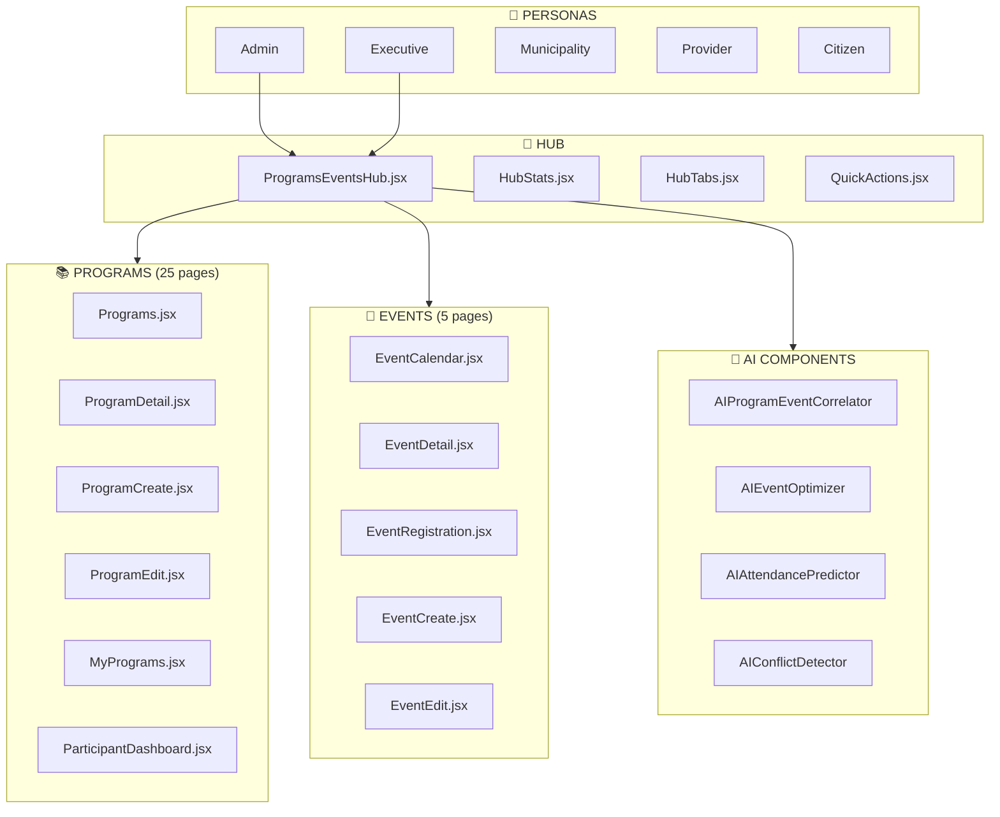
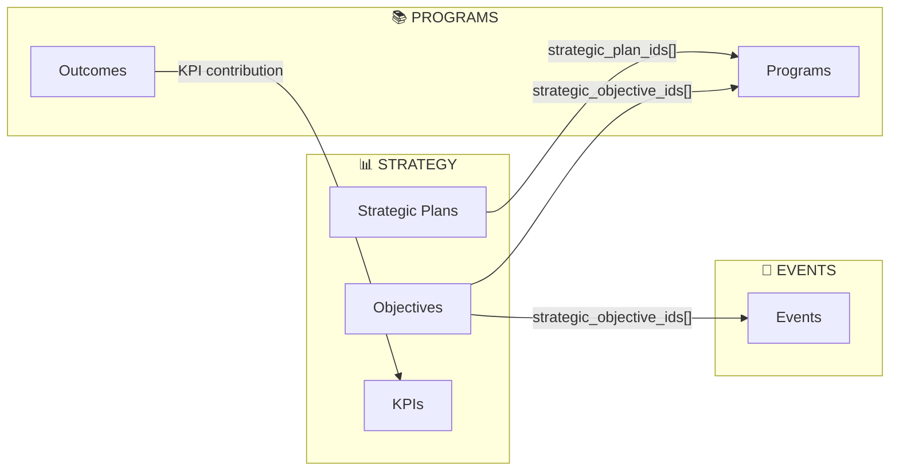
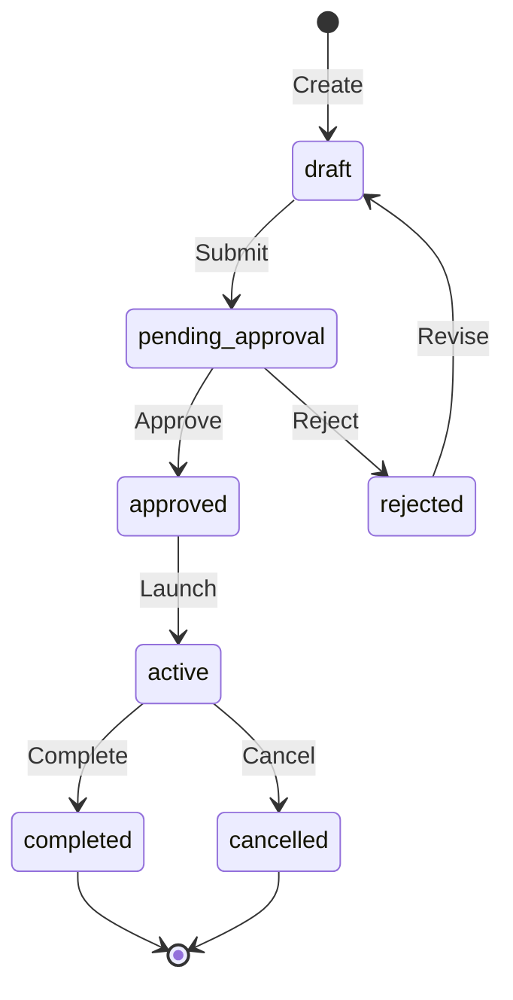
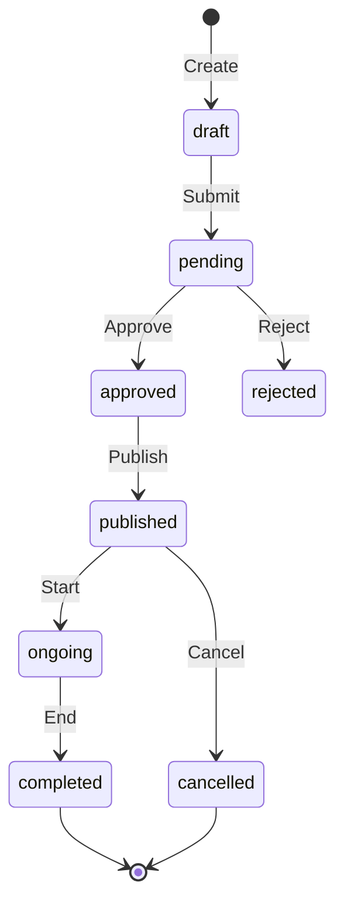

# Programs & Events Hub - Design Document

**Version:** 11.0  
**Last Updated:** 2025-12-13  
**Scope:** Architecture, data model, component structure, and system diagrams

---

## Table of Contents

1. [System Overview](#system-overview)
2. [Architecture Diagrams](#architecture-diagrams)
3. [Data Model](#data-model)
4. [Pages Inventory](#pages-inventory)
5. [Components Inventory](#components-inventory)
6. [Hooks Inventory](#hooks-inventory)
7. [Edge Functions](#edge-functions)
8. [Persona Access Matrix](#persona-access-matrix)

---

## System Overview

The Programs & Events Hub provides unified management for innovation programs, events, and campaigns with full lifecycle support, AI-powered insights, and bidirectional strategy integration.

### Core Entities

| Entity | Description | Primary Table |
|--------|-------------|---------------|
| **Program** | Innovation/training programs with cohorts | `programs` |
| **Event** | Standalone or program-linked events | `events` |
| **Campaign** | Marketing/outreach campaigns | `email_campaigns` |
| **Registration** | Event participant registrations | `event_registrations` |
| **Application** | Program applications | `program_applications` |

---

## Architecture Diagrams

### System Flow

### Strategy Integration Flow

### Program Lifecycle

### Event Lifecycle

---

## Data Model

### programs Table

| Column | Type | Description |
|--------|------|-------------|
| id | uuid | Primary key |
| title_en | text | English title |
| title_ar | text | Arabic title |
| description_en | text | English description |
| description_ar | text | Arabic description |
| status | text | draft, pending_approval, approved, active, completed, cancelled |
| program_type | text | innovation, training, incubation, acceleration, mentorship |
| start_date | timestamp | Program start date |
| end_date | timestamp | Program end date |
| application_deadline | timestamp | Application deadline |
| max_participants | integer | Maximum capacity |
| budget_estimate | numeric | Estimated budget |
| municipality_id | uuid | FK to municipalities |
| sector_id | uuid | FK to sectors |
| strategic_plan_ids | uuid[] | FK array to strategic_plans |
| strategic_objective_ids | uuid[] | FK array to strategic_objectives |
| strategic_pillar_id | uuid | FK to strategic_pillars |
| image_url | text | Cover image URL |
| gallery_urls | text[] | Gallery image URLs |
| video_url | text | Video URL |
| created_by | text | Creator email |
| created_at | timestamp | Creation timestamp |
| updated_at | timestamp | Last update timestamp |

### events Table

| Column | Type | Description |
|--------|------|-------------|
| id | uuid | Primary key |
| title_en | text | English title |
| title_ar | text | Arabic title |
| description_en | text | English description |
| description_ar | text | Arabic description |
| status | text | draft, pending, approved, published, ongoing, completed, cancelled |
| event_type | text | workshop, conference, webinar, meetup, hackathon |
| start_date | timestamp | Event start |
| end_date | timestamp | Event end |
| location | text | Physical location |
| is_virtual | boolean | Virtual event flag |
| virtual_link | text | Virtual meeting URL |
| max_attendees | integer | Maximum capacity |
| current_attendees | integer | Current registrations |
| registration_deadline | timestamp | Registration deadline |
| budget_estimate | numeric | Estimated budget |
| budget_actual | numeric | Actual spend |
| program_id | uuid | FK to programs (if linked) |
| municipality_id | uuid | FK to municipalities |
| strategic_plan_ids | uuid[] | FK array to strategic_plans |
| strategic_objective_ids | uuid[] | FK array to strategic_objectives |
| image_url | text | Cover image URL |
| gallery_urls | text[] | Gallery image URLs |
| created_by | text | Creator email |
| created_at | timestamp | Creation timestamp |
| updated_at | timestamp | Last update timestamp |

### event_registrations Table

| Column | Type | Description |
|--------|------|-------------|
| id | uuid | Primary key |
| event_id | uuid | FK to events |
| user_id | uuid | FK to auth.users |
| user_email | text | User email |
| status | text | registered, confirmed, cancelled, attended |
| registered_at | timestamp | Registration timestamp |
| attended | boolean | Attendance confirmation |
| feedback | text | Post-event feedback |
| rating | integer | Event rating (1-5) |

### program_applications Table

| Column | Type | Description |
|--------|------|-------------|
| id | uuid | Primary key |
| program_id | uuid | FK to programs |
| applicant_email | text | Applicant email |
| applicant_name | text | Applicant name |
| status | text | pending, under_review, accepted, rejected, waitlisted |
| application_data | jsonb | Form responses |
| submitted_at | timestamp | Submission timestamp |
| reviewed_by | text | Reviewer email |
| reviewed_at | timestamp | Review timestamp |
| score | numeric | Evaluation score |
| feedback | text | Reviewer feedback |

---

## Pages Inventory

### Program Pages (25)

| # | Page | Path | Purpose |
|---|------|------|---------|
| 1 | Programs.jsx | /programs | Main listing with filters |
| 2 | ProgramDetail.jsx | /programs/:id | Detail view with 16+ tabs |
| 3 | ProgramCreate.jsx | /programs/create | Creation wizard wrapper |
| 4 | ProgramEdit.jsx | /programs/:id/edit | Edit form |
| 5 | MyPrograms.jsx | /my-programs | User's program portfolio |
| 6 | ParticipantDashboard.jsx | /participant-dashboard | Participant progress |
| 7 | ProgramOperatorPortal.jsx | /program-operator | Operator tools |
| 8 | ProgramIdeaSubmission.jsx | /program-ideas | Innovation proposals |
| 9 | ProgramApplicationWizard.jsx | /programs/:id/apply | Application flow |
| 10 | ProgramApplicationDetail.jsx | /program-applications/:id | Application details |
| 11 | ProgramApplicationEvaluationHub.jsx | /program-evaluation | Evaluation queue |
| 12 | ProgramCohortManagement.jsx | /program-cohorts/:id | Cohort management |
| 13 | ProgramOutcomesAnalytics.jsx | /program-outcomes | Outcome metrics |
| 14 | ProgramImpactDashboard.jsx | /program-impact | Conversion funnel |
| 15 | ProgramPortfolioPlanner.jsx | /program-portfolio | Portfolio planning |
| 16 | ProgramROIDashboard.jsx | /program-roi | ROI calculations |
| 17 | ProgramFinancialROI.jsx | /program-financial-roi | Financial ROI |
| 18 | ProgramChallengeAlignment.jsx | /program-challenges | Challenge alignment |
| 19 | ProgramChallengeMatcher.jsx | /program-matcher | Challenge matching |
| 20 | ProgramCampaignHub.jsx | /program-campaigns | Campaign management |
| 21 | ProgramLaunchWizard.jsx | /program-launch/:id | Launch wizard |
| 22 | ProgramRDApprovalGates.jsx | /program-rd-gates | R&D approval gates |
| 23 | ProgramRDKnowledgeExchange.jsx | /program-rd-knowledge | R&D knowledge exchange |
| 24 | ProgramsCoverageReport.jsx | /programs-coverage | Coverage analysis |
| 25 | ProgramsControlDashboard.jsx | /programs-dashboard | Control dashboard |

### Event Pages (5)

| # | Page | Path | Purpose |
|---|------|------|---------|
| 1 | EventCalendar.jsx | /events | Event listing/calendar |
| 2 | EventDetail.jsx | /events/:id | Event detail view |
| 3 | EventRegistration.jsx | /events/:id/register | Registration form |
| 4 | EventCreate.jsx | /events/create | Create new event |
| 5 | EventEdit.jsx | /events/:id/edit | Edit event |

### Hub & Supporting Pages (6)

| # | Page | Path | Purpose |
|---|------|------|---------|
| 1 | ProgramsEventsHub.jsx | /programs-events-hub | Unified hub |
| 2 | CampaignPlanner.jsx | /campaign-planner | Campaign creation |
| 3 | CalendarView.jsx | /calendar | Unified calendar |
| 4 | CommunicationsHub.jsx | /communications | Email campaigns |
| 5 | ApprovalCenter.jsx | /approvals | Approval queue |
| 6 | StrategyFeedbackDashboard.jsx | /strategy-feedback | Strategy feedback |

---

## Components Inventory

### Program Components (37 in /src/components/programs/)

| # | Component | AI-Powered | Purpose |
|---|-----------|------------|---------|
| 1 | AICurriculumGenerator | ✅ | Generate curriculum |
| 2 | AIDropoutPredictor | ✅ | Predict at-risk participants |
| 3 | AICohortOptimizerWidget | ✅ | Optimize cohort composition |
| 4 | AIAlumniSuggester | ✅ | Alumni next steps |
| 5 | AIProgramBenchmarking | ✅ | Benchmark programs |
| 6 | AIProgramSuccessPredictor | ✅ | Predict success rate |
| 7 | AlumniImpactTracker | - | Track alumni impact |
| 8 | AlumniNetworkHub | - | Alumni networking |
| 9 | AttendanceTracker | - | Session attendance |
| 10 | AutomatedCertificateGenerator | - | Generate certificates |
| 11 | CohortManagement | - | Manage cohorts |
| 12 | DropoutPredictor | - | Dropout prediction |
| 13 | EnhancedProgressDashboard | - | Progress tracking |
| 14 | GraduationWorkflow | - | Graduation process |
| 15 | MentorMatchingEngine | - | Match mentors |
| 16 | MentorScheduler | - | Schedule mentorship |
| 17 | OnboardingWorkflow | - | Onboarding process |
| 18 | ParticipantAssignmentSystem | - | Assign participants |
| 19 | PeerCollaborationHub | - | Peer collaboration |
| 20 | PeerLearningNetwork | - | Peer learning |
| 21 | PostProgramFollowUp | - | Follow-up tracking |
| 22 | ProgramActivityLog | - | Activity logging |
| 23 | ProgramBenchmarking | - | Benchmarking |
| 24 | ProgramCreateWizard | - | Creation wizard |
| 25 | ProgramExpertEvaluation | - | Expert evaluation |
| 26 | ProgramToPilotWorkflow | - | Program→Pilot |
| 27 | ProgramToSolutionWorkflow | - | Program→Solution |
| 28 | ResourceLibrary | - | Resources |
| 29 | SessionScheduler | - | Session scheduling |
| 30 | StrategicAlignmentWidget | - | Strategy alignment |
| 31 | WaitlistManager | - | Waitlist management |
| 32 | ProgramOutcomeKPITracker | - | KPI tracking |
| 33 | ProgramLessonsToStrategy | - | Lessons feedback |

### Event Components (10 in /src/components/events/)

| # | Component | AI-Powered | Purpose |
|---|-----------|------------|---------|
| 1 | AIEventOptimizer | ✅ | Optimize timing/content |
| 2 | AIAttendancePredictor | ✅ | Predict attendance |
| 3 | AIConflictDetector | ✅ | Detect schedule conflicts |
| 4 | AIProgramEventCorrelator | ✅ | Program-event correlation |
| 5 | EventCard | - | Event card display |
| 6 | EventFilters | - | Filter controls |
| 7 | EventCancelDialog | - | Cancel confirmation |
| 8 | EventAttendeeList | - | Attendee listing |
| 9 | EventExpertEvaluation | - | Expert evaluation |
| 10 | EventStrategicAlignment | - | Strategy alignment |

### Hub Components (4 in /src/components/hub/)

| # | Component | Purpose |
|---|-----------|---------|
| 1 | ProgramsEventsHub | Main hub container |
| 2 | HubStats | Statistics display |
| 3 | HubTabs | Tab navigation |
| 4 | QuickActions | Quick action buttons |

---

## Hooks Inventory

| Hook | File | Purpose |
|------|------|---------|
| usePrograms | `src/hooks/usePrograms.js` | Program CRUD with triggers |
| useEvents | `src/hooks/useEvents.js` | Event CRUD with triggers |
| useEventRegistrations | `src/hooks/useEventRegistrations.js` | Registration management |
| useMediaIntegration | `src/hooks/useMediaIntegration.js` | Media usage tracking |
| useAuditLog | `src/hooks/useAuditLog.js` | Audit logging |
| useEmailTrigger | `src/hooks/useEmailTrigger.ts` | Email triggers |
| useStrategicKPI | `src/hooks/useStrategicKPI.js` | Strategic KPI updates |

---

## Edge Functions

| Function | Path | Purpose |
|----------|------|---------|
| event-reminder | `supabase/functions/event-reminder/` | 24h reminder cron |
| email-trigger-hub | `supabase/functions/email-trigger-hub/` | Trigger processing |
| send-email | `supabase/functions/send-email/` | Email sending via Resend |

---

## Persona Access Matrix

| Page | Admin | Executive | Municipality | Provider | Citizen |
|------|-------|-----------|--------------|----------|---------|
| Programs | ✅ Full | ✅ View | ✅ Scoped | ✅ Own | ✅ View |
| ProgramDetail | ✅ Full | ✅ View | ✅ Scoped | ✅ Own | ✅ View |
| ProgramCreate | ✅ | ✅ | ✅ | ✅ | ❌ |
| ProgramEdit | ✅ | ⚠️ | ⚠️ Owner | ⚠️ Owner | ❌ |
| MyPrograms | ✅ | ✅ | ✅ | ✅ | ✅ |
| ParticipantDashboard | ✅ | ❌ | ❌ | ✅ | ✅ |
| EventCalendar | ✅ | ✅ | ✅ | ✅ | ✅ |
| EventDetail | ✅ | ✅ | ✅ | ✅ | ✅ |
| EventCreate | ✅ | ✅ | ✅ | ❌ | ❌ |
| EventEdit | ✅ | ⚠️ | ⚠️ Owner | ❌ | ❌ |
| ProgramsEventsHub | ✅ | ✅ | ❌ | ❌ | ❌ |
| ApprovalCenter | ✅ | ✅ | ⚠️ | ❌ | ❌ |

**Legend:** ✅ Full access | ⚠️ Limited/scoped | ❌ No access
