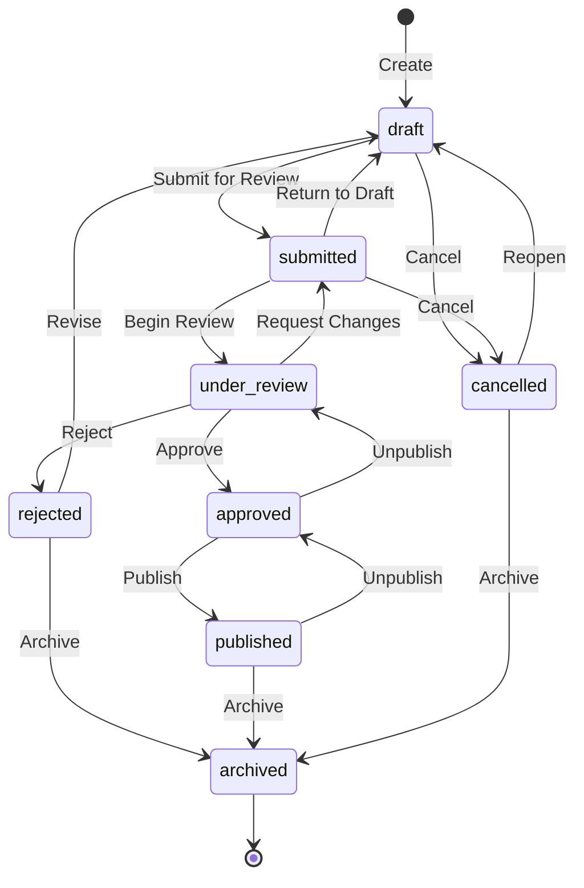
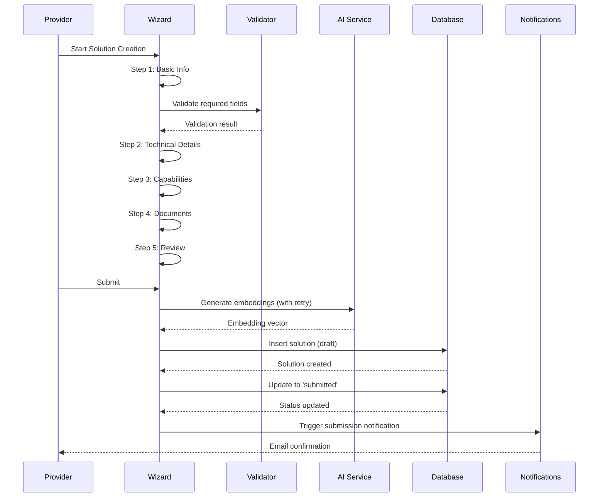
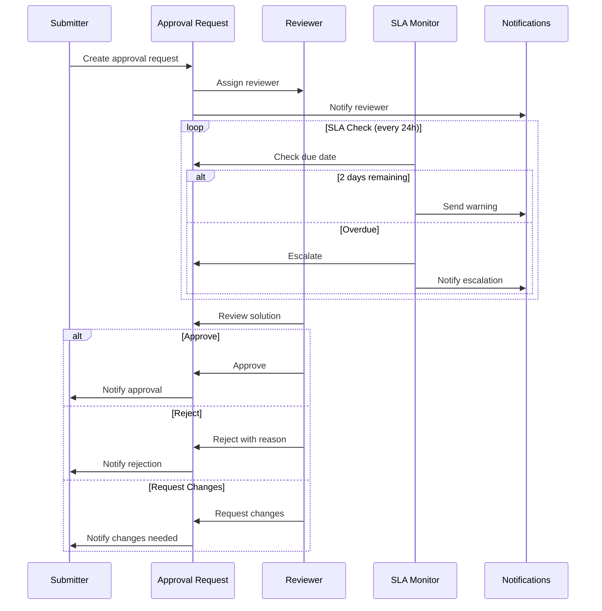
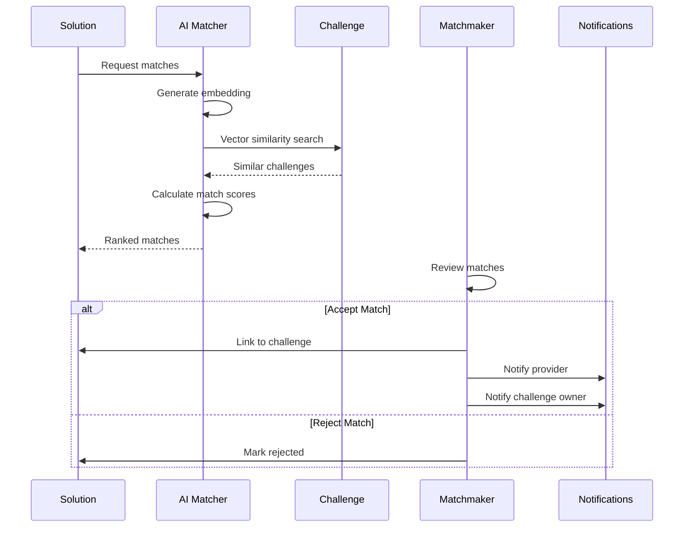
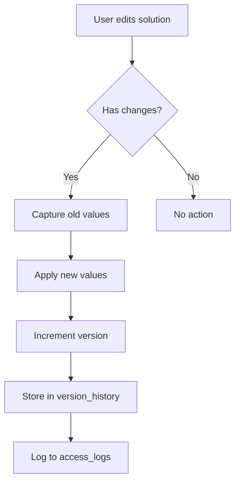
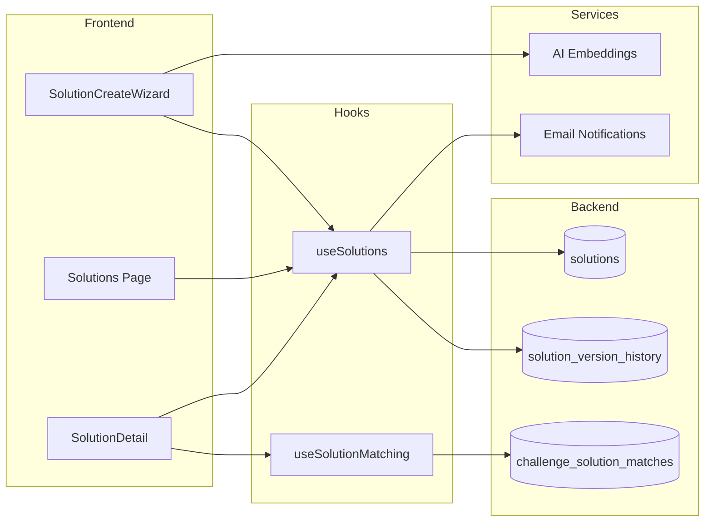

# Solutions Workflows

## Overview

Business workflow documentation for the Solutions system.

## Solution Lifecycle

## Submission Workflow

## Approval Workflow

## Matching Workflow

## Version Control

## Data Flow

## SLA Escalation

| Level | Trigger | Action |
|-------|---------|--------|
| 0 | Request created | Assign reviewer |
| 1 | 2 days before due | Warning notification |
| 2 | Due date passed | Escalate to manager |
| 3 | 3 days overdue | Escalate to admin |
| 4 | 7 days overdue | Auto-approve/reject |

## Audit Trail

All workflow actions are logged:

| Action | Logged Data |
|--------|-------------|
| Create | Full solution data |
| Update | Old/new values, changed fields |
| Stage change | Old/new stage, timestamp |
| Delete | Full solution data, reason |
| Match | Challenge ID, score, type |
| Approve/Reject | Reviewer, reason, timestamp |
