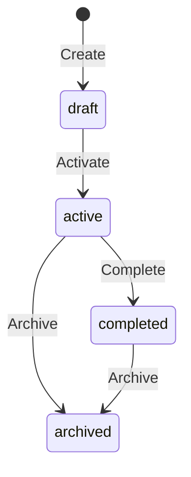
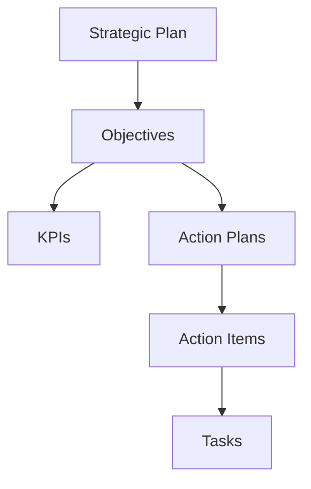

# Strategy Workflows

## Plan Lifecycle

## Objective Cascade

## Approval Flow

1. Plan created in draft
2. Submit for review
3. Stakeholder approval
4. Plan activation
5. Progress monitoring
6. Annual review
