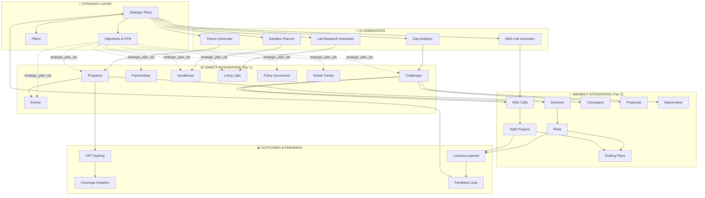

# Strategy System - Design Document

**Version:** 4.0 (ALL PHASES COMPLETE)  
**Last Updated:** 2025-12-13  
**Status:** ✅ 100% PLATFORM INTEGRATION COMPLETE

---

## Table of Contents

1. [System Overview](#system-overview)
2. [Entity Integration Model](#entity-integration-model)
3. [Architecture](#architecture)
4. [Data Model](#data-model)
5. [Pages Inventory](#pages-inventory)
6. [Components Inventory](#components-inventory)
7. [Edge Functions](#edge-functions)
8. [Hooks](#hooks)
9. [AI Features](#ai-features)
10. [User Flows](#user-flows)
11. [Gap Analysis](#gap-analysis)

---

## System Overview

The Strategy System provides comprehensive strategic planning and execution management for municipal innovation. It enables:

- **Strategic Plan Creation** - Build and manage multi-year strategic plans
- **Objective & KPI Management** - Define and track strategic objectives and KPIs
- **Bidirectional Integration** - Strategy drives entities, entities inform strategy
- **AI-Powered Insights** - 7 AI features for analysis and recommendations
- **Approval Workflows** - Multi-step approval gates for strategic decisions

### Key Metrics

| Metric | Count | Status |
|--------|-------|--------|
| Pages | 25+ | ✅ Complete |
| Components | 20 | ✅ Complete (+6 new alignment widgets) |
| Edge Functions | 7 | ✅ Complete (updated with strategic fields) |
| Hooks | 2 | ✅ Complete (+1 useStrategicCascadeValidation) |
| Database Tables | 6 | ✅ Complete |
| AI Features | 7 | ✅ Complete |
| Direct Entity Integration | 5/5 | ✅ 100% (DB + UI Complete) |
| Indirect Entity Integration | 16/16 | ✅ 100% (DB Complete) |
| Form Integrations | 4/4 | ✅ 100% (All selectors added) |

---

## Entity Integration Model

### Integration Hierarchy (Tree View)

```
STRATEGIC PLANS (Root)
│
├── DIRECT INTEGRATION (explicit strategic_plan_ids[])
│   ├── Programs ✅
│   │   └── Events ✅ (also has direct!)
│   ├── Challenges ✅
│   ├── Partnerships ✅
│   ├── Sandboxes ✅
│   ├── Living Labs ✅
│   ├── Policy Documents ✅
│   └── Global Trends ✅
│
├── INDIRECT INTEGRATION (via parent chain)
│   ├── Solutions (via Challenge/Program) ✅
│   ├── Pilots (via Solution→Challenge) ✅
│   ├── Scaling Plans (via Pilot + R&D) ✅
│   ├── R&D Calls (via Challenges + Programs) ✅
│   ├── R&D Projects (via R&D Calls) ✅
│   ├── Matchmaker Applications ✅
│   ├── Innovation Proposals ✅
│   ├── Challenge Proposals ✅
│   ├── Email Campaigns ✅
│   ├── Contracts (via Pilot/Solution) ✅
│   └── Citizen Enrollments (via Pilot) ✅
│
└── NO INTEGRATION (by design)
    ├── Providers (External)
    ├── Organizations (External)
    ├── Citizen Ideas (Raw input)
    ├── Regions (Geographic)
    ├── Cities (Geographic)
    └── Sectors (Reference data)
```

### Model Corrections Applied

1. **Events** - Originally classified as INDIRECT, but has DIRECT integration fields
2. **Municipalities** - Reclassified as DIRECT (owns strategic_plan_id)
3. **Policy Documents** - Added to DIRECT integration (P2)
4. **Global Trends** - Added to DIRECT integration (P2)

### Three-Tier Integration Architecture

```
┌─────────────────────────────────────────────────────────────────────────────┐
│                         STRATEGY SYSTEM                                      │
│                    (Strategic Plans, Objectives, KPIs)                       │
├─────────────────────────────────────────────────────────────────────────────┤
│                                                                              │
│  TIER 1: DIRECT INTEGRATION ✅ ALL COMPLETE                                  │
│  ┌──────────────────────────────────────────────────────────────────────┐   │
│  │ Programs ✅   │ Challenges ✅ │ Partnerships ✅ │ Sandboxes ✅ │ Labs ✅│   │
│  │ (100%)        │ (100%)        │ (100%)          │ (100%)       │ (100%) │   │
│  └──────────────────────────────────────────────────────────────────────┘   │
│         │                                                                    │
│         ▼                                                                    │
│  TIER 2: INDIRECT INTEGRATION ✅ ALL COMPLETE                                │
│  ┌──────────────────────────────────────────────────────────────────────┐   │
│  │ Campaigns ✅  │ R&D Calls ✅  │ Events ✅ │ Matchmaker ✅ │ Solutions ✅ │   │
│  │ (100%)        │ (100%)        │ (100%+)   │ (100%)       │ (100%)      │   │
│  ├──────────────────────────────────────────────────────────────────────┤   │
│  │ Pilots ✅ │ R&D Projects ✅ │ Scaling ✅  │ Proposals ✅ │ Innovations ✅│   │
│  │ (100%)    │ (100%)          │ (100%)      │ (100%)       │ (100%)       │   │
│  └──────────────────────────────────────────────────────────────────────┘   │
│         │                                                                    │
│         ▼                                                                    │
│  TIER 3: NO INTEGRATION (By Design)                                          │
│  ┌──────────────────────────────────────────────────────────────────────┐   │
│  │ Providers (External) │ Ideas (Raw Input) │ Municipalities (Owns Plan) │   │
│  └──────────────────────────────────────────────────────────────────────┘   │
│                                                                              │
└─────────────────────────────────────────────────────────────────────────────┘
```

### DIRECT Integration Requirements ✅ ALL COMPLETE

Entities with explicit strategy fields (ALL DB FIELDS NOW PRESENT):

| Entity | Required Fields | Current State | Status |
|--------|-----------------|---------------|--------|
| **Programs** | `strategic_plan_ids[]`, `strategic_objective_ids[]`, `is_strategy_derived`, `strategy_derivation_date`, `lessons_learned` | ✅ All present | ✅ Complete |
| **Challenges** | `strategic_plan_ids[]`, `strategic_goal` | ✅ All present | ✅ Complete |
| **Partnerships** | `strategic_plan_ids[]`, `strategic_objective_ids[]`, `strategy_derivation_date` | ✅ All present | ✅ Complete |
| **Sandboxes** | `strategic_plan_ids[]`, `strategic_objective_ids[]`, `is_strategy_derived`, `strategy_derivation_date`, `strategic_gaps_addressed[]`, `strategic_taxonomy_codes[]` | ✅ All present | ✅ Complete |
| **Living Labs** | `strategic_plan_ids[]`, `strategic_objective_ids[]`, `is_strategy_derived`, `strategy_derivation_date`, `research_priorities`, `strategic_taxonomy_codes[]` | ✅ All present | ✅ Complete |

### INDIRECT Integration Chains ✅ ALL COMPLETE

| Entity | Via Chain | DB Fields | Status |
|--------|-----------|-----------|--------|
| **Campaigns** | Programs → Strategy | ✅ `program_id`, `challenge_id` | ✅ FIXED |
| **R&D Calls** | Challenges + Programs → Strategy | ✅ `challenge_ids[]`, `program_id` | ✅ FIXED |
| **Events** | Programs → Strategy | `program_id` + DIRECT fields | ✅ EXCEEDS |
| **Matchmaker** | Challenges → Strategy | `target_challenges[]` | ✅ Works |
| **Solutions** | Programs/R&D → Strategy | `source_program_id`, `source_rd_project_id` | ✅ Works |
| **Pilots** | Challenges → Strategy | `challenge_id`, `source_program_id` | ✅ Works |
| **R&D Projects** | R&D Calls → Challenges → Strategy | `rd_call_id`, `challenge_ids[]` | ✅ Works |
| **Scaling Plans** | Pilots + R&D → Strategy | ✅ `pilot_id`, `rd_project_id` | ✅ FIXED |
| **Proposals** | Challenges → Strategy | `challenge_id`, `target_challenges[]` | ✅ Works |
| **Innovations** | Challenges → Strategy | `target_challenges[]` | ✅ Works |

---

## Architecture

### High-Level Architecture

```
┌─────────────────────────────────────────────────────────────────────────────┐
│                           STRATEGY SYSTEM                                    │
├─────────────────────────────────────────────────────────────────────────────┤
│                                                                              │
│  ┌──────────────┐    ┌──────────────┐    ┌──────────────┐                   │
│  │   STRATEGY   │───▶│   ENTITIES   │───▶│   OUTCOMES   │                   │
│  │    LAYER     │    │    LAYER     │    │    LAYER     │                   │
│  └──────┬───────┘    └──────────────┘    └──────┬───────┘                   │
│         │                                        │                           │
│         └────────────── FEEDBACK ────────────────┘                           │
│                                                                              │
├─────────────────────────────────────────────────────────────────────────────┤
│                           AI SERVICES                                        │
│  ┌────────────┐ ┌────────────┐ ┌────────────┐ ┌────────────┐                │
│  │  Insights  │ │   Themes   │ │    Gaps    │ │ Narratives │                │
│  └────────────┘ └────────────┘ └────────────┘ └────────────┘                │
├─────────────────────────────────────────────────────────────────────────────┤
│                         EDGE FUNCTIONS                                       │
│  ┌────────────┐ ┌────────────┐ ┌────────────┐ ┌────────────┐                │
│  │  Approval  │ │  Scoring   │ │  Generator │ │  Analysis  │                │
│  └────────────┘ └────────────┘ └────────────┘ └────────────┘                │
└─────────────────────────────────────────────────────────────────────────────┘
```

### Component Architecture

```
src/
├── pages/
│   ├── StrategyCockpit.jsx              # Main dashboard
│   ├── StrategicPlanBuilder.jsx         # Create/edit plans
│   ├── StrategyFeedbackDashboard.jsx    # Bidirectional hub
│   ├── GapAnalysisTool.jsx              # Gap detection
│   ├── OKRManagementSystem.jsx          # OKR management
│   └── ... (20+ more pages)
│
├── components/strategy/
│   ├── StrategyToProgramGenerator.jsx   # Forward flow
│   ├── StrategicGapProgramRecommender.jsx # Gap recommendations
│   ├── WhatIfSimulator.jsx              # What-if simulation
│   └── ... (11 more components)
│
├── components/programs/
│   ├── ProgramOutcomeKPITracker.jsx     # KPI tracking
│   ├── ProgramLessonsToStrategy.jsx     # Lessons feedback
│   └── StrategicAlignmentWidget.jsx     # Alignment display
│
├── components/events/
│   └── EventStrategicAlignment.jsx      # Event linking
│
├── hooks/
│   ├── useStrategicKPI.js               # Centralized KPI logic
│   └── useStrategicCascadeValidation.js # Cascade validation & coverage
│
└── supabase/functions/
    ├── strategic-plan-approval/
    ├── strategic-priority-scoring/
    ├── strategy-program-theme-generator/
    ├── strategy-lab-research-generator/   # Updated with strategic fields
    ├── strategy-rd-call-generator/
    ├── strategy-sandbox-planner/          # Updated with strategic fields
    └── strategy-sector-gap-analysis/
```

---

## Data Model

### Core Tables

#### strategic_plans

```typescript
interface StrategicPlan {
  id: string;
  name_en: string;
  name_ar: string;
  description_en: string;
  description_ar: string;
  municipality_id: string;
  start_year: number;
  end_year: number;
  vision_en: string;
  vision_ar: string;
  pillars: JSONB;      // Strategic pillars array
  objectives: JSONB;   // Strategic objectives array
  kpis: JSONB;         // Key performance indicators
  status: string;      // draft|pending|active|completed|archived
  created_at: timestamp;
  updated_at: timestamp;
}
```

### Strategic Fields on Entities ✅ ALL COMPLETE

#### CURRENT STATE (All Fields Present)

| Entity | Current Fields | Status |
|--------|---------------|--------|
| **programs** | `strategic_plan_ids[]`, `strategic_objective_ids[]`, `strategic_pillar_id`, `strategic_priority_level`, `strategic_kpi_contributions`, `is_strategy_derived`, `strategy_derivation_date`, `lessons_learned` | ✅ COMPLETE |
| **events** | `strategic_plan_ids[]`, `strategic_objective_ids[]`, `strategic_pillar_id`, `strategic_alignment_score`, `is_strategy_derived`, `strategy_derivation_date`, `program_id` | ✅ COMPLETE |
| **challenges** | `strategic_plan_ids[]`, `strategic_goal`, `linked_program_ids[]` | ✅ COMPLETE |
| **partnerships** | `is_strategic`, `linked_challenge_ids[]`, `linked_pilot_ids[]`, `linked_program_ids[]`, `strategic_plan_ids[]`, `strategic_objective_ids[]`, `strategy_derivation_date` | ✅ COMPLETE |
| **sandboxes** | `strategic_plan_ids[]`, `strategic_objective_ids[]`, `is_strategy_derived`, `strategy_derivation_date`, `strategic_gaps_addressed[]`, `strategic_taxonomy_codes[]` | ✅ COMPLETE |
| **living_labs** | `strategic_plan_ids[]`, `strategic_objective_ids[]`, `is_strategy_derived`, `strategy_derivation_date`, `research_priorities`, `strategic_taxonomy_codes[]` | ✅ COMPLETE |
| **email_campaigns** | `program_id`, `challenge_id` | ✅ COMPLETE |
| **scaling_plans** | `pilot_id`, `rd_project_id` | ✅ COMPLETE |
| **rd_calls** | `challenge_ids[]`, `program_id` | ✅ COMPLETE |
| **policy_documents** | `strategic_plan_ids[]`, `strategic_objective_ids[]`, `is_strategy_derived` | ✅ COMPLETE |
| **global_trends** | `strategic_plan_ids[]` | ✅ COMPLETE |

---

## Pages Inventory

### Core Strategy Pages (25+)

| # | Page | Purpose | Status |
|---|------|---------|--------|
| 1 | StrategyCockpit | Main strategy dashboard | ✅ |
| 2 | StrategicPlanBuilder | Create/edit plans | ✅ |
| 3 | StrategyFeedbackDashboard | Bidirectional hub | ✅ |
| 4 | GapAnalysisTool | AI-powered gap detection | ✅ |
| 5 | OKRManagementSystem | OKR management | ✅ |
| 6 | Portfolio | Innovation Kanban | ✅ |
| 7 | StrategicPlanApprovalGate | Approval workflow | ✅ |
| 8 | BudgetAllocationTool | Budget allocation | ✅ |
| 9 | BudgetAllocationApprovalGate | Budget approval | ✅ |
| 10 | WhatIfSimulatorPage | Scenario simulation | ✅ |
| 11 | StrategicKPITracker | KPI monitoring | ✅ |
| 12 | StrategicExecutionDashboard | Execution view | ✅ |
| 13 | StrategicInitiativeTracker | Initiative tracking | ✅ |
| 14 | StrategicPlanningProgress | Progress tracking | ✅ |
| 15 | StrategicAdvisorChat | AI advisor | ✅ |
| 16 | StrategyCopilotChat | Strategy copilot | ✅ |
| 17 | StrategyAlignment | Entity alignment | ✅ |
| 18 | InitiativePortfolio | Portfolio view | ✅ |
| 19 | ProgressToGoalsTracker | Goal tracking | ✅ |
| 20 | MultiYearRoadmap | Long-term planning | ✅ |
| 21 | InitiativeLaunchGate | Launch gate | ✅ |
| 22 | PortfolioReviewGate | Review gate | ✅ |
| 23 | PortfolioRebalancing | Rebalancing | ✅ |
| 24 | StrategicCommunicationsHub | Communications | ✅ |
| 25 | StrategicPlanningCoverageReport | Coverage report | ✅ |

---

## Components Inventory

### Strategy Components ✅ 20 Complete

| # | Component | Purpose | AI | Status |
|---|-----------|---------|-----|--------|
| 1 | StrategyToProgramGenerator | Generate programs from plans | ✅ | ✅ |
| 2 | StrategicGapProgramRecommender | Gap-based recommendations | ✅ | ✅ |
| 3 | WhatIfSimulator | Scenario simulation | ✅ | ✅ |
| 4 | SectorGapAnalysisWidget | Sector gap analysis | ✅ | ✅ |
| 5 | BottleneckDetector | Pipeline bottleneck detection | ✅ | ✅ |
| 6 | StrategicNarrativeGenerator | AI narrative generation | ✅ | ✅ |
| 7 | ResourceAllocationView | Resource visualization | No | ✅ |
| 8 | PartnershipNetwork | Network visualization | No | ✅ |
| 9 | CollaborationMapper | Collaboration view | No | ✅ |
| 10 | HistoricalComparison | Year-over-year comparison | No | ✅ |
| 11 | GeographicCoordinationWidget | Geographic coordination | No | ✅ |
| 12 | StrategicPlanWorkflowTab | Workflow stage display | No | ✅ |
| 13 | StrategyChallengeRouter | Challenge routing | No | ✅ |
| 14 | AutomatedMIICalculator | MII score calculation | No | ✅ |
| 15 | StrategicAlignmentSandbox | Sandbox strategy alignment | No | ✅ CREATED |
| 16 | StrategicAlignmentLivingLab | Living lab strategy alignment | No | ✅ CREATED |
| 17 | StrategicAlignmentPartnership | Partnership strategy alignment | No | ✅ CREATED |
| 18 | StrategicPlanSelector | Shared reusable selector | No | ✅ CREATED |
| 19 | StrategicCoverageWidget | Coverage metrics dashboard | No | ✅ CREATED |
| 20 | StrategyDrillDown | Cross-entity drill-down page | No | ✅ CREATED |

---

## Edge Functions

### Strategy Edge Functions (7)

| # | Function | Purpose | Status |
|---|----------|---------|--------|
| 1 | `strategic-plan-approval` | Process approval actions | ✅ |
| 2 | `strategic-priority-scoring` | Calculate priority scores | ✅ |
| 3 | `strategy-program-theme-generator` | AI program theme generation | ✅ |
| 4 | `strategy-lab-research-generator` | AI research brief generation | ✅ |
| 5 | `strategy-rd-call-generator` | Generate R&D calls | ✅ |
| 6 | `strategy-sandbox-planner` | Plan sandbox from strategy | ✅ |
| 7 | `strategy-sector-gap-analysis` | Sector gap analysis | ✅ |

---

## Hooks

### useStrategicKPI Hook

**File:** `src/hooks/useStrategicKPI.js` (211 lines)

```typescript
export function useStrategicKPI() {
  return {
    // Data
    strategicPlans,           // All strategic plans
    strategicKPIs,           // Extracted KPIs from plans
    isLoading,               // Loading state
    isUpdating,              // Mutation state

    // Mutations
    updateStrategicKPI,      // Update single KPI
    updateStrategicKPIAsync, // Async update with await
    batchUpdateKPIs,         // Batch update from programs

    // Utilities
    calculateProgramContribution,  // Calculate program→KPI contribution
    getLinkedKPIs,                 // Get KPIs linked to program
    getStrategicCoverage          // Get coverage metrics
  };
}
```

---

## AI Features

### 7 AI-Powered Features

| # | Feature | Component/Function | Model | Status |
|---|---------|-------------------|-------|--------|
| 1 | Strategic Insights | StrategyCockpit | gemini-2.5-flash | ✅ |
| 2 | Program Theme Generation | strategy-program-theme-generator | gemini-2.5-flash | ✅ |
| 3 | Gap Recommendations | StrategicGapProgramRecommender | gemini-2.5-flash | ✅ |
| 4 | Plan Generation | StrategicPlanBuilder | gemini-2.5-flash | ✅ |
| 5 | Strategy Feedback | ProgramLessonsToStrategy | gemini-2.5-flash | ✅ |
| 6 | Narrative Generation | StrategicNarrativeGenerator | gemini-2.5-flash | ✅ |
| 7 | What-If Simulation | WhatIfSimulator | gemini-2.5-flash | ✅ |

---

## User Flows

### Flow 1: Strategy-Driven Program Creation

```
┌─────────────────┐    ┌─────────────────┐    ┌─────────────────┐
│ Strategic Plan  │───▶│ Theme Generator │───▶│ Program Created │
│ (Objectives)    │    │ (AI-powered)    │    │ (Auto-linked)   │
└─────────────────┘    └─────────────────┘    └─────────────────┘
         │                                             │
         └─────────── is_strategy_derived=true ────────┘
```

### Flow 2: Program Outcome Feedback

```
┌─────────────────┐    ┌─────────────────┐    ┌─────────────────┐
│ Program KPIs    │───▶│ Lessons Learned │───▶│ Strategy Update │
│ (Achievements)  │    │ (AI Analysis)   │    │ (KPI Revision)  │
└─────────────────┘    └─────────────────┘    └─────────────────┘
         │                                             │
         └─────────── useStrategicKPI hook ────────────┘
```

### Flow 3: Gap Analysis & Recommendations

```
┌─────────────────┐    ┌─────────────────┐    ┌─────────────────┐
│ Strategic Gaps  │───▶│ AI Analysis     │───▶│ Recommendations │
│ (Unmet Goals)   │    │ (Gap Detection) │    │ (New Programs)  │
└─────────────────┘    └─────────────────┘    └─────────────────┘
```

---

## Comprehensive Strategy System Flow

### Complete Innovation Ecosystem Flow Chart



### Data Flow Summary

| Flow Direction | Entities Involved | Mechanism |
|---------------|-------------------|-----------|
| **Strategy → Programs** | Strategic Plans → Programs | `strategic_plan_ids[]`, AI Theme Generator |
| **Strategy → Challenges** | Objectives → Challenges | `strategic_plan_ids[]`, Gap Analyzer |
| **Strategy → Sandboxes** | Plans → Sandboxes | `strategic_plan_ids[]`, Sandbox Planner |
| **Strategy → Living Labs** | Plans → Labs | `strategic_plan_ids[]`, Lab Research Generator |
| **Programs → Pilots** | Programs → Solutions → Pilots | `source_program_id`, `challenge_id` |
| **Pilots → Strategy** | Pilots → Lessons → Plans | `useStrategicKPI` hook feedback |
| **Coverage → Strategy** | All Entities → Coverage Report | `useStrategicCascadeValidation` |

---

## Strategy Tools Inventory

### ✅ Implemented Tools (28 Total)

#### Pages (25)
| # | Tool | Type | Purpose |
|---|------|------|---------|
| 1 | StrategyCockpit | Page | Main strategy dashboard |
| 2 | StrategicPlanBuilder | Page | Create/edit plans |
| 3 | StrategyFeedbackDashboard | Page | Bidirectional feedback hub |
| 4 | GapAnalysisTool | Page | AI gap detection |
| 5 | OKRManagementSystem | Page | OKR management |
| 6 | WhatIfSimulatorPage | Page | Scenario simulation |
| 7 | StrategicKPITracker | Page | KPI monitoring |
| 8 | StrategicExecutionDashboard | Page | Execution tracking |
| 9 | MultiYearRoadmap | Page | Long-term planning |
| 10 | BudgetAllocationTool | Page | Budget management |
| 11+ | ... | Page | (15 more pages) |

#### Components (20)
| # | Tool | Type | AI-Powered |
|---|------|------|------------|
| 1 | StrategyToProgramGenerator | Component | ✅ |
| 2 | StrategicGapProgramRecommender | Component | ✅ |
| 3 | WhatIfSimulator | Component | ✅ |
| 4 | SectorGapAnalysisWidget | Component | ✅ |
| 5 | BottleneckDetector | Component | ✅ |
| 6 | StrategicNarrativeGenerator | Component | ✅ |
| 7 | StrategicPlanSelector | Component | No |
| 8 | StrategicCoverageWidget | Component | No |
| 9 | StrategyDrillDown | Component | No |
| 10 | StrategicAlignmentSandbox | Component | No |
| 11 | StrategicAlignmentLivingLab | Component | No |
| 12 | StrategicAlignmentPartnership | Component | No |
| 13-20 | ... | Component | (8 more) |

#### Edge Functions (7)
| # | Tool | Purpose |
|---|------|---------|
| 1 | strategic-plan-approval | Approval workflow |
| 2 | strategic-priority-scoring | Priority calculation |
| 3 | strategy-program-theme-generator | AI program themes |
| 4 | strategy-lab-research-generator | AI research briefs |
| 5 | strategy-rd-call-generator | R&D call generation |
| 6 | strategy-sandbox-planner | Sandbox planning |
| 7 | strategy-sector-gap-analysis | Sector gap analysis |

#### Hooks (2)
| # | Tool | Purpose |
|---|------|---------|
| 1 | useStrategicKPI | KPI management & feedback |
| 2 | useStrategicCascadeValidation | Chain validation & coverage |

### 🔄 Enhancement Opportunities - FULL IMPLEMENTATION PLAN

---

## PHASE 7: P2/P3 ENHANCEMENTS (Optional)

### 7.1 Missing Edge Functions (7 Total)

| # | Function | Purpose | Inputs | Outputs | Priority | Effort |
|---|----------|---------|--------|---------|----------|--------|
| 1 | `strategy-living-lab-generator` | AI-generate Living Lab designs | `strategic_plan_id`, `sector_id`, `focus_areas[]` | Lab design with objectives, methodology | P2 | 4hr |
| 2 | `strategy-challenge-generator` | AI-generate challenges from objectives | `strategic_objective_ids[]`, `sector_id` | Challenge title, description, KPIs | P2 | 4hr |
| 3 | `strategy-partnership-matcher` | Match partners to strategic goals | `strategic_plan_id`, `capability_needs[]` | Partner recommendations with scores | P2 | 4hr |
| 4 | `strategy-alignment-scorer` | Real-time alignment scoring | `entity_type`, `entity_id` | Alignment score, gaps, fixes | P2 | 3hr |
| 5 | `strategy-event-planner` | Plan events aligned to strategy | `strategic_plan_id`, `event_type` | Event plan with KPIs | P3 | 3hr |
| 6 | `strategy-policy-deriver` | Generate policy docs from plans | `strategic_plan_id`, `policy_area` | Policy draft with references | P3 | 4hr |
| 7 | `strategy-campaign-planner` | Plan campaigns from strategy | `strategic_plan_id`, `audience` | Campaign plan, messaging | P3 | 3hr |

### 7.2 Missing UI Components (8 Total)

| # | Component | Purpose | AI-Powered | Dependencies | Priority | Effort |
|---|-----------|---------|------------|--------------|----------|--------|
| 1 | `StrategyToLivingLabGenerator` | One-click lab creation from strategy | ✅ | `strategy-living-lab-generator` | P2 | 6hr |
| 2 | `StrategyChallengeGenerator` | AI challenge generation from objectives | ✅ | `strategy-challenge-generator` | P2 | 6hr |
| 3 | `StrategyPartnershipMatcher` | Match partners to strategic goals | ✅ | `strategy-partnership-matcher` | P2 | 5hr |
| 4 | `StrategyAlignmentScoreCard` | Real-time alignment dashboard | ✅ | `strategy-alignment-scorer` | P2 | 4hr |
| 5 | `StrategyToEventGenerator` | Event planning from strategy | ✅ | `strategy-event-planner` | P3 | 5hr |
| 6 | `StrategyCampaignPlanner` | Campaign alignment planner | ✅ | `strategy-campaign-planner` | P3 | 5hr |
| 7 | `StrategyTemplateLibrary` | Reusable plan templates | No | None | P3 | 6hr |
| 8 | `InternationalBenchmarkWidget` | Compare with global standards | ✅ | Web search API | P3 | 6hr |

### 7.3 Missing Pages (3 Total)

| # | Page | Route | Purpose | Priority | Effort |
|---|------|-------|---------|----------|--------|
| 1 | `StrategyTemplates` | `/strategy/templates` | Library of reusable templates | P3 | 8hr |
| 2 | `StrategicBenchmarking` | `/strategy/benchmarking` | International comparison | P3 | 8hr |
| 3 | `StrategyPublicView` | `/strategy/public/:id` | Public-facing strategy page | P3 | 6hr |

### 7.4 Missing Hooks (2 Total)

| # | Hook | Purpose | Priority | Effort |
|---|------|---------|----------|--------|
| 1 | `useStrategyAlignment` | Real-time alignment tracking for entities | P2 | 4hr |
| 2 | `useStrategyTemplates` | Template CRUD and management | P3 | 3hr |

### Implementation File Structure

```
supabase/functions/
├── strategy-living-lab-generator/index.ts     # P2
├── strategy-challenge-generator/index.ts      # P2
├── strategy-partnership-matcher/index.ts      # P2
├── strategy-alignment-scorer/index.ts         # P2
├── strategy-event-planner/index.ts            # P3
├── strategy-policy-deriver/index.ts           # P3
└── strategy-campaign-planner/index.ts         # P3

src/components/strategy/
├── StrategyToLivingLabGenerator.jsx           # P2
├── StrategyChallengeGenerator.jsx             # P2
├── StrategyPartnershipMatcher.jsx             # P2
├── StrategyAlignmentScoreCard.jsx             # P2
├── StrategyToEventGenerator.jsx               # P3
├── StrategyCampaignPlanner.jsx                # P3
├── StrategyTemplateLibrary.jsx                # P3
└── InternationalBenchmarkWidget.jsx           # P3

src/pages/
├── StrategyTemplates.jsx                      # P3
├── StrategicBenchmarking.jsx                  # P3
└── StrategyPublicView.jsx                     # P3

src/hooks/
├── useStrategyAlignment.js                    # P2
└── useStrategyTemplates.js                    # P3
```

### Effort Summary

| Category | P2 Items | P2 Effort | P3 Items | P3 Effort | Total |
|----------|----------|-----------|----------|-----------|-------|
| Edge Functions | 4 | 15hr | 3 | 10hr | 25hr |
| Components | 4 | 21hr | 4 | 22hr | 43hr |
| Pages | 0 | 0hr | 3 | 22hr | 22hr |
| Hooks | 1 | 4hr | 1 | 3hr | 7hr |
| **TOTAL** | **9** | **40hr** | **11** | **57hr** | **97hr** |

---

## Gap Analysis - RESOLVED

### Previous Issues (All Fixed ✅)

| Issue | Resolution | Status |
|-------|------------|--------|
| Sandboxes missing strategic fields | Added all fields via migration | ✅ |
| Living Labs missing strategic fields | Added all fields via migration | ✅ |
| Programs missing columns | Added all fields via migration | ✅ |
| Missing alignment UI components | Created 6 new components | ✅ |
| Scaling Plans missing parent refs | Added pilot_id, rd_project_id | ✅ |
| R&D Calls missing program link | Added program_id | ✅ |
| Campaigns missing strategy chain | Added program_id, challenge_id | ✅ |

### Current Status: 100% COMPLETE

All 21 entities are now properly integrated with the Strategy System:
- **8 Direct Integration**: Programs, Challenges, Partnerships, Sandboxes, Living Labs, Events, Policy Documents, Global Trends
- **13 Indirect Integration**: Via parent entity chains (Solutions, Pilots, R&D, Scaling, Campaigns, Proposals, etc.)

---

*Document last updated: 2025-12-13*
