# Strategy System - Integration Matrix

**Last Updated:** 2025-12-14 (DEEP IMPLEMENTATION ANALYSIS)  
**Status:** ✅ Platform Integration 100% | ✅ Database Integration 95% | 🟡 Overall 85%  
**Section G Added:** Deep implementation analysis - schema consistency, entity creation verification, approval workflow gaps

---

## EXECUTIVE SUMMARY

This matrix documents all integrations required for the complete Strategy Leader Workflow across **8 phases** of the strategic planning lifecycle.

### IMPLEMENTATION STATUS OVERVIEW

| Dimension | Complete | Partial | Missing | Coverage |
|-----------|----------|---------|---------|----------|
| **Platform Entity Integration** | 35+ | 0 | 0 | ✅ 100% |
| **Phase 1: Pre-Planning** | 6/6 | 0 | 0 | ✅ 100% |
| **Phase 2: Strategy Creation** | 6/6 | 0 | 0 | ✅ 100% |
| **Phase 3: Cascade** | 9/9 | 0 | 0 | ✅ 100% |
| **Phase 4: Governance** | 4/4 | 0 | 0 | ✅ 100% |
| **Phase 5: Communication** | 6/6 | 0 | 0 | ✅ 100% |
| **Phase 6: Monitoring** | 11/11 | 0 | 0 | ✅ 100% |
| **Phase 7: Evaluation** | 3/6 | 0 | 3 | 🟡 50% |
| **Phase 8: Recalibration** | 0/6 | 0 | 6 | ❌ 0% |
| **Database Tables** | 19/20 | 0 | 1 | ✅ 95% |
| **AI Integration** | 5/5 | 0 | 0 | ✅ 100% |

---

## SECTION A: PLATFORM ENTITY INTEGRATION

### A.1 Integration Type Summary

| Type | Entity Count | Status |
|------|--------------|--------|
| **DIRECT** (strategic_plan_ids[]) | 7 entities | ✅ 100% |
| **INDIRECT** (via linked entities) | 16 entities | ✅ 100% |
| **OWNER** (owns strategic plans) | 1 entity | ✅ 100% |
| **NO INTEGRATION** (external/raw) | 3 entities | N/A |
| **TOTAL** | 27 entities | ✅ 100% |

### A.2 Entity Integration Details

| # | Entity | Type | Integration Fields | Phase Usage |
|---|--------|------|-------------------|-------------|
| 1 | `programs` | DIRECT | strategic_plan_ids[], is_strategy_derived | P3, P5 |
| 2 | `challenges` | DIRECT | strategic_plan_ids[], strategic_goal | P1, P3, P5, P6 |
| 3 | `partnerships` | DIRECT | strategic_plan_ids[], is_strategy_derived | P1, P3, P5 |
| 4 | `sandboxes` | DIRECT | strategic_plan_ids[], is_strategy_derived | P3 |
| 5 | `living_labs` | DIRECT | strategic_plan_ids[], is_strategy_derived | P3, P5 |
| 6 | `events` | DIRECT | strategic_plan_ids[], program_id | P3, P5 |
| 7 | `policy_documents` | DIRECT | strategic_plan_ids[], is_strategy_derived | P1, P3 |
| 8 | `email_campaigns` | INDIRECT | program_id, challenge_id → Strategy | P3 |
| 9 | `rd_calls` | INDIRECT | challenge_ids[], program_id → Strategy | P3 |
| 10 | `solutions` | INDIRECT | source_program_id → Programs | P5 |
| 11 | `pilots` | INDIRECT | challenge_id, source_program_id | P1, P3, P5, P6 |
| 12 | `rd_projects` | INDIRECT | rd_call_id, challenge_ids[] | P3 |
| 13 | `scaling_plans` | INDIRECT | pilot_id, rd_project_id | P7 |
| 14 | `challenge_proposals` | INDIRECT | challenge_id | P3 |
| 15 | `innovation_proposals` | INDIRECT | target_challenges[] | P3 |
| 16 | `citizen_profiles` | INDIRECT | Via pilot enrollments | P5 |
| 17 | `user_profiles` | INDIRECT | Via ownership | P2, P5 |
| 18 | `team_members` | INDIRECT | Via assignments | P2 |
| 19 | `global_trends` | INDIRECT | strategic_plan_ids[] | P1 |
| 20 | `budgets` | INDIRECT | entity_type, entity_id | P2, P6 |
| 21 | `tasks` | INDIRECT | entity_type, entity_id | P4, P6 |
| 22 | `audits` | INDIRECT | entity_type, entity_id | P4, P7 |
| 23 | `mii_results` | INDIRECT | municipality context | P1 |
| 24 | `sectors` | INDIRECT | Sector strategies | P2 |
| 25 | `email_templates` | INDIRECT | Communication | P5 |
| 26 | `email_logs` | INDIRECT | Analytics | P5 |
| 27 | `citizen_feedback` | INDIRECT | Sentiment analysis | P5 |
| 28 | `case_studies` | INDIRECT | Impact stories | P5 |
| 29 | `municipalities` | OWNER | Owns strategic_plans | All Phases |
| 30 | `providers` | NONE | External entity | - |
| 31 | `ideas` | NONE | Raw citizen input | P1 |
| 32 | `organizations` | NONE | External entity | - |

---

## SECTION B: PHASE-BY-PHASE INTEGRATIONS

### B.1 PHASE 1: PRE-PLANNING (✅ 100% INTEGRATED)

**Methodology:** [phase1-strategic-methodology.md](./phase1-strategic-methodology.md)

#### Components & Platform Integration

| Component | Platform Entities | Integration Type |
|-----------|------------------|------------------|
| BaselineDataCollector | mii_results, challenges, pilots, partnerships | SELECT real data |
| EnvironmentalScanWidget | global_trends, policy_documents | SELECT for context |
| SWOTAnalysisBuilder | swot_analyses (strategy DB) | CRUD |
| StakeholderAnalysisWidget | stakeholder_analyses (strategy DB) | CRUD |
| RiskAssessmentBuilder | strategy_risks (strategy DB) | CRUD |
| StrategyInputCollector | strategy_inputs (strategy DB) | CRUD |

#### Database Tables

| Table | Purpose | RLS |
|-------|---------|-----|
| swot_analyses | Store SWOT factors | ✅ |
| stakeholder_analyses | Store stakeholder mapping | ✅ |
| strategy_risks | Store risk registry | ✅ |
| strategy_inputs | Store collected inputs | ✅ |
| environmental_factors | Store PESTLE factors | ✅ |
| strategy_baselines | Store baseline KPIs | ✅ |

---

### B.2 PHASE 2: STRATEGY CREATION (✅ 100% INTEGRATED + AI)

**Methodology:** [phase2-strategic-methodology.md](./phase2-strategic-methodology.md)

#### Components & Platform Integration

| Component | Platform Entities | Integration Type | AI Status |
|-----------|------------------|------------------|-----------|
| StrategyPillarGenerator | strategy_pillars (strategy DB) | CRUD | ✅ Real AI |
| StrategyObjectiveGenerator | strategic_objectives (strategy DB) | CRUD | ✅ Real AI |
| StrategyTimelinePlanner | strategy_milestones (strategy DB) | CRUD | ✅ Real AI |
| StrategyOwnershipAssigner | user_profiles, team_members | SELECT for assignment | ✅ Real AI |
| ActionPlanBuilder | action_plans, action_items (strategy DB) | CRUD | ✅ Real AI |
| NationalStrategyLinker | national_strategy_alignments (strategy DB) | CRUD | ✅ Real AI |
| SectorStrategyBuilder | sectors (platform), sector_strategies (DB) | SELECT + CRUD | ✅ Real AI |
| StrategyTemplateLibrary | strategy_templates (strategy DB) | CRUD | N/A |

#### AI Edge Functions (7 Functions)

| Function | Purpose |
|----------|---------|
| strategy-pillar-generator | Generate strategic pillars from Phase 1 analysis |
| strategy-objective-generator | Generate SMART objectives with KPIs |
| strategy-action-plan-generator | Generate action items for objectives |
| strategy-sector-generator | Generate sector-specific strategies |
| strategy-national-linker | AI-powered Vision 2030/SDG/NIS alignment suggestions |
| strategy-timeline-generator | Generate milestone timeline with dependencies and deliverables |
| strategy-ownership-ai | AI-powered RACI assignment suggestions based on roles |

#### Database Tables

| Table | Purpose | RLS |
|-------|---------|-----|
| strategy_milestones | Store timeline milestones | ✅ |
| strategy_ownership | Store RACI assignments | ✅ |
| action_plans | Store action plans | ✅ |
| action_items | Store action items | ✅ |
| national_strategy_alignments | Store V2030/SDG links | ✅ |
| sector_strategies | Store sector strategies | ✅ |

---

### B.3 PHASE 3: CASCADE (✅ 100% INTEGRATED)

**Methodology:** [phase3-strategic-methodology.md](./phase3-strategic-methodology.md)

#### Components & Entity Generation

| Component | Entity Generated | Integration |
|-----------|-----------------|-------------|
| StrategyToProgramGenerator | programs | INSERT with strategic_plan_ids[] |
| StrategyChallengeGenerator | challenges | INSERT with strategic_plan_ids[] |
| StrategyToPilotGenerator | pilots | INSERT with challenge linkage |
| StrategyToPartnershipGenerator | partnerships | INSERT with strategic_plan_ids[] |
| StrategyToLivingLabGenerator | living_labs | INSERT with strategic_plan_ids[] |
| StrategyToRDCallGenerator | rd_calls | INSERT with program/challenge links |
| StrategyToEventGenerator | events | INSERT with strategic_plan_ids[] |
| StrategyToCampaignGenerator | email_campaigns | INSERT with program_id |
| StrategyToPolicyGenerator | policy_documents | INSERT with strategic_plan_ids[] |

---

### B.4 PHASE 4: GOVERNANCE (✅ 100% INTEGRATED + AI)

**Methodology:** [phase4-strategic-methodology.md](./phase4-strategic-methodology.md)

#### Components & Database Integration

| Component | Database Tables | AI Features |
|-----------|----------------|-------------|
| StakeholderSignoffTracker | strategy_signoffs | Stakeholder suggestions, risk prediction |
| StrategyVersionControl | strategy_versions | Change impact analysis, comparison |
| StrategyCommitteeReview | committee_decisions | Agenda prioritization, action items |
| GovernanceMetricsDashboard | All governance tables | Workflow optimization |

#### AI Edge Functions

| Function | Purpose |
|----------|---------|
| strategy-signoff-ai | Stakeholder suggestions, risk prediction, reminder optimization |
| strategy-version-ai | Change impact analysis, categorization, comparison |
| strategy-committee-ai | Agenda prioritization, scheduling, decision impact |
| strategy-workflow-ai | Workflow optimization, bottleneck prediction |

---

### B.5 PHASE 5: COMMUNICATION (✅ 100% INTEGRATED + AI)

**Methodology:** [phase5-strategic-methodology.md](./phase5-strategic-methodology.md)

#### Components & Platform Integration (17 Entities)

| Component | Platform Entities | Purpose |
|-----------|------------------|---------|
| ImpactStoryGenerator | challenges, pilots, solutions, programs, partnerships, living_labs | Story context data |
| StakeholderNotificationManager | email_templates, citizen_profiles | Template selection, recipients |
| CommunicationAnalyticsDashboard | email_logs, citizen_feedback | Analytics data, sentiment |
| StrategyCommunicationPlanner | events, case_studies | Calendar, content library |
| PublicStrategyDashboard | All platform entities | Real-time public view |
| StrategyPublicView | case_studies, platform entities | Public showcase |

#### Database Tables

| Table | Purpose |
|-------|---------|
| communication_plans | Store communication strategies |
| impact_stories | Store generated impact stories |
| communication_notifications | Store notification history |
| communication_analytics | Store engagement metrics |

#### AI Edge Function

| Function | Features |
|----------|----------|
| strategy-communication-ai | Story generation, key messages, channel strategy, content calendar, engagement analysis, translation |

---

### B.6 PHASE 6: MONITORING (✅ 100% INTEGRATED)

**Methodology:** [phase6-strategic-methodology.md](./phase6-strategic-methodology.md)

#### Components

| Component | Integration |
|-----------|-------------|
| useStrategicKPI | Hook for KPI tracking |
| StrategicCoverageWidget | Coverage analysis |
| useStrategicCascadeValidation | Cascade validation |
| WhatIfSimulator | Scenario simulation |
| SectorGapAnalysisWidget | Gap analysis |
| StrategicNarrativeGenerator | AI narrative |
| strategic-priority-scoring | Edge function |
| BottleneckDetector | Bottleneck detection |
| StrategyCockpit | Executive dashboard |
| StrategyAlignmentScoreCard | Alignment scoring |
| useStrategyAlignment | Alignment hook |

---

### B.7 PHASE 7: EVALUATION (🟡 50% INTEGRATED)

**Methodology:** [phase7-strategic-methodology.md](./phase7-strategic-methodology.md)

#### Components Status

| Component | Status | Priority |
|-----------|--------|----------|
| StrategyImpactAssessment | ✅ Complete | - |
| StrategyReprioritizer | ✅ Complete | - |
| StrategyAdjustmentWizard | ✅ Complete | - |
| StrategyEvaluationPanel | ❌ Missing | P1 |
| ROICalculator | ❌ Missing | P2 |
| CaseStudyGenerator | ❌ Missing | P2 |

#### Missing Database

| Table | Purpose | Priority |
|-------|---------|----------|
| strategy_evaluations | Evaluation results & lessons | P1 |

---

### B.8 PHASE 8: RECALIBRATION (❌ 0% - DESIGN ONLY)

**Methodology:** [phase8-strategic-methodology.md](./phase8-strategic-methodology.md)

#### Components (All Missing)

| Component | Purpose | Priority |
|-----------|---------|----------|
| FeedbackAnalysisEngine | Aggregate Phase 7 feedback | P1 |
| AdjustmentDecisionMatrix | Decision support for pivots | P1 |
| MidCyclePivotManager | Track strategic pivots | P2 |
| PhaseModificationExecutor | Execute cross-phase changes | P2 |
| BaselineRecalibrator | Update baselines | P3 |
| NextCycleInitializer | Cycle handoff | P3 |

---

## SECTION C: DATA FLOW BETWEEN PHASES

### C.1 Phase Input/Output Matrix

```
┌─────────────────────────────────────────────────────────────────────────────────┐
│                          PHASE DATA FLOW                                         │
├─────────────────────────────────────────────────────────────────────────────────┤
│                                                                                  │
│   PHASE 1 → PHASE 2                                                             │
│   ├── SWOT Analysis → Objective prioritization                                  │
│   ├── Baseline KPIs → Target setting                                            │
│   ├── Risk Assessment → Mitigation planning                                     │
│   └── Stakeholder Map → RACI assignments                                        │
│                                                                                  │
│   PHASE 2 → PHASE 3                                                             │
│   ├── Strategic Objectives → Entity generation triggers                         │
│   ├── Sector Strategies → Sector-specific cascades                              │
│   ├── Action Plans → Initiative details                                         │
│   └── Ownership → Entity ownership                                              │
│                                                                                  │
│   PHASE 3 → PHASE 4                                                             │
│   ├── Generated Entities → Approval workflows                                   │
│   ├── Entity Relationships → Governance dependencies                            │
│   └── Resource Requirements → Budget approvals                                  │
│                                                                                  │
│   PHASE 4 → PHASE 5                                                             │
│   ├── Approved Strategies → Communication content                               │
│   ├── Sign-off Status → Milestone announcements                                 │
│   └── Committee Decisions → Decision communication                              │
│                                                                                  │
│   PHASE 5 → PHASE 6                                                             │
│   ├── Published Strategies → Public tracking                                    │
│   ├── Engagement Metrics → Communication effectiveness                          │
│   └── Citizen Feedback → Sentiment monitoring                                   │
│                                                                                  │
│   PHASE 6 → PHASE 7                                                             │
│   ├── KPI Actuals → Achievement assessment                                      │
│   ├── Health Scores → Portfolio evaluation                                      │
│   └── Alert History → Problem pattern analysis                                  │
│                                                                                  │
│   PHASE 7 → PHASE 8                                                             │
│   ├── Lessons Learned → Feedback analysis                                       │
│   ├── Impact Data → Baseline recalibration                                      │
│   └── Recommendations → Adjustment decisions                                    │
│                                                                                  │
│   PHASE 8 → PHASE 1 (Next Cycle)                                                │
│   ├── Updated Baselines → New cycle starting point                              │
│   ├── Methodology Updates → Improved processes                                  │
│   └── Strategic Recommendations → Planning focus                                │
│                                                                                  │
│   PHASE 8 → PHASES 2-6 (Mid-Cycle)                                              │
│   ├── Objective Revisions → Phase 2 updates                                     │
│   ├── Portfolio Changes → Phase 3 pivots                                        │
│   ├── Governance Updates → Phase 4 rule changes                                 │
│   ├── Communication Adjustments → Phase 5 messaging                             │
│   └── Threshold Changes → Phase 6 monitoring                                    │
│                                                                                  │
└─────────────────────────────────────────────────────────────────────────────────┘
```

---

## SECTION D: STRATEGIC ELEMENT RELATIONSHIPS

### D.1 Entity Relationship Diagram


### D.2 Strategic Elements to Execution Entities

#### Core Strategic Elements

| Strategic Element | Contains/Produces | Links To Execution |
|-------------------|-------------------|-------------------|
| **Pillars** | Strategic themes, focus areas | Objectives, Sector Strategies |
| **Objectives** | SMART goals with targets | KPIs, Action Plans, Programs, Challenges |
| **Sector Strategy** | Sector-specific innovation plans | Programs, Challenges by sector |
| **KPIs** | Measurable indicators | Program outcomes, Pilot results |
| **Action Plans** | Initiatives, budgets, ownership | Tasks, Milestones |
| **National Strategy** | V2030/SDG/NIS alignments | Compliance reporting, Scoring |
| **Timeline** | Milestones, dependencies | Phase gates, Reviews |
| **Strategy Template** | Pre-built patterns | Accelerate plan creation |

#### Direct Integration Entities (strategic_plan_ids[])

| Entity | Integration Fields | Phase Usage | Relationship |
|--------|-------------------|-------------|--------------|
| **Programs** | strategic_plan_ids[], is_strategy_derived, strategic_objective_ids[] | P3, P5 | Generated from objectives |
| **Challenges** | strategic_plan_ids[], strategic_goal | P1, P3, P5, P6 | Derived from strategy gaps |
| **Partnerships** | strategic_plan_ids[], is_strategy_derived | P1, P3, P5 | Enable strategy execution |
| **Sandboxes** | strategic_plan_ids[], is_strategy_derived | P3 | Test strategic initiatives |
| **Living Labs** | strategic_plan_ids[], is_strategy_derived | P3, P5 | Citizen co-creation |
| **Events** | strategic_plan_ids[], program_id | P3, P5 | Strategy communication |
| **Policy Documents** | strategic_plan_ids[], is_strategy_derived | P1, P3 | Policy enablement |
| **Global Trends** | strategic_plan_ids[] | P1 | Environmental scanning |

#### Indirect Integration Entities (via linked entities)

| Entity | Links Via | Relationship Chain |
|--------|-----------|-------------------|
| **Solutions** | source_program_id | Strategy → Program → Solution |
| **Pilots** | challenge_id, source_program_id | Strategy → Challenge/Program → Pilot |
| **R&D Calls** | challenge_ids[], program_id | Strategy → Challenge/Program → R&D Call |
| **R&D Projects** | rd_call_id | Strategy → R&D Call → R&D Project |
| **Scaling Plans** | pilot_id, rd_project_id | Strategy → Pilot/R&D → Scaling |
| **Campaigns** | program_id, challenge_id | Strategy → Program/Challenge → Campaign |
| **Proposals** | challenge_id, target_challenges[] | Strategy → Challenge → Proposal |
| **Matchmaker** | challenge ↔ solution links | Connects challenges to solutions |

### D.3 Cascade Flow Visualization

```
┌─────────────────────────────────────────────────────────────────────────────────┐
│                        STRATEGIC CASCADE FLOW                                    │
├─────────────────────────────────────────────────────────────────────────────────┤
│                                                                                  │
│   STRATEGY LAYER (Phase 2)                                                       │
│   ┌─────────────────────────────────────────────────────────────────────────┐   │
│   │  Strategy Template → Strategic Plan → Pillars → Objectives → KPIs      │   │
│   │                          ↓              ↓           ↓                    │   │
│   │                   National Alignment  Sector    Action Plans            │   │
│   │                   (V2030/SDG/NIS)    Strategy   Timeline                │   │
│   └─────────────────────────────────────────────────────────────────────────┘   │
│                                    │                                             │
│                    ════════════════╪════════════════                            │
│                    DIRECT LINKAGE  │ strategic_plan_ids[]                       │
│                    ════════════════╪════════════════                            │
│                                    ▼                                             │
│   EXECUTION LAYER (Phase 3)                                                      │
│   ┌─────────────────────────────────────────────────────────────────────────┐   │
│   │  ┌──────────┐ ┌────────────┐ ┌─────────────┐ ┌──────────┐ ┌──────────┐ │   │
│   │  │ Programs │ │ Challenges │ │ Partnerships│ │ Sandboxes│ │Living Lab│ │   │
│   │  └────┬─────┘ └─────┬──────┘ └─────────────┘ └──────────┘ └──────────┘ │   │
│   │       │             │                                                    │   │
│   │       │             │  ┌─────────────┐ ┌─────────────┐ ┌───────────────┐│   │
│   │       │             │  │   Events    │ │   Policy    │ │ Global Trends ││   │
│   │       │             │  │             │ │  Documents  │ │               ││   │
│   │       │             │  └─────────────┘ └─────────────┘ └───────────────┘│   │
│   └───────┼─────────────┼───────────────────────────────────────────────────┘   │
│           │             │                                                        │
│           ▼             ▼                                                        │
│   INNOVATION LAYER (Indirect)                                                    │
│   ┌─────────────────────────────────────────────────────────────────────────┐   │
│   │  ┌──────────┐ ┌──────────┐ ┌──────────┐ ┌───────────┐ ┌───────────────┐ │   │
│   │  │Solutions │ │  Pilots  │ │ R&D Calls│ │R&D Project│ │   Campaigns   │ │   │
│   │  └────┬─────┘ └────┬─────┘ └────┬─────┘ └─────┬─────┘ └───────────────┘ │   │
│   │       │            │            │             │                          │   │
│   │       │            ▼            ▼             │                          │   │
│   │       │     ┌────────────┐ ┌────────────┐     │                          │   │
│   │       │     │ Proposals  │ │ Matchmaker │     │                          │   │
│   │       │     └────────────┘ └────────────┘     │                          │   │
│   │       │                                       │                          │   │
│   │       └───────────────────┬───────────────────┘                          │   │
│   │                           ▼                                              │   │
│   │                   ┌───────────────┐                                      │   │
│   │                   │ Scaling Plans │                                      │   │
│   │                   └───────────────┘                                      │   │
│   └─────────────────────────────────────────────────────────────────────────┘   │
│                                                                                  │
└─────────────────────────────────────────────────────────────────────────────────┘
```

---

## SECTION E: IMPLEMENTATION PATTERNS & DATA FLOW

### E.1 How Strategy Generates Entities (Cascade Generators)

The system uses **AI-powered generators** to create new entities from strategic plans. Here's exactly what happens:

#### E.1.1 Entity Generation Pattern

```
┌─────────────────────────────────────────────────────────────────────────────────┐
│                        ENTITY GENERATION WORKFLOW                                │
├─────────────────────────────────────────────────────────────────────────────────┤
│                                                                                  │
│   USER INPUT                                                                     │
│   ├── Select Strategic Plan                                                      │
│   ├── Select Objectives (optional filter)                                        │
│   ├── Select Sector (optional filter)                                            │
│   └── Additional Context (optional)                                              │
│                   │                                                              │
│                   ▼                                                              │
│   AI EDGE FUNCTION                                                               │
│   ├── Fetches strategic plan from DB                                             │
│   ├── Analyzes objectives, KPIs, sector focus                                    │
│   ├── Generates entity suggestions (3-5 typically)                               │
│   └── Returns structured JSON with bilingual content                             │
│                   │                                                              │
│                   ▼                                                              │
│   USER REVIEW                                                                    │
│   ├── AI suggestions displayed as cards                                          │
│   ├── User selects which to save                                                 │
│   └── User can edit before saving                                                │
│                   │                                                              │
│                   ▼                                                              │
│   DATABASE INSERT                                                                │
│   ├── Entity created with strategic_plan_ids[] = [selectedPlanId]               │
│   ├── is_strategy_derived = true                                                 │
│   ├── strategy_derivation_date = now()                                           │
│   ├── status = 'draft'                                                           │
│   └── Related links created (e.g., strategic_plan_challenge_links)              │
│                                                                                  │
└─────────────────────────────────────────────────────────────────────────────────┘
```

#### E.1.2 Generator Components & Their Outputs

| Generator | Entity Created | Key Fields Set | Status |
|-----------|----------------|----------------|--------|
| **StrategyToProgramGenerator** | `programs` | strategic_plan_ids[], is_strategy_derived, objectives, target_outcomes | draft |
| **StrategyChallengeGenerator** | `challenges` | strategic_plan_ids[], problem_statement, desired_outcome, source='ai_generated' | draft |
| **StrategyToPilotGenerator** | `pilots` | challenge_id, source_program_id, strategic_plan_ids[] (via challenge) | planning |
| **StrategyToPartnershipGenerator** | `partnerships` | strategic_plan_ids[], is_strategy_derived, partnership_type | proposed |
| **StrategyToLivingLabGenerator** | `living_labs` | strategic_plan_ids[], is_strategy_derived, target_outcomes | planning |
| **StrategyToSandboxGenerator** | `sandboxes` | strategic_plan_ids[], is_strategy_derived, strategic_gaps_addressed | planning |
| **StrategyToEventGenerator** | `events` | strategic_plan_ids[], program_id, event_type | draft |
| **StrategyToPolicyGenerator** | `policy_documents` | strategic_plan_ids[], is_strategy_derived, policy_type | draft |
| **StrategyToRDCallGenerator** | `rd_calls` | challenge_ids[], program_id, focus_areas | draft |
| **StrategyToCampaignGenerator** | `email_campaigns` | program_id, challenge_id (indirect link) | draft |

### E.2 Input/Output Specification by Entity

#### E.2.1 Programs (Direct Linkage)

```
INPUT (What AI receives):
├── strategic_plan_id: UUID of selected plan
├── strategic_goals: Array of objectives from plan
├── sector_focus: Sector ID or 'general'
└── vision_statement: Plan vision for context

OUTPUT (What is created):
└── programs table INSERT:
    ├── name_en, name_ar: Bilingual titles
    ├── description_en, description_ar: Bilingual descriptions
    ├── program_type: 'capacity_building' | 'innovation_challenge' | 'mentorship' | etc.
    ├── strategic_plan_ids: [selected_plan_id]
    ├── strategic_objective_ids: [linked_objective_ids]
    ├── objectives: Array of program objectives
    ├── target_outcomes: Array of {description, target, current}
    ├── is_strategy_derived: true
    ├── strategy_derivation_date: timestamp
    └── status: 'draft'
```

#### E.2.2 Challenges (Direct Linkage)

```
INPUT (What AI receives):
├── strategic_plan_id: UUID of selected plan
├── objective_ids: Array of selected objective indices
├── sector_id: Optional sector filter
├── challenge_count: 1-5
└── additional_context: Free text context

OUTPUT (What is created):
└── challenges table INSERT:
    ├── title_en, title_ar: Bilingual titles
    ├── description_en, description_ar: Bilingual descriptions
    ├── problem_statement_en, problem_statement_ar: Problem definition
    ├── desired_outcome_en, desired_outcome_ar: Target outcomes
    ├── strategic_plan_ids: [selected_plan_id]
    ├── sector_id: Sector if specified
    ├── source: 'ai_generated'
    └── status: 'draft'

ALSO CREATED:
└── strategic_plan_challenge_links table INSERT:
    ├── strategic_plan_id
    ├── challenge_id
    ├── contribution_type: 'addresses'
    └── alignment_status: 'pending'
```

#### E.2.3 Pilots (Indirect via Challenge)

```
INPUT (What AI receives):
├── challenge_id: Parent challenge UUID
├── solution_id: Optional linked solution
├── strategic_context: Derived from challenge's strategic_plan_ids
└── municipality_id: Target municipality

OUTPUT (What is created):
└── pilots table INSERT:
    ├── name_en, name_ar: Bilingual titles
    ├── description_en, description_ar: Bilingual descriptions
    ├── challenge_id: Links to parent challenge
    ├── solution_id: Links to solution being piloted
    ├── municipality_id: Implementation location
    ├── stage: 'planning'
    └── status: 'draft'

STRATEGIC LINK (Indirect):
├── Pilot.challenge_id → challenges.id
├── challenges.strategic_plan_ids[] → strategic_plans.id
└── Therefore: Pilot is INDIRECTLY linked to strategy via challenge
```

#### E.2.4 Living Labs & Sandboxes (Direct Linkage)

```
INPUT:
├── strategic_plan_id
├── selected_objectives: Array of objective IDs
├── municipality_id: Host municipality
└── focus_area: Innovation focus

OUTPUT (living_labs/sandboxes):
├── name_en, name_ar
├── description_en, description_ar
├── strategic_plan_ids: [selected_plan_id]
├── strategic_objective_ids: [objective_ids]
├── is_strategy_derived: true
├── strategy_derivation_date: timestamp
├── target_outcomes: Array of outcomes
└── status: 'planning'
```

### E.3 Manual vs Automatic Linking

| Scenario | Behavior | User Action |
|----------|----------|-------------|
| **AI Generator** | Automatic `strategic_plan_ids` injection | Select plan, review, save |
| **Manual Entity Creation** | Optional strategic alignment | Use StrategicAlignmentSelector component |
| **Edit Existing Entity** | Add/remove strategic links | Use StrategicAlignmentSelector component |
| **Indirect Entities** | No direct link field | Link via parent entity (challenge, program) |

### E.4 What Gets Injected vs What You Select

#### Automatic Injection (By Generators)
- `strategic_plan_ids[]` - Always set to [selected_plan_id]
- `is_strategy_derived` - Always set to `true`
- `strategy_derivation_date` - Always set to current timestamp
- `status` - Always set to 'draft' or 'planning'
- `source` - Set to 'ai_generated' for challenges

#### User Selection Required
- Which generated entities to save (multi-select)
- Sector filter (optional)
- Municipality assignment (optional)
- Additional context for AI
- Which objectives to address (for focused generation)

#### Post-Creation (Manual Linking)
- Additional strategic plans can be linked via StrategicAlignmentSelector
- Alignment status can be updated (pending → aligned → verified)
- Contribution type can be refined (addresses, enables, supports)

### E.5 Relationship Chain Examples

#### Example 1: Complete Strategy-to-Scale Chain
```
Strategic Plan: "Digital Municipality 2030"
    │
    ├── GENERATES (AI) ──► Program: "Smart Services Accelerator"
    │                           │
    │                           └── SPAWNS ──► R&D Call: "AI Municipal Solutions"
    │                                               │
    │                                               └── PRODUCES ──► R&D Project: "Chatbot for Citizens"
    │
    ├── GENERATES (AI) ──► Challenge: "Long Queue Times at Service Centers"
    │                           │
    │                           ├── MATCHES ──► Solution: "AI Queue Management"
    │                           │
    │                           └── TESTS ──► Pilot: "Riyadh Queue Pilot"
    │                                               │
    │                                               └── SCALES ──► Scaling Plan: "National Rollout"
    │
    └── GENERATES (AI) ──► Partnership: "Tech Company Innovation Lab"
                                │
                                └── HOSTS ──► Living Lab: "Smart City Testing Center"
```

#### Example 2: Data Flow for KPI Tracking
```
Strategic Plan KPI: "Reduce service time by 30%"
    │
    ├── TRACKED BY ──► Program Outcome: "Average processing time"
    │                       current: 45 min, target: 31.5 min
    │
    ├── VALIDATED BY ──► Pilot Results: "Actual time reduction achieved"
    │                       measured: 28% reduction
    │
    └── AGGREGATED IN ──► Strategy Cockpit: "KPI Achievement Dashboard"
                              showing: 28/30% = 93.3% achieved
```

### E.6 What You Should Expect

#### As a Strategy Creator:
1. **Input**: Create strategic plan with objectives and KPIs
2. **Process**: Use cascade generators to create execution entities
3. **Output**: Programs, challenges, partnerships, etc. all linked to your plan
4. **Tracking**: Monitor KPI progress across all derived entities

#### As an Entity Manager:
1. **Receive**: Strategy-derived entities appear in your queue (status: draft)
2. **Review**: Validate AI-generated content, edit as needed
3. **Execute**: Move through lifecycle (draft → active → completed)
4. **Report**: Progress automatically flows back to strategy monitoring

#### As an Administrator:
1. **Visibility**: See all entities linked to each strategic plan
2. **Coverage**: Track which objectives have derived entities
3. **Gaps**: Identify objectives without execution entities
4. **Health**: Monitor overall strategic execution health

---

## SECTION F: STRATEGY-DERIVED ENTITY APPROVAL WORKFLOW

This section documents how strategy-derived entities flow from AI generation → draft queues → approval → active records, integrating with the Unified Approval System.

### F.1 Lifecycle Overview


### F.2 Draft Entity Creation

When a cascade generator creates an entity, it sets these fields:

| Field | Value | Purpose |
|-------|-------|---------|
| `status` | `'draft'` | Marks as pending review |
| `is_strategy_derived` | `true` | Flags as AI-generated from strategy |
| `strategy_derivation_date` | `now()` | Timestamp of generation |
| `strategic_plan_ids[]` | `[selected_plan_id]` | Links back to source plan |
| `strategic_objective_ids[]` | `[objective_ids]` | Links to specific objectives |
| `created_by` | `current_user.email` | Tracks who generated it |

**Example - Program Creation:**
```javascript
await supabase.from('programs').insert({
  title_en: aiGeneratedContent.title_en,
  title_ar: aiGeneratedContent.title_ar,
  description_en: aiGeneratedContent.description,
  status: 'draft',                           // ← Draft status
  is_strategy_derived: true,                 // ← Strategy flag
  strategy_derivation_date: new Date().toISOString(),
  strategic_plan_ids: [selectedPlanId],
  strategic_objective_ids: [objectiveId],
  created_by: user.email
});
```

### F.3 Where Drafts Appear

Strategy-derived drafts appear in multiple locations:

| Location | What Shows | User Action |
|----------|------------|-------------|
| **Entity List Page** (e.g., /programs) | All entities including drafts with "Draft" badge | Filter by status, click to edit |
| **Entity Detail Page** | Full entity with Workflow & Approval Tab | Edit content, submit for approval |
| **ApprovalCenter** | Only entities WITH `ApprovalRequest` created | Review and decide |
| **My Tasks** | Assigned drafts for review | Quick access to assigned items |
| **Strategy Cascade Dashboard** | Entities linked to each plan | Monitor derivation coverage |

### F.4 Making Drafts Actionable

A draft becomes actionable when the user clicks "Submit for Approval" in the entity detail page:

**Step 1: User Triggers Submission**
```jsx
// In UnifiedWorkflowApprovalTab.jsx
const handleSubmitForApproval = async (gateName) => {
  await supabase.from('approval_requests').insert({
    entity_type: 'program',              // Type of entity
    entity_id: entityId,                 // UUID of the entity
    gate_name: gateName,                 // e.g., 'initial_review', 'budget_approval'
    gate_type: 'review',                 
    workflow_stage: entityData.status,   // Current status (draft)
    requester_email: currentUser.email,
    status: 'pending',                   // ← Triggers appearance in ApprovalCenter
    sla_due_date: calculateSLA(3),       // 3-day SLA
    priority: 'medium'
  });
};
```

**Step 2: ApprovalRequest Record Created**

| Column | Value | Purpose |
|--------|-------|---------|
| `id` | UUID | Unique identifier |
| `entity_type` | `'program'` | Links to entity table |
| `entity_id` | UUID | Links to specific record |
| `request_type` | `'initial_review'` | Type of approval needed |
| `requester_email` | `user@gov.sa` | Who submitted |
| `approval_status` | `'pending'` | Queue status |
| `sla_due_date` | `timestamp` | Deadline for review |
| `escalation_level` | `0` | Auto-increments if overdue |
| `metadata` | JSON | Additional context |

### F.5 ApprovalCenter Integration

The ApprovalCenter (`/ApprovalCenter`) fetches all pending requests:

```javascript
// Fetch program approvals
const { data: programApprovals } = useQuery({
  queryKey: ['program-entity-approvals'],
  queryFn: async () => {
    const approvals = await supabase
      .from('approval_requests')
      .select('*')
      .eq('entity_type', 'program')
      .in('approval_status', ['pending', 'under_review']);
    
    // Join with entity data for display
    const programs = await supabase.from('programs').select('*');
    return approvals.map(a => ({ 
      ...a, 
      programData: programs.find(p => p.id === a.entity_id) 
    }));
  }
});
```

**ApprovalCenter Tabs by Entity Type:**
- Challenges, Pilots, Programs, Solutions
- R&D Proposals, Program Applications
- Events, Citizen Ideas, Innovation Proposals
- Policy Recommendations

### F.6 Reviewer Decision Flow

When a reviewer makes a decision via `InlineApprovalWizard`:

```javascript
const handleDecision = async (decision) => {
  // 1. Update ApprovalRequest status
  await supabase.from('approval_requests').update({
    approval_status: decision,         // 'approved', 'rejected', 'conditional'
    approver_email: currentUser.email,
    approved_at: new Date().toISOString(),
    rejection_reason: decision === 'rejected' ? comments : null
  }).eq('id', approvalRequest.id);

  // 2. Trigger email notification
  await triggerEmail(`approval.${decision}`, {
    entityType: 'program',
    entityId: approvalRequest.entity_id,
    recipientEmail: approvalRequest.requester_email,
    variables: { decision, comments }
  });

  // 3. Optionally update entity status
  if (decision === 'approved') {
    await supabase.from('programs').update({
      status: 'approved',              // ← Entity becomes active
      approval_date: new Date().toISOString(),
      approved_by: currentUser.email
    }).eq('id', approvalRequest.entity_id);
  }
};
```

### F.7 Status Transition Matrix

| Initial Status | Action | ApprovalRequest Status | Entity Status | What Happens |
|----------------|--------|------------------------|---------------|--------------|
| `draft` | Submit for Approval | `pending` | `draft` | Appears in ApprovalCenter |
| `draft` | Reviewer Approves | `approved` | `approved` | Entity becomes active |
| `draft` | Reviewer Rejects | `rejected` | `draft` (or `rejected`) | Requester notified, can edit & resubmit |
| `draft` | Conditional Approval | `conditional` | `pending_conditions` | Must satisfy conditions |
| `approved` | Next Gate Triggered | New `pending` | `approved` | Multi-gate workflow continues |
| `approved` | Implementation Starts | N/A | `in_progress` | Entity enters execution phase |

### F.8 Multi-Gate Approval Workflows

Some entities require multiple approval gates:

**Example: Program (4 Gates)**
```
Gate 1: initial_review     → Policy Officer
Gate 2: budget_approval    → Finance Officer
Gate 3: legal_review       → Legal Counsel
Gate 4: executive_approval → Deputy Minister
```

Each gate creates a separate `ApprovalRequest` record. The entity only becomes fully `approved` when all required gates are cleared.


### F.9 Visibility in Entity Lists

After approval, the entity appears normally in lists:

| Entity State | Badge Shown | Filter Status | Visible To |
|--------------|-------------|---------------|------------|
| Draft (new) | "Draft" | `status=draft` | Creator only |
| Pending Approval | "Pending Approval" | `status=draft` + has ApprovalRequest | Creator + Reviewers |
| Approved | "Active" / None | `status=approved` | Everyone |
| In Progress | "In Progress" | `status=in_progress` | Everyone |
| Completed | "Completed" | `status=completed` | Everyone |

### F.10 Strategy Derivation Tracking

Strategy-derived entities are trackable through:

1. **Entity Detail Page** - Shows "Strategy Derived" badge with link to source plan
2. **Strategy Cascade Dashboard** - Lists all entities derived from each plan
3. **Objective Coverage Report** - Shows which objectives have derived entities
4. **Strategy Feedback Dashboard** - Aggregates KPI contributions from all derived entities

**Query to Find All Strategy-Derived Entities:**
```sql
-- All programs derived from strategy
SELECT * FROM programs 
WHERE is_strategy_derived = true
  AND status = 'approved';

-- Programs linked to specific plan
SELECT * FROM programs
WHERE 'plan-uuid' = ANY(strategic_plan_ids)
  AND status != 'draft';
```

### F.11 Workflow Configuration by Entity Type

| Entity | Gates Required | Auto-Submit | SLA Days | Escalation |
|--------|----------------|-------------|----------|------------|
| Program | 4 | No | 3 per gate | Level +1 after SLA |
| Challenge | 4 | No | 5 | Level +1 after SLA |
| Pilot | 4 | No | 5 | Level +1 after SLA |
| Solution | 3 | No | 3 | Level +1 after SLA |
| Event | 2 | Yes (if budget < threshold) | 2 | Level +1 after SLA |
| Partnership | 3 | No | 5 | Level +1 after SLA |
| Living Lab | 2 | No | 5 | Level +1 after SLA |
| Sandbox | 2 | No | 3 | Level +1 after SLA |
| Policy Document | 4 | No | 7 | Level +1 after SLA |
| Campaign | 1 | Yes (for small campaigns) | 1 | None |

---

## SECTION G: TECHNICAL INTEGRATION DETAILS

### D.1 Database Hooks Summary

| Phase | Hooks | Count |
|-------|-------|-------|
| Phase 1 | useSwotAnalysis, useStakeholderAnalysis, useRiskAssessment, useEnvironmentalFactors, useStrategyBaselines, useStrategyInputs | 6 |
| Phase 2 | useStrategyMilestones, useStrategyOwnership, useActionPlans, useNationalAlignments, useSectorStrategies, useStrategyTemplates | 6 |
| Phase 4 | useStrategySignoffs, useStrategyVersions, useCommitteeDecisions | 3 |
| Phase 4 AI | useSignoffAI, useVersionAI, useCommitteeAI, useWorkflowAI | 4 |
| Phase 5 | useCommunicationPlans, useImpactStories, useCommunicationNotifications, useCommunicationAI | 4 |
| Phase 6 | useStrategicKPI, useStrategicCascadeValidation, useStrategyAlignment | 3 |
| **TOTAL** | | **26 hooks** |

### D.2 Edge Functions Summary

| Function | Phase | Purpose |
|----------|-------|---------|
| strategy-pillar-generator | P2 | Generate strategic pillars from Phase 1 analysis |
| strategy-objective-generator | P2 | Generate SMART objectives with KPIs |
| strategy-action-plan-generator | P2 | Generate action items for objectives |
| strategy-sector-generator | P2 | Generate sector-specific strategies |
| strategy-signoff-ai | P4 | Stakeholder suggestions, risk prediction |
| strategy-version-ai | P4 | Change impact analysis, categorization |
| strategy-committee-ai | P4 | Agenda prioritization, decision impact |
| strategy-workflow-ai | P4 | Workflow optimization, bottleneck prediction |
| strategy-communication-ai | P5 | Story generation, key messages, translation |
| strategic-priority-scoring | P6 | Priority scoring algorithm |
| **TOTAL** | | **10 functions** |

---

## SECTION E: DOCUMENTATION REFERENCES

| Document | Purpose | Status |
|----------|---------|--------|
| [plan-tracker.md](./plan-tracker.md) | Implementation tracking | ✅ Updated |
| [strategy-design.md](./strategy-design.md) | System architecture | ✅ Updated |
| [phase1-strategic-methodology.md](./phase1-strategic-methodology.md) | Pre-Planning guide | ✅ Complete |
| [phase2-strategic-methodology.md](./phase2-strategic-methodology.md) | Creation guide | ✅ Complete |
| [phase3-strategic-methodology.md](./phase3-strategic-methodology.md) | Cascade guide | ✅ Complete |
| [phase4-strategic-methodology.md](./phase4-strategic-methodology.md) | Governance guide | ✅ Complete |
| [phase5-strategic-methodology.md](./phase5-strategic-methodology.md) | Communication guide | ✅ Complete |
| [phase6-strategic-methodology.md](./phase6-strategic-methodology.md) | Monitoring guide | ✅ Complete |
| [phase7-strategic-methodology.md](./phase7-strategic-methodology.md) | Evaluation guide | ✅ Complete |
| [phase8-strategic-methodology.md](./phase8-strategic-methodology.md) | Recalibration guide | ✅ Complete |

---

## SECTION G: DEEP IMPLEMENTATION ANALYSIS (CRITICAL REVIEW)

This section provides a deep-dive analysis of how strategy-derived entities are actually created, their schema consistency, and gaps in the current implementation.

### G.1 Are Generated Entities Individual Records?

**YES** - Each AI-generated entity becomes an **individual database record** in the target entity table:

```mermaid
flowchart LR
    AI[AI Generator] -->|Returns JSON array| UI[Generator Component]
    UI -->|User clicks "Save"| INSERT[supabase.from('table').insert()]
    INSERT -->|Single record| DB[(Target Table)]
```

**Verification from Code:**

| Generator | Target Table | Insert Method | Confirmed |
|-----------|--------------|---------------|-----------|
| StrategyChallengeGenerator | `challenges` | `supabase.from('challenges').insert({...})` | ✅ |
| StrategyToProgramGenerator | `programs` | `base44.entities.Program.create({...})` | ✅ |
| StrategyToLivingLabGenerator | `living_labs` | `supabase.from('living_labs').insert({...})` | ✅ |
| StrategyToPilotGenerator | `pilots` | `supabase.from('pilots').insert({...})` | ✅ |
| StrategyToEventGenerator | `events` | `supabase.from('events').insert({...})` | ✅ |
| StrategyToPolicyGenerator | `policy_documents` | `supabase.from('policy_documents').insert({...})` | ✅ |
| StrategyToPartnershipGenerator | `partnerships` | `supabase.from('partnerships').insert({...})` | ✅ |
| StrategyToRDCallGenerator | `rd_calls` | `supabase.from('rd_calls').insert({...})` | ✅ |
| StrategyCampaignGenerator | `email_campaigns` | `supabase.from('email_campaigns').insert({...})` | ✅ |

### G.2 Schema Consistency Analysis - CRITICAL GAPS FOUND

**DATABASE SCHEMA CHECK:**

The following columns exist in the database for strategy tracking:

| Table | `is_strategy_derived` | `strategy_derivation_date` | `strategic_plan_ids` | Default Status |
|-------|----------------------|---------------------------|---------------------|----------------|
| `programs` | ✅ `boolean DEFAULT false` | ✅ `timestamptz` | ✅ `uuid[] DEFAULT '{}'` | `draft` |
| `living_labs` | ✅ `boolean DEFAULT false` | ✅ `timestamptz` | ✅ `uuid[] DEFAULT '{}'` | `planning` |
| `partnerships` | ❓ NOT VERIFIED | ✅ `timestamptz` | ✅ `uuid[] DEFAULT '{}'` | `proposed` |
| `sandboxes` | ✅ `boolean DEFAULT false` | ❌ MISSING | ✅ `uuid[] DEFAULT '{}'` | `active` |
| `events` | ✅ `boolean DEFAULT false` | ✅ `timestamptz` | ✅ `uuid[] DEFAULT '{}'` | `upcoming` |
| `pilots` | ❌ **MISSING** | ❌ **MISSING** | ❌ **MISSING** | `proposed` |
| `challenges` | ❌ **MISSING** | ❌ **MISSING** | ✅ `text[] (not uuid[])` | `draft` |
| `policy_documents` | ✅ `boolean DEFAULT false` | ❌ MISSING | ✅ `uuid[] DEFAULT '{}'` | `draft` |
| `rd_calls` | ❌ **MISSING** | ❌ **MISSING** | ❌ **MISSING** | `draft` |
| `email_campaigns` | ❌ **MISSING** | ❌ **MISSING** | ❌ **MISSING** | `draft` |

### G.3 Generator vs Schema Alignment - INCONSISTENCIES

**StrategyChallengeGenerator.jsx (Lines 90-107):**
```javascript
// WHAT IT INSERTS:
{
  title_en: challenge.title_en,
  title_ar: challenge.title_ar,
  description_en: challenge.description_en,
  description_ar: challenge.description_ar,
  problem_statement_en: challenge.problem_statement_en,
  problem_statement_ar: challenge.problem_statement_ar,
  desired_outcome_en: challenge.desired_outcome_en,
  desired_outcome_ar: challenge.desired_outcome_ar,
  sector_id: selectedSector || null,
  strategic_plan_ids: [selectedPlanId],  // ✅ Sets plan link
  status: 'draft',                        // ✅ Sets draft status
  source: 'ai_generated'                  // ✅ Tags as AI-generated
}
// ❌ MISSING: is_strategy_derived: true
// ❌ MISSING: strategy_derivation_date: now()
```

**StrategyToProgramGenerator.jsx (Lines 143-155):**
```javascript
// WHAT IT INSERTS:
{
  name_en: theme.name_en,
  name_ar: theme.name_ar,
  description_en: theme.description_en,
  description_ar: theme.description_ar,
  program_type: theme.recommended_type || 'capacity_building',
  strategic_plan_ids: [selectedPlanId],   // ✅ Sets plan link
  status: 'draft',                         // ✅ Sets draft status
  objectives: theme.objectives,
  target_outcomes: theme.target_outcomes?.map(o => ({...})),
  is_strategy_derived: true,               // ✅ CORRECT
  strategy_derivation_date: new Date().toISOString()  // ✅ CORRECT
}
```

**StrategyToLivingLabGenerator.jsx (Lines 79-92):**
```javascript
// WHAT IT INSERTS:
{
  name_en: lab.name_en,
  name_ar: lab.name_ar,
  description_en: lab.description_en,
  description_ar: lab.description_ar,
  research_focus: lab.research_focus,
  target_outcomes: lab.target_outcomes,
  municipality_id: selectedMunicipality || null,
  strategic_plan_ids: [selectedPlanId],    // ✅ Sets plan link
  is_strategy_derived: true,                // ✅ CORRECT
  status: 'planning'                        // ✅ Sets initial status
}
// ❌ MISSING: strategy_derivation_date: now()
```

**StrategyToPilotGenerator.jsx (Lines 90-106):**
```javascript
// WHAT IT INSERTS:
{
  name_en: pilot.name_en,
  name_ar: pilot.name_ar,
  description_en: pilot.description_en,
  description_ar: pilot.description_ar,
  challenge_id: selectedChallenge,
  solution_id: selectedSolution || null,
  municipality_id: challenge?.municipality_id,
  duration_months: Number(pilotDuration),
  target_participants: Number(targetParticipants),
  success_criteria: pilot.success_criteria,
  kpis: pilot.kpis,
  risks: pilot.risks,
  status: 'proposed'                       // ✅ Sets initial status
}
// ❌ MISSING: strategic_plan_ids[]
// ❌ MISSING: is_strategy_derived: true
// ❌ MISSING: strategy_derivation_date: now()
```

### G.4 Consistency Summary Table

| Generator | Sets `strategic_plan_ids` | Sets `is_strategy_derived` | Sets `strategy_derivation_date` | Sets Draft Status | Creates ApprovalRequest |
|-----------|--------------------------|---------------------------|--------------------------------|-------------------|------------------------|
| **StrategyChallengeGenerator** | ✅ | ❌ | ❌ | ✅ `draft` | ❌ |
| **StrategyToProgramGenerator** | ✅ | ✅ | ✅ | ✅ `draft` | ❌ |
| **StrategyToLivingLabGenerator** | ✅ | ✅ | ❌ | ✅ `planning` | ❌ |
| **StrategyToPilotGenerator** | ❌ | ❌ | ❌ | ✅ `proposed` | ❌ |
| **StrategyToEventGenerator** | ⚠️ Partial | ❌ | ❌ | ✅ `upcoming` | ❌ |
| **StrategyToPolicyGenerator** | ✅ | ❌ | ❌ | ✅ `draft` | ❌ |
| **StrategyToPartnershipGenerator** | ✅ | ❌ | ❌ | ✅ `proposed` | ❌ |
| **StrategyToRDCallGenerator** | ⚠️ Partial | ❌ | ❌ | ✅ `draft` | ❌ |
| **StrategyCampaignGenerator** | ❌ | ❌ | ❌ | ✅ `draft` | ❌ |

### G.5 Critical Gap: No Automatic Approval Request Creation

**NONE of the generators create `approval_requests` records automatically.**

This means:
1. ✅ Entity is created in the target table with `status: 'draft'`
2. ❌ Entity does NOT appear in ApprovalCenter
3. ❌ Reviewers are NOT notified
4. ❌ No SLA tracking starts

**To appear in ApprovalCenter, user must:**
1. Navigate to the entity detail page (e.g., `/programs/:id`)
2. Open the Workflow & Approval tab
3. Click "Submit for Approval" for the first gate
4. This triggers the `approval_requests` insert

### G.6 Current Flow vs Expected Flow

```mermaid
flowchart TB
    subgraph "EXPECTED FLOW (What Should Happen)"
        B1[AI Generates Entity Suggestions] --> B2[User Clicks 'Save & Submit']
        B2 --> B3[Entity Created in DB with status='draft']
        B3 --> B4[ApprovalRequest AUTOMATICALLY Created]
        B4 --> B5[Reviewer Notified via Email + In-App]
        B5 --> B6[Entity appears in ApprovalCenter immediately]
        B6 --> B7[Reviewer uses InlineApprovalWizard]
        B7 --> B8[Decision made → Entity status updated]
    end
```




### G.7 Approval Integration Gap Analysis

**What exists in the platform:**

| Component | Location | Purpose | Used by Generators? |
|-----------|----------|---------|---------------------|
| `UnifiedWorkflowApprovalTab` | Entity detail pages | Multi-gate approval UI | N/A (manual trigger) |
| `InlineApprovalWizard` | ApprovalCenter | Quick approval inline | N/A (requires ApprovalRequest) |
| `ApprovalGateConfig.jsx` | `/components/approval/` | Gate definitions per entity | ✅ Defines gates |
| `usePrograms.createProgramMutation` | `/hooks/usePrograms.js` | Creates ApprovalRequest on submit | ❌ Not used by generator |

**usePrograms.js creates ApprovalRequest (Lines 107-124):**
```javascript
// Create approval request if submitting for approval
if (programData.status === 'pending' || programData.submit_for_approval) {
  const slaDueDate = new Date();
  slaDueDate.setDate(slaDueDate.getDate() + 5); // 5-day SLA

  await supabase.from('approval_requests').insert({
    entity_type: 'program',
    entity_id: data.id,
    request_type: 'program_approval',
    requester_email: user?.email,
    approval_status: 'pending',
    sla_due_date: slaDueDate.toISOString(),
    metadata: {
      gate_name: 'approval',
      program_type: data.program_type,
      name: data.name_en
    }
  });
}
```

**The generators do NOT use this hook** - they use direct `supabase.from().insert()` calls.

### G.8 What You Should Expect (Current State)

**As a Strategy Creator:**
1. You select a strategic plan and objectives
2. AI generates 3-5 entity suggestions
3. You click "Save" on ones you like
4. Entities are created as **draft records** in the database
5. ⚠️ You must manually navigate to each entity and submit for approval
6. ⚠️ No automatic notification to reviewers

**As a Reviewer:**
1. You check ApprovalCenter for pending items
2. ⚠️ Strategy-derived entities only appear AFTER manual submission
3. ⚠️ No way to distinguish strategy-derived from manually created in ApprovalCenter
4. Once visible, use InlineApprovalWizard to approve/reject
5. Entity status updates on approval

### G.9 Recommended Fixes

**Priority 1: Add strategy fields to all generators**
```javascript
// Every generator should include:
{
  ...generatedFields,
  strategic_plan_ids: [selectedPlanId],
  is_strategy_derived: true,
  strategy_derivation_date: new Date().toISOString(),
  status: 'draft'  // or entity-specific initial status
}
```

**Priority 2: Add "Save & Submit for Approval" option**
```javascript
const handleSaveAndSubmit = async (entity, index) => {
  // 1. Create entity
  const { data, error } = await supabase.from('programs').insert({
    ...entity,
    is_strategy_derived: true,
    strategy_derivation_date: new Date().toISOString()
  }).select().single();

  // 2. Create approval request
  await supabase.from('approval_requests').insert({
    entity_type: 'program',
    entity_id: data.id,
    request_type: 'initial_review',
    requester_email: currentUser.email,
    approval_status: 'pending',
    sla_due_date: addDays(new Date(), 5),
    metadata: {
      gate_name: 'initial_review',
      source: 'strategy_cascade',
      strategic_plan_id: selectedPlanId
    }
  });

  // 3. Notify reviewer
  await triggerEmail('approval.submitted', {...});
};
```

**Priority 3: Add database columns where missing**
```sql
-- For pilots table
ALTER TABLE pilots ADD COLUMN IF NOT EXISTS strategic_plan_ids uuid[] DEFAULT '{}';
ALTER TABLE pilots ADD COLUMN IF NOT EXISTS is_strategy_derived boolean DEFAULT false;
ALTER TABLE pilots ADD COLUMN IF NOT EXISTS strategy_derivation_date timestamptz;

-- For challenges table (fix type)
ALTER TABLE challenges DROP COLUMN IF EXISTS strategic_plan_ids;
ALTER TABLE challenges ADD COLUMN strategic_plan_ids uuid[] DEFAULT '{}';
ALTER TABLE challenges ADD COLUMN IF NOT EXISTS is_strategy_derived boolean DEFAULT false;
ALTER TABLE challenges ADD COLUMN IF NOT EXISTS strategy_derivation_date timestamptz;

-- Similar for: rd_calls, email_campaigns
```

### G.10 ApprovalGateConfig Integration Points

The `ApprovalGateConfig.jsx` defines gates for all entity types. Strategy-derived entities should use these same gates:

| Entity | Gates Defined | First Gate | SLA Days |
|--------|--------------|------------|----------|
| `challenge` | 4 | `submission` | 3 |
| `pilot` | 2 | `design_review` | 5 |
| `program` | (uses hooks) | `initial_review` | 5 |
| `rd_proposal` | 2 | `submission` | 3 |
| `program_application` | 2 | `submission` | 3 |
| `policy_recommendation` | 4 | `legal_review` | 5 |
| `living_lab` | (not defined) | N/A | N/A |
| `sandbox` | (not defined) | N/A | N/A |
| `partnership` | (not defined) | N/A | N/A |
| `event` | (uses hooks) | N/A | 3 |

---

## SECTION H: COMPLETE WORKFLOW VISUALIZATION

### H.1 End-to-End Flow: Strategy to Active Entity


### H.2 Data Flow Diagram


---

## CHANGELOG

### 2025-12-14 - Deep Implementation Analysis (SECTION G & H)
- Added complete schema consistency analysis across all generators
- Identified 6 generators missing `is_strategy_derived` field
- Identified 7 generators missing `strategy_derivation_date` field
- Documented critical gap: no automatic ApprovalRequest creation
- Added recommended fixes for all identified issues
- Created end-to-end sequence diagram showing current flow vs expected
- Mapped ApprovalGateConfig integration points

### 2025-12-14 - Comprehensive Documentation Update
- Consolidated integration matrix with accurate entity counts
- Added data flow documentation between all phases
- Updated hook and edge function summaries
- Added cross-references to all methodology documents
- Verified all platform integrations across phases

### 2025-12-14 - Platform Integration Verification
- Verified 35+ platform entities integrated across phases
- Confirmed Phase 5 has 17 platform entity integrations
- Updated Phase 1-2 with corrected platform integrations
- All methodology documents reference confirmed
