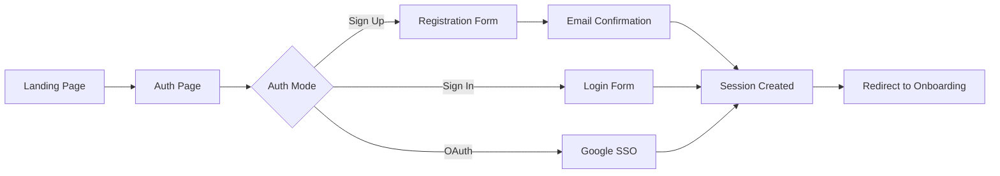

# Validation Plan: Phase 1 - Registration & Authentication

## Overview
This document provides a comprehensive validation checklist for the Registration & Authentication flow - the entry point for all platform users.

---

## Scope



---

## 1. Pages to Validate

| Page | File Path | Purpose |
|------|-----------|---------|
| Auth | `src/pages/Auth.jsx` | Main authentication page |
| Landing/Home | `src/pages/Home.jsx` | Entry point with auth CTAs |

---

## 2. Components to Validate

| Component | File Path | Purpose |
|-----------|-----------|---------|
| AuthContext | `src/lib/AuthContext.jsx` | Authentication state management |
| SupabaseAuth | `src/api/supabaseAuth.js` | Auth API wrapper |
| ProtectedRoute | `src/components/ProtectedRoute.jsx` | Route protection HOC |

---

## 3. Database Tables Involved

| Table | Purpose | RLS Required |
|-------|---------|--------------|
| `auth.users` | Supabase managed users | N/A (Supabase) |
| `user_profiles` | Extended user data | Yes |
| `user_roles` | Role assignments | Yes |

---

## 4. Validation Checklist

### 4.1 UI/UX Validation

#### Landing Page → Auth Navigation
- [ ] "Sign Up" button visible and clickable
- [ ] "Sign In" button visible and clickable
- [ ] Buttons navigate to `/auth` page
- [ ] Mobile responsive design
- [ ] RTL support (Arabic)

#### Auth Page Layout
- [ ] Sign Up tab displays registration form
- [ ] Sign In tab displays login form
- [ ] Tab switching works correctly
- [ ] Form fields are properly labeled
- [ ] Password visibility toggle works
- [ ] Form validation messages display correctly
- [ ] Loading states during submission
- [ ] Error messages are user-friendly
- [ ] Success messages display correctly

### 4.2 Registration Flow Validation

#### Form Fields
- [ ] Email field accepts valid email formats
- [ ] Email field rejects invalid formats
- [ ] Password field enforces minimum length
- [ ] Password field shows strength indicator (if applicable)
- [ ] Full name field is present and required
- [ ] Terms acceptance checkbox (if applicable)

#### Submission
- [ ] Form submits on button click
- [ ] Form submits on Enter key
- [ ] Duplicate email shows appropriate error
- [ ] Weak password shows appropriate error
- [ ] Network error handled gracefully
- [ ] Success creates user in `auth.users`
- [ ] Success creates profile in `user_profiles`

#### Email Confirmation
- [ ] Auto-confirm enabled (for non-production)
- [ ] OR confirmation email sent
- [ ] OR confirmation link works
- [ ] Session created after confirmation

### 4.3 Login Flow Validation

#### Form Fields
- [ ] Email field present and functional
- [ ] Password field present and functional
- [ ] "Forgot Password" link present

#### Submission
- [ ] Correct credentials → successful login
- [ ] Wrong email → appropriate error
- [ ] Wrong password → appropriate error
- [ ] Non-existent user → appropriate error
- [ ] Locked account handling (if applicable)
- [ ] Session created and stored

#### Password Reset
- [ ] Reset link navigates to reset form
- [ ] Email sent for valid accounts
- [ ] Error for non-existent accounts
- [ ] Reset link in email works
- [ ] New password saved successfully

### 4.4 OAuth (Google SSO) Validation

- [ ] Google button visible
- [ ] Click opens Google auth popup/redirect
- [ ] Successful auth creates session
- [ ] User profile created/updated
- [ ] Cancellation handled gracefully
- [ ] Error states handled

### 4.5 Session Management Validation

#### Session Creation
- [ ] Session stored in browser
- [ ] Session accessible via `supabase.auth.getSession()`
- [ ] User data accessible via `supabase.auth.getUser()`
- [ ] AuthContext updates with user state

#### Session Persistence
- [ ] Session persists across page refresh
- [ ] Session persists across browser close/open
- [ ] Session expiry handled correctly
- [ ] Expired session redirects to auth

#### Logout
- [ ] Logout button accessible
- [ ] Logout clears session
- [ ] Logout clears local state
- [ ] Logout redirects to home/auth
- [ ] Protected routes inaccessible after logout

### 4.6 Redirect Logic Validation

#### Post-Registration Redirect
- [ ] New user → `/onboarding`
- [ ] Onboarding incomplete → `/onboarding`
- [ ] Onboarding complete → appropriate dashboard

#### Post-Login Redirect
- [ ] Onboarding incomplete → `/onboarding`
- [ ] Citizen role → `/citizen-dashboard`
- [ ] Provider role → `/startup-dashboard`
- [ ] Researcher role → `/researcher-dashboard`
- [ ] Expert role → `/expert-assignment-queue`
- [ ] Municipality role → `/municipality-dashboard`
- [ ] Admin role → `/admin-portal`
- [ ] Viewer/no role → `/home` or `/onboarding`

#### Protected Route Behavior
- [ ] Unauthenticated → redirect to `/auth`
- [ ] Return URL preserved for post-login redirect
- [ ] Role-based access enforced

### 4.7 Database Validation

#### User Creation
- [ ] `auth.users` record created
- [ ] `user_profiles` record created via trigger
- [ ] Profile contains correct `user_id`
- [ ] Profile contains correct `email`
- [ ] `onboarding_completed` = false initially

#### RLS Policies
- [ ] Users can read own profile
- [ ] Users can update own profile
- [ ] Users cannot read other profiles (unless policy allows)
- [ ] Admins can read all profiles

### 4.8 Error Handling Validation

| Error Scenario | Expected Behavior |
|----------------|-------------------|
| Network offline | Show offline message |
| Server error (500) | Show generic error, allow retry |
| Rate limited | Show rate limit message |
| Invalid credentials | Show specific error |
| Validation error | Show field-specific errors |

### 4.9 Security Validation

- [ ] Passwords not logged to console
- [ ] Passwords not stored in plain text
- [ ] HTTPS enforced
- [ ] CSRF protection active
- [ ] XSS prevention in forms
- [ ] SQL injection prevention (Supabase handles)
- [ ] Session tokens secure and httpOnly

### 4.10 Accessibility Validation

- [ ] Form labels associated with inputs
- [ ] Error messages announced to screen readers
- [ ] Tab navigation works correctly
- [ ] Focus states visible
- [ ] Color contrast sufficient
- [ ] Button/link roles correct

### 4.11 Internationalization (i18n) Validation

- [ ] All text translatable
- [ ] Arabic translations present
- [ ] RTL layout for Arabic
- [ ] Date formats localized
- [ ] Error messages localized

---

## 5. AI Features in This Phase

| Feature | Status | Validation |
|---------|--------|------------|
| None | N/A | Auth phase has no AI features |

---

## 6. Edge Functions in This Phase

| Function | Purpose | Validation |
|----------|---------|------------|
| None | N/A | Auth uses Supabase native auth |

---

## 7. Test Cases

### TC-AUTH-001: New User Registration
```
Given: User on auth page, Sign Up tab
When: User enters valid email, password, name and submits
Then: 
  - User created in auth.users
  - Profile created in user_profiles
  - Session established
  - Redirect to /onboarding
```

### TC-AUTH-002: Duplicate Email Registration
```
Given: Email already registered
When: User tries to register with same email
Then: 
  - Error message "Email already registered"
  - No new records created
```

### TC-AUTH-003: Successful Login
```
Given: Existing user with valid credentials
When: User enters email/password and submits
Then:
  - Session established
  - Redirect based on onboarding/role status
```

### TC-AUTH-004: Failed Login - Wrong Password
```
Given: Existing user
When: User enters correct email but wrong password
Then:
  - Error message displayed
  - No session created
```

### TC-AUTH-005: Google OAuth Success
```
Given: User clicks Google sign-in
When: User completes Google auth flow
Then:
  - Session established
  - Profile created/updated
  - Redirect appropriately
```

### TC-AUTH-006: Session Persistence
```
Given: User logged in
When: User refreshes page
Then:
  - Session still active
  - User state preserved
```

### TC-AUTH-007: Logout Flow
```
Given: User logged in
When: User clicks logout
Then:
  - Session cleared
  - Redirect to home/auth
  - Protected routes inaccessible
```

### TC-AUTH-008: Protected Route Access
```
Given: User not authenticated
When: User tries to access /onboarding
Then:
  - Redirect to /auth
  - Return URL preserved
```

---

## 8. Validation Status Tracker

| Item | Status | Notes | Date |
|------|--------|-------|------|
| Auth page exists | ⬜ Pending | | |
| Sign up form works | ⬜ Pending | | |
| Sign in form works | ⬜ Pending | | |
| Google OAuth works | ⬜ Pending | | |
| Profile creation trigger | ⬜ Pending | | |
| Session management | ⬜ Pending | | |
| Redirect logic | ⬜ Pending | | |
| RLS policies | ⬜ Pending | | |
| Error handling | ⬜ Pending | | |
| i18n support | ⬜ Pending | | |

---

## 9. Files to Review

```
src/pages/Auth.jsx
src/pages/Home.jsx
src/lib/AuthContext.jsx
src/api/supabaseAuth.js
src/components/ProtectedRoute.jsx
src/utils/index.js (createPageUrl)
supabase/migrations/ (profile triggers)
```

---

## 10. Next Steps After Validation

1. ✅ Complete all checklist items
2. ✅ Document any bugs found
3. ✅ Fix identified issues
4. ➡️ Proceed to Phase 2: General Onboarding Validation

---

## 11. Related Documents

- [Onboarding Flow Tracking](../ONBOARDING_FLOW_TRACKING.md)
- [Platform Flows](../PLATFORM_FLOWS_AND_PERSONAS.md)
- [Persona README](../personas/README.md)
