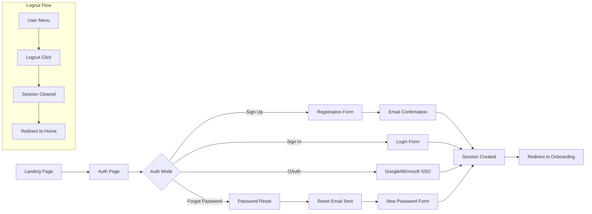

# Validation Plan: Phase 1 - Registration & Authentication

## Overview
This document provides a **fully comprehensive** validation checklist for the Registration & Authentication flow - the entry point for all platform users.

---

## Scope



---

## 1. Pages to Validate

| Page | File Path | Purpose |
|------|-----------|---------|
| Auth | `src/pages/Auth.jsx` | Main authentication page |
| Landing/Home | `src/pages/Home.jsx` | Entry point with auth CTAs |
| Password Reset | `src/pages/ResetPassword.jsx` | Password reset form (if exists) |

---

## 2. Components to Validate

| Component | File Path | Purpose |
|-----------|-----------|---------|
| AuthContext | `src/lib/AuthContext.jsx` | Authentication state management |
| SupabaseAuth | `src/api/supabaseAuth.js` | Auth API wrapper |
| ProtectedRoute | `src/components/ProtectedRoute.jsx` | Route protection HOC |
| LanguageContext | `src/context/LanguageContext.jsx` | i18n/RTL management |
| UserMenu | `src/components/UserMenu.jsx` | User dropdown with logout |

---

## 3. Database Tables & Field Mapping

### 3.1 Tables Involved

| Table | Purpose | RLS Required |
|-------|---------|--------------|
| `auth.users` | Supabase managed users | N/A (Supabase) |
| `user_profiles` | Extended user data | Yes |
| `user_roles` | Role assignments | Yes |

### 3.2 Field Mapping Validation: `user_profiles`

| Form Field | DB Column | Type | Required | Default | Validation |
|------------|-----------|------|----------|---------|------------|
| Email | `email` | text | Yes | from auth | Email format |
| Full Name | `full_name` | text | Yes | null | Min 2 chars |
| - | `user_id` | uuid | Yes | from auth | FK to auth.users |
| - | `avatar_url` | text | No | null | URL format |
| - | `onboarding_completed` | boolean | Yes | false | - |
| - | `onboarding_step` | integer | No | 0 | 0-10 |
| - | `created_at` | timestamp | Yes | now() | - |
| - | `updated_at` | timestamp | Yes | now() | - |
| - | `extracted_data` | jsonb | No | {} | Valid JSON |
| - | `preferred_language` | text | No | 'en' | 'en' or 'ar' |

### 3.3 Field Mapping Validation: `user_roles`

| DB Column | Type | Required | Default | Validation |
|-----------|------|----------|---------|------------|
| `id` | uuid | Yes | gen_random_uuid() | - |
| `user_id` | uuid | Yes | - | FK to auth.users |
| `role` | app_role | Yes | - | Enum value |
| `municipality_id` | uuid | No | null | FK to municipalities |
| `organization_id` | uuid | No | null | FK to organizations |
| `granted_by` | uuid | No | null | FK to auth.users |
| `granted_at` | timestamp | Yes | now() | - |
| `is_active` | boolean | Yes | true | - |

### 3.4 app_role Enum Values
- [ ] `admin`
- [ ] `citizen`
- [ ] `municipality_staff`
- [ ] `municipality_admin`
- [ ] `provider`
- [ ] `researcher`
- [ ] `expert`
- [ ] `viewer`

---

## 4. RTL/LTR & Bilingual (Arabic/English) Validation

### 4.1 Language Switching

| Check | EN | AR | Notes |
|-------|----|----|-------|
| Language toggle visible | ⬜ | ⬜ | Header/Footer |
| Toggle switches language | ⬜ | ⬜ | |
| Language persists on refresh | ⬜ | ⬜ | localStorage |
| Language persists on navigation | ⬜ | ⬜ | |

### 4.2 RTL Layout (Arabic)

| Element | LTR (EN) | RTL (AR) | Notes |
|---------|----------|----------|-------|
| `<html dir>` attribute | `ltr` | `rtl` | |
| Text alignment | left | right | |
| Form labels position | left | right | |
| Input text direction | ltr | rtl | |
| Icons/arrows flipped | → | ← | |
| Navigation order | left→right | right→left | |
| Button order | left→right | right→left | |
| Toast position | top-right | top-left | |
| Dropdown alignment | left | right | |
| Margin/padding flipped | ⬜ | ⬜ | Use logical props |

### 4.3 Text Translations

| Text Element | English | Arabic | Present |
|--------------|---------|--------|---------|
| Page title | Sign In | تسجيل الدخول | ⬜ |
| Sign Up tab | Sign Up | إنشاء حساب | ⬜ |
| Sign In tab | Sign In | تسجيل الدخول | ⬜ |
| Email label | Email | البريد الإلكتروني | ⬜ |
| Password label | Password | كلمة المرور | ⬜ |
| Full Name label | Full Name | الاسم الكامل | ⬜ |
| Submit button | Sign In/Up | تسجيل الدخول/إنشاء | ⬜ |
| Forgot password | Forgot Password? | نسيت كلمة المرور؟ | ⬜ |
| Reset password | Reset Password | إعادة تعيين كلمة المرور | ⬜ |
| New password | New Password | كلمة المرور الجديدة | ⬜ |
| Confirm password | Confirm Password | تأكيد كلمة المرور | ⬜ |
| Google button | Sign in with Google | تسجيل الدخول بجوجل | ⬜ |
| Microsoft button | Sign in with Microsoft | تسجيل الدخول بمايكروسوفت | ⬜ |
| Logout | Logout | تسجيل الخروج | ⬜ |
| Error messages | All errors | All errors | ⬜ |
| Success messages | All success | All success | ⬜ |
| Loading states | Loading... | جاري التحميل... | ⬜ |

### 4.4 Font & Typography

| Check | EN | AR | Notes |
|-------|----|----|-------|
| Font family correct | ⬜ | ⬜ | Arabic font loaded |
| Font size readable | ⬜ | ⬜ | |
| Line height appropriate | ⬜ | ⬜ | Arabic may need more |
| Numbers display correctly | ⬜ | ⬜ | Western vs Arabic numerals |

---

## 5. Authentication & Session Validation

### 5.1 Registration Flow

| Step | Check | Status |
|------|-------|--------|
| 1 | Form displays correctly | ⬜ |
| 2 | Email validation (format) | ⬜ |
| 3 | Email validation (unique) | ⬜ |
| 4 | Password validation (min 6 chars) | ⬜ |
| 5 | Name validation (required) | ⬜ |
| 6 | Submit creates auth.users record | ⬜ |
| 7 | Trigger creates user_profiles record | ⬜ |
| 8 | Auto-confirm enabled (dev) | ⬜ |
| 9 | Session created after signup | ⬜ |
| 10 | Redirect to /onboarding | ⬜ |

### 5.2 Login Flow

| Step | Check | Status |
|------|-------|--------|
| 1 | Form displays correctly | ⬜ |
| 2 | Valid credentials → success | ⬜ |
| 3 | Invalid email → error | ⬜ |
| 4 | Invalid password → error | ⬜ |
| 5 | Non-existent user → error | ⬜ |
| 6 | Session created on success | ⬜ |
| 7 | Session persists on refresh | ⬜ |
| 8 | Redirect based on role/onboarding | ⬜ |

### 5.3 OAuth - Google SSO

| Step | Check | Status |
|------|-------|--------|
| 1 | Google button visible | ⬜ |
| 2 | Google button styled correctly | ⬜ |
| 3 | Click opens Google auth popup/redirect | ⬜ |
| 4 | Google Cloud Console configured | ⬜ |
| 5 | Authorized redirect URLs set | ⬜ |
| 6 | Success creates session | ⬜ |
| 7 | Profile created/updated from Google data | ⬜ |
| 8 | Avatar URL populated (if available) | ⬜ |
| 9 | Cancel handled gracefully | ⬜ |
| 10 | Error states handled (popup blocked, etc.) | ⬜ |
| 11 | Works in production domain | ⬜ |
| 12 | Works in preview domain | ⬜ |

### 5.4 OAuth - Microsoft SSO

| Step | Check | Status |
|------|-------|--------|
| 1 | Microsoft button visible | ⬜ |
| 2 | Microsoft button styled correctly (MS branding) | ⬜ |
| 3 | Click opens Microsoft auth popup/redirect | ⬜ |
| 4 | Azure AD App Registration configured | ⬜ |
| 5 | Client ID configured in Supabase | ⬜ |
| 6 | Client Secret configured in Supabase | ⬜ |
| 7 | Redirect URIs set in Azure | ⬜ |
| 8 | Supabase callback URL added to Azure | ⬜ |
| 9 | Scopes configured (email, profile, openid) | ⬜ |
| 10 | Success creates session | ⬜ |
| 11 | Profile created/updated from Microsoft data | ⬜ |
| 12 | Email populated from Microsoft account | ⬜ |
| 13 | Name populated from Microsoft account | ⬜ |
| 14 | Cancel handled gracefully | ⬜ |
| 15 | Error states handled | ⬜ |
| 16 | Personal Microsoft accounts work | ⬜ |
| 17 | Work/School accounts work (if enabled) | ⬜ |
| 18 | Works in production domain | ⬜ |
| 19 | Works in preview domain | ⬜ |

### 5.5 Session Management

| Check | Status | Notes |
|-------|--------|-------|
| Session stored correctly | ⬜ | localStorage |
| Session accessible via getSession() | ⬜ | |
| User data via getUser() | ⬜ | |
| AuthContext updates on change | ⬜ | |
| onAuthStateChange listener works | ⬜ | |
| Session persists on refresh | ⬜ | |
| Session persists on close/open | ⬜ | |
| Token refresh works | ⬜ | |
| Expired session → redirect | ⬜ | |

### 5.6 Logout Flow (Comprehensive)

| Step | Check | Status |
|------|-------|--------|
| 1 | Logout button visible in user menu | ⬜ |
| 2 | Logout button accessible on all pages | ⬜ |
| 3 | Logout button labeled correctly (EN/AR) | ⬜ |
| 4 | Click triggers supabase.auth.signOut() | ⬜ |
| 5 | Session cleared from Supabase | ⬜ |
| 6 | Session cleared from localStorage | ⬜ |
| 7 | AuthContext user state set to null | ⬜ |
| 8 | AuthContext session state set to null | ⬜ |
| 9 | All cached user data cleared | ⬜ |
| 10 | React Query cache invalidated (if used) | ⬜ |
| 11 | Redirect to home page (/) | ⬜ |
| 12 | Protected routes now redirect to /auth | ⬜ |
| 13 | Back button doesn't restore session | ⬜ |
| 14 | No session data visible in DevTools | ⬜ |
| 15 | Logout works from any page | ⬜ |
| 16 | Toast/confirmation shown on logout | ⬜ |
| 17 | No errors in console on logout | ⬜ |
| 18 | Multiple tabs: other tabs detect logout | ⬜ |
| 19 | Logout during pending request handled | ⬜ |
| 20 | OAuth sessions fully cleared | ⬜ |

### 5.7 Password Reset Flow

| Step | Check | Status |
|------|-------|--------|
| 1 | "Forgot Password?" link visible on login | ⬜ |
| 2 | "Forgot Password?" link labeled (EN/AR) | ⬜ |
| 3 | Click navigates to reset form/modal | ⬜ |
| 4 | Reset form displays email input | ⬜ |
| 5 | Email validation on reset form | ⬜ |
| 6 | Submit calls supabase.auth.resetPasswordForEmail() | ⬜ |
| 7 | Redirect URL configured correctly | ⬜ |
| 8 | Success message shown | ⬜ |
| 9 | Error for non-existent email (or generic message) | ⬜ |
| 10 | Rate limiting handled | ⬜ |
| 11 | Reset email actually sent | ⬜ |
| 12 | Email contains correct reset link | ⬜ |
| 13 | Link expires after appropriate time | ⬜ |
| 14 | User can return to login from reset page | ⬜ |

### 5.8 Password Recovery (New Password Entry)

| Step | Check | Status |
|------|-------|--------|
| 1 | Reset link from email works | ⬜ |
| 2 | Link redirects to app with token | ⬜ |
| 3 | App detects recovery token in URL | ⬜ |
| 4 | New password form displays | ⬜ |
| 5 | Password field present | ⬜ |
| 6 | Confirm password field present | ⬜ |
| 7 | Password visibility toggle works | ⬜ |
| 8 | Password validation (min 6 chars) | ⬜ |
| 9 | Password match validation | ⬜ |
| 10 | Submit calls supabase.auth.updateUser() | ⬜ |
| 11 | Success message shown | ⬜ |
| 12 | Session created after password update | ⬜ |
| 13 | Redirect to appropriate page | ⬜ |
| 14 | Expired link handled gracefully | ⬜ |
| 15 | Already used link handled | ⬜ |
| 16 | Invalid token handled | ⬜ |
| 17 | Old password no longer works | ⬜ |
| 18 | New password works for login | ⬜ |

---

## 6. Access Control & Permissions Validation

### 6.1 RLS Policies - user_profiles

| Policy | Command | Check | Status |
|--------|---------|-------|--------|
| Users can read own profile | SELECT | `auth.uid() = user_id` | ⬜ |
| Users can update own profile | UPDATE | `auth.uid() = user_id` | ⬜ |
| Users can insert own profile | INSERT | `auth.uid() = user_id` | ⬜ |
| Admins can manage all | ALL | `is_admin(auth.uid())` | ⬜ |

### 6.2 RLS Policies - user_roles

| Policy | Command | Check | Status |
|--------|---------|-------|--------|
| Users can view own roles | SELECT | `auth.uid() = user_id` | ⬜ |
| Admins can manage roles | ALL | `is_admin(auth.uid())` | ⬜ |
| No self role assignment | INSERT | Admin only | ⬜ |

### 6.3 Pre-Auth Access

| Page/Route | Expected | Status |
|------------|----------|--------|
| `/` (Home) | Accessible | ⬜ |
| `/auth` | Accessible | ⬜ |
| `/browse-challenges` | Accessible | ⬜ |
| `/browse-solutions` | Accessible | ⬜ |
| `/reset-password` | Accessible | ⬜ |
| `/onboarding` | Redirect to /auth | ⬜ |
| `/citizen-dashboard` | Redirect to /auth | ⬜ |
| `/admin-portal` | Redirect to /auth | ⬜ |
| Any protected route | Redirect to /auth | ⬜ |

### 6.4 Post-Auth Access (No Role Yet)

| Page/Route | Expected | Status |
|------------|----------|--------|
| `/onboarding` | Accessible | ⬜ |
| `/citizen-dashboard` | Redirect to /onboarding | ⬜ |
| `/admin-portal` | Forbidden or redirect | ⬜ |

---

## 7. Role & Routing Validation

### 7.1 Role Assignment (Post-Registration)

| Check | Status |
|-------|--------|
| No role assigned at registration | ⬜ |
| Role assigned after onboarding | ⬜ |
| Role stored in user_roles table | ⬜ |
| Role accessible via AuthContext | ⬜ |

### 7.2 Route Protection Matrix

| Route | Required Auth | Required Role | Status |
|-------|---------------|---------------|--------|
| `/` | No | None | ⬜ |
| `/auth` | No | None | ⬜ |
| `/reset-password` | No | None | ⬜ |
| `/onboarding` | Yes | None | ⬜ |
| `/citizen-dashboard` | Yes | citizen | ⬜ |
| `/startup-dashboard` | Yes | provider | ⬜ |
| `/researcher-dashboard` | Yes | researcher | ⬜ |
| `/expert-assignment-queue` | Yes | expert | ⬜ |
| `/municipality-dashboard` | Yes | municipality_* | ⬜ |
| `/admin-portal` | Yes | admin | ⬜ |

### 7.3 Redirect Logic After Auth

| Condition | Redirect To | Status |
|-----------|-------------|--------|
| New user (no profile) | /onboarding | ⬜ |
| Onboarding incomplete | /onboarding | ⬜ |
| Onboarding complete + citizen | /citizen-dashboard | ⬜ |
| Onboarding complete + provider | /startup-dashboard | ⬜ |
| Onboarding complete + researcher | /researcher-dashboard | ⬜ |
| Onboarding complete + expert | /expert-assignment-queue | ⬜ |
| Onboarding complete + muni_staff | /municipality-dashboard | ⬜ |
| Onboarding complete + admin | /admin-portal | ⬜ |
| Onboarding complete + viewer | /home | ⬜ |
| No role assigned | /onboarding | ⬜ |
| After password reset | /onboarding or dashboard | ⬜ |

---

## 8. Theme & Style Validation

### 8.1 Design System Tokens

| Token Category | Used Correctly | Status |
|----------------|----------------|--------|
| `--background` | Page backgrounds | ⬜ |
| `--foreground` | Text colors | ⬜ |
| `--primary` | Primary buttons | ⬜ |
| `--primary-foreground` | Button text | ⬜ |
| `--secondary` | Secondary elements | ⬜ |
| `--muted` | Muted backgrounds | ⬜ |
| `--muted-foreground` | Muted text | ⬜ |
| `--accent` | Accents | ⬜ |
| `--destructive` | Error states | ⬜ |
| `--border` | Borders | ⬜ |
| `--input` | Input borders | ⬜ |
| `--ring` | Focus rings | ⬜ |

### 8.2 Dark/Light Mode

| Element | Light Mode | Dark Mode | Status |
|---------|------------|-----------|--------|
| Background | ⬜ | ⬜ | |
| Text | ⬜ | ⬜ | |
| Buttons | ⬜ | ⬜ | |
| Inputs | ⬜ | ⬜ | |
| Cards | ⬜ | ⬜ | |
| Borders | ⬜ | ⬜ | |
| Icons | ⬜ | ⬜ | |
| Links | ⬜ | ⬜ | |
| Errors | ⬜ | ⬜ | |
| Success | ⬜ | ⬜ | |
| OAuth buttons | ⬜ | ⬜ | |

### 8.3 Component Styling

| Component | Matches Design System | Status |
|-----------|----------------------|--------|
| Auth Card | ⬜ | |
| Input fields | ⬜ | |
| Buttons | ⬜ | |
| Tabs | ⬜ | |
| Links | ⬜ | |
| Loading spinner | ⬜ | |
| Error alerts | ⬜ | |
| Toast notifications | ⬜ | |
| Google OAuth button | ⬜ | |
| Microsoft OAuth button | ⬜ | |
| Password reset form | ⬜ | |
| User menu dropdown | ⬜ | |
| Logout button | ⬜ | |

### 8.4 Responsive Design

| Breakpoint | Layout Correct | Status |
|------------|----------------|--------|
| Mobile (<640px) | ⬜ | |
| Tablet (640-1024px) | ⬜ | |
| Desktop (>1024px) | ⬜ | |

---

## 9. Error Handling Validation

### 9.1 Form Validation Errors

| Field | Validation | Error Message (EN) | Error Message (AR) | Status |
|-------|------------|-------------------|-------------------|--------|
| Email | Empty | Email is required | البريد الإلكتروني مطلوب | ⬜ |
| Email | Invalid format | Invalid email format | صيغة البريد غير صحيحة | ⬜ |
| Password | Empty | Password is required | كلمة المرور مطلوبة | ⬜ |
| Password | Too short | Min 6 characters | 6 أحرف على الأقل | ⬜ |
| Password | Mismatch | Passwords don't match | كلمات المرور غير متطابقة | ⬜ |
| Name | Empty | Name is required | الاسم مطلوب | ⬜ |

### 9.2 API/Server Errors

| Error Scenario | Status Code | User Message | Status |
|----------------|-------------|--------------|--------|
| Duplicate email | 400 | Email already registered | ⬜ |
| Invalid credentials | 400 | Invalid email or password | ⬜ |
| Server error | 500 | Something went wrong | ⬜ |
| Network offline | - | Check your connection | ⬜ |
| Rate limited | 429 | Too many attempts | ⬜ |
| Session expired | 401 | Please sign in again | ⬜ |
| Invalid reset token | 400 | Reset link expired | ⬜ |
| OAuth error | varies | Sign in failed | ⬜ |
| OAuth popup blocked | - | Please allow popups | ⬜ |
| Microsoft auth error | varies | Microsoft sign in failed | ⬜ |
| Google auth error | varies | Google sign in failed | ⬜ |

### 9.3 Error Display

| Check | Status |
|-------|--------|
| Errors display near relevant field | ⬜ |
| Errors use destructive color | ⬜ |
| Errors are readable | ⬜ |
| Errors clear on re-attempt | ⬜ |
| Toast for global errors | ⬜ |
| Errors announced to screen readers | ⬜ |

### 9.4 Edge Cases

| Scenario | Expected Behavior | Status |
|----------|-------------------|--------|
| Submit empty form | Show all required errors | ⬜ |
| Paste invalid email | Show format error | ⬜ |
| Submit during loading | Prevent double submit | ⬜ |
| Close browser during submit | Graceful handling | ⬜ |
| Session expires during submit | Redirect to auth | ⬜ |
| Reset link clicked twice | Show appropriate message | ⬜ |
| Logout during loading | Complete logout safely | ⬜ |
| OAuth cancelled mid-flow | Return to auth cleanly | ⬜ |

---

## 10. Links & Navigation Validation

### 10.1 Auth Page Links

| Link | Target | Works | Status |
|------|--------|-------|--------|
| "Sign Up" tab | Switch to signup form | ⬜ | |
| "Sign In" tab | Switch to signin form | ⬜ | |
| "Forgot Password?" | Password reset flow | ⬜ | |
| "Sign in with Google" | Google OAuth | ⬜ | |
| "Sign in with Microsoft" | Microsoft OAuth | ⬜ | |
| Back to Home | `/` | ⬜ | |
| Terms of Service | Terms page | ⬜ | |
| Privacy Policy | Privacy page | ⬜ | |

### 10.2 Password Reset Links

| Link | Target | Works | Status |
|------|--------|-------|--------|
| Back to Sign In | Return to login form | ⬜ | |
| Email reset link | Opens new password form | ⬜ | |
| Resend reset email | Sends another email | ⬜ | |

### 10.3 Landing Page Links

| Link | Target | Works | Status |
|------|--------|-------|--------|
| "Sign Up" CTA | `/auth` (signup mode) | ⬜ | |
| "Sign In" | `/auth` (signin mode) | ⬜ | |
| Navigation items | Respective pages | ⬜ | |
| Logo | `/` | ⬜ | |

### 10.4 Navigation State

| State | Header Shows | Status |
|-------|--------------|--------|
| Not authenticated | Sign In / Sign Up | ⬜ |
| Authenticated | User menu / Avatar | ⬜ |
| Authenticated | Logout option | ⬜ |
| Authenticated | Profile link | ⬜ |

### 10.5 Browser Navigation

| Action | Expected | Status |
|--------|----------|--------|
| Back button from onboarding | Go to auth | ⬜ |
| Forward after logout | Stay on public or redirect | ⬜ |
| Refresh on auth page | Stay on auth | ⬜ |
| Deep link to protected | Redirect to auth | ⬜ |
| Back button after password reset | Appropriate behavior | ⬜ |

---

## 11. Security Validation

### 11.1 Password Security

| Check | Status |
|-------|--------|
| Password not logged to console | ⬜ |
| Password not in URL | ⬜ |
| Password field type="password" | ⬜ |
| Password visibility toggle works | ⬜ |
| Password not stored in plain text | ⬜ |
| New password field secure | ⬜ |
| Confirm password field secure | ⬜ |

### 11.2 Session Security

| Check | Status |
|-------|--------|
| Tokens stored securely | ⬜ |
| httpOnly where applicable | ⬜ |
| HTTPS enforced | ⬜ |
| No tokens in URLs | ⬜ |
| Reset tokens expire properly | ⬜ |
| Reset tokens single-use | ⬜ |

### 11.3 Logout Security

| Check | Status |
|-------|--------|
| Server-side session invalidated | ⬜ |
| All tokens revoked | ⬜ |
| No cached sensitive data remains | ⬜ |
| OAuth provider session note (not cleared) | ⬜ |

### 11.4 Input Validation

| Check | Status |
|-------|--------|
| Email sanitized | ⬜ |
| XSS prevention | ⬜ |
| SQL injection prevention (Supabase) | ⬜ |
| CSRF protection | ⬜ |

### 11.5 OAuth Security

| Check | Status |
|-------|--------|
| State parameter used | ⬜ |
| PKCE flow used | ⬜ |
| Redirect URL validated | ⬜ |
| Token exchange secure | ⬜ |

---

## 12. Accessibility Validation

### 12.1 Form Accessibility

| Check | Status |
|-------|--------|
| Labels associated with inputs | ⬜ |
| Required fields marked | ⬜ |
| Error messages linked to fields | ⬜ |
| Tab order logical | ⬜ |
| Focus visible | ⬜ |
| Focus trapped in modal (if any) | ⬜ |

### 12.2 Screen Reader

| Check | Status |
|-------|--------|
| Page title announced | ⬜ |
| Form labels read | ⬜ |
| Errors announced | ⬜ |
| Success announced | ⬜ |
| Loading state announced | ⬜ |
| Logout confirmation announced | ⬜ |

### 12.3 Keyboard Navigation

| Action | Keyboard | Status |
|--------|----------|--------|
| Focus email | Tab | ⬜ |
| Focus password | Tab | ⬜ |
| Submit form | Enter | ⬜ |
| Switch tabs | Tab + Enter/Space | ⬜ |
| Toggle password visibility | Enter/Space | ⬜ |
| Trigger logout | Enter/Space | ⬜ |
| Navigate OAuth buttons | Tab | ⬜ |

### 12.4 Color Contrast

| Element | Ratio Required | Status |
|---------|----------------|--------|
| Body text | 4.5:1 | ⬜ |
| Large text | 3:1 | ⬜ |
| UI components | 3:1 | ⬜ |
| Error text | 4.5:1 | ⬜ |
| Success text | 4.5:1 | ⬜ |

---

## 13. Performance Validation

| Check | Target | Status |
|-------|--------|--------|
| Page load time | < 2s | ⬜ |
| Auth response time | < 1s | ⬜ |
| OAuth redirect time | < 3s | ⬜ |
| Logout response time | < 1s | ⬜ |
| Password reset email time | < 30s | ⬜ |
| No layout shift | CLS < 0.1 | ⬜ |
| First contentful paint | < 1.5s | ⬜ |

---

## 14. Test Cases

### TC-AUTH-001: New User Registration (English)
```
Given: User on /auth, Sign Up tab, English language
When: User enters valid email, password (6+ chars), name and submits
Then: 
  - User created in auth.users
  - Profile created in user_profiles with preferred_language='en'
  - Session established
  - Redirect to /onboarding
```

### TC-AUTH-002: New User Registration (Arabic)
```
Given: User on /auth, Sign Up tab, Arabic language
When: User enters valid email, password, name and submits
Then: 
  - Profile created with preferred_language='ar'
  - All success messages in Arabic
  - Redirect preserves Arabic language
```

### TC-AUTH-003: Registration - Duplicate Email
```
Given: Email already registered
When: User tries to register with same email
Then: 
  - Error "Email already registered" (or Arabic equivalent)
  - No new records created
```

### TC-AUTH-004: Login Success
```
Given: Existing user with completed onboarding, citizen role
When: User enters correct credentials
Then:
  - Session established
  - Redirect to /citizen-dashboard
```

### TC-AUTH-005: Login - Onboarding Incomplete
```
Given: Existing user with onboarding_completed=false
When: User logs in successfully
Then:
  - Session established
  - Redirect to /onboarding (not dashboard)
```

### TC-AUTH-006: Login - Wrong Password
```
Given: Existing user
When: User enters correct email, wrong password
Then:
  - Error message displayed
  - No session created
```

### TC-AUTH-007: Google OAuth Success
```
Given: User clicks Google sign-in
When: User completes Google auth flow
Then:
  - Session established
  - Profile created/updated
  - Redirect based on onboarding status
```

### TC-AUTH-008: Microsoft OAuth Success
```
Given: User clicks Microsoft sign-in
When: User completes Microsoft auth flow with personal/work account
Then:
  - Session established
  - Profile created/updated with Microsoft email and name
  - Redirect based on onboarding status
```

### TC-AUTH-009: Microsoft OAuth - Cancel
```
Given: User clicks Microsoft sign-in
When: User cancels at Microsoft login screen
Then:
  - Return to auth page
  - No error displayed (or friendly message)
  - No session created
```

### TC-AUTH-010: Protected Route - Not Authenticated
```
Given: User not authenticated
When: User navigates to /onboarding directly
Then:
  - Redirect to /auth
  - Return URL preserved (?redirect=/onboarding)
```

### TC-AUTH-011: Session Persistence
```
Given: User logged in
When: User refreshes page
Then:
  - Session still active
  - User state preserved
  - No redirect to auth
```

### TC-AUTH-012: Logout Flow - Complete
```
Given: User logged in on /citizen-dashboard
When: User clicks logout in user menu
Then:
  - Session cleared from Supabase
  - localStorage cleared
  - AuthContext reset
  - Redirect to /
  - Back button doesn't restore session
  - Protected routes redirect to /auth
```

### TC-AUTH-013: Logout - Multiple Tabs
```
Given: User logged in with app open in 2 tabs
When: User logs out in Tab 1
Then:
  - Tab 2 detects logout via onAuthStateChange
  - Tab 2 redirects to / or /auth
```

### TC-AUTH-014: Password Reset - Request
```
Given: User on auth page, forgot password
When: User clicks "Forgot Password?" and enters valid email
Then:
  - Password reset email sent
  - Success message shown
  - User can return to login
```

### TC-AUTH-015: Password Reset - Complete
```
Given: User received reset email and clicked link
When: User enters new password (meeting requirements) and confirms
Then:
  - Password updated in auth.users
  - Session created
  - Redirect to onboarding/dashboard
  - Old password no longer works
```

### TC-AUTH-016: Password Reset - Expired Link
```
Given: User has expired reset link (>24 hours)
When: User clicks the link
Then:
  - Error message "Reset link expired"
  - Option to request new reset link
```

### TC-AUTH-017: Password Reset - Password Mismatch
```
Given: User on new password form
When: User enters different passwords in password and confirm fields
Then:
  - Error "Passwords don't match"
  - Form not submitted
```

### TC-AUTH-018: RTL Layout - Arabic
```
Given: User selects Arabic language
When: Auth page loads
Then:
  - html dir="rtl"
  - Form aligned right
  - Labels on right
  - Buttons in correct order
  - OAuth buttons in correct order
```

### TC-AUTH-019: Dark Mode
```
Given: User has dark mode enabled
When: Auth page loads
Then:
  - All elements use dark theme tokens
  - Text readable
  - No white backgrounds
  - OAuth buttons appropriately styled
```

### TC-AUTH-020: OAuth Error Handling
```
Given: User tries Google/Microsoft OAuth
When: Popup is blocked by browser
Then:
  - Appropriate error message shown
  - User can retry
  - No session created
```

---

## 15. Validation Status Tracker

| Category | Items | Passed | Failed | Pending |
|----------|-------|--------|--------|---------|
| UI/UX | 15 | 0 | 0 | 15 |
| RTL/LTR | 25 | 0 | 0 | 25 |
| Database Fields | 15 | 0 | 0 | 15 |
| Registration | 10 | 0 | 0 | 10 |
| Login | 8 | 0 | 0 | 8 |
| Google OAuth | 12 | 0 | 0 | 12 |
| Microsoft OAuth | 19 | 0 | 0 | 19 |
| Session Management | 9 | 0 | 0 | 9 |
| Logout Flow | 20 | 0 | 0 | 20 |
| Password Reset | 14 | 0 | 0 | 14 |
| Password Recovery | 18 | 0 | 0 | 18 |
| Access Control | 15 | 0 | 0 | 15 |
| Role & Routing | 22 | 0 | 0 | 22 |
| Theme & Style | 30 | 0 | 0 | 30 |
| Error Handling | 25 | 0 | 0 | 25 |
| Links & Navigation | 20 | 0 | 0 | 20 |
| Security | 20 | 0 | 0 | 20 |
| Accessibility | 22 | 0 | 0 | 22 |
| Performance | 7 | 0 | 0 | 7 |
| **TOTAL** | **326** | **0** | **0** | **326** |

---

## 16. Files to Review

```
# Pages
src/pages/Auth.jsx
src/pages/Home.jsx
src/pages/ResetPassword.jsx (if exists)

# Auth Components
src/lib/AuthContext.jsx
src/api/supabaseAuth.js
src/components/ProtectedRoute.jsx
src/components/UserMenu.jsx

# i18n
src/context/LanguageContext.jsx
src/locales/en.json
src/locales/ar.json

# Routing
src/App.jsx
src/utils/index.js

# Theme
src/index.css
tailwind.config.ts

# Database
supabase/migrations/ (profile triggers)

# Backend Config
supabase/config.toml (OAuth providers)
```

---

## 17. OAuth Provider Configuration Checklist

### Google Cloud Console
- [ ] Project created
- [ ] OAuth consent screen configured
- [ ] OAuth 2.0 Client ID created
- [ ] Authorized JavaScript origins added
- [ ] Authorized redirect URIs added (Supabase callback)
- [ ] Client ID added to Supabase

### Microsoft Azure AD
- [ ] App registration created
- [ ] Application (client) ID copied
- [ ] Client secret created
- [ ] Redirect URIs configured
- [ ] Supported account types set (Personal, Work, or Both)
- [ ] API permissions: openid, email, profile
- [ ] Client ID added to Supabase
- [ ] Client secret added to Supabase

---

## 18. Next Steps

1. ✅ Complete all 326 checklist items
2. ✅ Document any bugs found in `docs/validation/BUGS_PHASE1.md`
3. ✅ Fix identified issues
4. ➡️ Proceed to **Phase 2: General Onboarding Validation**

---

## 19. Related Documents

- [Onboarding Flow Tracking](../ONBOARDING_FLOW_TRACKING.md)
- [Platform Flows](../PLATFORM_FLOWS_AND_PERSONAS.md)
- [Persona README](../personas/README.md)
