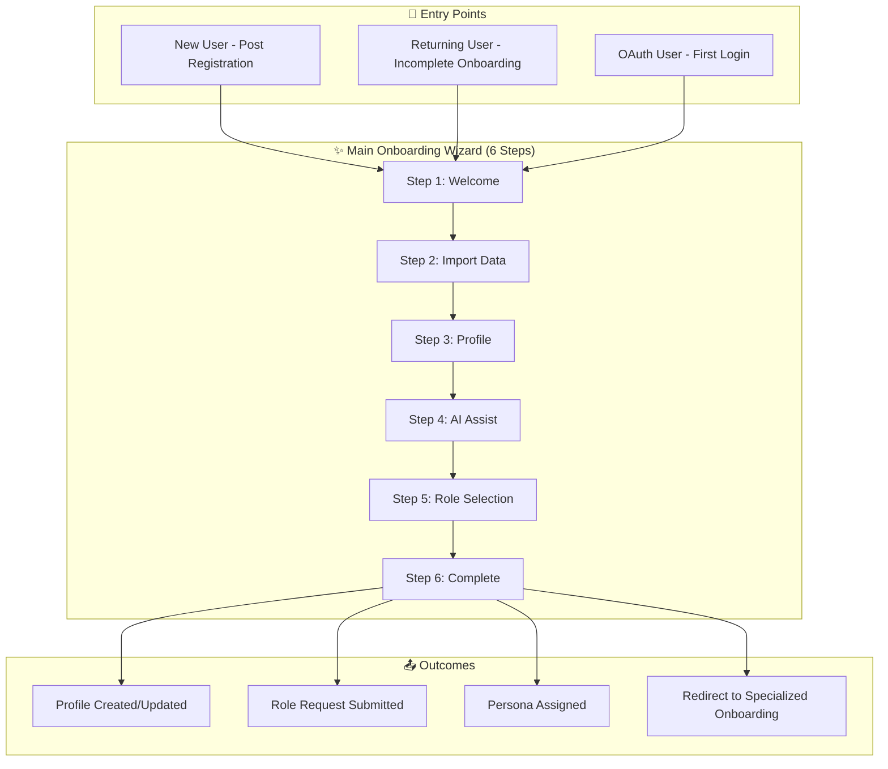

# Validation Plan: Phase 2 - Main Onboarding Wizard

## Overview
This document provides comprehensive validation for the Main Onboarding Wizard (6 Steps) - the core profile setup and persona selection flow that identifies user role, permissions, and account status.

**Prerequisite:** Phase 1 (Registration & Authentication) completed

---

## Phase Index

| Phase | Name | Status | Checks |
|-------|------|--------|--------|
| 1 | Registration & Authentication | ⬜ | 326 |
| **2** | **Main Onboarding Wizard** | ⬜ | **418** |
| 3 | Municipality Staff Onboarding | ⬜ | TBD |
| 4 | Provider/Startup Onboarding | ⬜ | TBD |
| 5 | Researcher Onboarding | ⬜ | TBD |
| 6 | Expert Onboarding | ⬜ | TBD |
| 7 | Citizen Onboarding | ⬜ | TBD |
| 8 | Viewer Flow | ⬜ | TBD |
| 9 | Admin Portal | ⬜ | TBD |
| 10 | Role Request & Approval | ⬜ | TBD |
| 11 | Profile Management | ⬜ | TBD |
| 12+ | Feature-specific flows | ⬜ | TBD |

---

## Scope

---

## 1. Pages & Components to Validate

### 1.1 Main Pages

| Page | File Path | Purpose |
|------|-----------|---------|
| Onboarding | `src/pages/Onboarding.jsx` | Main onboarding entry point |
| OnboardingWizard | `src/components/onboarding/OnboardingWizard.jsx` | 6-step wizard component |
| OnboardingWizardNew | `src/components/onboarding/OnboardingWizardNew.jsx` | Alternative wizard |

### 1.2 Step Components

| Component | Purpose |
|-----------|---------|
| WelcomeStep | Platform intro, language selection |
| ImportDataStep | CV upload, LinkedIn import |
| ProfileStep | Bilingual profile form |
| AIAssistStep | AI suggestions for bio/persona |
| RoleSelectionStep | Persona selection |
| CompleteStep | Summary and next steps |

### 1.3 Enhancement Components

| Component | File Path | Purpose |
|-----------|-----------|---------|
| ProfileCompletenessCoach | `src/components/onboarding/ProfileCompletenessCoach.jsx` | Profile completion tracking |
| FirstActionRecommender | `src/components/onboarding/FirstActionRecommender.jsx` | AI action recommendations |
| OnboardingChecklist | `src/components/onboarding/OnboardingChecklist.jsx` | Interactive checklist |
| ProgressiveProfilingPrompt | `src/components/onboarding/ProgressiveProfilingPrompt.jsx` | Non-intrusive prompts |
| AIRoleAssigner | `src/components/onboarding/AIRoleAssigner.jsx` | AI role suggestion |

---

## 2. User Type Detection & Routing

### 2.1 New vs Returning User Detection

| Check | Condition | Expected Behavior | Status |
|-------|-----------|-------------------|--------|
| New user detection | `user_profiles` record missing | Create profile, start Step 1 | ⬜ |
| OAuth new user | Profile exists but empty | Start Step 1 with pre-filled email | ⬜ |
| Returning incomplete | `onboarding_completed = false` | Resume from last step | ⬜ |
| Returning complete | `onboarding_completed = true` | Redirect to dashboard | ⬜ |
| Step persistence | `onboarding_step` stored | Resume from correct step | ⬜ |

### 2.2 Entry Point Routing

| Entry | Source | Expected Route | Status |
|-------|--------|----------------|--------|
| Post email signup | `/auth` | `/onboarding` | ⬜ |
| Post Google OAuth | OAuth callback | `/onboarding` | ⬜ |
| Post Microsoft OAuth | OAuth callback | `/onboarding` | ⬜ |
| Direct URL (unauth) | `/onboarding` | Redirect to `/auth` | ⬜ |
| Direct URL (auth, incomplete) | `/onboarding` | Show wizard | ⬜ |
| Direct URL (auth, complete) | `/onboarding` | Redirect to dashboard | ⬜ |

### 2.3 Account Status Checks

| Check | Field | Expected | Status |
|-------|-------|----------|--------|
| Email verified | `auth.users.email_confirmed_at` | Not null | ⬜ |
| Profile exists | `user_profiles.id` | Exists | ⬜ |
| Onboarding status | `user_profiles.onboarding_completed` | false for wizard | ⬜ |
| Current step | `user_profiles.onboarding_step` | 0-6 | ⬜ |
| Role assigned | `user_roles` count | 0 before complete | ⬜ |
| Account active | `user_profiles.is_active` | true | ⬜ |

---

## 3. Step 1: Welcome

### 3.1 UI Elements

| Element | EN Text | AR Text | Status |
|---------|---------|---------|--------|
| Title | Welcome to Saudi Innovates | مرحباً بك في ابتكار السعودية | ⬜ |
| Subtitle | Platform introduction | مقدمة المنصة | ⬜ |
| Value props | 3-4 benefit cards | 3-4 بطاقات فوائد | ⬜ |
| Language selector | EN / AR toggle | تبديل EN / AR | ⬜ |
| Continue button | Continue | متابعة | ⬜ |
| Skip option | Skip for now | تخطي الآن | ⬜ |

### 3.2 Language Selection

| Check | EN | AR | Status |
|-------|----|----|--------|
| Default language from browser | ⬜ | ⬜ | |
| Language toggle visible | ⬜ | ⬜ | |
| Selection updates UI immediately | ⬜ | ⬜ | |
| Selection persists to profile | ⬜ | ⬜ | |
| RTL layout activates on AR | ⬜ | ⬜ | |

### 3.3 Analytics Tracking

| Event | Data | Status |
|-------|------|--------|
| `wizard_opened` | source, timestamp | ⬜ |
| `step_started` | stepNumber: 1, stepName: 'welcome' | ⬜ |
| `step_completed` | language_selected | ⬜ |

---

## 4. Step 2: Import Data

### 4.1 CV Upload

| Check | Status | Notes |
|-------|--------|-------|
| Upload button visible | ⬜ | |
| Supported formats shown (PDF, DOC, DOCX) | ⬜ | |
| File size limit displayed | ⬜ | Max 10MB |
| Drag-and-drop works | ⬜ | |
| Click to browse works | ⬜ | |
| Upload progress indicator | ⬜ | |
| Upload success feedback | ⬜ | |
| Upload error handling | ⬜ | |
| File stored in Supabase Storage | ⬜ | |
| CV URL saved to user_profiles.cv_url | ⬜ | |

### 4.2 AI CV Extraction

| Extracted Field | Maps to DB Column | Status |
|-----------------|-------------------|--------|
| Name | `full_name`, `full_name_en` | ⬜ |
| Job Title | `job_title`, `job_title_en` | ⬜ |
| Organization | `organization_en` | ⬜ |
| Email | `user_email` (verify) | ⬜ |
| Phone | `mobile_number` | ⬜ |
| Bio/Summary | `bio_en` | ⬜ |
| Skills | `skills` (array) | ⬜ |
| Experience | `work_experience` (jsonb) | ⬜ |
| Education | `extracted_data.education` | ⬜ |
| Certifications | `certifications` (jsonb) | ⬜ |
| LinkedIn URL | `linkedin_url` | ⬜ |

### 4.3 LinkedIn Import

| Check | Status | Notes |
|-------|--------|-------|
| LinkedIn URL input visible | ⬜ | |
| URL validation (linkedin.com) | ⬜ | |
| Import button works | ⬜ | |
| Loading state shown | ⬜ | |
| Data extracted and previewed | ⬜ | |
| User can accept/modify | ⬜ | |
| Error handling for invalid URLs | ⬜ | |
| Private profile handling | ⬜ | |

### 4.4 Skip Option

| Check | Status |
|-------|--------|
| Skip button visible | ⬜ |
| Skip labeled (EN/AR) | ⬜ |
| Skip proceeds to Step 3 | ⬜ |
| No data required to skip | ⬜ |

### 4.5 Analytics Tracking

| Event | Data | Status |
|-------|------|--------|
| `step_started` | stepNumber: 2, stepName: 'import' | ⬜ |
| `cv_uploaded` | fileType, extractedFieldsCount | ⬜ |
| `linkedin_imported` | fieldsExtractedCount | ⬜ |
| `step_completed` | import_method: 'cv'/'linkedin'/'skip' | ⬜ |

---

## 5. Step 3: Profile Information

### 5.1 Required Fields

| Field | DB Column | Type | Required | Validation | Status |
|-------|-----------|------|----------|------------|--------|
| Full Name (EN) | `full_name_en` | text | Yes | Min 2 chars | ⬜ |
| Full Name (AR) | `full_name_ar` | text | No | Arabic chars | ⬜ |
| Job Title (EN) | `job_title_en` | text | Yes | Min 2 chars | ⬜ |
| Job Title (AR) | `job_title_ar` | text | No | Arabic chars | ⬜ |
| Organization (EN) | `organization_en` | text | No | - | ⬜ |
| Organization (AR) | `organization_ar` | text | No | Arabic chars | ⬜ |
| Bio (EN) | `bio_en` | text | No | Max 500 chars | ⬜ |
| Bio (AR) | `bio_ar` | text | No | Max 500 chars | ⬜ |

### 5.2 Optional Fields

| Field | DB Column | Type | Validation | Status |
|-------|-----------|------|------------|--------|
| Region | `location_region` | text | Dropdown | ⬜ |
| City | `location_city` | text | Dropdown | ⬜ |
| Mobile | `mobile_number` | text | Phone format | ⬜ |
| Country Code | `mobile_country_code` | text | +XXX | ⬜ |
| LinkedIn URL | `linkedin_url` | text | URL format | ⬜ |
| Avatar | `avatar_url` | text | Image upload | ⬜ |

### 5.3 Expertise Areas Selection

| Check | Status |
|-------|--------|
| Expertise areas list loaded from DB | ⬜ |
| Multi-select (max 5) enforced | ⬜ |
| Selection visual feedback | ⬜ |
| "Add custom expertise" option | ⬜ |
| Custom expertise saves to `custom_expertise_areas` | ⬜ |
| Selected areas saved to `expertise_areas[]` | ⬜ |

### 5.4 Form Pre-fill from CV/LinkedIn

| Check | Status |
|-------|--------|
| Extracted data pre-fills form | ⬜ |
| User can modify pre-filled data | ⬜ |
| Pre-filled fields highlighted | ⬜ |
| Empty fields remain empty | ⬜ |

### 5.5 Bilingual Form Behavior

| Check | EN | AR | Status |
|-------|----|----|--------|
| Tab switching (EN/AR) | ⬜ | ⬜ | |
| Form direction matches tab | ⬜ | ⬜ | |
| Validation per language | ⬜ | ⬜ | |
| Both languages saved | ⬜ | ⬜ | |

### 5.6 Analytics Tracking

| Event | Data | Status |
|-------|------|--------|
| `step_started` | stepNumber: 3, stepName: 'profile' | ⬜ |
| `step_completed` | fields_completed, profile_completion_% | ⬜ |

---

## 6. Step 4: AI Assistance

### 6.1 AI Bio Suggestions

| Check | Status |
|-------|--------|
| AI suggestion button visible | ⬜ |
| Button triggers AI call | ⬜ |
| Loading state during AI call | ⬜ |
| Suggestion displayed in preview | ⬜ |
| User can accept suggestion | ⬜ |
| User can modify suggestion | ⬜ |
| User can reject and keep original | ⬜ |
| Bilingual suggestions (EN + AR) | ⬜ |

### 6.2 AI Persona Recommendations

| Check | Status |
|-------|--------|
| Based on profile data analysis | ⬜ |
| Recommendation displayed with confidence | ⬜ |
| Multiple recommendations shown | ⬜ |
| User can view recommendation rationale | ⬜ |
| Recommendation influences Step 5 | ⬜ |

### 6.3 AI Expertise Suggestions

| Check | Status |
|-------|--------|
| Based on CV/profile analysis | ⬜ |
| Suggestions shown as chips | ⬜ |
| Click to add suggestion | ⬜ |
| Respects max 5 limit | ⬜ |

### 6.4 Error Handling

| Check | Status |
|-------|--------|
| AI unavailable gracefully handled | ⬜ |
| Fallback to manual entry | ⬜ |
| Error message shown | ⬜ |
| Skip option available | ⬜ |

### 6.5 Analytics Tracking

| Event | Data | Status |
|-------|------|--------|
| `step_started` | stepNumber: 4, stepName: 'ai_assist' | ⬜ |
| `ai_suggestion_applied` | suggestionType: 'bio'/'persona'/'expertise' | ⬜ |
| `step_completed` | suggestions_applied_count | ⬜ |

---

## 7. Step 5: Role Selection (Persona)

### 7.1 Persona Options

| Persona | ID | Icon | Requires Approval | Status |
|---------|-------|------|-------------------|--------|
| Municipality Staff | `municipality_staff` | Building2 | Yes | ⬜ |
| Provider/Startup | `provider` | Rocket | Yes | ⬜ |
| Researcher | `researcher` | FlaskConical | Yes | ⬜ |
| Expert | `expert` | Award | Yes | ⬜ |
| Citizen | `citizen` | Users | No (auto) | ⬜ |
| Viewer | `viewer` | Eye | No (auto) | ⬜ |

### 7.2 Persona Card Display

| Check | EN | AR | Status |
|-------|----|----|--------|
| All 6 personas displayed | ⬜ | ⬜ | |
| Icons render correctly | ⬜ | ⬜ | |
| Title text correct | ⬜ | ⬜ | |
| Description text correct | ⬜ | ⬜ | |
| Selection visual feedback | ⬜ | ⬜ | |
| Only one selectable | ⬜ | ⬜ | |

### 7.3 Role Request Flow (Approval Required)

| Check | Status |
|-------|--------|
| Justification textarea shown | ⬜ |
| Justification required for approval roles | ⬜ |
| Organization verification section | ⬜ |
| Submit creates `role_requests` record | ⬜ |
| Request status = 'pending' | ⬜ |
| Admin notification triggered | ⬜ |
| User sees "pending approval" message | ⬜ |

### 7.4 Auto-Approved Roles

| Check | Status |
|-------|--------|
| Citizen selection → auto role grant | ⬜ |
| Viewer selection → auto role grant | ⬜ |
| Role inserted to `user_roles` immediately | ⬜ |
| No admin approval needed | ⬜ |

### 7.5 Role Database Records

| Table | Check | Status |
|-------|-------|--------|
| `role_requests` | Created for approval roles | ⬜ |
| `role_requests.status` | 'pending' initially | ⬜ |
| `role_requests.justification` | Stored | ⬜ |
| `user_roles` | Created for auto roles | ⬜ |
| `user_roles.role` | Correct app_role enum | ⬜ |
| `user_roles.is_active` | true | ⬜ |

### 7.6 Analytics Tracking

| Event | Data | Status |
|-------|------|--------|
| `step_started` | stepNumber: 5, stepName: 'role_selection' | ⬜ |
| `persona_selected` | persona | ⬜ |
| `step_completed` | selected_persona, requires_approval | ⬜ |

---

## 8. Step 6: Complete

### 8.1 Summary Display

| Check | Status |
|-------|--------|
| Profile summary shown | ⬜ |
| Selected persona shown | ⬜ |
| Next steps explained | ⬜ |
| Approval status shown (if applicable) | ⬜ |

### 8.2 Profile Finalization

| DB Update | Status |
|-----------|--------|
| `onboarding_completed = true` | ⬜ |
| `onboarding_completed_at = now()` | ⬜ |
| `onboarding_step = 6` | ⬜ |
| `profile_completion_percentage` calculated | ⬜ |
| All profile fields saved | ⬜ |

### 8.3 Welcome Email

| Check | Status |
|-------|--------|
| Email triggered on completion | ⬜ |
| Persona-specific content | ⬜ |
| Bilingual (based on preference) | ⬜ |
| Contains next steps | ⬜ |
| Edge function `send-welcome-email` works | ⬜ |

### 8.4 Redirect Logic

| Persona | Redirect To | Status |
|---------|-------------|--------|
| Municipality Staff | `/municipality-staff-onboarding` | ⬜ |
| Provider/Startup | `/startup-onboarding` | ⬜ |
| Researcher | `/researcher-onboarding` | ⬜ |
| Expert | `/expert-onboarding` | ⬜ |
| Citizen | `/citizen-onboarding` | ⬜ |
| Viewer | `/home` | ⬜ |

### 8.5 Analytics Tracking

| Event | Data | Status |
|-------|------|--------|
| `step_started` | stepNumber: 6, stepName: 'complete' | ⬜ |
| `onboarding_completed` | persona, profile_completion, duration | ⬜ |

---

## 9. Database Tables & Field Mapping

### 9.1 user_profiles Updates

| Column | Updated In Step | Status |
|--------|-----------------|--------|
| `preferred_language` | Step 1 | ⬜ |
| `cv_url` | Step 2 | ⬜ |
| `linkedin_url` | Step 2/3 | ⬜ |
| `extracted_data` | Step 2 | ⬜ |
| `full_name_en` | Step 3 | ⬜ |
| `full_name_ar` | Step 3 | ⬜ |
| `job_title_en` | Step 3 | ⬜ |
| `job_title_ar` | Step 3 | ⬜ |
| `organization_en` | Step 3 | ⬜ |
| `organization_ar` | Step 3 | ⬜ |
| `bio_en` | Step 3/4 | ⬜ |
| `bio_ar` | Step 3/4 | ⬜ |
| `location_region` | Step 3 | ⬜ |
| `location_city` | Step 3 | ⬜ |
| `mobile_number` | Step 3 | ⬜ |
| `mobile_country_code` | Step 3 | ⬜ |
| `expertise_areas` | Step 3 | ⬜ |
| `avatar_url` | Step 3 | ⬜ |
| `onboarding_step` | Each step | ⬜ |
| `onboarding_completed` | Step 6 | ⬜ |
| `onboarding_completed_at` | Step 6 | ⬜ |
| `profile_completion_percentage` | Step 6 | ⬜ |

### 9.2 role_requests Table

| Column | Value | Status |
|--------|-------|--------|
| `id` | gen_random_uuid() | ⬜ |
| `user_id` | auth.uid() | ⬜ |
| `user_email` | User email | ⬜ |
| `requested_role` | Selected persona | ⬜ |
| `justification` | User input | ⬜ |
| `organization_verification` | JSONB | ⬜ |
| `status` | 'pending' | ⬜ |
| `created_at` | now() | ⬜ |

### 9.3 onboarding_events Table

| Column | Value | Status |
|--------|-------|--------|
| `id` | gen_random_uuid() | ⬜ |
| `user_id` | auth.uid() | ⬜ |
| `user_email` | User email | ⬜ |
| `event_type` | Event name | ⬜ |
| `event_data` | JSONB | ⬜ |
| `step_number` | 1-6 | ⬜ |
| `step_name` | Step name | ⬜ |
| `persona` | Selected persona | ⬜ |
| `duration_seconds` | Calculated | ⬜ |
| `created_at` | now() | ⬜ |

---

## 10. RTL/LTR & Bilingual Validation

### 10.1 Each Step RTL Support

| Step | LTR (EN) | RTL (AR) | Status |
|------|----------|----------|--------|
| Step 1: Welcome | ⬜ | ⬜ | |
| Step 2: Import | ⬜ | ⬜ | |
| Step 3: Profile | ⬜ | ⬜ | |
| Step 4: AI Assist | ⬜ | ⬜ | |
| Step 5: Role | ⬜ | ⬜ | |
| Step 6: Complete | ⬜ | ⬜ | |

### 10.2 Navigation Elements

| Element | LTR | RTL | Status |
|---------|-----|-----|--------|
| Progress bar direction | → | ← | ⬜ |
| Back button position | left | right | ⬜ |
| Next button position | right | left | ⬜ |
| Step indicators order | 1-2-3-4-5-6 | 6-5-4-3-2-1 or 1-2-3-4-5-6 | ⬜ |

### 10.3 Form Input Directions

| Input | EN | AR | Status |
|-------|----|----|--------|
| Name fields | LTR | RTL | ⬜ |
| Bio textarea | LTR | RTL | ⬜ |
| Email (always LTR) | LTR | LTR | ⬜ |
| Phone (always LTR) | LTR | LTR | ⬜ |
| URLs (always LTR) | LTR | LTR | ⬜ |

### 10.4 Text Translations (All Steps)

| Element | English | Arabic | Status |
|---------|---------|--------|--------|
| Step 1 title | Welcome | مرحباً | ⬜ |
| Step 2 title | Import Your Data | استيراد بياناتك | ⬜ |
| Step 3 title | Your Profile | ملفك الشخصي | ⬜ |
| Step 4 title | AI Assistance | المساعدة الذكية | ⬜ |
| Step 5 title | Select Your Role | اختر دورك | ⬜ |
| Step 6 title | All Done! | تم بنجاح! | ⬜ |
| Continue | Continue | متابعة | ⬜ |
| Back | Back | رجوع | ⬜ |
| Skip | Skip | تخطي | ⬜ |
| Complete | Complete | إتمام | ⬜ |
| Upload CV | Upload CV | رفع السيرة الذاتية | ⬜ |
| Import LinkedIn | Import from LinkedIn | استيراد من لينكد إن | ⬜ |
| All error messages | ⬜ | ⬜ | |
| All success messages | ⬜ | ⬜ | |

---

## 11. Access Control & Permissions

### 11.1 RLS Policies During Onboarding

| Table | Operation | Policy | Status |
|-------|-----------|--------|--------|
| `user_profiles` | SELECT | Own profile only | ⬜ |
| `user_profiles` | UPDATE | Own profile only | ⬜ |
| `role_requests` | INSERT | Own requests only | ⬜ |
| `role_requests` | SELECT | Own requests only | ⬜ |
| `onboarding_events` | INSERT | Own events only | ⬜ |
| `sectors` | SELECT | All users | ⬜ |
| `regions` | SELECT | All users | ⬜ |
| `cities` | SELECT | All users | ⬜ |

### 11.2 Storage Permissions

| Bucket | Operation | Policy | Status |
|--------|-----------|--------|--------|
| `cv-uploads` | INSERT | Authenticated | ⬜ |
| `cv-uploads` | SELECT | Own files only | ⬜ |
| `avatars` | INSERT | Authenticated | ⬜ |
| `avatars` | SELECT | Public | ⬜ |

### 11.3 Pre-Role Permissions

| Check | Status |
|-------|--------|
| User has no roles during onboarding | ⬜ |
| Access limited to onboarding pages | ⬜ |
| Cannot access role-specific dashboards | ⬜ |
| Cannot access admin features | ⬜ |

---

## 12. Error Handling

### 12.1 Form Validation Errors

| Field | Validation | EN Message | AR Message | Status |
|-------|------------|------------|------------|--------|
| Name (EN) | Required | Name is required | الاسم مطلوب | ⬜ |
| Name (EN) | Min length | Min 2 characters | حرفين على الأقل | ⬜ |
| Email | Format | Invalid email | بريد غير صحيح | ⬜ |
| Phone | Format | Invalid phone | رقم غير صحيح | ⬜ |
| LinkedIn | URL format | Invalid URL | رابط غير صحيح | ⬜ |
| Bio | Max length | Max 500 characters | 500 حرف كحد أقصى | ⬜ |
| Expertise | Max selection | Max 5 areas | 5 مجالات كحد أقصى | ⬜ |
| Justification | Required | Justification required | التبرير مطلوب | ⬜ |

### 12.2 API/System Errors

| Error | User Message | Status |
|-------|--------------|--------|
| Profile save failed | Unable to save profile | ⬜ |
| CV upload failed | Upload failed, try again | ⬜ |
| AI service unavailable | AI unavailable, continue manually | ⬜ |
| Role request failed | Request failed, try again | ⬜ |
| Network error | Connection error | ⬜ |

### 12.3 Session Errors

| Error | Behavior | Status |
|-------|----------|--------|
| Session expired during wizard | Redirect to /auth | ⬜ |
| Token refresh failed | Redirect to /auth | ⬜ |
| Profile fetch failed | Show error, retry option | ⬜ |

---

## 13. Theme & Style Validation

### 13.1 Wizard Container

| Element | Light | Dark | Status |
|---------|-------|------|--------|
| Background | ⬜ | ⬜ | |
| Card styling | ⬜ | ⬜ | |
| Border | ⬜ | ⬜ | |
| Shadow | ⬜ | ⬜ | |

### 13.2 Progress Indicator

| Element | Light | Dark | Status |
|---------|-------|------|--------|
| Active step | ⬜ | ⬜ | |
| Completed step | ⬜ | ⬜ | |
| Upcoming step | ⬜ | ⬜ | |
| Progress bar fill | ⬜ | ⬜ | |

### 13.3 Form Elements

| Element | Light | Dark | Status |
|---------|-------|------|--------|
| Input fields | ⬜ | ⬜ | |
| Labels | ⬜ | ⬜ | |
| Placeholders | ⬜ | ⬜ | |
| Error states | ⬜ | ⬜ | |
| Focus rings | ⬜ | ⬜ | |
| Disabled states | ⬜ | ⬜ | |

### 13.4 Buttons

| Element | Light | Dark | Status |
|---------|-------|------|--------|
| Primary (Continue) | ⬜ | ⬜ | |
| Secondary (Back) | ⬜ | ⬜ | |
| Ghost (Skip) | ⬜ | ⬜ | |
| Loading state | ⬜ | ⬜ | |

### 13.5 Persona Cards

| Element | Light | Dark | Status |
|---------|-------|------|--------|
| Unselected card | ⬜ | ⬜ | |
| Selected card | ⬜ | ⬜ | |
| Hover state | ⬜ | ⬜ | |
| Icon colors | ⬜ | ⬜ | |

---

## 14. Responsive Design

| Breakpoint | Step 1 | Step 2 | Step 3 | Step 4 | Step 5 | Step 6 | Status |
|------------|--------|--------|--------|--------|--------|--------|--------|
| Mobile (<640px) | ⬜ | ⬜ | ⬜ | ⬜ | ⬜ | ⬜ | |
| Tablet (640-1024px) | ⬜ | ⬜ | ⬜ | ⬜ | ⬜ | ⬜ | |
| Desktop (>1024px) | ⬜ | ⬜ | ⬜ | ⬜ | ⬜ | ⬜ | |

---

## 15. Navigation & Links

### 15.1 Wizard Navigation

| Navigation | Works | Status |
|------------|-------|--------|
| Next button advances step | ⬜ | |
| Back button returns to previous | ⬜ | |
| Step indicators clickable (if allowed) | ⬜ | |
| Skip advances without saving | ⬜ | |
| Complete redirects correctly | ⬜ | |

### 15.2 External Navigation

| Action | Behavior | Status |
|--------|----------|--------|
| Browser back button | Confirms exit or goes back | ⬜ |
| Browser refresh | Resumes from current step | ⬜ |
| Close tab | Progress saved | ⬜ |
| Direct URL to later step | Validates prerequisites | ⬜ |

### 15.3 Exit Handling

| Check | Status |
|-------|--------|
| Exit confirmation dialog | ⬜ |
| Progress saved on exit | ⬜ |
| Abandon tracking event | ⬜ |

---

## 16. Security Validation

### 16.1 Input Sanitization

| Input | Sanitized | Status |
|-------|-----------|--------|
| Name fields | XSS prevention | ⬜ |
| Bio textarea | XSS prevention | ⬜ |
| URLs | URL validation | ⬜ |
| File uploads | Type validation | ⬜ |

### 16.2 Authorization

| Check | Status |
|-------|--------|
| Only authenticated users access wizard | ⬜ |
| Cannot access other users' data | ⬜ |
| Cannot modify other users' profiles | ⬜ |
| Cannot submit role requests for others | ⬜ |

### 16.3 File Upload Security

| Check | Status |
|-------|--------|
| File type validation (server-side) | ⬜ |
| File size limit enforced | ⬜ |
| Malware scanning (if available) | ⬜ |
| Secure file URLs | ⬜ |

---

## 17. Performance Validation

| Check | Target | Status |
|-------|--------|--------|
| Initial wizard load | < 2s | ⬜ |
| Step transition | < 500ms | ⬜ |
| CV upload | < 10s for 5MB | ⬜ |
| AI suggestions | < 5s | ⬜ |
| Profile save | < 2s | ⬜ |
| Lazy loading of components | ⬜ | |
| Image optimization | ⬜ | |

---

## 18. Accessibility Validation

| Check | Status |
|-------|--------|
| Keyboard navigation through all steps | ⬜ |
| Focus management on step change | ⬜ |
| Screen reader announcements | ⬜ |
| ARIA labels on form fields | ⬜ |
| Color contrast (WCAG AA) | ⬜ |
| Error announcements | ⬜ |
| Skip to main content | ⬜ |

---

## 19. Test Cases

### TC-ONB-001: New User Complete Flow
1. Register new user
2. Redirected to /onboarding
3. Complete all 6 steps
4. Profile saved correctly
5. Redirected to specialized onboarding

### TC-ONB-002: Returning User Resume
1. User abandoned at Step 3
2. Login again
3. Wizard resumes at Step 3
4. Previous data preserved

### TC-ONB-003: OAuth User Flow
1. Sign in with Google
2. Profile created with email pre-filled
3. Complete onboarding
4. Google avatar saved

### TC-ONB-004: CV Upload & Extraction
1. Upload PDF CV
2. AI extracts data
3. Data pre-fills Step 3
4. User modifies and saves

### TC-ONB-005: Role Request Flow
1. Select Municipality Staff persona
2. Enter justification
3. Role request created (pending)
4. User notified of pending status

### TC-ONB-006: Auto-Approved Role
1. Select Citizen persona
2. No justification needed
3. Role immediately granted
4. Redirect to citizen onboarding

### TC-ONB-007: Bilingual Profile
1. Fill EN fields
2. Switch to AR tab
3. Fill AR fields
4. Both languages saved

### TC-ONB-008: AI Bio Suggestion
1. Complete profile data
2. Request AI bio
3. Preview suggestion
4. Accept and save

### TC-ONB-009: Skip All Optional
1. Skip Step 2 (import)
2. Fill only required fields
3. Skip AI suggestions
4. Complete onboarding

### TC-ONB-010: Error Recovery
1. Network error during save
2. Error message shown
3. Retry option works
4. Progress not lost

---

## 20. Summary

| Category | Checks | Completed | Status |
|----------|--------|-----------|--------|
| User Type Detection | 11 | 0 | ⬜ |
| Step 1: Welcome | 15 | 0 | ⬜ |
| Step 2: Import Data | 30 | 0 | ⬜ |
| Step 3: Profile | 40 | 0 | ⬜ |
| Step 4: AI Assist | 20 | 0 | ⬜ |
| Step 5: Role Selection | 35 | 0 | ⬜ |
| Step 6: Complete | 20 | 0 | ⬜ |
| Database Mapping | 45 | 0 | ⬜ |
| RTL/LTR Bilingual | 50 | 0 | ⬜ |
| Access Control | 25 | 0 | ⬜ |
| Error Handling | 30 | 0 | ⬜ |
| Theme & Style | 45 | 0 | ⬜ |
| Responsive Design | 18 | 0 | ⬜ |
| Navigation | 15 | 0 | ⬜ |
| Security | 14 | 0 | ⬜ |
| Performance | 8 | 0 | ⬜ |
| Accessibility | 7 | 0 | ⬜ |
| **TOTAL** | **418** | **0** | ⬜ |

---

## 21. Related Documents

- [Phase 1: Registration & Authentication](./VALIDATION_PLAN_PHASE1_REGISTRATION.md)
- [Onboarding Flow Tracking](../ONBOARDING_FLOW_TRACKING.md)
- [Platform Flows & Personas](../PLATFORM_FLOWS_AND_PERSONAS.md)
